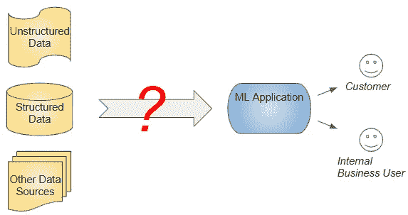
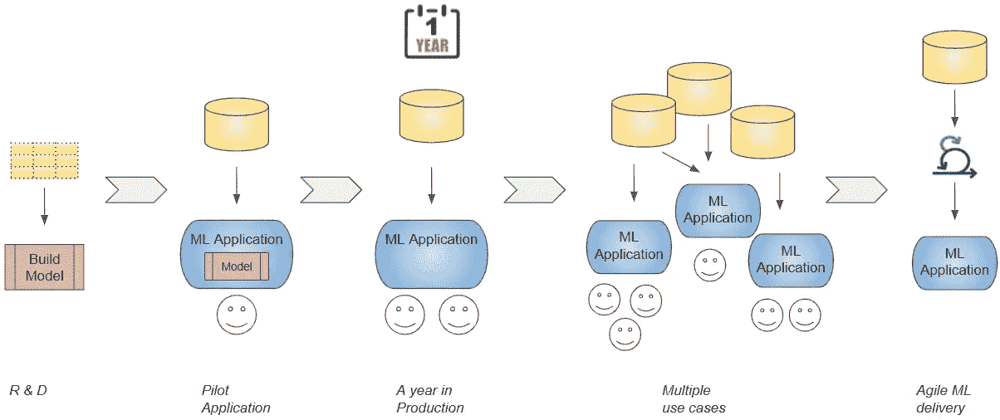
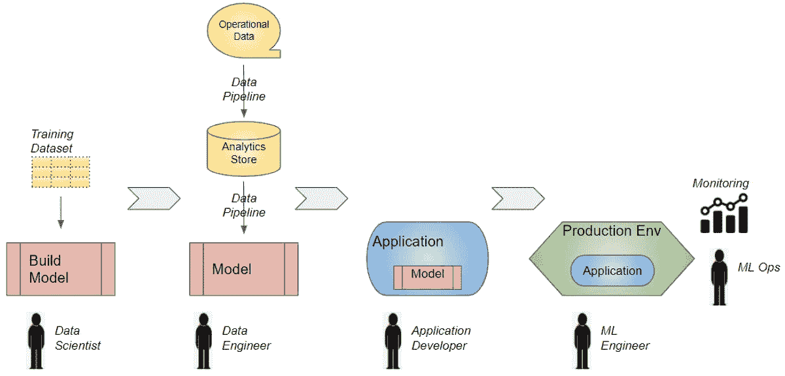
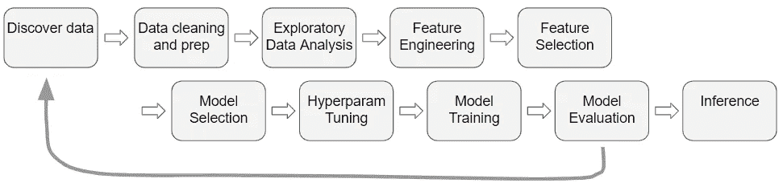

# 企业机器学习——为什么构建和训练“真实世界”模型很难

> 原文：<https://towardsdatascience.com/enterprise-ml-why-building-and-training-a-real-world-model-is-hard-59d09a430fae?source=collection_archive---------10----------------------->

## [行业笔记](https://towardsdatascience.com/tagged/notes-from-industry)，企业机器学习系列

## 用通俗易懂的英语为企业中的机器学习项目的生命周期、所涉及的角色以及构建模型的挑战提供了一个简明的指南

由[格雷格·拉科齐](https://unsplash.com/@grakozy?utm_source=medium&utm_medium=referral)在 [Unsplash](https://unsplash.com?utm_source=medium&utm_medium=referral) 上拍摄的照片

# 什么是企业 ML？

交付一个为你的公司提供真正商业价值的机器学习(ML)应用需要什么？

一旦你做到了这一点，并且证明了 ML 可以给公司带来实质性的好处，你如何将这一努力扩展到额外的用例，并真正开始实现 ML 的承诺呢？

然后，您如何在整个组织中扩展 ML，并简化 ML 开发和交付过程，以标准化 ML 计划、共享和重用工作并快速迭代？

一些世界领先的科技公司采用的最佳实践是什么？

*通过企业中的 ML 应用交付商业价值(图片由作者提供)*

通过一系列的文章，我的目标是探索这些迷人的问题，并理解沿途的挑战和学习。

*   一个人如何在“真实世界”中训练一个 ML 模型，这与“在实验室”构建一个 ML 原型有什么不同？
*   您如何将该模型投入生产，并使其月复一月地保持最佳性能？
*   处于这一趋势前沿的公司已经部署了哪些基础设施、系统架构和工具？
*   您如何构建数据管道来从您公司收集的大量数据中提取价值，并将其用于您的 ML 和分析用例？

在第一篇文章中，我们将深入探讨构建和训练 ML 模型的关键步骤，因为这是这个过程的核心。

为了做到这一点，让我们首先设置背景，并获得一个组织的整体 ML 旅程的高层次概述。

# 在 ML 旅程中走向成熟

假设一家公司已经收集了一组丰富的数据，并希望利用机器学习来显著改善其客户的体验或以主要方式影响其业务运营。

通常，大多数能够成功利用 ML 的公司都会经历不同的成熟阶段。

*一个组织会经历 ML 成熟的各个阶段(图片由作者提供)*

*   开始—识别问题并定义业务目标。开始 R&D 活动，开发一个 ML 模型。
*   飞行员——第一个受训的模型。生产中的应用程序就绪。
*   早期阶段——生产一两年的少数型号。
*   中间阶段——跨多个部门的多种业务场景中的多个生产模型。
*   高级——敏捷的 ML 应用程序开发、标准化的工具以及快速实验和交付的流程。

但这是一条艰难的道路。许多公司在第一阶段就陷入困境，无法从他们的 ML 投资中获取切实的商业价值。

既然我们已经在高层次上讨论了长期的旅程，那么让我们沿着这条路径缩小到单个 ML 项目，并查看端到端涉及的步骤。

# ML 应用生命周期和角色

交付一个 ML 应用程序包括几个任务。在过去的几年中，行业中出现了许多专门的角色来执行这些任务。

请注意，这一领域仍在发展，这一术语并不标准。如果你去几家不同的公司，问他们这些任务和角色，你可能会得到稍微不同的解释。这些角色之间的界限有些模糊。在某些情况下，同一个人可能会履行所有这些职责。

然而，其中一些概念开始具体化。所以对我们来说，大致了解一下这个过程还是很有用的。

*ML 应用生命周期(图片由作者提供)*

*   该流程从数据科学家构建和训练模型开始，通常使用训练数据的快照。
*   然后，数据工程师设置数据管道，从公司的分析商店中获取训练数据。管道还可能从运营数据源填充分析存储。
*   然后，经过训练的模型必须与最终用户使用的业务应用程序集成。它获取模型用来进行预测的输入数据。预测的结果然后被呈现给最终用户。这是由应用程序开发人员或产品工程师完成的。
*   ML 工程师将 ML 应用程序部署到生产中。
*   最后，ML Ops 负责保持应用程序在生产环境中运行并监控其性能。

正如我们刚刚看到的，应用程序生命周期的第一阶段是构建和训练 ML 模型。这通常是项目中最“迷人”和最具技术挑战性的部分。让我们放大来看看它涉及到什么。

# 培训一个“真实世界”的 ML 模型和一个“演示”ML 项目有什么不同？

互联网上不乏资源、教程、在线课程和项目，涵盖了为一系列应用构建机器学习或深度学习模型的每个可能的技术方面。然而，它们中的大部分涵盖了在一个非常受控的“演示”环境中构建 ML 模型。

这与你在“真实世界”中会遇到的有什么不同？到目前为止，最大的区别与访问带标签的数据集有关。演示项目总是从已经为您准备好的精心策划的数据集开始。数据已经被清理和系统标记。因为数据集中的字段已经被选择并确定了范围，所以这个问题被巧妙地限制住了。

另一方面，在一个真实的项目中，你从一张白纸开始。准备数据集成为项目中要求最高的方面之一。你必须解决一些棘手的问题:

*   有哪些数据来源？
*   我们如何查询和提取数据？
*   它们包含哪些字段？
*   我们将使用哪些数据特征？
*   我们如何获得标签？
*   数据格式是否正确？
*   是否存在缺失值或垃圾值？
*   我们应该使用什么样的数据切片/数据段？
*   我需要多少训练数据？
*   我如何扩充我的数据？

第二，在一个演示项目中，重点通常是挤出你的模型的最后一滴准确性，或者得到最先进的结果。在许多在线比赛中，79.0345 和 79.0312 之间的指标得分差异可能意味着排行榜上的数百个排名。

在现实世界的项目中，多花几周时间来获得一个或两个百分点的度量改进，可能不值得。您的模型的准确性可能只是整体业务成果中的一个因素。更重要的是快速交付一个工作解决方案，让客户有明显的改进，获得反馈并快速迭代。

# 模型构建和培训工作流程

假设要解决的问题和业务目标是明确的，并且您对如何解决它有一个初步的假设。通常，创建 ML 模型涉及几个步骤，由数据科学家或数据科学家团队执行。

*ML 模型工作流程(图片由作者提供)*

*   **数据发现**:您可以从浏览数据源开始，发现您想要使用的数据集。重要的是，您还需要确定哪些数据将用作目标标签。
*   **数据清理**:数据可能比较乱，需要验证和清理。可能存在缺失值或无效值、异常值、重复值等。一些字段可能有无用的值，例如，像“客户流失原因”这样的字段有很多值，只是简单地表示“未知”。某些值的格式可能不正确，例如数字、日期。如果您正在处理图像，您可能会看到模糊的图片、不同大小和分辨率的图像、光线不足或从奇怪的角度拍摄的照片。
*   **探索性数据分析(EDA)** :查看数据分布，以识别字段之间的模式和关系。你可以识别季节性趋势或将数据分成相关的部分等。
*   **特征工程**:通过丰富一些字段，执行聚合或汇总，或者通过组合多个字段进行计算，从而衍生出新的特征。例如，您可以使用日期字段提取自月初或年初以来的天数的新要素，或者提取是否是假日的新要素。
*   **特征选择**:识别对模型预测结果最有用的特征。移除对模型没有任何价值的特征。
*   **模型选择**:你可能会尝试几种不同的机器学习算法或深度学习架构，以找到性能最佳的一种。
*   **超参数调整**:对于每个模型，都有几个超参数值需要优化，例如神经网络中隐藏层的数量和每层的大小。
*   **模型训练**:挑选一个模型，选择一些数据特征，尝试一些超参数，训练模型。
*   **模型评估**:对照验证数据集测试模型。跟踪和比较每个模型的指标。
*   **推理**:在确定了一个有希望的潜在模型(以及特征和超参数)之后，构建逻辑来对看不见的数据进行预测。
*   **重复，重复，再重复**:改变一些东西，尝试一个不同的想法，并不断地这样做很多很多次，直到你找到一个效果很好的东西。

您必须保持细致的记录，以跟踪您的每一次试验，所使用的数据特征和超参数，以及所获得的指标。这将有助于您回过头来为进一步的研究确定有前途的模型，并能够重新运行测试和再现结果。

# 模型构建挑战

建立一个 ML 模型是困难的。这项工作是非常研究性和反复性的，需要大量的试验和错误。

不像大多数软件开发项目，你知道如何解决手边的问题，ML 项目有许多不确定性和未知性。一开始，你可能不知道解决方案是什么，甚至不知道它是否可行，也不知道可能需要多长时间。估计和计划时间表需要相当多的猜测。

通常，ML 模型是黑箱。当一个模型未能产生预期的结果时，您可能不确定它失败的确切原因。在许多情况下，解决方法是简单地提出另一个假设或尝试不同的东西，并希望它能提高性能。

# 终于，模型做好了！现在艰苦的工作真正开始了…

经过几周或几个月的工作，您最终解决了问题，并且拥有了一个在开发环境中运行良好的模型。

然而，正如我们将在下一阶段看到的，这只是到达目的地的很小一部分。更大的挑战和陷阱还在前面。

模型开发通常在 Jupyter 笔记本上完成。很可能使用 CSV 或 Excel 文件中数据集的静态快照来训练模型。培训在开发人员的本地笔记本电脑上运行，或者在云中的虚拟机上运行。

换句话说，模型的开发是相当独立的，与公司的应用程序和数据管道相隔离。集成模型并将其部署到生产环境中的艰苦工作即将开始…

# 结论

正如我们刚刚看到的，企业 ML 是一个旅程，像所有的旅程一样，它始于第一步，即建立您的 ML 模型。从很多方面来说，这一部分既技术复杂又令人兴奋。

然而，并不是这个阶段，而是下一个阶段，往往会绊倒许多项目，使它们无法重见天日。现在我们已经对“模型构建”阶段有了一个概念，我们准备在下一篇文章中看看“将模型投入生产”阶段。

最后，如果你喜欢这篇文章，你可能也会喜欢我关于变形金刚、音频深度学习和地理定位机器学习的其他系列。

 [## 直观解释的变压器(第 1 部分):功能概述

### NLP 变形金刚的简明指南，以及为什么它们比 rnn 更好，用简单的英语。注意力如何帮助…

towardsdatascience.com](/transformers-explained-visually-part-1-overview-of-functionality-95a6dd460452)  [## 音频深度学习变得简单(第一部分):最新技术

### 颠覆性深度学习音频应用和架构世界的温和指南。以及为什么我们都需要…

towardsdatascience.com](/audio-deep-learning-made-simple-part-1-state-of-the-art-techniques-da1d3dff2504)  [## 利用地理位置数据进行机器学习:基本技术

### 简明的地理空间数据特征工程和可视化指南

towardsdatascience.com](/leveraging-geolocation-data-for-machine-learning-essential-techniques-192ce3a969bc)