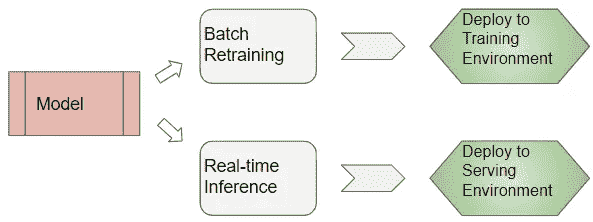
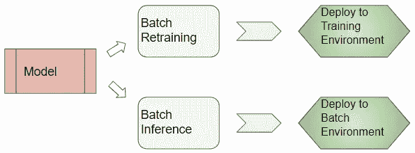
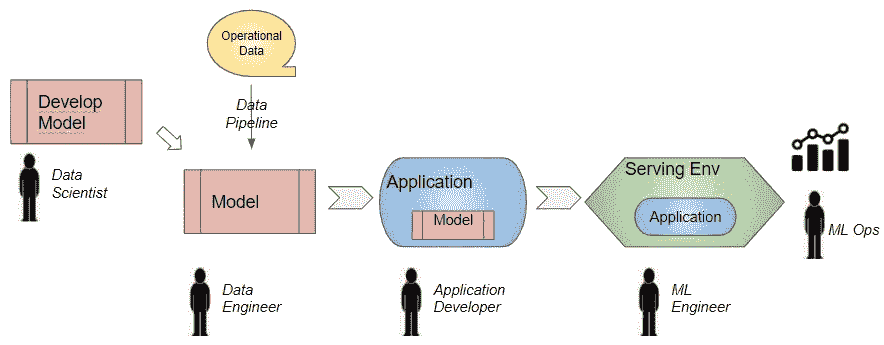
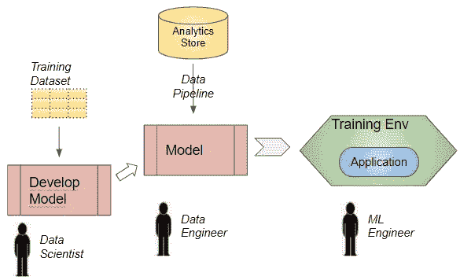

# 企业 ML——为什么将你的模型投入生产比构建它需要更长的时间

> 原文：<https://towardsdatascience.com/enterprise-ml-why-getting-your-model-to-production-takes-longer-than-building-it-e44ef80f8969?source=collection_archive---------15----------------------->

## 企业机器学习系列

## 关于模型部署的复杂性以及与企业应用程序和数据管道集成的简明指南。数据科学家、数据工程师、ML 工程师和 ML Ops 用简单的英语做什么。

里卡多·罗查在 [Unsplash](https://unsplash.com?utm_source=medium&utm_medium=referral) 上的照片

比方说，我们已经确定了我们公司的一个高影响业务问题，建立了一个 ML(机器学习)模型来解决它，训练它，并对预测结果感到满意。这是一个需要大量研究和实验才能解决的难题。因此，我们很高兴终于能够使用该模型来解决我们用户的问题！

然而，我们很快就会发现，构建模型本身只是冰山一角。将这种模型投入生产的大部分艰苦工作仍在我们前面。我发现第二阶段可能会占用项目 90%的时间和精力。

那么这个阶段由什么组成呢？为什么要花这么多时间？这是本文的重点。

在几篇文章中，我的目标是探索一个组织的 ML 旅程的各个方面，从部署它的第一个 ML 模型到建立一个敏捷开发和部署过程，以快速试验和交付 ML 项目。如果你感兴趣，这是我关于这个话题的另一篇文章:

*   [建立和训练“真实世界”模型](/enterprise-ml-why-building-and-training-a-real-world-model-is-hard-59d09a430fae) ( *企业中机器学习项目的工作流程，以及建立模型的挑战*)

为了理解第二阶段需要做什么，让我们先看看在第一阶段结束时交付了什么。

# 模型构建和培训阶段交付了什么？

模型通常由数据科学团队构建和训练。准备好之后，我们会在 Jupyter 笔记本上记下模型代码和经过训练的砝码。

*   它通常使用数据集的静态快照(可能在 CSV 或 Excel 文件中)进行训练。
*   快照可能是整个数据集的子集。
*   培训在开发人员的本地笔记本电脑上运行，或者在云中的虚拟机上运行

换句话说，模型的开发是相当独立的，与公司的应用程序和数据管道相隔离。

# “生产”是什么意思？

当一个模型投入生产时，它以两种模式运行:

*   实时推理-对新输入数据执行在线预测，一次一个样本
*   重新训练-用于每晚或每周使用当前刷新的数据集对模型进行离线重新训练

这两种模式涉及的要求和任务非常不同。这意味着模型被放入两个生产环境中:

*   用于执行推理和服务预测的服务环境
*   再培训的培训环境

*生产中的实时推理和再培训(图片由作者提供)*

实时推理是大多数人在想到“生产”时会想到的。但是也有很多用例是做批量推理而不是实时的。

*   批量推断-每晚或每周对完整数据集执行离线预测

*生产中的批量推理和再培训(图片由作者提供)*

对于这些模式中的每一种，现在都需要将模型与公司的生产系统(业务应用程序、数据管道和部署基础设施)集成在一起。让我们打开每个领域的包装，看看它们需要什么。

我们将从关注实时推理开始，之后，我们将检查批量案例(再训练和批量推理)。出现的一些复杂性是 ML 特有的，但是许多是标准的软件工程挑战。

# 推理—应用程序集成

模型通常不是一个独立的实体。它是面向最终用户的商业应用程序的一部分，例如电子商务网站的推荐模型。该模型需要与应用程序的交互流和业务逻辑相集成。

应用程序可能通过 UI 从最终用户那里获得输入，并将其传递给模型。或者，它可能从 API 端点或流数据系统获得输入。例如，批准信用卡交易的欺诈检测算法可能会处理来自 Kafka 主题的交易输入。

类似地，模型的输出被应用程序使用。它可能会在 UI 中返回给用户，或者应用程序可能会使用模型的预测来做出一些决策，作为其业务逻辑的一部分。

需要建立模型和应用程序之间的进程间通信。例如，我们可以将模型部署为通过 API 调用访问的它自己的服务。或者，如果应用程序也是用相同的编程语言(例如 Python)编写的，它可以只对模型代码进行本地函数调用。

这项工作通常由与数据科学家密切合作的应用程序开发人员来完成。与软件开发项目中模块之间的任何集成一样，这需要协作来确保关于来回流动的数据的格式和语义的假设在双方都是一致的。我们都知道可能会突然出现的各种问题。例如，如果模型期望一个数字“数量”字段为非负，应用程序会在将它传递给模型之前进行验证吗？或者模型应该执行检查吗？应用程序以什么格式传递日期，模型是否期望相同的格式？

*实时推理生命周期(图片由作者提供)*

# 推断—数据集成

该模型不再依赖于包含进行预测所需的所有要素的静态数据集。它需要从组织的数据存储中获取“实时”数据。

这些功能可能位于事务性数据源(如 SQL 或 NoSQL 数据库)中，也可能位于半结构化或非结构化数据集(如日志文件或文本文档)中。也许有些功能是通过调用 API 来获取的，无论是内部微服务或应用(如 SAP)还是外部第三方端点。

如果这些数据的位置或格式不正确，可能需要构建一些 ETL(提取、转换、加载)作业来将数据预取到应用程序将使用的存储中。

处理所有的数据集成问题可能是一项艰巨的任务。例如:

*   **访问需求** —如何连接到每个数据源，其安全和访问控制策略是什么？
*   **处理错误**——如果请求超时，或者系统停机了怎么办？
*   **匹配延迟** —对数据源的查询需要多长时间，而我们需要多快响应用户？
*   **敏感数据** —是否存在必须屏蔽或匿名的个人身份信息。
*   **解密** —在模型可以使用数据之前，数据需要被解密吗？
*   **国际化** —模型能处理必要的字符编码和数字/日期格式吗？
*   还有更多…

这个工具是由数据工程师构建的。对于这一阶段，他们也将与数据科学家进行互动，以确保假设是一致的，并且集成进展顺利。模型所做的数据清理和预处理是否足够了，或者是否需要构建更多的转换？

# 推理-部署

现在是时候将模型部署到生产环境中了。任何软件部署都需要考虑以下所有因素:

*   **模特托管**——在手机 app 上？在内部数据中心还是在云上？在嵌入式设备上？
*   **模型封装** —它需要哪些依赖软件和 ML 库？这些库通常不同于常规的应用程序库。
*   **协同定位** —模型会与应用程序协同定位吗？还是作为外部服务？
*   **车型配置设置** —如何维护和更新？
*   **所需的系统资源** — CPU、RAM、磁盘，最重要的是 GPU，因为这可能需要专门的硬件。
*   **非功能需求** —请求流量的容量和吞吐量？预期的响应时间和延迟是多少？
*   **自动扩展** —需要什么样的基础设施来支持它？
*   **集装箱化**——需要打包进码头集装箱吗？容器编排和资源调度将如何完成？
*   **安全需求** —存储凭证，管理私钥以访问数据？
*   **云服务** —如果部署到云中，是否需要与任何云服务集成，例如(亚马逊网络服务)AWS S3？AWS 访问控制权限呢？
*   **自动化部署工具** —供应、部署和配置基础设施并安装软件。
*   **CI/CD** —自动化单元或集成测试，以与组织的 CI/CD 管道集成。

ML 工程师负责实现这个阶段，并将应用程序部署到生产环境中。最后，您能够将应用程序呈现在客户面前，这是一个重要的里程碑！

然而，现在还不是高枕无忧的时候😃。现在开始监控应用程序的 ML Ops 任务，以确保它在生产中继续以最佳状态运行。

# 推理——监控

监控的目标是检查您的模型在生产中是否继续使用实时客户数据做出正确的预测，就像在开发过程中一样。很有可能你的指标没有那么好。

此外，您需要像监控任何应用程序一样监控所有标准 DevOps 应用程序指标—延迟、响应时间、吞吐量以及系统指标，如 CPU 利用率、RAM 等。您将运行正常的健康检查，以确保应用程序的正常运行时间和稳定性。

同样重要的是，监控需要是一个持续的过程，因为您的模型的评估指标很有可能会随着时间而恶化。将您的评估指标与过去的指标进行比较，以检查是否偏离了历史趋势。

这可能是因为数据漂移。

# 推断—数据验证

随着时间的推移，您的数据将会发展和变化-可能会添加新的数据源，收集新的特征值，新的客户会输入与以前不同的值的数据。这意味着您的数据分布可能会改变。

所以用当前数据验证你的模型需要一个持续的活动。仅查看全球数据集的评估指标是不够的。您还应该评估数据的不同部分和片段的指标。很有可能随着您业务的发展以及客户人口统计、偏好和行为的变化，您的数据段也会发生变化。

最初构建模型时所做的数据假设可能不再成立。考虑到这一点，您的模型也需要发展。模型所做的数据清理和预处理可能也需要更新。

这将我们带到第二种生产模式——定期进行批量再训练，以便模型继续从新数据中学习。让我们从开发模型开始，看看在生产中设置批量再培训所需的任务。

*再培训生命周期(图片由作者提供)*

# 再培训—数据集成

当我们讨论用于推断的数据集成时，它涉及到获取最新“实时”数据的单个样本。另一方面，在重新训练期间，我们需要获取完整的历史数据集。此外，这种再培训以批处理方式进行，比如每晚或每周。

历史并不一定意味着“旧的和过时的”数据，例如，它可以包括直到昨天收集的所有数据。

该数据集通常位于组织的分析存储中，如数据仓库或数据湖。如果那里没有一些数据，您可能需要构建额外的 ETL 作业，以所需的格式将数据传输到仓库中。

# 再培训—应用集成

因为我们只是对模型本身进行重新训练，所以不涉及整个应用程序。因此不需要任何应用程序集成工作。

# 再培训—部署

再培训可能会使用大量数据，可能远远超过开发期间使用的数据。

你需要弄清楚训练模型所需的硬件基础设施——它的 GPU 和 RAM 要求是什么？由于训练需要在合理的时间内完成，因此需要分布在集群中的许多节点上，以便训练并行进行。每个节点将需要由资源调度器提供和管理，以便硬件资源可以有效地分配给每个训练过程。

该设置还需要确保这些大数据量可以有效地传输到正在执行训练的所有节点。

在我们结束之前，让我们看一下我们的第三个生产用例——批量推理场景。

# 批量推断

通常，推理不必一次为单个数据项“实时”运行。在许多用例中，它可以作为批处理作业运行，其中大量数据样本的输出结果是预先计算和缓存的。

然后，可以根据用例以不同的方式使用预先计算的结果。例如。

*   它们可以存储在数据仓库中，供业务分析师进行报告或交互式分析。
*   当用户下次登录时，应用程序可以将它们缓存并显示给用户。
*   或者它们可以被缓存并被另一个下游应用程序用作输入要素。

例如，预测客户流失可能性的模型(即他们停止向你购买)可以每周或每天晚上运行。然后，这些结果可用于为所有被归类为高风险的客户开展特别促销活动。或者，当他们下次访问该网站时，可以向他们提供一个报价。

批处理推理模型可以作为应用程序网络的工作流的一部分进行部署。每个应用程序在其依赖关系完成后执行。

实时推理中出现的许多相同的应用程序和数据集成问题也适用于此。另一方面，批量推理没有相同的响应时间和延迟需求。但是，它确实有很高的吞吐量要求，因为它要处理巨大的数据量。

# 结论

正如我们刚刚看到的，将一个模型投入生产有许多挑战和大量的工作。即使在数据科学家准备好一个训练有素的模型之后，一个组织中还有许多角色聚集在一起，最终将它带给您的客户，并让它月复一月地运行。只有这样，组织才能真正获得利用机器学习的好处。

我们现在已经看到了构建和训练真实世界模型，然后将其投入生产的复杂性。在下一篇文章中，我们将看看领先的技术公司如何解决这些问题，以快速顺利地生产 ML 应用程序。

最后，如果你喜欢这篇文章，你可能也会喜欢我关于变形金刚、音频深度学习和地理定位机器学习的其他系列。

</transformers-explained-visually-part-1-overview-of-functionality-95a6dd460452>  </audio-deep-learning-made-simple-part-1-state-of-the-art-techniques-da1d3dff2504>  </leveraging-geolocation-data-for-machine-learning-essential-techniques-192ce3a969bc> 