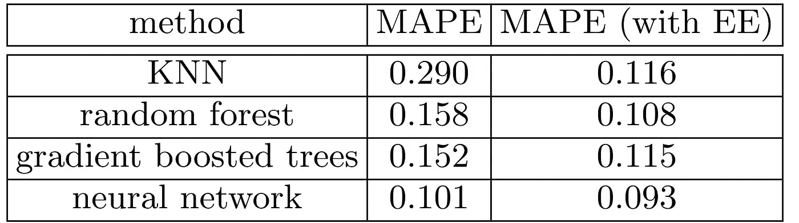
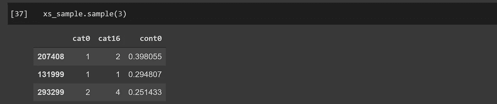
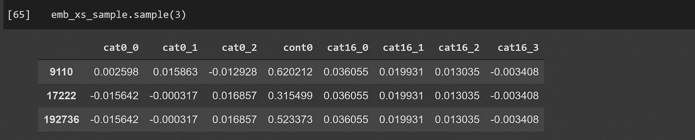

# ML 的实体嵌入

> 原文：<https://towardsdatascience.com/entity-embeddings-for-ml-2387eb68e49?source=collection_archive---------18----------------------->

## 试试看:它们比一键编码执行得更好。


连续地表示分类数据，就像这幅热带草原的连续视图。[【来源】](https://www.pexels.com/photo/panoramic-photography-of-trees-and-lake-358482/)

这篇文章是在机器学习算法中使用嵌入来表示分类变量的指南。我看过其他文章讨论这个方法，但是没有一篇真正向*展示如何用代码来做*。所以我决定用我自己的帖子来填补这个空白。

如果你对代码感兴趣，可以直接跳到**实现**部分。还有一个[附随笔记本](https://github.com/adam-mehdi/EntityEmbeddingsTutorial/blob/main/EntityEmbeddings.ipynb)，管道全部铺设完毕。

# 为什么是实体嵌入？

简而言之，它们比一键编码性能更好，因为它们以紧凑和连续的方式表示分类变量。

从神经网络到 k-最近邻和树集成，我们可以用嵌入代替一键编码来表示几乎任何建模算法中的分类变量。尽管一键编码忽略了特征值之间的信息关系，但实体嵌入可以在嵌入空间中将相关值更紧密地映射在一起，从而揭示数据的内在连续性( [Guo 2016](https://arxiv.org/pdf/1604.06737.pdf) )。

例如，当使用单词嵌入(本质上与实体嵌入相同)来表示每个类别时，一个完美的嵌入集将保持这样的关系: ***king - queen =丈夫-妻子*** 。

分类变量中的值实际上总是表现出某种关系。另一个例子:如果用实体嵌入来表示颜色，“棕色”和“黑色”在一个元素中具有相似的值，表示阴影，而在另一个元素中具有不同的值，例如，一个元素表示原色的组成。这种表示让模型了解每个变量之间的相互关系，从而简化学习过程并提高性能。

利用这些优势实际上很简单，只需用嵌入矩阵(取自用这些类别训练的神经网络)替换独热矩阵。



Rossman 数据集上不使用和使用实体嵌入来表示分类变量的算法的性能(平均绝对百分比误差—越低越好)( [Guo 2016](https://arxiv.org/pdf/1604.06737.pdf) )。

说够了；让我们进入实现。

# 履行

我将使用 PyTorch、fastai 和 sklearn。管道有三个步骤:

## 1.用嵌入来训练神经网络

```
# import modules, read data, and define options
from fastai.tabular.all import *
df = pd.read_csv('/train.csv', low_memory=False)
cont,cat = cont_cat_split(df_nn, max_card=9000, dep_var='target')
procs = [Categorify, Normalize]
splits = RandomSplitter()(df)
device =torch.device('cuda' if torch.cuda.is_available() else 'cpu')# feed the data into the Learner and train
to_nn = TabularPandas(nn, procs, cat, cont,
                      splits=splits, y_names='target')
dls = to_nn.dataloaders(1024, device = device)
learn = tabular_learner(dls, layers=[500,250], n_out=1)
learn.fit_one_cycle(12, 3e-3)
```

最终结果是一个具有嵌入层的神经网络，可用于表示每个分类变量。通常嵌入的大小是一个要指定的超参数，但是 fast.ai 通过基于变量的基数自动推断适当的嵌入大小来简化这一过程。

这一步可以在纯 PyTorch 或者 TensorFlow 中完成；如果您选择这样做，请确保修改后续代码的适当部分。

## 2.用嵌入向量替换每个分类值

```
def embed_features(learner, xs):
  """
  learner: fastai Learner used to train the neural net
  xs: DataFrame containing input variables. Categorical values are defined by their rank. 
 ::return:: copy of `xs` with embeddings replacing each categorical variable
  """
  xs = xs.copy()
  for i,col in enumerate(learn.dls.cat_names):

    # get matrix containing each row's embedding vector
    emb = learn.model.embeds[i]
    emb_data = emb(tensor(xs[col], dtype=torch.int64))
    emb_names = [f'{col}_{j}' for j in range(emb_data.shape[1])]

    # join the embedded category and drop the old feature column
    feat_df = pd.DataFrame(data=emb_data, index=xs.index,               
                           columns=emb_names)
    xs = xs.drop(col, axis=1)
    xs = xs.join(feat_df)
  return xs
```

这个函数将每个分类列(一个大小为 **n_rows** 的向量)扩展成一个形状为**的嵌入矩阵(n_rows，embedding_dim)。**现在我们用它来嵌入数据的分类列。

```
emb_xs = embed_features(learn, to.train.xs)
emb_valid_xs = embed_features(learn, to.valid.xs)
```

在不亲自试验的情况下遵循代码是一项艰巨的任务，因此我在示例数据集的之前提供了*，在*之后提供了*:*



应用实体嵌入方法之前的数据集**。**



数据集 ***在*** 之后应用实体嵌入方法。

3.在嵌入数据上训练 ML 算法

大部分繁重的工作已经完成；我们现在可以以标准方式训练我们的机器学习算法，但将嵌入的数据作为输入传递。

下面是一个训练随机森林的管道示例:

```
from sklearn.ensemble import RandomForestClassifier
from sklearn.metrics import roc_auc_score

rf = RandomForestClassifier(n_estimators=40, max_samples=100_000,      
                          max_features=.5, min_samples_leaf=5)
rf = rf.fit(emb_xs, y)
roc_auc_score(rf.predict(emb_valid_xs), to.valid.y)
```

如果您希望使用不同的算法，只需将`RandomForestClassifier`替换为`GradientBoostingClassifier`或任何其他算法，您应该会看到相对于一次性编码方法的性能提升。

## 特征选择

还有最后一点要考虑。现在，我们已经将按值排序的列扩展为嵌入矩阵，从而有了更多的特性。树集合会慢得多，因为有更多的特征要循环通过，并且相应地有更多的分裂要评估。使用一键编码，决策树可以快速训练，将样本分成 1 或 0 的组。

然而，在嵌入式表示中，每一列都包含一个连续的区间 **(0，1)** 。因此，树必须将区间分成几个区间，并分别评估每个区间。因此，对于决策树来说，实体嵌入表示比一次性编码计算量大得多，这意味着训练和推理需要更长的时间。

我们可以改善这个问题:选择最显著的特征，只在这些特征上训练。

Sklearn tree ensembles 可以使用模型的`feature_importances_`属性自动计算特征重要性，该属性返回对应于每个特征列的百分比列表。为了计算这些百分比，sklearn 遍历每棵树上的每个分裂，对使用某个特征的每个分裂的信息增益求和，并使用该累积的信息增益作为贡献的代理。

```
m = RandomForestClassifier().fit(emb_xs, y)
fi = pd.DataFrame({'cols':df.columns, 'imp':m.feature_importances_})
emb_xs_filt = emb_xs.loc[fi['imp'] > .002]
```

代码简单明了:拟合一个模型，定义一个将每个特性与它们的特性重要性联系起来的`DataFrame`，删除任何特性重要性等于或低于. 002 的列(一个要优化的超参数)。

我们的精简数据集在一小部分维度上提供了与全尺寸数据集一样好的性能。然而，更少的列意味着更不容易过度拟合，并且对于新数据的变化更健壮，所以即使时间限制不是问题，应用特征选择也是一个好主意。

如果在使用树集合时时间紧迫，并且无法使用实体嵌入方法，那么就像表示任何顺序变量一样表示分类变量。序数风格的排序表示更快，至少和一键编码一样好( [Wright 2019](https://peerj.com/articles/6339/) )。

# 结论

对于一键编码，有更好的替代方法。使用来自经过训练的神经网络的嵌入来表示分类变量优于机器学习算法中的一键编码方法。实体嵌入可以以连续的方式表示分类变量，保留不同数据值之间的关系，从而有助于模型的训练。如果需要可解释性，性能更好的机器学习模型可以用于集成或作为神经网络的替代品。

# 参考

1.  郭，程等。范畴变量的实体嵌入。 [arXiv:1604.06737](https://arxiv.org/abs/1604.06737)
2.  莱特 MN，柯尼希 IR。2019.“随机森林中分类预测因子的分裂”。 *PeerJ。*[https://doi.org/10.7717/peerj.6339](https://doi.org/10.7717/peerj.6339)。
3.  霍华德杰里米。*针对拥有 Fastai 和 PyTorch 的程序员的深度学习:没有博士学位的 ai 应用*。[https://www . Amazon . com/Deep-Learning-Coders-fastai-py torch/DP/1492045527](https://www.amazon.com/Deep-Learning-Coders-fastai-PyTorch/dp/1492045527)

感谢 [fastai 论坛](https://forums.fast.ai/)和 [fastai 书籍](https://www.amazon.com/Deep-Learning-Coders-fastai-PyTorch/dp/1492045527)【3】提供了学习资料的资源。