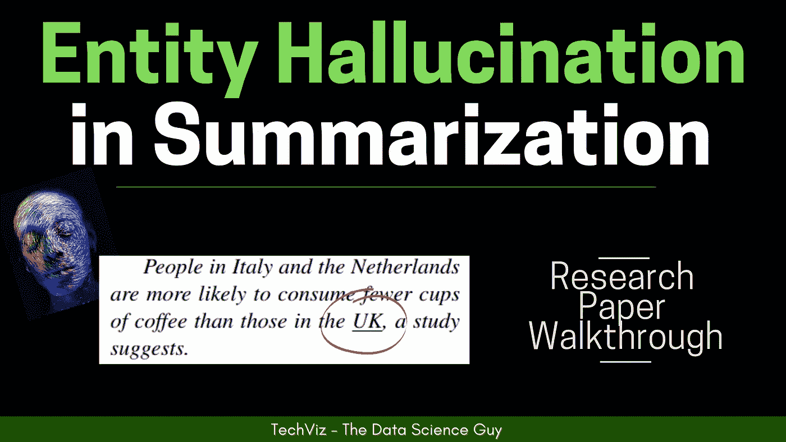
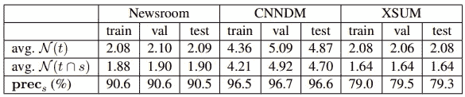
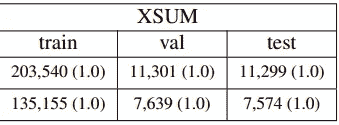
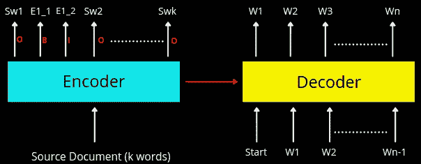
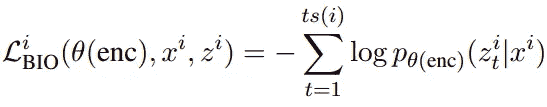
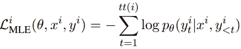
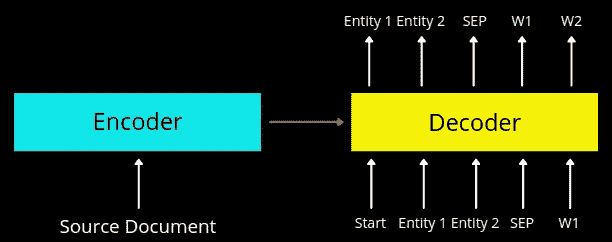
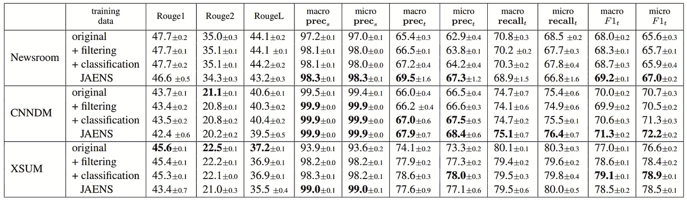

# 现有抽象文本摘要模型的问题——甚至是 SOTA

> 原文：<https://towardsdatascience.com/entity-level-factual-consistency-in-abstractive-text-summarization-cb19e8a48397?source=collection_archive---------22----------------------->

## NLP 研究论文摘要

*在这篇博客中，我尝试根据我的理解总结了论文* [*抽象文本摘要的实体级事实一致性*](https://arxiv.org/pdf/2102.09130.pdf) *。请随时评论你的想法！*

# 问题陈述

众所周知，现有的[抽象文本摘要模型](https://www.youtube.com/watch?v=QY8oZxS0txs)倾向于**产生虚假信息**。现在，这可能发生在**实体**级别*(生成额外的实体)*或实体**关系**级别*(实体出现的上下文被错误地生成)*。本文**仅在实体级**量化事实一致性，而将关系级一致性留给未来的工作。他们提出了一种度量标准来量化模型产生的这种幻觉，并提出了一系列措施和训练方案，这些措施和方案可以帮助模型更好地执行并生成实体级别的事实上正确的摘要。

# 提议的方法

首先，本文引入了 3 个度量标准来量化生成的摘要中实体级的一致性。*其细节在下面讨论—*

## 韵律学

1.  *Precision-source—***prec(s))**量化幻觉程度模型有 w.r.t **源文件**。*数学上定义为* —

> prec(s) = N (h ∩ s)/N (h)

这里，N(h)和 N(s)分别指生成的摘要和源文档中的命名实体集合。他们使用 [SpaCy 的 NER 模型](https://spacy.io/universe/project/video-spacys-ner-model/)来提取这些实体。prec(s)的低值意味着幻觉严重，因为在这种情况下 N(h)会很高，因为生成的概要中的唯一实体的计数会很高。

*   *精确目标—* **精确目标(prec(t))** 与 prec(s)做相同的事情，但 w.r.t .为**实际汇总。**这个想法是计算模型在假设汇总中生成多少个实体也是实际汇总的一部分。*数学上，它被给定为—*

> prec(t) = N (h ∩ t)/N (h)

这里，N(h)和 N(t)分别指生成/假设和实际摘要中的命名实体集合。

*   *Recall-target—**下的***Recall-target(Recall(t))其思路是计算实际摘要中有多少实体没有出现在模型生成的假设摘要中。*数学上，它被给定为—*

> 回忆(t) = N (h∩t)/N (t)

这里，N(h)和 N(t)分别指生成/假设和实际摘要中的命名实体集合。为了得到一个可量化的数字，他们**将 prec(t)和 prec(s)合并，并表示为 F1 分数**。*数学上，它被给定为—*

> F1 = 2 预测召回次数(t)/(预测召回次数+召回次数)

## 基于实体的数据过滤

作者假设**幻觉问题很大程度上嵌入了训练数据本身**。因此，为了验证这一点，他们计算了 3 个流行数据集(即 Newsroom、CNN/DM 和 XSUM)的 prec(s)分数。

来自[源](https://arxiv.org/pdf/2102.09130.pdf)的实际摘要|图像中命名实体和 prec 的平均数量(%)

正如我们在上表中看到的，新闻编辑室和 CNN/DM 数据集的幻觉率接近 10%，XSUM 的幻觉率接近 20%。因此，如果看到这些都是非常重要的数字，那么模型也会学习这些模式，并且注定会在生成摘要时产生幻觉。

因此，作者提出了一种**数据过滤方法**，其中，如果摘要中的任何实体在源文档中不存在，则从摘要中删除该特定句子。万一，如果基本事实摘要只包含一个句子，并且它需要被丢弃，我们从数据集中移除文档-摘要对。因此，从所有 3 个黄金标准数据集中删除句子后，大量数据被删除。例如，下表显示了 XSUM 数据集的相同情况。第一行是实际计数，第二行是数据过滤步骤后的计数。

对来自[源](https://arxiv.org/pdf/2102.09130.pdf)的 XSUM |图像进行数据过滤

*根据实际数据和过滤数据训练的模型的评估分数在结果部分提及。*

# 多任务学习

在这种情况下，他们提出了一个额外的任务**对源文件*(编码器端)*中值得摘要的命名实体**进行分类。有摘要价值的实体被定义为来自源文档的命名实体，其也存在于基本事实摘要中。为了实现这一点，他们用一个**生物方案** *(B-Begin，I-Inside，O-outside)* 来标记源文档中的每个标记，这是一种非常标准的技术，用于标记文本片段中的单个/多个单词实体。*下图以图形方式显示了流程—*

多任务学习|作者图片

*数学上可以表示为—*

这种损失背后的直觉是，这种损失将迫使编码器对其表示进行建模，以便捕获关于值得汇总的实体的相关信息。现在，当**解码器获得这种实体丰富的表示时，它可以产生相当好的有思想的一代** *(希望导致较少的幻觉)？*

除了 BIO 损失，他们还将典型的 MLE 损失用于训练序列生成模型，该模型将从解码器端传播损失。*数学上可以表示为—*

这里，θ，x，y，I 分别是模型参数，输入记号，输出记号和第 I 个记号。最后，他们最小化联合损失***L(I)= L(I)_ MLE+αL(I)_ BIO***，其中α为超参数。他们根据验证集在 0.1 到 0.5 之间选择α。

## 加入显著实体和摘要生成(JAENS)

除了前两种方法之外，他们还探索了另一种生成方法，其中，他们不是仅仅生成摘要，而是训练序列模型来生成值得摘要的命名实体的序列，随后是特殊标记，然后是摘要标记。

这种方法背后的直觉是，在生成摘要令牌的同时，解码器可以通过自我关注机制关注值得摘要的实体。因为它将在学习生成摘要的同时共同学习识别值得摘要的命名实体。*下图以图形方式显示了流程—*

JAENS 建筑|作者图片

# 结果

正如我们在下表中看到的，使用所提出的方法，幻觉率有了相当好的降低。

各种训练方案对比|图片来自[来源](https://arxiv.org/pdf/2102.09130.pdf)

> 如果你愿意，你也可以查看我写的其他研究论文摘要。

所以，是的，这就是我的博客。我也有同样的多语言字幕视频漫游，如果你喜欢看视频而不是文字(就像我:D 一样)，一定要看看

[多看看这样的视频](https://www.youtube.com/channel/UCoz8NrwgL7U9535VNc0mRPA/)

请随意阅读整篇论文，并向作者说“**嗨**”，感谢他们的贡献。

> ***论文标题:*** *抽象文本摘要的实体级事实一致性*
> 
> ***论文链接:***[*https://arxiv.org/pdf/2102.09130.pdf*](https://arxiv.org/pdf/2102.09130.pdf)
> 
> ***作者:*** *冯楠、拉梅什·纳拉帕蒂、、西塞罗·诺盖拉·多斯桑托斯、朱恒辉、张德娇、凯思琳·麦克科恩、冰翔*

另外，如果你喜欢读这篇文章，你可以选择在[*【https://www.buymeacoffee.com/TechvizCoffee】*](https://www.buymeacoffee.com/TechvizCoffee)*——因为我实际上不喝咖啡:)非常感谢！完全是可选的，自愿的:)*

