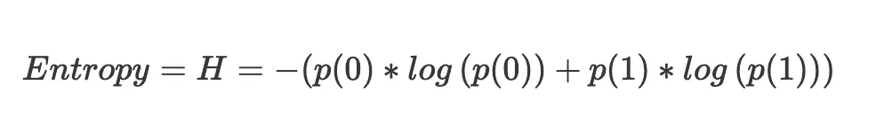

# 熵，简单地解释

> 原文：<https://towardsdatascience.com/entropy-how-to-explain-to-a-10-year-old-7bcc5315291b?source=collection_archive---------12----------------------->

## 让不太直观的概念变得直观

安妮·斯普拉特在 [Unsplash](https://unsplash.com?utm_source=medium&utm_medium=referral) 上的照片

熵是信息论的核心概念之一，对机器学习领域贡献巨大，主要由(但不限于)基于树的算法(决策树、随机森林、bagging、boosting 等)作为其核心来决定要分割的特征(或基于熵构建的 IG/Gini)

尽管它们有广泛的应用，巨大的影响，以及它们在数学上有多大的意义，但它们不是很直观

如果你第一次听到熵这个词，这个故事将有助于理解它们背后的核心概念。如果你很了解它，也许想向你的侄子或侄女(或者不了解统计的人)解释，这个故事会有所帮助

# 故事是这样的:

你坐在教室里，这是你最好的朋友的生日。你可以看到他走向每张桌子，分发巧克力，每个人都被要求从他的巧克力袋中挑选一块巧克力。假设他包里有两种不同口味的巧克力:

1.  黑巧克力
2.  牛奶巧克力

现在他来到你的桌前，让你从他的包里随机挑选一块巧克力

# 熵

假设你喜欢黑巧克力&无论何时，你都喜欢黑巧克力胜过牛奶巧克力。因为他是你最好的朋友，他愿意就他包里的东西给你提示。让我们考虑以下场景

1.  他说*“袋子里还剩 6 块巧克力，都是黑的”*你欣喜若狂，因为你确定你肯定会得到黑巧克力，所以马上跳了起来。没有惊喜的成分
2.  他说*“袋子里还剩 6 块巧克力，其中 4 块是深色的，另外 2 块是牛奶巧克力”*你仍然很有信心随机抽取的巧克力仍然是深色的，但你不再是 100%有信心了。随机挑选巧克力的惊喜成分正在增加。
3.  他说*“袋子里还剩 6 块巧克力，其中 3 块是黑色的，其余 3 块是牛奶巧克力”*。现在你担心了，因为你随机挑选的巧克力可能是。在这种情况下，出其不意的因素达到了顶峰。
4.  他说*“袋子里还剩 6 块巧克力，其中 4 块是牛奶巧克力，剩下 2 块是黑巧克力”*。现在你更担心了，因为你随机挑选的巧克力很可能是牛奶巧克力。惊喜的成分很低(即使它对你不利)
5.  他说*“包里还剩 6 块巧克力，都是牛奶巧克力”*。现在你很难过，因为你确定不管你选什么，都是牛奶巧克力。一点惊喜都没有了

在上面的例子中，惊奇的元素只不过是熵。在情景 3 中，两种巧克力在袋子里的数量相等，这种惊喜的成分是最大的。当巧克力的比例变得有利于某一种巧克力时，你的惊奇感就会减少(不管你喜欢什么；) )

# 我们学到了什么

简单地说，熵是用数学表达的惊奇元素。二元分类的等式是:

其中 p(0)是一等品的比例& p(1)是二等品的比例。当惊奇元素最大时，熵取最大值 1，即在二进制类的情况下，当类分布为 50%-50%时。每当一个类完全接管另一个类时，即 100%-0%分布时，它取最小值零

推广到多功能场景:

看待熵的另一种方式是帮助理解概率分布的不可预测性。在案例 1 和 5 中，分布是高度可预测的，而在案例 3 中，它是非常不可预测的

总之，熵提供了对数据集中的不确定性或无序的度量，作为数据科学家/ML 工程师，我们的目标是创建模型，以减少/最小化数据集标签系统中的熵(在分类问题的情况下)