# 软演员-评论家中的熵(上)

> 原文：<https://towardsdatascience.com/entropy-in-soft-actor-critic-part-1-92c2cd3a3515?source=collection_archive---------24----------------------->

## [思想和理论](https://towardsdatascience.com/tagged/thoughts-and-theory)

在概率论中，与熵相关的原理有两个:最大熵的*原理和最小交叉熵*的*原理。一开始我们注意到有两种类型的熵，然而还有更多。*


资料来源:123rf.com

# **熵的许多面**

首先让我们强调一下，最大熵原理和最小交叉熵原理都不是定理，它们只是统计推断的原理。这和哲学教义很像。然而，这些学说当然有数学含义。所以我们有两种不同类型的熵:*熵*和*交叉熵*。它们由所谓的*相关熵*连接:

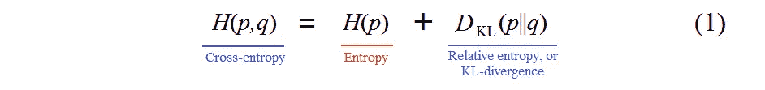

**熵、交叉熵和 KL 散度(**图片由作者提供)

相对熵的另一个更广为人知的名字是 kull back-lei bler 散度，或 *KL 散度*。

> “……这一措施在技术文献中可能以九种不同的名称出现……我自己的偏好是术语**歧视信息**及其最小歧视信息(MDI)原则的基础”*S . kull back*【5】**

***熵作为一种学习工具***

*在强化学习中， [*探索 vs .*](https://lilianweng.github.io/lil-log/2020/06/07/exploration-strategies-in-deep-reinforcement-learning.html)是概念的重要组成部分。在没有充分探索的情况下过快地做出决定可能会是一个大失败。探索是学习的主要组成部分。众所周知，[在动作中加入噪音](/three-aspects-of-deep-rl-noise-overestimation-and-exploration-122ffb4bb92b)是探索中合理的事情之一。熵是另一个强大的探索工具。高熵可以确保我们避免重复利用相同的不一致性。*

***香农熵***

*熵是一种通常与无序或不确定状态联系在一起的物理属性。设 ***X*** 为某个离散变量，{ ***x* ₁** ，…， ***xn*** }为概率为 ***X*** 的可能值***pᵢ= p*(*xᵢ*)**。那么*信息熵*，或者仅仅是*熵*，或者*香农熵*定义如下:*

*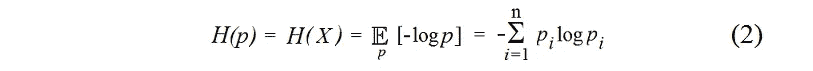*

***熵作为不确定性的度量(**图片由作者提供)*

*直观地说，熵是变量*的分布***【p】***的*不确定性度量。一个典型的例子是与硬币相关的概率分布。让硬币公平，即正面和反面都有相等的概率: ***p = p* (** 正面**)***=***p***(反面)= 1/2。然后，****

*****H*(*p*)**=-(1/2 log(1/2)+1/2 log(1/2))=-log(1/2)=-(-1)= 1，既然我们考虑以 2 为底的 log，这是**最大不确定性**，因为很难预测接下来的折腾。让我们取一个不公平的硬币， ***p*** =0.1。然后，**

*****H*(*p*)**=-(0.1 log(0.1)+0.9 log(0.9))=-0.332-0.137 = 0.469。在这种情况下，不确定性明显小于最大不确定性= 1。**

**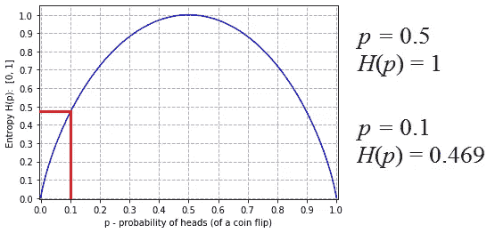**

****熵曲线(**图片由作者提供)**

> **均匀概率产生最大的不确定性，因此也产生最大的熵。**

**有关熵曲线生成，请参见应用程序 2 中的 python 代码。**

****统计力学中的最大熵****

**在统计力学中，*玻尔兹曼分布*是一种概率分布，它给出了一个系统的状态 ***i*** 的概率 ***pᵢ*** :**

****

****玻尔兹曼分布*最大化熵 H(p)* (** 图片由作者提供)**

**其中**ε*ᵢ*是状态**t5】I**， ***T*** 是系统的温度， ***k*** 是玻尔兹曼常数。玻尔兹曼分布是*最大化熵****H(p)****的分布。*玻尔兹曼分布也被称为*吉布斯分布*。****

> **“……一种涉及熵概念的方法，它的存在依赖于热力学第二定律，对许多人来说无疑是牵强的，可能会因为晦涩难懂而使初学者感到厌恶。这种不便可能被一种方法的优点所抵消，这种方法使热力学第二定律如此突出，并给它如此清晰和基本的表达。”( [J.W .吉布斯](https://en.wikisource.org/wiki/Scientific_Papers_of_Josiah_Willard_Gibbs,_Volume_1/Chapter_I)，*【6】*)**

**玻尔兹曼分布与 *softmax 函数*有关，它在机器学习和神经网络中起着核心作用。我们将在下一篇文章中回到这个问题上(第二部分)**

# ****内置熵项的贝尔曼方程****

****带有熵项的目标函数****

**SAC 算法基于最大熵 RL 框架。行动者学习机制优化策略以最大化策略的期望收益和期望熵。标准目标(最大化期望回报)增加了一个熵项*****【H(p)***:****

****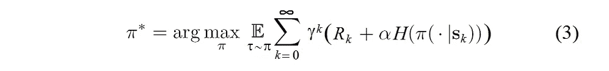****

******熵项 H 用α加权的目标函数(**作者图片)****

****这里， ***γ*** 为*折扣*因子，0<***γ****<*1，要求保证奖励和熵之和是有限的； **α** > 0 是所谓的*温度*参数，决定了熵项 ***H(p)*** *的相对重要性；* ***R_k*** 是在时间 ***k*** 的奖励；**𝜋**(*****|**|*s _ k***)-在状态 ***s_k 执行的策略 **𝜋** 的概率分布；τ*** = ( ***s_k，a_k)*** *-* 对(状态，动作)在时间 ***k*** 。****

******最大报酬和最大熵******

****在 SAC 目标函数(3)中，奖励 ***R_k*** 增加如下:****

********

******熵增奖励(**图片由作者提供)****

****这意味着标准的*最大回报目标*增加了熵最大化。SAC 算法旨在同时最大化预期收益和熵。****

> ****“…最大熵公式在探索和稳健性方面提供了实质性的改进…最大熵策略在面对模型和估计错误时是稳健的…它们通过获得不同的行为来改进探索。”*【1】*****

******状态值和动作值功能******

****状态-价值函数***v*𝜋(*s _ t*)**估计如果我们*在状态* ***s_t*** 开始时的期望收益。包括**熵项**的状态值函数定义如下:****

****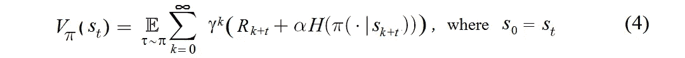****

******带熵项的状态值函数(**图片由作者提供)****

****动作值函数 **Q𝜋( *s* _t， *a* _t)** 估计期望值，如果我们*在状态* ***s_t，*** 开始并执行任意动作 ***a_t.*** 包含**熵项**的动作值函数定义如下****

****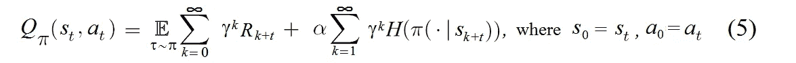****

******带有熵项的动作值函数(**图片由作者提供)****

******软状态值功能******

****注意，在熵项中，和从 k=1 开始。因此，动作值函数 **Q𝜋( *s* _ *t* ， *a* _ *t* )** 与状态值函数***v*𝜋(*s _ t*)**仅在一项上不同:****

****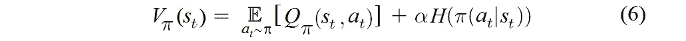****

******状态值和动作值函数之间的联系(**图片由作者提供)****

****将表达式(2)中的熵 ***H(p)*** 代入(6):****

****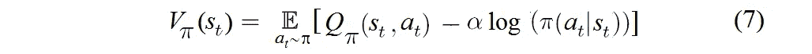****

******软状态值函数(**图片由作者提供)****

****函数***v*𝜋(*s*)**就是所谓的**软态值函数**，参见 [*“软优演算法及应用*](https://arxiv.org/abs/1812.05905) ”，第 5 页****

******软贝尔曼方程******

****让我们把等式中的第一项和第一项分开。(5)****

****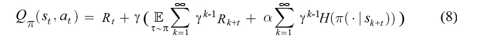****

******轻微变换的动作值函数(**图片由作者提供)****

****通过代入 *k* = *p* +1 我们得到****

****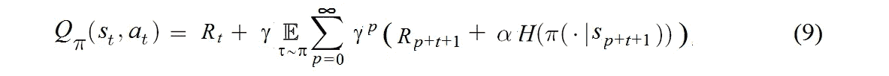****

******代入 k = p+1 (** 图片由作者提供)****

****eq 中 ***γ*** 后的表达式。(9)是状态值函数***v*𝜋(*s _*{*t+*1 })**。****

****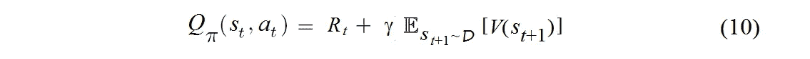****

******软贝尔曼方程(**图片由作者提供)****

****情商。(10)是将*修正后的贝尔曼方程*，参见 [*《软优算法与应用*](https://arxiv.org/abs/1812.05905) 》，第 2 页.此方程称为 [**软贝尔曼方程**](https://arxiv.org/abs/1702.08165) **.**熵是这个方程不可分割的一部分。****

# ****演员-评论家神经网络****

****下面，我们展示与一些张量和神经网络的计算相关的 SAC 算法的片断。使用*神经网络* `***critic***`计算 q 值`***qf1***`、`***qf2***`、`***qf1_next***`、`***qf2_next***`、*、*。张量`***next_state_action***`、`***next_state_log_pi***`使用*神经网络*`***policy***`*(actor)计算。网络`***critic***`由类 *QNetwork* 定义，网络`***policy***`由类 *GaussianPolicy* 定义。第三种神经网络将在下一篇文章中讨论(第 2 部分，软行动者-批评家中的*熵)。******

*******计算张量 V(s)和 Q(s，a)*******

*****数组`***state_batch,***`*`***action_batch,***`*`***reward_batch,***`*`***next_action_batch,***`和`***mask_batch***` 是从类`***ReplayMemory***`中先前保存的剧集中提取的。********

*****来自(7)的软状态值函数***V*(*s*)**由张量`***min_qf_next***`表示:*****

*****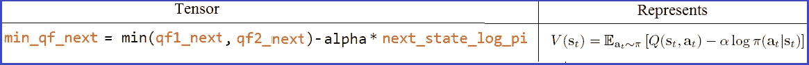*****

*****S **oft 状态值函数** `***V*(*s*)**` **(** 图片由作者提供)*****

*****来自贝尔曼方程(10)的软动作值函数 ***Q* ( *s，* )** 由张量`***next_q_value***` 表示:*****

*****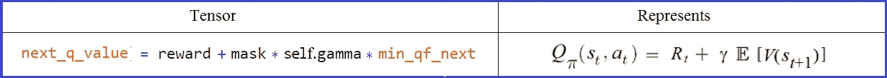*****

*******软动作值函数 *Q* ( *s，a* ) (** 图片由作者提供)*****

*****获取张量 qf1_next，qf2_next，`**min_qf_next**` 和 next_q_value*****

# *****结论*****

*****J.W. Gibbs 使用了热力学中的熵概念，约翰·冯·诺依曼将经典的 Gibbs 熵扩展到量子力学领域来表征纠缠的熵。根据约翰·冯·诺依曼的建议，克劳德·香农将这种类似于统计力学中使用的缺失信息实体命名为熵。这样信息论就诞生了。很明显，熵的概念，作为一个可以通过系统的单个部分来描述系统整体特征的概念，在各个知识领域都非常有用。今天，我们看到熵概念在与深度学习和人工智能相关的系统中非常有用。我们可能很快就会看到其他概念和定律，比如熵将物理学和人工智能联系起来。*****

*****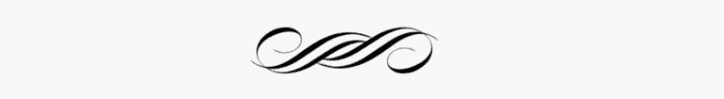*****

# *****App 1。软影评人的一些特征*****

*******不符合政策*******

*****SAC 是一个*非策略*算法。这意味着，SAC 算法允许我们重用已经收集的数据。*****

```
*****memory = *ReplayMemory*(replay_size)
# Sample a batch from memory, _batch_size_ = 256
state_batch, action_batch, reward_batch, next_state_batch, mask_batch = memory.sample(batch_size=batch_size)*****
```

*****至于 *on-policy* 学习算法，如[近似策略优化](https://arxiv.org/abs/1707.06347) (PPO)和[软 Q 学习](https://arxiv.org/abs/1702.08165) (SQL)，这些算法的样本复杂度都很低。这些算法需要为每个梯度步骤收集新的样本，这变得非常昂贵。*****

*******随机演员-评论家训练*******

*****非策略算法 [DDPG](https://arxiv.org/abs/1509.02971) (深度确定性策略梯度)可以被视为一种*确定性行动者-批评家*算法和一种*近似*Q*-学习*算法。然而，这两种算法之间的相互作用使得 DDPG 容易受到超参数设置的影响。SAC 避免了基于软 Q 学习的先验非策略最大熵算法中与近似推理相关的潜在不稳定性。相反，这个 SAC 将政策外的行动者-批评家训练与一个**随机行动者**相结合，并进一步以
**最大化这个行动者**的熵为目标**熵最大化** 。*****

*******双 Q 绝招*******

*****软演员评论家不是 TD3 的直接继承者(大约同时出版)，但它结合了*剪辑的双 Q 技巧*:*****

```
 *****qf1, qf2 = self.critic(state_batch, action_batch) 
    qf1_loss = F.mse_loss(qf1, next_q_value) 
    qf2_loss = F.mse_loss(qf2, next_q_value)    pi, log_pi, _ = self.policy.sample(state_batch) qf1_pi, qf2_pi = self.critic(state_batch, pi)
    min_qf_pi = torch.min(qf1_pi, qf2_pi) policy_loss = ((self.alpha * log_pi) - min_qf_pi).mean()*****
```

*****在政策改进步骤中，两个 Q 函数用于**减轻正偏差**。*****

*******最大熵与熵正则化*******

*****在 [PPO 算法](https://arxiv.org/abs/1707.06347)中，一个*熵正则项*被添加到目标函数中，以保证*充分探索:******

*****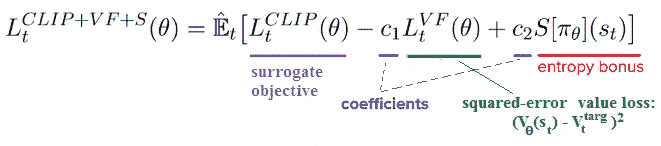*****

*******添加*熵加成* (** 图片由作者提供)*****

*****SAC 中最大熵的*原理提供的探索允许代理发现比使用*熵正则项*的其他算法(如 PPO)更快更好的策略。******

******App 2。Python 代码:** **熵曲线生成******

****[软优评中的熵(下)](/entropy-in-soft-actor-critic-part-2-59821bdd5671)****

******参考文献******

****[1] [软行动者-批评家:带随机行动者的离策最大熵深度强化学习](https://arxiv.org/abs/1801.01290)，2018，arXiv****

****[2] [软演员-评论家算法及应用](https://arxiv.org/abs/1812.05905) s，2019，arXiv****

****[3] [基于深度能量策略的强化学习](https://arxiv.org/abs/1702.08165)，2017，arXiv****

****[4] E.T .杰恩斯，信息理论和统计力学。一、二(1957 年)****

****[5] S .库尔贝克，致编辑的信:库尔贝克-莱布勒距离，1987 年****

****[6] J.W.Gibbs，流体热力学中的图解法，2011 年检索，维基资源****

****[7] [软演员-评论家，](https://spinningup.openai.com/en/latest/algorithms/sac.html) 2018，OpenAI，Spinning Up****

****[8] [软演员-评论家揭秘](/soft-actor-critic-demystified-b8427df61665)，2019，TDS****

****[9] [深度 RL 的三个方面:噪声、高估和勘探](/three-aspects-of-deep-rl-noise-overestimation-and-exploration-122ffb4bb92b)，2020，TDS****

****[10] [深度 Q 网络中一对相互关联的神经网络](/a-pair-of-interrelated-neural-networks-in-dqn-f0f58e09b3c4)，2020，TDS****

****【Bellman 方程在 Deep RL 中是如何工作的？，2020 年，全港发展策略****

****[12] [深度强化学习中的探索策略](https://lilianweng.github.io/lil-log/2020/06/07/exploration-strategies-in-deep-reinforcement-learning.html)，2020， [github.io](https://lilianweng.github.io/lil-log/2020/06/07/exploration-strategies-in-deep-reinforcement-learning.html)****

****[13][Project-HopperBulletEnv with Soft 演员-评论家(SAC)](https://github.com/Rafael1s/Deep-Reinforcement-Learning-Algorithms/blob/master/HopperBulletEnv-v0-SAC/sac_agent.py) ，2020，github****

****[14] [近似策略优化算法](https://arxiv.org/abs/1707.06347)，2017，arXiv****

****[15] [深度强化学习的连续控制](https://arxiv.org/abs/1509.02971)，v6，2015，arXiv****

****[16] [熵在软优评(下)](/entropy-in-soft-actor-critic-part-2-59821bdd5671)，2021****