# 软演员-评论家中的熵(下)

> 原文：<https://towardsdatascience.com/entropy-in-soft-actor-critic-part-2-59821bdd5671?source=collection_archive---------29----------------------->

SAC 算法执行在*策略评估*和*策略改进*之间交替的迭代。在策略评估步骤中，算法根据*最大熵*和软贝尔曼方程计算**中策略 **𝜋** 的值。在策略改进步骤中，使用*最小交叉熵将目标策略更新为尽可能接近先前策略的 softmax 函数。*在该步骤中，对于每个状态，通过 Kullback-Leiber 散度来更新策略。**

资料来源:123rf.com

**查找策略**

在[第一部分](/entropy-in-soft-actor-critic-part-1-92c2cd3a3515)中，按照 SAC 算法，利用*最大熵原理，*我们构造了*软*状态值函数***V*(*s*)**，*软*动作值函数 ***Q* (s，*a【T32)***和**T35 下面的目标是建立一个寻找最佳策略的算法**𝜋(*a*|*s*)**。为此，SAC 算法使用*KL-divergence 和 softmax 函数实现了*最小交叉熵原理*。***

## ***KL-divergence***

***交叉熵 *H* ( *p，q* )和 KL-散度***

*设 ***p*** 和 ***q*** 为事件集合上的离散概率分布{ ***x* ₁** ，…， ***x_n*** }与某个离散变量 ***X*** 分布*相对于分布*的*交叉熵*在给定的一组事件上定义如下:***

**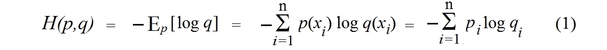**

****交叉熵**(图片由作者提供)**

**这里 **E** *p* [∙]是相对于分布 ***p*** 的期望值算子。**

**对于概率空间相同的离散概率分布 ***p*** 和***q*******X****kull back-lei bler 散度(*或 *KL-divergence)* 从 ***q*** 到 ***p******

***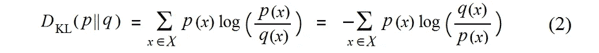***

*****KL-divergence** (图片作者提供)***

***熵和交叉熵通过 KL-divergence 联系起来:***

***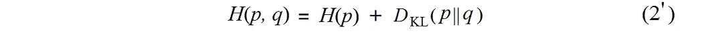***

*****熵、交叉熵和 KL 散度**(图片由作者提供)***

***KL- *散度*仅当对于所有 ***x*** 从***q*(*x*)= 0**遵循 ***p* (x)=0** 时定义。如果 ***p* (x)=0** ，那么根据洛必达法则，和中的相应项解释为 **0*****

**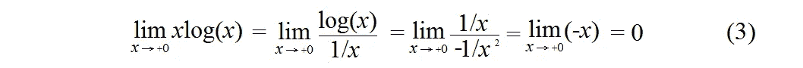**

****p(x)= 0 的项的贡献**(图片由作者提供)**

**设 ***p*** 是固定的参考分布，那么交叉熵和 KL-散度直到一个加法常数都是相同的(因为 ***p*** 是固定的)。当 ***p=q，*** KL-divergence 取*最小值* = 0，交叉熵 ***H(p，q)*** 取*最小值* ***H(p，q) = H(p)*** 。**

****KL-散度和距离度量****

**交叉熵 ***H* ( *p* ， *q* )** 不能作为距离度量，因为它有一个缺点就是***H***(***p***，***p***)**=*H*(KL 散度不能是距离度量，因为它不是对称的，即***d***ᴋʟ(***p*∩*q*)≦*d***ᴋʟ**(*q*∩*p【t128*******

**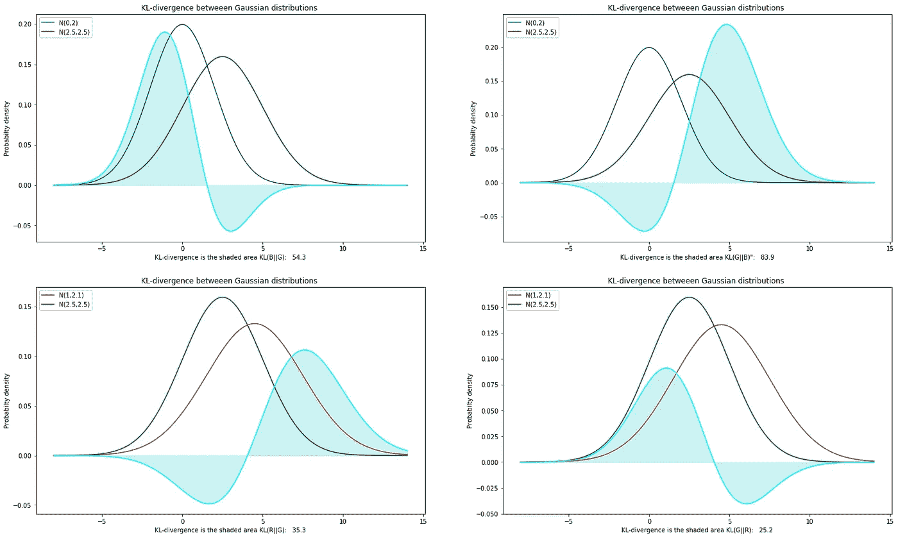**

****高斯对的 KL 散度，由应用程序 2.1 的 python 代码生成****

**KL 散度可以被认为是分布 ***q*** 离分布*有多远的度量，但是它不能被用作距离度量。然而，KL 散度的*无穷小形式*，所有二阶偏导数(Hessian)的矩阵构成了被称为*费希尔信息度量*的度量。根据[陈佐夫定理](https://arxiv.org/abs/1701.08895)、[、【Do17】](https://arxiv.org/abs/1701.08895)费希尔信息度量是黎曼度量的一种变体，是黎曼几何中必不可少的部分。***

****KL-散度估计的偏差****

**KL-散度可能高度依赖于样本的数量，并且当样本的数量趋于无穷大时，KL-散度估计可能不会收敛到好的结果。这方面的一个例子如图(a)所示，我们有两个固定的高斯分布:***p*****~*N*(0，2)** 和 ***q ~ N* ( *8，2* )** 。然而，样本数量在区间**【500，5000】**内变化。KL 散度随着样本数量的增加而线性增加。**

**如果样本数量是固定的，而分布参数是变化的，则 KL-散度估计可能会有很大的偏差，并且该偏差可能高度依赖于分布。在图(b)中，我们又有了两个高斯分布:***p*****~*N*(0，2)** 和 ***q~ N* (3，std)** : `***mean***` *=* 3 和`***std***`在区间**【1，20】**上运行。在这个区间内，KL-散度变化很大。参见[【Pe08】](https://ieeexplore.ieee.org/document/4595271)、[【第 18 期】](https://ieeexplore.ieee.org/document/8850627)了解更多关于 KL-散度估计的详细信息。**

**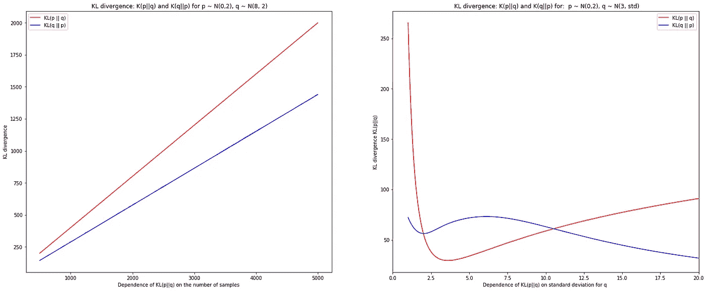**

****(a)*d***ᴋʟ(***p*∩*q*)对样本数的依赖性，(b)*d***ᴋʟ(***p*∩*q*对标准差的依赖性(图(a)和(b)为****

## **演员兼评论家**

****确定性策略与随机策略****

**对于离散动作空间的情况，有一个成功的算法*【DQN】**(深 Q 网)。将 *DQN* 方法转移到演员-评论家架构的连续动作空间的成功尝试之一是算法[*【DDPG】*](https://arxiv.org/abs/1509.02971)，其关键组件是*[【Li15】](https://arxiv.org/abs/1509.02971)*。*确定性策略的主要优点是，与随机策略相比，可以更有效地计算策略梯度，随机策略需要更多的样本来计算，[【Si14】](http://proceedings.mlr.press/v32/silver14.html)*。*****

**然而 *DDPG* 的*、*一个*、一个*常见故障模式是学习到的 *Q* 函数经常高估 *Q* 值。众所周知的事实是，如果探索不够有效，就无法学习到好的政策。在[ [Ma19](https://arxiv.org/abs/1911.11679) ]中确立了一个不那么微不足道的事实:**

> **“…如果探索确实始终如一地发现了奖励，但发现得不够早，演员-评论家算法可能会陷入一种配置，奖励的样本会被忽略。”**

**如[【Ma19】](https://arxiv.org/abs/1911.11679)所示，对于一个确定性的策略梯度更新，即使在非常简单的环境(比如 1D-托伊)的情况下，即使行为策略定期检测到奖励，演员更新也会停止。**

****随机因素和术语“软”****

**在[第 1 部分](/entropy-in-soft-actor-critic-part-1-92c2cd3a3515)中，我们考虑了统计力学中使用的*玻尔兹曼分布*。这是一个概率分布，给出了系统状态*的概率*:****

***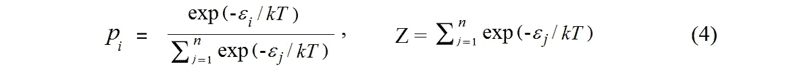***

******玻尔兹曼分布和 p* 分区函数**(图片由作者提供)***

***在统计力学中，方程(4)的归一化分母称为*配分函数*，用 ***Z*** 表示。为了更精确地表达配分函数，我们需要使用积分，而不是求和，但是对于我们的目的，使用离散的情况就足够了。***

**在概率论中， *softmax 函数* ***p(x)*** *，*如同玻尔兹曼分布，是一个取**实数*其中 ***i*** 遍历事件空间**{ 1*******

****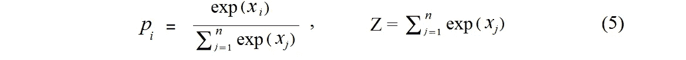****

******Softmax 函数 p(x)和分区函数 *Z*** (图片由作者提供)****

****函数*映射****【xᵢ】****到半开区间 **(0，1】**，所有***【p(xᵢ】****之和为 **1** 。由此可见，函数 ***p*** 是一个*概率分布在事件空间****{ 1， *…* ， *n* }** 。softmax 函数也称为*归一化指数变换。Softmax 是一种在事件之间创造一种竞争的方式。特别地，在软行动者-批评家中，随机代理使用 softmax 执行选择动作。Softmax 将选择最大值的 [*赢者通吃*](https://proceedings.neurips.cc/paper/1989/hash/0336dcbab05b9d5ad24f4333c7658a0e-Abstract.html) 策略改为随机策略，其中每个动作都可以按一定概率选择。这就是“软”这个词的动机[【Br89】](https://proceedings.neurips.cc/paper/1989/hash/0336dcbab05b9d5ad24f4333c7658a0e-Abstract.html)。显然，在软演员-评论家中，术语“*软*”指的是使用了 *softmax* 函数的事实。**********

***配分函数 ***Z*** 也出现在神经网络中，并且具有与统计力学中相同的含义:离散项的和，其是如等式(5)中的 softmax 函数中的归一化分母。***

*****政策改进步骤*****

***在软行动者-批评家中，策略通过以下公式更新:***

***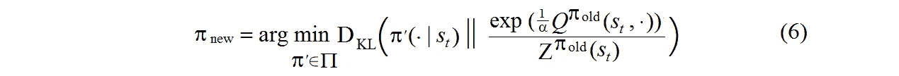***

*****更新政策**(图片作者提供)***

***等式(6)中的第一个分布是分布**𝜋**'(∙|***s _ t***)。这是高斯分布π集合中的一个分布。本质上，这种分布提供了*最小交叉熵。*与等式(2’)中 KL 散度的最小值*相同。****

> ***“由于在实践中我们更喜欢易处理的策略，因此我们将额外将策略限制为某个策略集*π*，例如，它可以对应于一个参数化的分布族，如高斯分布、[*【SAC-1】*](https://arxiv.org/abs/1801.01290)*。****

***等式(6)中的第二分布是使用 softmax 函数构建的，分母是配分函数(5)。为前一个策略函数 **𝜋_old** 获得的状态值函数 ***Q* ( *s_t，aᵢ* )** 的值构成了等式(5)中 softmax 函数的一组***【xᵢ***值。***

*****预期 KL-散度*****

***让我们从方程(6)转换 KL 散度。根据(2)，因为比率的对数是对数的差，所以 KL 散度看起来像这样:***

***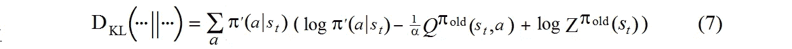***

*****将 KL-divergence 转换为对数差**(图片由作者提供)***

***我们的目标是最小化高斯分布π集上的 KL 散度。对数分区函数不依赖于动作*和策略**𝜋'∈**π的选择，那么对数分区函数**log*z*(*s*_*t*)**可以被丢弃。此外，可以通过直接最小化方程(7)中的*预期 KL-散度*乘以温度参数 *α* 来学习策略参数****

****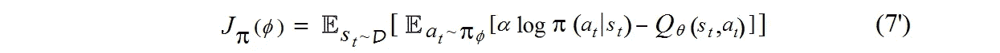****

******最小化预期 KL 散度的目标函数**(图片由作者提供)****

****等式(7’)用于计算`***policy_loss***` 张量。****

******策略计算步骤******

****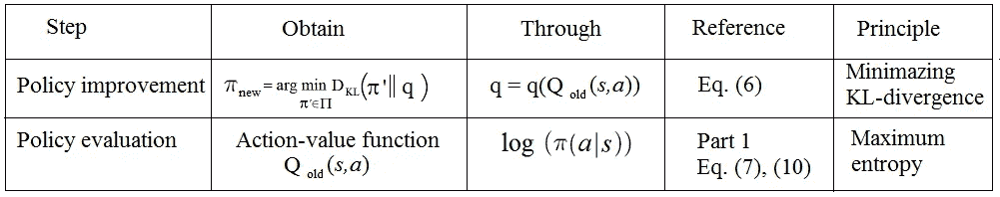****

******策略计算步骤**(图片由作者提供)****

## ****SAC 实施提示****

******SAC 代理的初始化函数******

****在 SAC 代理`**__init__**`函数中，*`***self.critic***``***self.critic_target***`*成员属于类型*QNetwork**和`***self.policy***`属于类型*高斯策略*。 [model.py](https://github.com/Rafael1s/Deep-Reinforcement-Learning-Algorithms/blob/master/HopperBulletEnv-v0-SAC/model.py) 中定义的 *QNetwork* 和*高斯策略*类为神经网络。*******

******soft _ actor _ critic _ agent 类的函数 _ _ init _ _******

******政策性亏损和批评性亏损******

****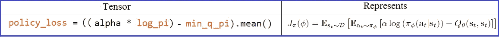****

******张量 policy_loss 代表 eq。(7)出自**[**【SAC-2】**](https://arxiv.org/abs/1812.05905)****

****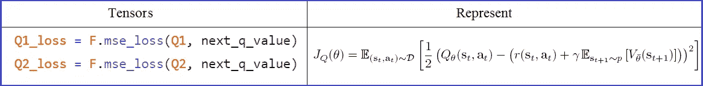****

****张量 Q1 _ 损耗和 Q2 _ 损耗代表 eq。(5)出自[**【SAC-2】**](https://arxiv.org/abs/1812.05905)****

*   ****以`***state_batch***`为输入的`***policy.sample***`函数返回张量`***action_batch_pi***`和`***log_pi***` ***。*** 两个张量都用于计算`***policy_loss***` ***的。*******
*   ***有两个(*评论家)*神经网络`***Q1***`和`***Q2***` ***，***`[***QNetwork***](https://github.com/Rafael1s/Deep-Reinforcement-Learning-Algorithms/blob/master/HopperBulletEnv-v0-SAC/sac_agent.py)`，[【hop 20】](https://github.com/Rafael1s/Deep-Reinforcement-Learning-Algorithms/blob/master/HopperBulletEnv-v0-SAC/sac_agent.py)两个实例。请注意，SAC(如在 TD3 算法中)使用两个*评论家*神经网络来减轻策略改进步骤中的正偏差。***
*   ***`***policy.sample***` 函数，以`***next_state_batch***`为输入，返回张量`***next_state_action***`和`***next_state_log_pi***` ***。*** 两个张量都用于两个 Q 损失值 `***Q1_loss, Q2_loss***`的计算。***
*   ***两个张量`***Q1_loss***`和`***Q2_loss***` 由 *PyTorch* `***mse_loss()***` 函数计算。**对`***mse_loss()***`的[是通过两种方式](/a-pair-of-interrelated-neural-networks-in-dqn-f0f58e09b3c4)得到的:(一)动作值函数 *Q(s，a)* **，**(二)软贝尔曼方程([第一部分](/entropy-in-soft-actor-critic-part-1-92c2cd3a3515)，【10】)。与`***mse_loss()***`的自变量之差称为*软更夫残差*。*****

******计算张量保单 _ 损失和 Q1 _ 损失，Q2 _ 损失******

******实施方案******

****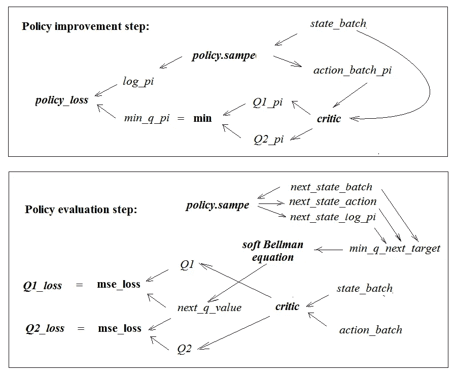****

******函数 update_parameters** 中发生了什么(图片由作者提供)****

****上图基本上反映了 SAC 算法的核心`***update_parameters***` 函数中发生的事情。****

******结论**
与交叉熵相关的 KL 散度几乎可以认为是概率分布空间上的距离度量。在无穷小形式中，KL 散度甚至与黎曼几何中的某些特定距离度量相一致。这种由 KL-divergence 生成的“几乎”度量用于考虑高斯分布空间中的接近度，其中在改进的每一步都寻求最佳策略。事实证明，随机策略比确定性策略工作得更好，特别是存在这样的例子，其中确定性策略的最优策略梯度更新被停止，并且即使对于非常简单的环境也不能改进策略。****

****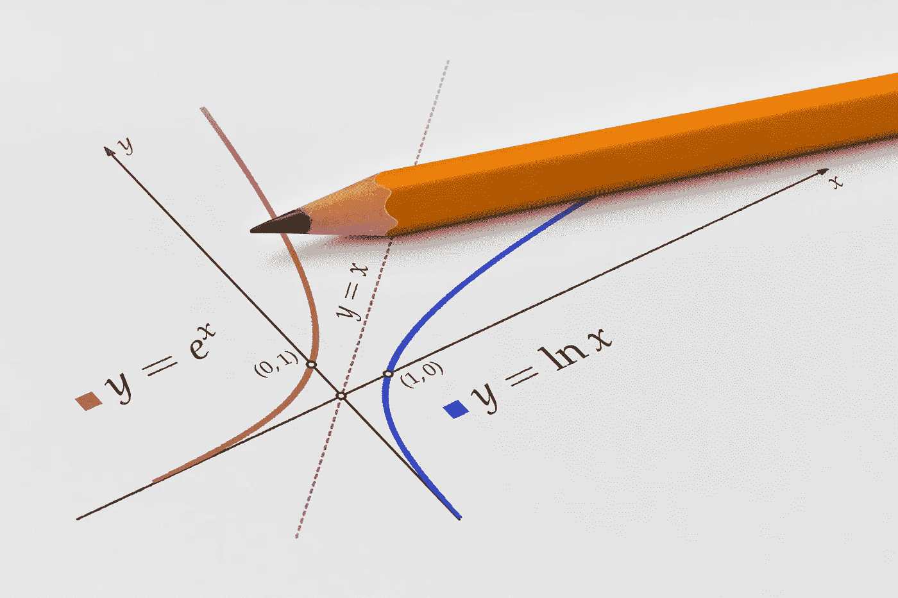****

****资料来源:123rf.com****

****第三部分会有什么？****

****如何计算**log 𝜋(*a*|*s*)**，SAC 上下文中的重新参数化技巧，以及其他类似的东西…****

******App 1。吉布斯不等式******

****设 ***p=* { *p* ₁， *…* ， *p_* n}** 和***q =*{*q*₁*，…，q_* n}** 为两个概率分布。假设 ***I*** 是所有 ***i*** 的集合，其中*为非零。然后*****

*****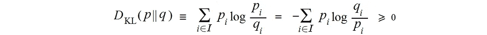*****

*******吉布斯不等式*******

*****让我们看看为什么吉布斯不等式成立。首先，*****

*****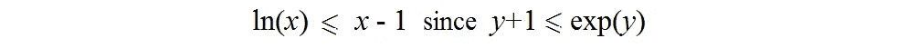*****

*******这里，y = ln(x)*******

*****然后*****

*****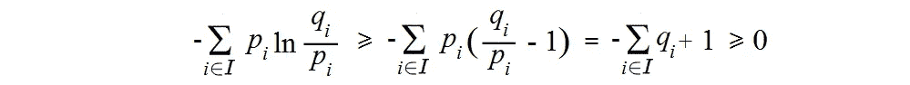*****

*******吉布斯不等式的证明*******

*****所有非零值 ***pᵢ*** 之和为 **1** 。一些非零的***【qᵢ】***可能被排除在总和之外，因为根据定义，我们只选择那些*不等于零的指数。从 **ln( *x* )** 到**log**₂**(*x*)**我们只需要用 **ln2 除所有项。********

# ****App 2。 **Python 代码:KL-divergence******

******App 2.1。高斯对******

******App 2.2 KL-散度对标准偏差的依赖性******

******参考文献******

****[Br89] J. Bridly，[将随机模型识别算法训练为网络可以导致参数的最大互信息估计](https://proceedings.neurips.cc/paper/1989/hash/0336dcbab05b9d5ad24f4333c7658a0e-Abstract.html)，1989，NeurIPS Proceedings****

****[Do17] J.Dowty，[指数族的陈佐夫定理](https://arxiv.org/abs/1701.08895)，2017，arXiv****

****[Hop20] [项目—HopperBulletEnv with Soft Actor-critical(SAC)](https://github.com/Rafael1s/Deep-Reinforcement-Learning-Algorithms/blob/master/HopperBulletEnv-v0-SAC/sac_agent.py)，2020，github****

****[Li15] T.Lillicrap 等，[深度强化学习的连续控制](https://arxiv.org/abs/1509.02971)，2015，arXiv****

****[Ma19] G. Matheron 等人，[DDPG 的问题:理解具有稀疏回报的确定性环境中的失败](https://arxiv.org/abs/1911.11679)，2019，arXiv****

****[No18] Y.-K. Noh 等人，[kull back-lei bler 散度最近邻估计的偏差减少和度量学习](https://ieeexplore.ieee.org/document/8850627)，2018，IEEE *Xplore*****

****[Pe08] F. Perez-Cruz，[连续分布的 Kullback-Leibler 散度估计](https://ieeexplore.ieee.org/document/4595271)，2008，IEEE *Xplore*****

****【Sa18】Y . Sako，[是“softmax”这个词把你逼疯了](https://medium.com/@u39kun/is-the-term-softmax-driving-you-nuts-ee232ab4f6bd)，2018，Medium****

****[SAC-1] T.Haarnoja 等人，[软行动者-批评家:带随机行动者的离策最大熵深度强化学习](https://arxiv.org/abs/1801.01290)，2018，arXiv****

****[SAC-2] T.Haarnoja 等，[软演员-评论家算法及应用](https://arxiv.org/abs/1812.05905) s，2019，arXiv****

****[Si14] D.Silver 等人，[确定性策略梯度算法](http://proceedings.mlr.press/v32/silver14.html)，2014，DeepMind Technologies****

****[St20a] R. Stekolshchik，[深度 Q 网络中一对相互关联的神经网络](/a-pair-of-interrelated-neural-networks-in-dqn-f0f58e09b3c4)，2020，TDS****

****[St20b] R. Stekolshchik，[深层 RL 的三个方面:噪声、高估和勘探](/three-aspects-of-deep-rl-noise-overestimation-and-exploration-122ffb4bb92b)，2020，TDS****

****[St21] R. Stekolshchik，[软演员-评论家中的熵(上)](/entropy-in-soft-actor-critic-part-1-92c2cd3a3515#6f9e-408b2cef46eb)，2021 年，TDS****