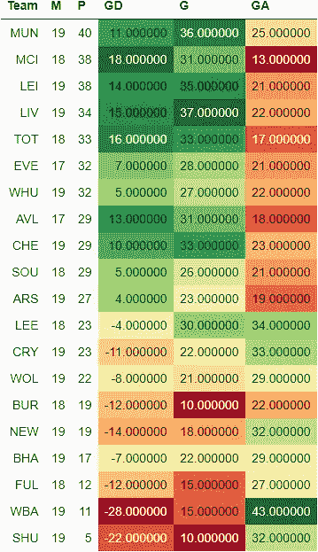
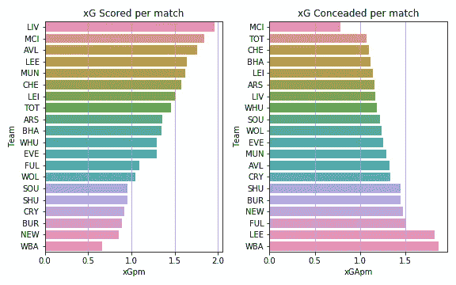
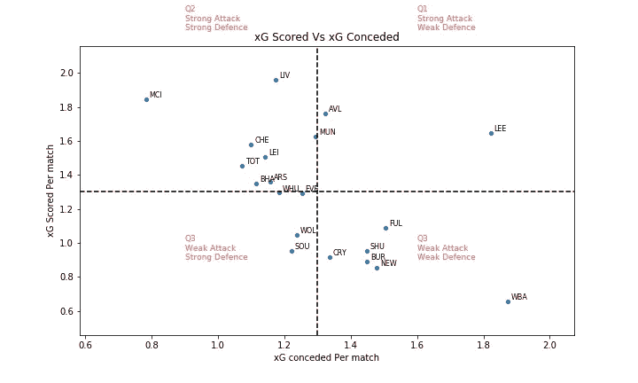
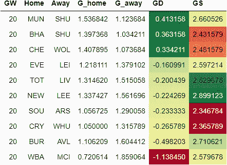
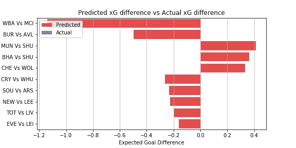
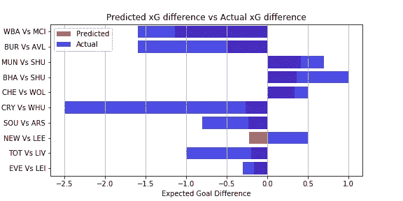

# EPL 分析和游戏周 20 预测

> 原文：<https://towardsdatascience.com/epl-analysis-and-gameweek-20-prediction-73014a4deb36?source=collection_archive---------62----------------------->

## 使用 xG 统计预测英超联赛结果的数据驱动尝试

这是我的 EPL 预测系列的一篇文章。在游戏周 9 之后，由于其他任务，我无法更新这个系列。嗯，我现在回来了，希望从现在开始定期发表！
你可以在这里查看第八周比赛的[预测和实际表现。](/epl-analysis-and-gameweek-8-prediction-691fcc6bdfdd)

[预期目标或 xG](https://medium.com/@abhijithchandradas/xg-xplained-27b1dbafa943) 是用于预测的参数。如果你对理解预测算法感兴趣，我建议你看看这篇文章[，其中有详细的解释](/epl-2020-21-season-analysis-and-prediction-5502e20dce26)。

# 截至第 19 周比赛的分析

EPL 表格，包括净胜球、进球数和进球数(图片由作者提供)

在 19 个比赛周之后，红魔以 40 分高居榜首。然而，很难说他们是否会在第 20 场比赛后保持领先，因为他们的同城对手以 38 分和一场比赛的优势紧随其后。狐狸队在打了 19 场比赛后也拿到了 38 分，和曼联队一样。

曼联在安菲尔德拿到一分，并赢得了双赛周的第二场比赛，对阵富勒姆，保住了榜首位置。

曼城和莱斯特城都在第 19 轮比赛中获得了 6 分。卫冕冠军正在努力寻找进球的机会，他们在过去的 4 场联赛中都没有进球。红军在主场被红魔逼平后，在第二场比赛中被伯恩利重创。这是*伯恩利*46 年来第一次在安菲尔德获胜，结束了*利物浦*的安菲尔德不败纪录，该纪录可追溯至 2017 年 4 月。对于克洛普的利物浦来说，目前获得冠军联赛席位本身似乎非常困难，在过去两个赛季的表现之后，他们预计将在至少几年内统治联赛。

蓝军在最后一个转会窗口投入巨资后，正在努力让他们的大炮开火。他们在克拉文农场赢得了双赛周的第一场比赛。然而，对兰帕德和他的团队来说，狐狸是一块难啃的骨头。对于切尔西的老板和俱乐部传奇人物弗兰克·兰帕德来说，0:2 输给狐狸是压垮骆驼的最后一根稻草，使他失去了在斯坦福桥的工作。

每场比赛 xG 得分与 xG 失球(图片由作者提供)

在 19 场比赛后，卫冕冠军尽管在最后 4 场比赛中没有进球，但在 xG 以每场 2 分左右的比分领先，紧随其后的是曼城。阿斯顿维拉、利兹、曼联、切尔西也都创造了场均 1.5xG 以上。

水晶宫、伯恩利、纽卡斯尔、西布朗、南安普顿和谢联都在创造力上挣扎，甚至无法每场创造 1 个 xG。

曼城似乎是最好的防守单位，让对手每场比赛创造大约 0.75 xG。大多数球队每场比赛承认 1 到 1.5 xG。西布朗和利兹的场均失球超过 1.5 克。

每场比赛 xG 得分与 xG 失球(图片由作者提供)

根据 xG 得分和 xG 失球，球队可以分为 4 个象限，如上图所示。
水平虚线显示每场比赛的平均 xG 得分。水平虚线上方的球队是强攻方，下方的球队是弱攻方。
垂直虚线表示每场比赛的平均 xG 失球。左边的队伍防守强，右边的队伍防守弱。

每次匹配的增量 xG(图片由作者提供)

尽管没有合适的前锋，曼城显然是德尔塔 xG 最好的球队。另一方面，西布朗在球场的两端苦苦挣扎，进攻最弱，防守漏洞百出。

利兹联队在每场比赛创造的 xG 中名列前茅。然而，球队的 delta xG 是负的，因为对手发现很容易穿透利兹的防守，这是贝尔萨必须立即研究的问题。

# 游戏周 20 预测

在进行预测之前，让我澄清一下，这是一个非常简单的算法，只是基于过去的 xG，所以只能预期基线性能。该算法也不能预测高得分游戏。

下表提供了对第 20 周比赛的预测。
GD 的绝对值显示了比赛的竞争力。该值越高，预计匹配越偏向一侧，预测的准确性也越高。
GD 值越低，这场比赛就越有可能成为任何人的游戏。GD 的正值表示主场胜，负值表示客场胜。

GW 9 的 xG 预测(图片由作者提供)

西布罗姆维奇 vs 曼城有望成为比赛周最一边倒的比赛。我们可以期待曼城在山楂球场轻松击败对手。阿斯顿维拉也有望在伯恩利轻松取胜。曼联、布莱顿和切尔西也有望在本周赢得主场比赛。

埃弗顿对莱斯特是最势均力敌的比赛，可能是任何人的比赛。

本周最值得期待的比赛是穆里尼奥的热刺主场迎战克洛普的利物浦。这场比赛将是两个最好的教练之间的战斗。这场比赛预计会非常激烈，红军稍占上风。

铁锤帮、枪手和孔雀队可以期待赢得他们的比赛，尽管他们在客场比赛中面临着来自东道主的激烈竞争。

比赛周总共 10 场比赛中只有 3 场对主队有利。

# 更新:预测与实际表现

在第 20 周的比赛中，我们的算法在 10 场比赛中有 9 场能够预测 xG 的方向。在预测纽卡斯尔对利兹的比赛中，算法是错误的，在这场比赛中，东道主的 xG 比客队高，然而以 1-2 输掉了比赛。

预测与实际 xG(图片由作者提供)

托马斯·塞勒在 [Unsplash](https://unsplash.com?utm_source=medium&utm_medium=referral) 上的照片