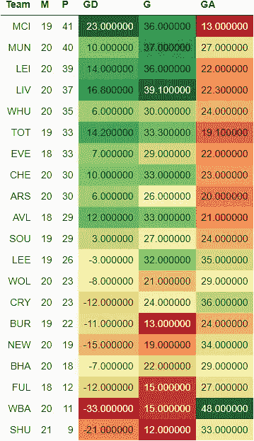
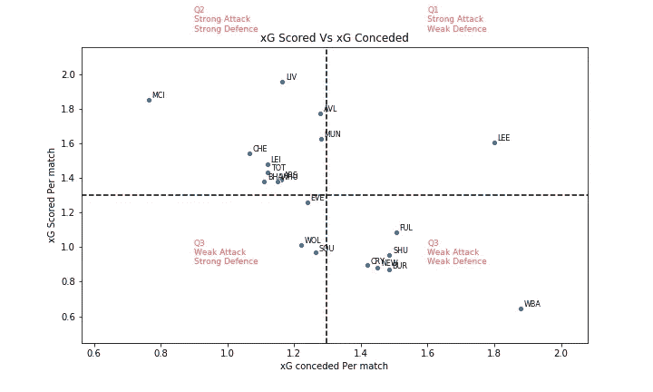
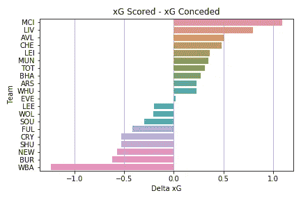
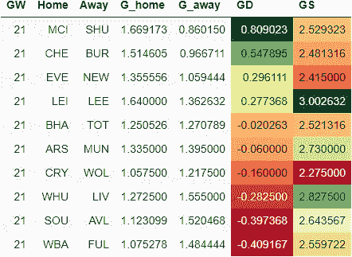
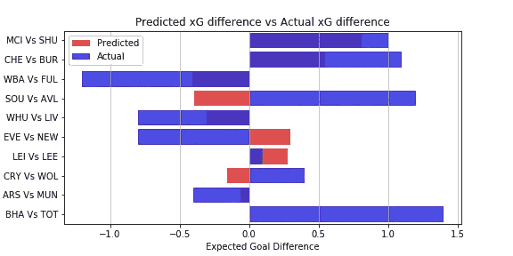

# EPL 分析和游戏周 21 预测

> 原文：<https://towardsdatascience.com/epl-analysis-and-gameweek-21-prediction-8249c3b0117c?source=collection_archive---------38----------------------->

## 使用 xG 统计预测英超联赛结果的数据驱动尝试

这是我的 EPL 预测系列的一篇文章。你可以在这里查看第 20 周比赛的[预测和它的实际表现](/epl-analysis-and-gameweek-20-prediction-73014a4deb36)。

[预期目标或 xG](https://medium.com/@abhijithchandradas/xg-xplained-27b1dbafa943) 是用于预测的参数。如果你对理解预测算法感兴趣，我推荐你去看看[这篇文章，里面有详细的解释](/epl-2020-21-season-analysis-and-prediction-5502e20dce26)。

# 截至第 20 周比赛的分析

EPL 表格，包括净胜球、进球数和进球数(图片由作者提供)

20 分钟后，曼城以 41 分高居榜首，因为他们的本地对手在主场输给谢菲尔德联队后丢分。佩普瓜迪奥拉的球队领先红魔 1 分，并且还有一场比赛。

上个比赛周，莱斯特、热刺、埃弗顿、切尔西和阿斯顿维拉都丢了分。

然而，卫冕冠军在托特纳姆热刺球场以 1-3 战胜穆里尼奥的球队，确保了全取三分。在经历了四场英超联赛的干旱后，这对红军来说是一剂急需的强心剂。铁锤帮和枪手保持着良好的状态，赢得了各自的比赛。

每场比赛 xG 得分与 xG 失球(图片由作者提供)

在 20 个比赛周之后，卫冕冠军尽管最近在进球得分上有所下滑，但在 xG 场均得分上领先大约 2 分。自从最近几个游戏周以来，曼城进球机器一直在稳步提高其每场比赛的 xG 得分。阿斯顿维拉、利兹、曼联、切尔西也都创造了场均 1.5xG 以上。

水晶宫、伯恩利、纽卡斯尔、西布朗、南安普顿和谢联都在创造力上挣扎，甚至无法每场创造 1 个 xG。

曼城似乎是最好的防守单位，让对手每场比赛创造大约 0.75 xG。大多数球队每场比赛承认 1 到 1.5 xG。西布朗和利兹的场均失球超过 1.5 克。

每场比赛 xG 得分与 xG 失球(图片由作者提供)

根据 xG 得分和 xG 失球，球队可以分为 4 个象限，如上图所示。
水平虚线显示每场比赛的平均 xG 得分。水平虚线上方的球队是强攻方，下方的球队是弱攻方。
垂直虚线显示每场比赛的平均 xG 失球。左边的队伍防守强，右边的队伍防守弱。

每次匹配的增量 xG(图片由作者提供)

尽管没有合适的前锋，曼城显然是德尔塔 xG 最好的球队。另一方面，西布朗在球场的两端苦苦挣扎，进攻最弱，防守漏洞百出。

利兹联队在每场比赛创造的 xG 中名列前茅。然而，球队的 delta xG 是负的，因为对手发现很容易穿透利兹的防守，这是贝尔萨必须立即研究的问题。让事情变得更糟的是，最近几周，该团队还在努力提高创造力。

# 游戏第 21 周预测

在进行预测之前，让我澄清一下，这是一个非常简单的算法，只是基于过去的 xG，所以只能预期基线性能。该算法也不能预测高得分游戏。然而，该模型在预测比赛势头方面表现得相当好。你可以在下面看看实际表现如何与前一周的预测相比较。

 [## EPL 分析和游戏周 20 预测

### 使用 xG 统计预测英超联赛结果的数据驱动尝试

towardsdatascience.com](/epl-analysis-and-gameweek-20-prediction-73014a4deb36) 

下表提供了对第 21 周比赛的预测。
GD 的绝对值显示了比赛的竞争力。该值越高，预计匹配越偏向一侧，预测的准确性也越高。
GD 值越低，这场比赛就越有可能成为任何人的游戏。GD 的正值表示主场胜，负值表示客场胜。

GW 9 的 xG 预测(图片由作者提供)

像前一周一样，刀片队再次前往曼彻斯特，在本周的比赛中迎战榜首球队。如果他们能击败曼城，我们可以期待在比赛周之后看到另一支球队夺冠！哦，这个季节太有趣了！然而，该模型预测这场比赛将是最一边倒的一场比赛，曼城队将大获全胜。考虑到他们令人难以置信的状态，曼城很有可能会击败他们。
布莱顿对马刺和枪手对红魔估计是周末竞争最均衡的比赛，算法稍微有利于客队。

预测的 xG(图片由作者提供)

切尔西的新任主教练图切尔有一个很好的机会来庆祝他在俱乐部的首胜，这个周末他将在主场迎来红葡萄酒。富勒姆和阿斯顿维拉也分别在客场对阵西布朗和阿斯顿维拉。

埃弗顿、利物浦和莱斯特有相当大的机会赢得本周的比赛。

莱斯特队主场迎战利兹队估计会是一场进球盛宴，莱斯特队有望获胜。水晶宫 vs 狼队，低挡防守之战估计是低得分手。

## 更新:实际结果与预测

在预测 xG 差异超过 0.20 的 7 次预测中，有 5 次预测与实际性能相匹配。南安普顿对阿斯顿维拉和埃弗顿对纽卡斯尔比赛的预测明显错误。阿斯顿维拉设法从他们的圣玛丽体育场的访问中获得 3 分，然而 xG 数据表明东道主是场上更好的球队。
埃弗顿对纽卡斯尔的比赛也很糟糕，太妃糖期待一场轻松的胜利，但多亏了卡勒姆·威尔逊的魔术，喜鹊在古迪逊公园确保了一场 2-0 的胜利。

布莱顿对热刺的比赛被认为是一场非常激烈的比赛，但穆里尼奥的球队甚至没有与正在保级的布莱顿进行比赛。

## 你可能会感兴趣的另一篇文章:

 [## 如何使用数据科学找到 VVD 的最佳替代品！

### 一种数据驱动的方法来确定受伤的利物浦中后卫维吉尔·范·迪克的最佳替代者。

abhijithchandradas.medium.com](https://abhijithchandradas.medium.com/how-to-find-the-best-replacement-for-vvd-using-data-science-52b64428b45b) 

照片由[蒂姆·贝彻维斯](https://unsplash.com/@timmybech?utm_source=medium&utm_medium=referral)在 [Unsplash](https://unsplash.com?utm_source=medium&utm_medium=referral) 上拍摄