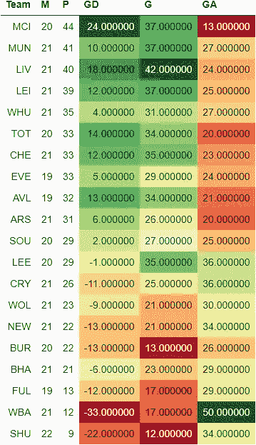
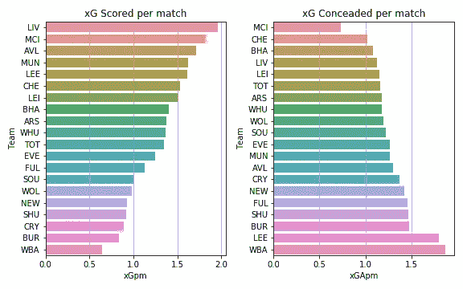
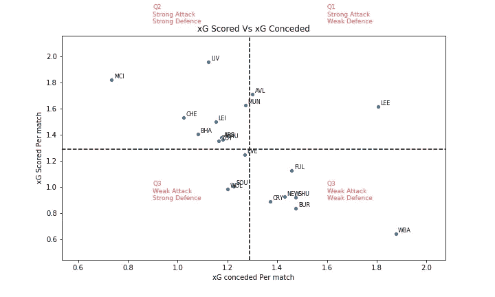
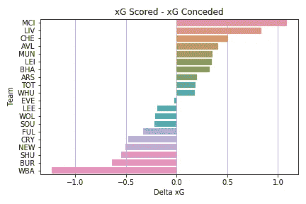
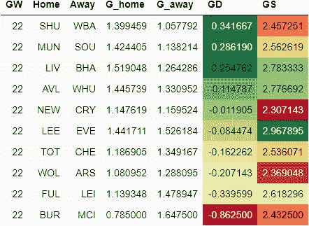
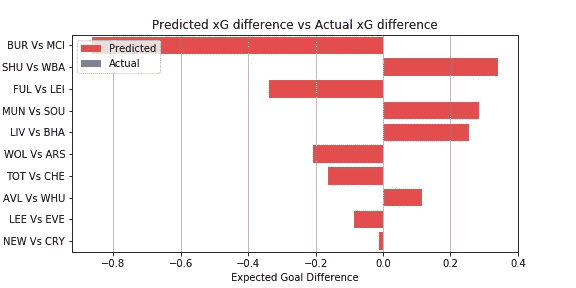
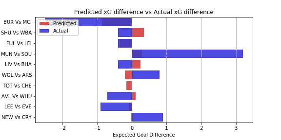
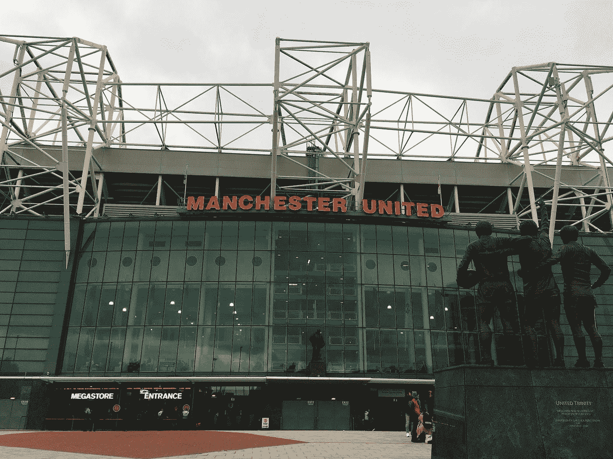

# EPL 分析和游戏周 22 预测

> 原文：<https://towardsdatascience.com/epl-analysis-and-gameweek-22-prediction-91982b809802?source=collection_archive---------42----------------------->

## 使用 xG 统计预测英超联赛结果的数据驱动尝试

这是我的 EPL 预测系列的一篇文章。你可以查看第 21 周比赛的[预测，以及它与实际表现的对比](/epl-analysis-and-gameweek-21-prediction-8249c3b0117c)。

[预期目标或 xG](https://medium.com/@abhijithchandradas/xg-xplained-27b1dbafa943) 是用于预测的参数。如果你对理解预测算法感兴趣，我推荐你去看看[这篇文章，里面有详细的解释](/epl-2020-21-season-analysis-and-prediction-5502e20dce26)。

# 截至第 21 周比赛的分析

EPL 表(图片由作者提供)

在第 21 轮比赛后，曼城以 44 分高居榜首。佩普瓜迪奥拉的球队在少赛一场的情况下领先红魔 3 分。正如克洛普所说，公民明显领先。

上周的比赛中，排名第二的曼彻斯特联队在酋长球场与枪手互交白卷，丢掉了一些分数。莱斯特城主场不敌利兹，滑落至积分榜第四位。莱斯特的损失被卫冕冠军利用，他们以 1-3 战胜了目前排名第五的铁锤帮，攀升至第三位。

积分榜中游看起来非常有趣，7 支球队仅相差 4 分。

穆里尼奥的马刺在没有队长和攻击线前锋哈里·基恩的情况下造访布莱顿。比赛以 1-0 结束，海鸥队领先，热刺队甚至没有进行一场像样的比赛。切尔西在新教练托马斯·图赫尔的带领下取得了首场胜利，对手是伯恩利，他们的两个进球分别来自后卫阿兹皮里库塔和阿朗索。尽管他们所有的明星球员都回到了古迪逊公园，太妃糖还是输给了喜鹊。

xG 得分 vs xG 失球(图片由作者提供)

经过 21 场比赛，卫冕冠军在 xG 场均得分领先 2 分左右。自从最近几个游戏周以来，曼城进球机器一直在稳步提高其每场比赛的 xG 得分。阿斯顿维拉、利兹、曼联、切尔西也都创造了场均 1.5xG 以上。

水晶宫，伯恩利，新城，西布朗，狼队和谢联都在创造力上挣扎，甚至不能每场比赛创造 1 个 xG。

曼城似乎是最好的防守单位，让对手每场比赛创造大约 0.75 xG。大多数球队每场比赛承认 1 到 1.5 xG。西布朗和利兹的场均失球超过 1.5 克。

xG 得分 vs xG 失球(图片由作者提供)

根据 xG 得分和 xG 失球，球队可以分为 4 个象限，如上图所示。
水平虚线显示每场比赛的平均 xG 得分。水平虚线上方的球队是强攻方，下方的球队是弱攻方。
垂直虚线表示每场比赛的平均 xG 失球。左边的队伍防守强，右边的队伍防守弱。

Delta xG(图片由作者提供)

曼城在 delta xG 方面遥遥领先于其他球队，xG 得分和 xG 失球之间的差距超过 1。卫冕冠军是另外一支 delta xG 在 0.5 以上的队伍。另一方面，西布朗在球场的两端苦苦挣扎，进攻最弱，防守漏洞百出。

利兹联队在每场比赛创造的 xG 中名列前茅。然而，球队的 delta xG 是负的，因为对手发现很容易穿透利兹的防守，这是贝尔萨必须立即研究的问题。刚刚超过降级区的海鸥队在 delta-xG 方面排名第 7。他们很不走运，没有把场上表现转化成积分。

# 游戏第 22 周预测

在进行预测之前，让我澄清一下，这是一个非常简单的算法，只是基于过去的 xG，所以只能预期基线性能。该算法也不能预测高得分游戏。该模型也没有考虑球队的选择，球员因伤缺席，阵型，战术变化等。

然而，该模型在预测比赛的势头方面表现得相当好。你可以在下面看看实际表现如何与前一周的预测相比较。

</epl-analysis-and-gameweek-21-prediction-8249c3b0117c>  

下表提供了对第 22 周比赛的预测。
GD 的绝对值显示了比赛的竞争力。该值越高，预计匹配越偏向一侧，预测的准确性也越高。
GD 值越低，这场比赛就越有可能成为任何人的游戏。GD 的正值表示主场胜，负值表示客场胜。

EPL 预测 GW 22(图片由作者提供)

伯恩利 vs 曼城似乎是 Gameweek 22 最一边倒的比赛。曼城有望在这场比赛中全取三分。莱斯特也有望在克拉文农场赢得与富勒姆的比赛。

刀片，曼联和红军有望轻松赢得各自的比赛。
阿斯顿维拉 vs 西汉姆，纽卡斯尔 vs 水晶宫，利兹联 vs 埃弗顿，热刺 vs 切尔西估计是非常接近的比赛，没有明确的热门。然而，阿斯顿维拉和切尔西比他们的对手略胜一筹。

GW 22 预测(图片由作者提供)

# 更新:预测与实际表现

## 成为会员

我希望你喜欢这篇文章，我强烈推荐 [**注册*中级会员***](https://abhijithchandradas.medium.com/membership) 来阅读更多我写的文章或成千上万其他作者写的各种主题的故事。
[你的会员费直接支持我和你看的其他作家。你还可以在 Medium](https://abhijithchandradas.medium.com/membership) 上看到所有的故事。

<https://abhijithchandradas.medium.com/how-to-find-the-best-replacement-for-vvd-using-data-science-52b64428b45b>  

阿莱西奥·费斯塔在 [Unsplash](https://unsplash.com?utm_source=medium&utm_medium=referral) 上拍摄的照片