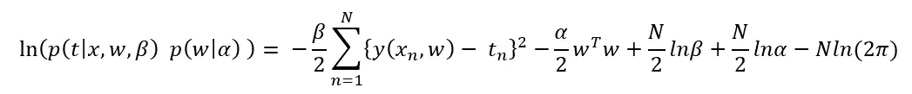

# 正则化最小二乘与最大化后验概率函数的等价性

> 原文：<https://towardsdatascience.com/equivalence-of-regularised-least-squares-and-maximising-the-posterior-probability-function-32082479849a?source=collection_archive---------21----------------------->

## 机器学习推导

## 为什么正则化最小二乘等价于最大后验解，是正态分布数据的最优算法

在 [Unsplash](https://unsplash.com?utm_source=medium&utm_medium=referral) 上拍摄的 [ThisisEngineering RAEng](https://unsplash.com/@thisisengineering?utm_source=medium&utm_medium=referral)

本文比较蒂科诺夫 L2 正则化和最大后验概率函数。这是一个相当代数密集，所以我建议拿起笔和纸，尝试自己！

# **偏差方差困境**

许多机器学习模型的一个问题是它们倾向于过度拟合数据。过度拟合是机器学习中的一种现象，发生在模型对训练数据学习得太好，使其概括能力变差的时候。

学习机的**偏差**和**方差**之间有一个微妙的平衡。

**偏差:**学习机器对未知数据进行归纳的能力

**方差:**当我们改变随机机器被训练的数据时，随机机器的预测的期望偏差

一台性能良好的机器将具有高偏差和低方差。为了获得更高的偏差，我们需要一台复杂的机器，能够对看不见的数据进行归纳。然而，机器必须足够简单，方差不会增加太多。

# **蒂科诺夫 L2 正规化**

一种增加机器复杂性而不增加方差的方法是调整机器。

正规化试图将训练过程中的过度适应最小化。当机器超载时，它们的重量会急剧增加。L2 正则化惩罚权重的大小以减少过度拟合。

L2 正则化的工作原理是，首先向最小二乘误差添加一项，惩罚权重 w 的大小。相对于 w 求微分并找到最小误差，得到上面所示的伪逆解，其中γ是 L2 正则化项。

# **最大后验概率**

根据贝叶斯定理，后验概率与先验乘似然成正比。

高斯分布似然和共轭先验的表达式如下所示。似然和先验概率都是多元高斯的形式。

其中多元高斯函数如下所示:

由数据、平均值和协方差矩阵参数化。

通过取似然和先验的乘积，然后取自然对数并最大化，可以找到产生最大后验概率的权重。对数函数用于简化，由于它是单调函数，我们希望最大化它，因此它不会影响最大化的结果。

后验概率函数结果对数的上方。因此，最大化后验概率相当于最小化下面的等式。

当最小化时，该等式与本文开头所示的正则化最小二乘法中所示的误差函数相同。因此，通过最大化后验概率函数来寻找最佳权重等价于最小化正则化最小二乘函数。

# **结论**

最小化正则化最小二乘误差相当于最大化后验概率。对于正态分布数据和无限数据，正则化最小二乘算法是最优的。这就是这个算法如此强大的原因，也是它一直沿用至今的原因。

## 支持我👏

希望这对你有帮助，如果你喜欢它，你可以 [**跟我来！**](https://medium.com/@diegounzuetaruedas)

您也可以成为 [**中级会员**](https://diegounzuetaruedas.medium.com/membership) 使用我的推荐链接，访问我的所有文章和更多:[https://diegounzuetaruedas.medium.com/membership](https://diegounzuetaruedas.medium.com/membership)

## 你可能喜欢的其他文章

[可微发电机网络:简介](/differentiable-generator-networks-an-introduction-5a9650a24823)

[傅立叶变换:直观的可视化](/fourier-transforms-an-intuitive-visualisation-ba186c7380ee)

# **参考文献**

主教，哥伦比亚特区，2006 年。模式识别和机器学习