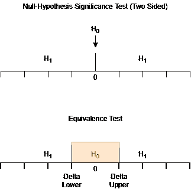
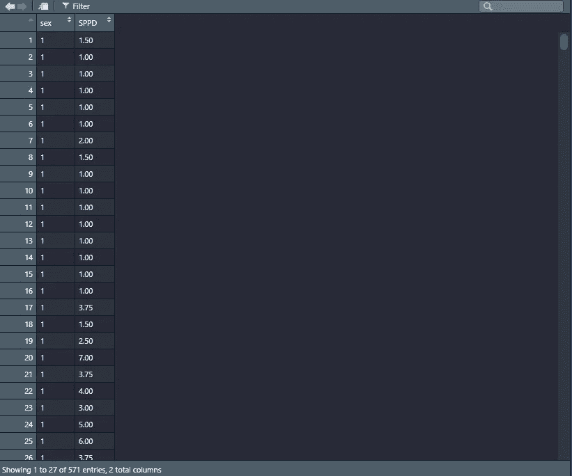
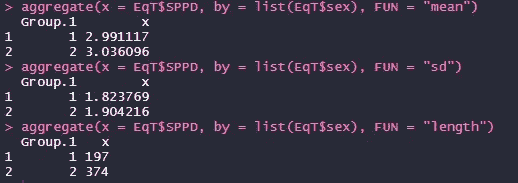
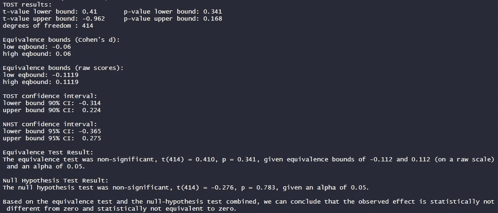
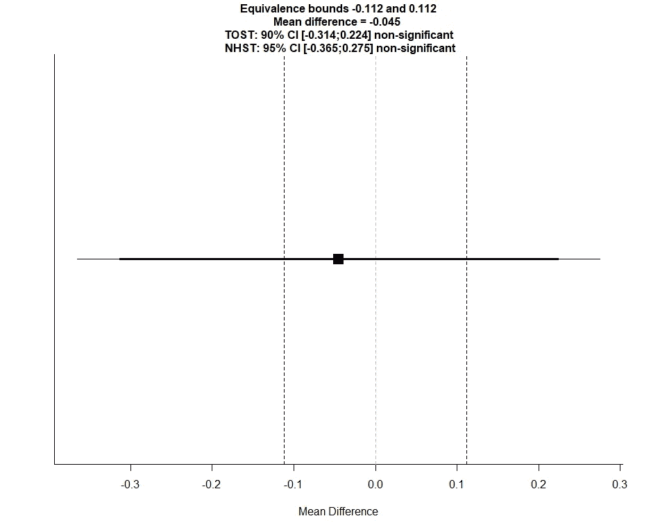

# 无效假设的证据？一个等价测试的例子

> 原文：<https://towardsdatascience.com/equivalence-testing-b107979a65ae?source=collection_archive---------14----------------------->

## 当结果不显著时使用的统计工具(R 中的例子)


布雷特·乔丹在 [Unsplash](https://unsplash.com?utm_source=medium&utm_medium=referral) 上的照片

假设你进行了一项研究，测试儿童和青少年对不公平待遇的道德厌恶之间的差异。收集数据并运行分析后，您会发现两者之间没有显著的统计差异。当这种情况发生时，通常将结果解释为零假设的证据，也就是说，儿童和青少年在道德厌恶方面没有真正的差异。然而，这是对非显著性结果的误解，因为不可能显示在人群中完全没有影响。

Quertemont (2011)指出，不重要的结果可能由于三种不同的原因而出现:

> 1.在收集或编码数据的过程中出现了错误，掩盖了其他重要的结果。这也包括测量误差(不精确)。
> 
> 2.这项研究没有足够的统计能力来证明在人群水平上确实存在这种影响。由于抽样误差，结果是“假等价”。
> 
> 3.在人群层面实际上并没有真正的影响(或者说影响可以忽略不计)。结果是“真正的等价”。

虽然不可能显示在人群中没有影响，但我们可以使用统计数据来显示人群中影响的大小低于某个值的可能性，该值被认为太低而无用(Quertemont，2011)。这就是*等价测试的情况。*

# 等价测试

等效性检验起源于生物等效性研究，即如果药物在一定时间后的吸收率和在血液中的浓度水平相同，则认为药物是生物等效的。

如前所述，等效性测试检验是否可以拒绝存在极端到足以被认为有意义的影响的假设(Lakens 等人，2018)。



经典零假设显著性检验和等价性检验的区别。图片作者。

正如你从上图中看到的，为了进行等价测试，研究者必须定义感兴趣的最小效应大小。让我们看看 Lakens 等人(2018 年)的例子，让它更清楚:

> 在与专家进行广泛讨论后，研究人员决定，只要性别差异与人口差异的偏差不超过 0.06，这种差异就太小了，不必在意。假设总体中的预期真实差异为 0.015，研究人员将测试观察到的差异是否超出 0.055 和 0.075 的边界值(或等价界限)。如果在两个单边测试中可以拒绝至少与这些边界值一样极端的差异[……]，研究人员将得出结论，应用率在统计上是相等的；性别差异将被视为微不足道，也不会花钱解决参与方面的性别差异。

要了解如何证明感兴趣的最小效应大小，请查看 Lakens 等人(2018 年)的论文。

# r 代码

## 读取数据

我们将使用 R 函数 *read.delim* 读取数据集

```
EqT <- read.delim("[https://raw.githubusercontent.com/rafavsbastos/data/main/EqT.txt](https://raw.githubusercontent.com/rafavsbastos/data/main/EqT.txt)")
```

我们为数据框选择的名称是 EqT。使用`View(EqT)`我们将看到我们的数据集:



其中性别分为 1 =男性，2 =女性；和 SPPD =偏见和歧视的自我认知(巴斯托斯等人，2021)。

## 装载到斯特包

为了开始操作数据，我们需要下载 *TOSTER* 包。只需运行以下代码。

```
install.packages(“TOSTER”)
```

好的。现在包在你的电脑上。现在，我们需要让它开始与`library(TOSTER)`一起工作。

## 汇总统计数据

使用 *TOSTER* 包，可以使用汇总统计数据执行等效性测试。然后，我们将计算每组的平均值、标准偏差和样本量。

```
aggregate(x = EqT$SPPD, by = list(EqT$sex), FUN = "mean")
aggregate(x = EqT$SPPD, by = list(EqT$sex), FUN = "sd")
aggregate(x = EqT$SPPD, by = list(EqT$sex), FUN = "length")
```

它给出了以下输出:



男性的平均值= 2.99，标准差= 1.82，有 197 名参与者，而女性的平均值= 3.03，标准差= 1.90，有 374 名参与者。

## R 中的等价测试

现在，我们将把这些结果放在一行代码中，这将为我们提供信息输出和图表。注意，这里的上下等价界只是一个例子，它不应该被认为是一个真实的结果。

```
TOSTtwo(m1 = 2.991117, m2 = 3.036096, sd1 = 1.823769, sd2 = 1.904216, n1 = 197, n2 = 374,
        low_eqbound_d = -0.06, high_eqbound_d = 0.06, alpha = 0.05,
        var.equal = FALSE)
```

> 测试的参数在最后一行代码的括号内定义。要对您自己的数据执行测试，只需复制这几行代码，用您自己研究中的相应值替换这些值，然后运行代码。结果和图将自动打印。运行代码“help("TOSTtwo ")”会提供一个包含更多详细信息的帮助文件。

输出如下:



和图:



正如我们所看到的，基于等价性检验和零假设检验，我们可以得出结论，观察到的效应在统计上不等于零，在统计上不等于零。

# 评论

在这篇文章中，我展示了等价测试的重要性以及这些统计数据对于研究的重要性。我还展示了一个使用两个单边测试(TOST)的例子，虽然等价测试也可以使用其他统计数据。重要的是要注意等效测试的一个限制:能力。为了进行这种统计，你可能需要一个超过 100 甚至 500 的样本量来获得足够的功效(Goertzen 和 Cribbie，2010)。这意味着研究人员需要投入更多的资金来做这些统计。

# 接触

请随时通过以下方式联系我

> 【Gmail:rafavsbastos@gmail.com
> 咨询与合作网站:[*rafavsbastos.wixsite.com/website*](https://rafavsbastos.wixsite.com/website) *LinkedIn:*[*linkedin.com/in/rafael-valdece-sousa-bastos/*](https://www.linkedin.com/in/rafael-valdece-sousa-bastos/) *Github:*[*github.com/rafavsbastos*](https://github.com/rafavsbastos)

# 参考

E.Quertemont，如何从统计上显示一种效果的缺失，2011 年，*心理比利时*， *51* (2)，109–127。

D.Lakens，A. M. Scheel，P. M. Isager，《心理学研究的等效测试:一个教程》，2018 年，*心理科学方法与实践进展*， *1* (2)，259–269。

R.V. S. Bastos，F. C. Novaes，J. C. Natividade,《偏见和歧视自我认知量表:有效性和其他心理测量性质的证据》, 2021 年，提交给同行评审的手稿。

J.R. Goertzen 和 R. A. Cribbie,《检测缺乏关联:等效测试方法》, 2010 年，*英国数学和统计心理学杂志*， *63* (3)，527–537。