# 分类模型中的可疑区域

> 原文：<https://towardsdatascience.com/equivocal-zones-in-a-classification-model-f156208f3994?source=collection_archive---------33----------------------->

## 朴素贝叶斯模型中具有可疑区域的分析示例。

**由吉纳·戈麦斯
与格雷戈·佩奇**

**可疑区域:概述**

通常，当我们度量分类模型的性能时，我们通过使用某个特定数据集中的所有记录来完成。例如，我们可能会说，一个模型“对训练集达到了 71%的准确性，对验证集达到了 68.4%的准确性”，或者该模型“对训练集的敏感度为 81.2%。”但是，并没有要求我们在进行预测时必须考虑所有的记录。

相反，在某些情况下，我们可能希望根据模型做出分类决策的潜在概率，只关注某个特定的记录子集。

例如，假设我们正在运行订阅服务，并且我们已经建立了一个模型来预测客户的订阅续订。与其只关注“是”或“否”的分类预测结果，我们可能更喜欢关注我们数据库中每个消费者的更新概率。为了以最有效的方式集中我们的精力，我们可能会忽略续订预测低于 0.20 的客户(也许他们是一个失败的原因)，以及那些概率高于 0.80 的客户(他们似乎是续订的“锁”)。通过将我们的精力引向概率在 0.20 和 0.80 之间的人，我们可以最有效地利用我们的营销资源。

或者，企业可能会遇到这样一种情况，在这种情况下，关注类成员的概率非常高的记录是最有意义的。也许我们正在出售豪华度假屋出租，我们的方法依赖于人力密集型，亲自推销。在这种情况下，我们可以将销售资源集中在那些购买概率超过某个高阈值的客户身上——通过只锁定这些客户，我们可以避免

在*应用预测建模*中，库恩和约翰逊描述了“模棱两可或不确定区域”的使用，在该区域中，某个分类根本无法预测。例如，对于两类问题，建模者可以简单地将预测概率在 0.40 到 0.60 之间的样本标记为“不确定”或“不确定”，而使用其余样本进行计算和更详细的分析。 *1*

**白俄罗斯二手车:准备数据&建立模型**

在下面的模型中，我们从包含白俄罗斯二手车供应信息的数据集开始。在宁滨之后，二手车价格(我们的结果变量)被分成三个相对平均大小的组，在宁滨之后，其他几个输入变量被用于朴素贝叶斯过程，

这个二手的 CC0 公共领域汽车数据集，由从 Kaggle 下载的数据科学家 Kirill Lepchenkov 创建，包含 38145 个观察值。

要下载 CC0 公共领域数据集，请点击链接:【https://www.kaggle.com/lepchenkov/usedcarscatalog 

***变量***

**制造商名称:**汽车的制造商名称。有 50 多个分类选项，如讴歌，阿尔法罗密欧，奥迪，宝马，别克，雪佛兰，奔驰，日产，沃尔沃等。

**变速器:**变速器是机械的还是自动的。

**颜色:**汽车外观的颜色，有 12 种独特的级别。

**year _ producted:**汽车生产的年份。这个变量是数字，但是我们把它转换成一个因子。“老”车是指在中间年份之前生产的车，“新”车是指在中间年份或之后生产的车。

**发动机 _ 燃料:**汽车使用的燃料类型(柴油、电动或燃气)

**engine_has_gas:** 汽车的发动机是否装有丙烷罐和油管。

**engine_capacity:** 发动机容量是一个以升为单位的数字变量，但我们将其转换为具有 5 个级别的分类变量:最低发动机容量、略低于平均发动机容量、平均发动机容量、略高于平均发动机容量和最高发动机容量。

**车身 _ 类型:**汽车的车身类型。这个变量有 12 个级别，包括敞篷车，轿跑车，豪华轿车，皮卡，轿车，通用，SUV 和其他。

**已 _ 质保:**车是否还有有效质保。

**状态:**该变量包含三个级别:新建、已拥有和紧急。紧急意味着汽车已经被损坏，有时是严重的。

**drive_train:** 汽车是否有前置、后置或全轮驱动的传动系统。

**is _ exchange:**车主是否准备将这辆车换成另一辆车，只需很少或不需要额外付款。

**location_region:** 有六个级别的类别，每个级别代表白俄罗斯的不同地区。

**duration_listed:** 汽车在目录中的上市时间，以天为单位。变量是数字，但是我们把它转换成两类:更短的和更长的。

**照片数量:**目录中发布的汽车照片数量。这个变量是数字，但我们把它转换成两个类别:更高和更低。

**price_USD:** 目录中所列汽车的价格，单位为美元。这个变量是数值型的，但是我们转换成了一个分类变量，有三个分类:便宜的、中等的和昂贵的。

首先，我们需要加载我们将用于分析的所有库，并将数据集加载到环境中。此处使用 read_csv2()，因为数据集包含一些西里尔字符，还因为它包含一个“；”列之间的分隔符。

原始数据集附带了一系列 10 个具有布尔值的其他特征变量。我们不清楚这些变量的含义，因此我们从数据集中删除了它们。

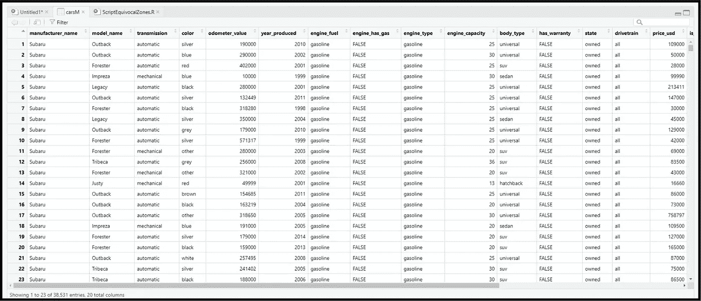

我们需要绑定 *price_usd* 变量，以便它可以用作朴素贝叶斯模型中的分类结果。

首先，我们确定了 386 条缺少 price_usd 值的记录，并从数据集中删除了这些记录:

在 quantile()函数的帮助下，如下所示，我们将记录分成三个平衡的组，分别标记为“便宜”、“中等”和“昂贵”

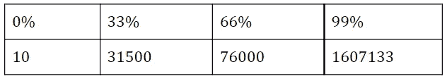

以下是三个结果类别组，每组中的记录数量几乎相同:

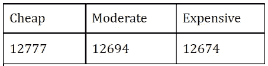

修改后的数据集将被重命名为 carsMod。

接下来，我们将字符变量和逻辑变量转换成因子。

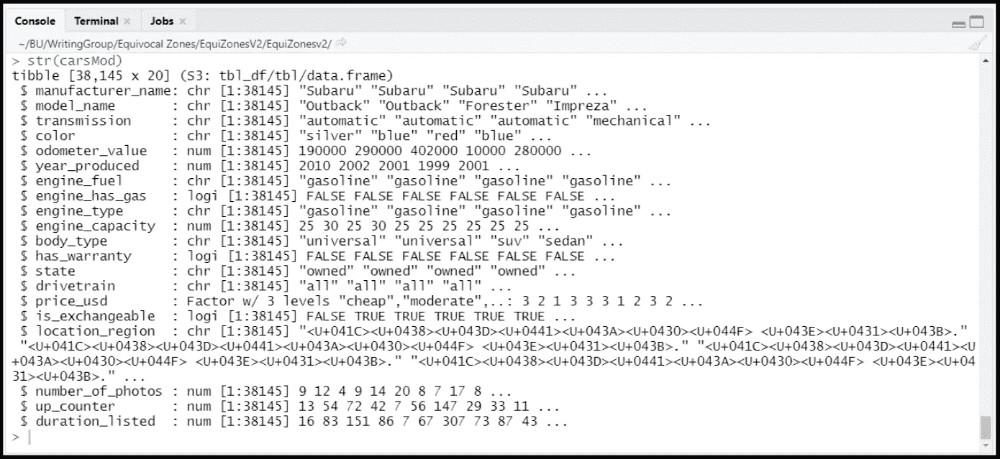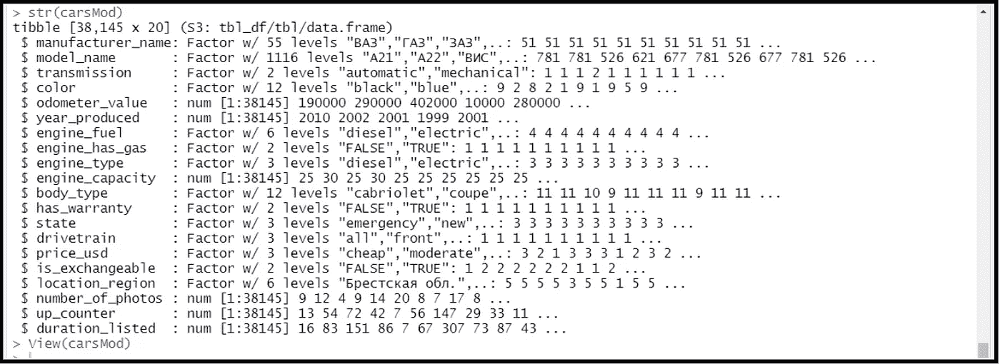

*engine_capacity* 变量是数值型的，因此我们将其转换为四个分类箱，如下所示:

我们将*里程表*变量转换成五个分类箱，如下所示:

变量 *year_produced、number_of_photos、up_counter、*和 *duration_listed* 均根据各自的中值分为两个结果组。这些转换按如下方式进行:

最后，如下所示，我们的变量被完全转换为因子:

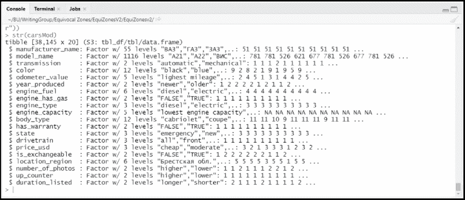

然后，我们对这些数据进行分区，随机将 60%的记录分配给训练集，另外 40%分配给验证集。这里使用种子值 699 是为了代码的可复制性。

为了评估我们的潜在独立变量在朴素贝叶斯模型中的适用性，我们构建了比例柱状图。这些柱状图仅使用训练集数据构建，它们展示了这些潜在输入变量的不同级别之间 price_usd 的比例差异。

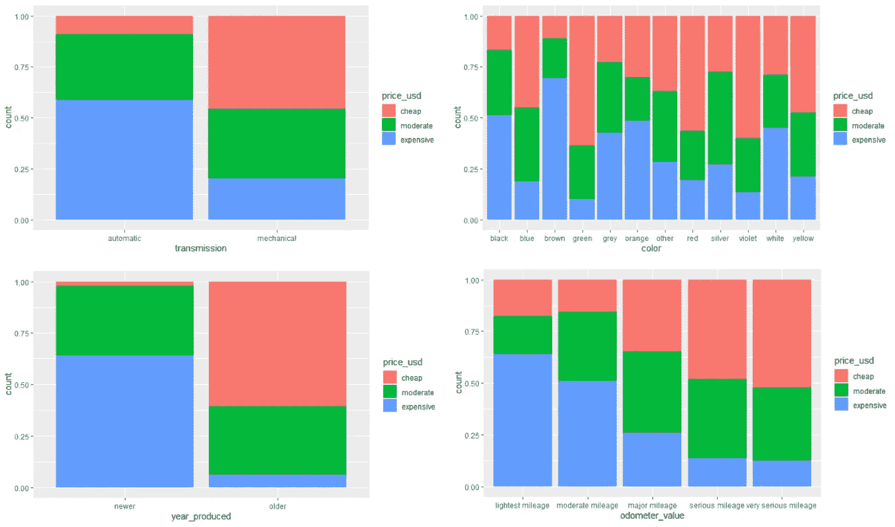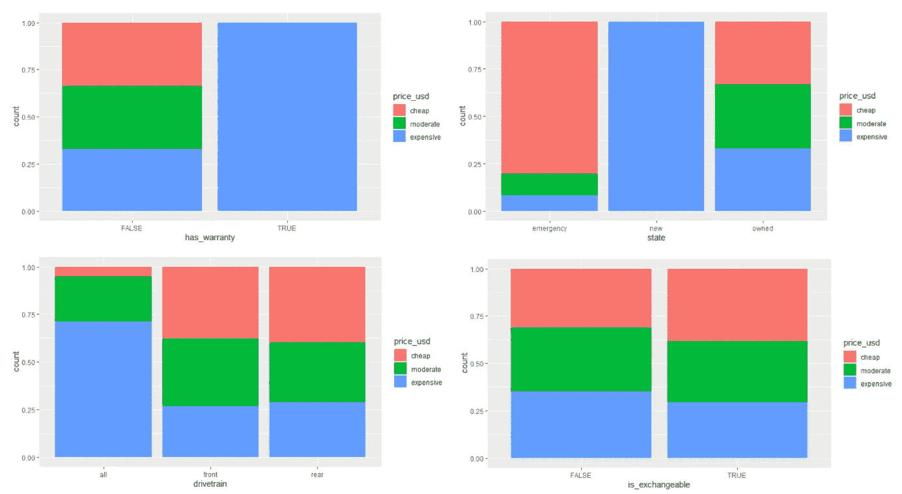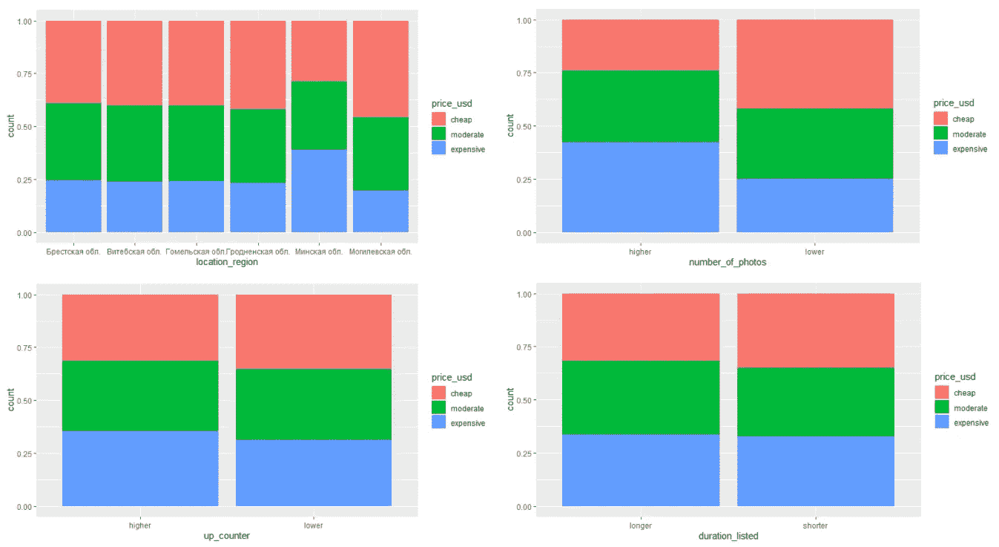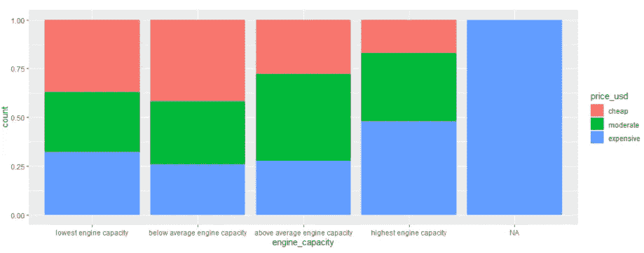

基于这些图表，我们决定删除*列出的*和*可交换的*，因为这些变量的不同水平不会显著影响价格。

我们还删除了*制造商名称*和*型号名称*，它们分别包含 55 个和 1，116 个唯一级别。

接下来，我们运行朴素贝叶斯分类模型:

然后，我们使用训练集数据生成了以下混淆矩阵:

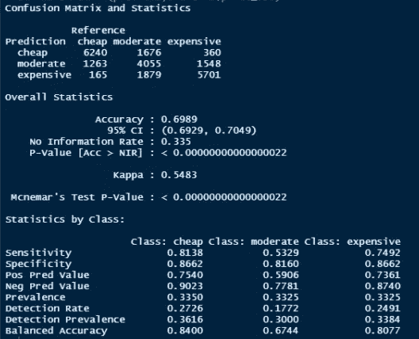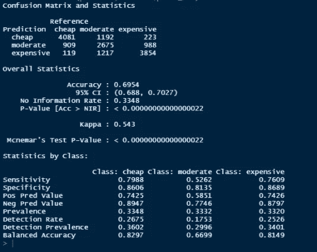

从上面显示的两个混淆矩阵中，我们可以看到训练集和验证集的模型性能非常相似，这表明模型没有过度适应训练集。在这两种情况下，我们都可以看到朴素规则(无信息率)的显著优势，准确率提高了一倍以上。

**改变游戏:缩小关注范围**

如果我们的目标不是预测一辆车将落入三个结果类别中的哪一个，而是将我们的注意力转移到最有可能*落入特定结果类别的车，会怎么样？通过检查与类别预测相关联的概率，我们可以实现这一点。*

首先，我们使用带有 type="raw "参数的 predict()函数，该函数返回我们的模型分配给每个记录的类成员的百分比可能性。(为了简洁起见，我们不会解释这些数字产生的整个过程，但是我们[推荐这个 YouTube 教程](https://www.youtube.com/watch?v=kIpNabtoj6s)来分解分类概率是如何产生的)。

将结果类概率预测附加到验证集之后，我们可以使用 dplyr 中的 arrange()函数按照预测的类概率对记录进行排序。例如，下面的第一行代码给出了验证集中最有可能属于“便宜”结果组的 500 辆汽车；它下面的一行生成一个表，显示这 500 条记录的实际结果类。

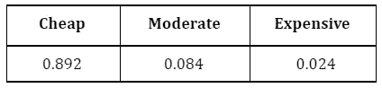

从这个组中，我们可以看到 89.2%的汽车属于“便宜”的结果组。如果我们专门寻找价格未知但预计在此范围内的汽车，这样的过程将具有巨大的实用价值——对于我们决定更仔细检查的每 10 辆汽车，9 辆将定价在我们的目标范围内。

我们可以对其他结果类使用类似的过程:

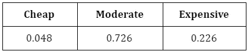

最后，我们可以对“昂贵的”结果组重复这个过程:

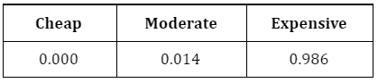

当我们在模型中筛选出我们的模型*最强烈地*预测为“昂贵”的 500 条记录时，我们几乎总是会识别出昂贵的汽车。

**但是等等，这不是作弊吗？**

首先，仅*对潜在分类概率满足某个阈值的记录进行分类的概念可能看起来不公平。在某些方面，这是不公平的——如果我们将使用这种方法的模型的性能与试图对它看到的每条记录进行分类的模型的性能进行比较，那么是的，这将是一个完全不公平的比较。*

当然，计划发布或分享结果的公司或研究人员必须非常明确地向观众披露，这些结果是在可疑区域的记录被排除在考虑范围之外之后才获得的。例如，我们永远不能声称上面显示的朴素贝叶斯模型在标记昂贵的汽车时达到了“98.6%的准确率”，而没有非常清楚地指出这只是在以这样一种方式过滤数据后发生的，即只有最有可能属于“昂贵”组的汽车保留下来。

然而，在商业世界中，模型不是为黑客马拉松或出版物而构建的。相反，它们是出于实际目的而构建的，从大量记录中消除“可疑区域”记录可以带来非常重要的实际好处。对于回答诸如客户是否会续订、潜在客户是否会购买或当前客户是否会升级到高级计划等业务问题，支持模型分类预测的概率可以提供大量信息线索，表明企业应集中精力在哪些方面，以获得最大的投资回报(ROI)。承认 51%的可能性和 99%的可能性是非常有意义的不同——即使它们导致相同的预测分类结果——是从任何分类模型生成最佳可能 ROI 的一大步。

摄影师 Pix 的生活。(2015 年 8 月 11 日)。Fotografì a de paisaje de coches 汽车查看照片。从 Pexels 检索。

**参考文献**

1.  库恩，马克斯和杰尔·约翰逊。*应用预测建模*。斯普林格，2013 年:第 254 页。
2.  [基里尔·列普琴科](https://www.kaggle.com/lepchenkov)。(2019 年 12 月 2 日)。特许 CC0 公共领域二手车目录数据集。从卡格尔那里取回的。[https://www.kaggle.com/lepchenkov/usedcarscatalog](https://www.kaggle.com/lepchenkov/usedcarscatalog)