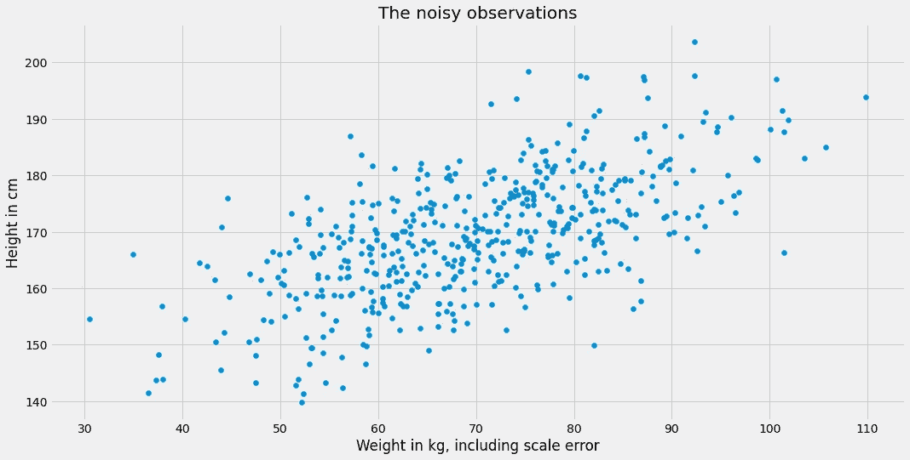
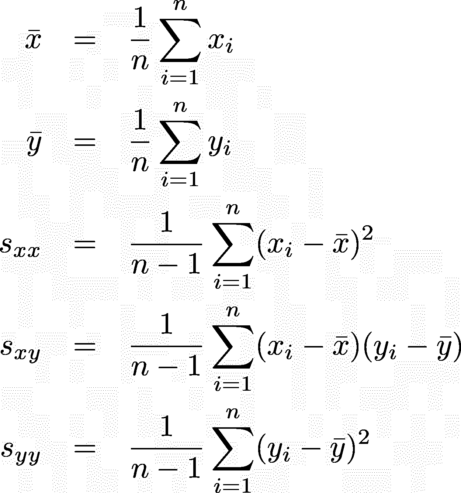
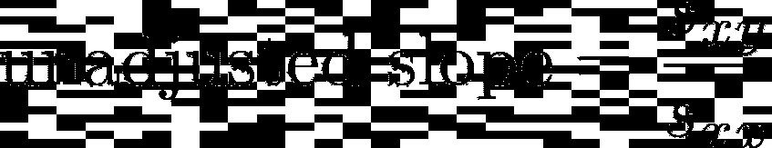
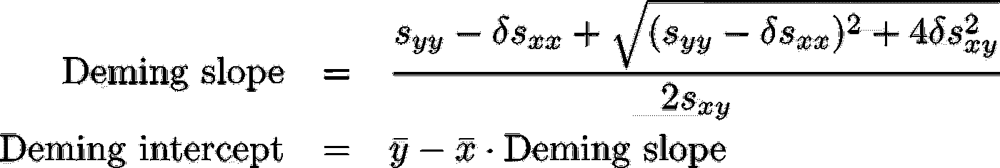
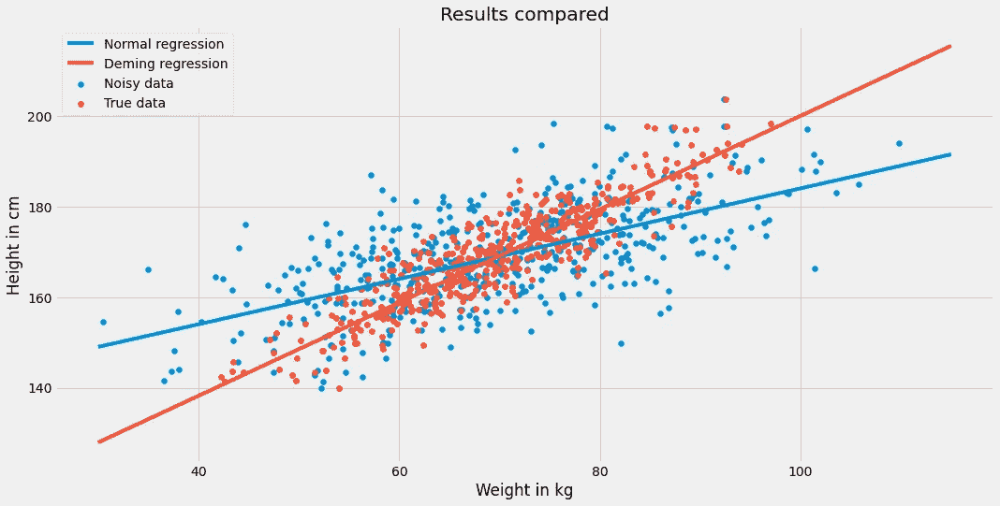
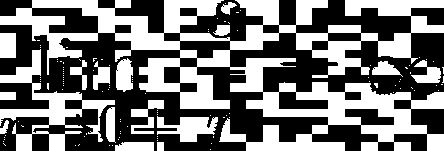

# 变量误差模型:戴明回归

> 原文：<https://towardsdatascience.com/error-in-variables-models-deming-regression-11ca93b6e138?source=collection_archive---------8----------------------->

## [实践教程](https://towardsdatascience.com/tagged/hands-on-tutorials)

## 当到处都是错误的时候，得到正确的结论


[苏珊·Q·尹](https://unsplash.com/@syinq?utm_source=medium&utm_medium=referral)在 [Unsplash](https://unsplash.com?utm_source=medium&utm_medium=referral) 上的照片

# 介绍

机器学习通常都是关于以下问题:

> 给定一个数据集(X，y)，其中 X 是特征矩阵，y 是目标向量，求一个 f，f(X) ≈ y。

因为目标值 *y* 存在误差，我们通常做**而不是**执行严格的等式àla*f*(*X*)=*y*。这些错误源于这样一个事实，即我们通常无法观察到宇宙中的所有事物并将其放入我们的特征矩阵中。即使*如果*我们可以，量子力学告诉我们，系统中可能仍然存在随机性，这使得我们有可能在相同的输入下获得不同的结果。

长话短说，标签是嘈杂的，我们通过引入一个误差项 *ɛ、*来处理这个问题，比如线性回归情况下的 *y* = *a*x + b + ɛ* 。目前没有新消息。但请回答我以下问题:

> 有没有想过特征变量 X 的错误？

我当然没有。所以让我告诉你什么时候这很重要。

# **动机**

我喜欢经典的、不起眼的例子。它们不会让你分心，让你专注于新事物，一步一步来。所以，我们用下面这个:**预测一个人的身高，给定体重！以前从没做过这个，对吗？😉**

> 你的目标是找到体重和身高的关系。如果一个人比另一个人重 1 公斤，你能说他们的身高是多少？你想使用线性模型，所以基本任务是计算直线的斜率。

**故事:**你邀请了 500 人参加你的创新研究，并量了他们的体重和身高。

**转折:**实验结束后，你注意到你的秤相当不准确——在反复称自己的体重后，你得到了很多满地的数字，尽管它们的均值至少在你的真实体重附近。其他 500 个重量级也是如此*。哎呀*。这种情况怎么处理？重新运行整个实验肯定是**而不是**一个选项。


[主题客栈](https://unsplash.com/@themeinn?utm_source=medium&utm_medium=referral)在 [Unsplash](https://unsplash.com?utm_source=medium&utm_medium=referral) 拍摄的照片

## 数据

我们从生成一些数据开始，这些数据可能是你在实验中获得的:首先，我们生成真实的重量 *x_true* ，并从中导出身高 *y* 。然后，我们给权重 *x_true* 添加一些噪声，并将结果称为 *x* 。

> 注意:我用 X 代替 X，因为我们这里只有一个单一的特性。

```
import numpy as np

np.random.seed(0)

n = 500
x_true = 10*np.random.randn(n) + 70 # the true, unobserved weights
y = x_true + 100 + 5*np.random.randn(n) # the observed heights
x = x_true + 10*np.random.randn(n) # the noisy, observed weights
```

在现实生活中，我们只被给予 *x* 和 *y* 来处理，所以这就是我们所看到的:



图片由作者提供。

如果我们不知道坏秤，或者根本不关心坏秤，我们可以对有噪声的 *x* 和 *y* 应用线性回归模型，例如:

```
from sklearn.linear_model import LinearRegression

lr = LinearRegression()
lr.fit(x.reshape(-1, 1), y)

print(f'height = {lr.coef_[0]:.2f}*weight + {lr.intercept_:.2f}')

# Output:
# height = 0.50*weight + 134.09
```

嗯，看起来是个合理的结果:体重越高，身高越高。健全性检查通过。但是，回头看看我们是如何生成高度值的:

```
y = x_true + 100 + 5*np.random.randn(n)
```

真正的系数其实是 1，截距是 100，和我们运行线性回归得到的系数 0.5，截距 134 相差甚远。如果这是一个问题，取决于你，虽然。

如果你继续使用你的坏秤，你只是想预测，目前的型号**身高= 0.50 *体重+ 134.09** 是正确的选择，因为它完全适应这种设置。你只是这样训练它。

另一方面，如果你想知道身高和真实体重之间的真实关系，你必须比那更聪明。问题是你的斜率太小了，也就是俗称的[回归稀释或者回归衰减](https://en.wikipedia.org/wiki/Regression_dilution)。我们现在来看看如何解决这个问题。

# 用戴明回归法修复量表

即使是脏数据，也有几种方法可以检索正确的系数。最简单的一种是所谓的[戴明回归](https://en.wikipedia.org/wiki/Deming_regression)，这是普通最小二乘法的一种变体，用于解释误差。

戴明回归是以威廉·爱德华·戴明博士的名字命名的，顺便说一下，他甚至没有发明这种方法，但却使它流行起来。发明者 **R. J .阿德考克**和 **C. H .库梅尔**也功不可没。

## 计算直线

在我们开始之前，让我们快速浏览一些符号。你可能已经看到了这些东西，但是让我们在这里让每个人都在同一页上。我们假设 *x=(x₁，x₂，x₃，…，xₙ)* 和 *y=(y₁，y₂，y₃，…，yₙ)* 是我们的数据集。然后，我们定义如下:



图片由作者提供。

在我们讨论戴明回归公式之前，让我强调一下，有了这些符号，我们也可以通过



图片由作者提供。

在 Python 中翻译成

```
s_xy = ((x - x.mean()) * (y - y.mean())).sum() 
s_xx = ((x - x.mean())**2).sum()

print(f'slope = {s_xy / s_xx:.2f}')

# Output:
# slope = 0.50
```

你也可以由此计算截距，这里我省略了。我们从 sklearn 已经知道是 **134.09。**

现在，让我们为戴明、阿德考克和库梅尔做一些公正的事，并提出调整后的斜率和截距:



图片由作者提供。

好吧，看起来稍微复杂一点，但还是可以处理的。但是公式中的这个 *δ* 是什么呢？可悲的是，这是这种方法的主要缺点。这不是我们可以计算的，我们只需要*知道*或者猜测。

*δ* 是 *y* 的误差方差除以 *x* 的误差方差的比值。我的意思是这样的:回归公式 *y* = *a*x + b + ɛ* ，包含一个正态分布的随机变量 *ɛ* ，所以我们假设。σᵧ.的情况有些变化*这就是我说的*“*y 中误差的方差”。*

*我们进一步假设我们观察到的权重 *x* 也是通过将高斯噪声添加到真实权重 *x_true，*而获得的，真实权重也具有一些方差，即*“*x”中误差的*方差。**

*在我们的例子中，我们被给予了一切。让我粘贴我们用来创建数据集的公式:*

```
*x_true = 10*np.random.randn(n) + 70

y = x_true + 100 + 5*np.random.randn(n)
x = x_true + 10*np.random.randn(n)*
```

*这里我们可以看到 *y* 中误差的方差正好是5 = 25。 *x* 中误差的方差为 10 = 100，因此*δ*= 25/100 =**1/4***。*插上所有东西给我们*

```
*x_mean = x.mean()
y_mean = y.mean()

s_xy = ((x - x.mean()) * (y - y.mean())).sum() 
s_xx = ((x - x.mean())**2).sum()
s_yy = ((y - y.mean())**2).sum()

delta = 1/4

deming_slope = (s_yy - delta*s_xx + np.sqrt((s_yy - delta*s_xx)**2 + 4*delta*s_xy**2)) / (2*s_xy)
deming_intercept = y_mean - x_mean*deming_slope

print(f'Deming slope = {deming_slope:.2f}')
print(f'Deming intercept = {deming_intercept:.2f}')

# Output:
# Deming slope = 1.03
# Deming intercept = 97.01*
```

*这已经足够接近真实值 1 和 100 了！当然，这不是 100%准确，但这是最大似然估计的通常处理方式。我们可以想象结果:*

**

*图片由作者提供。*

*我们可以再次看到，在噪声数据上训练的回归线过于平坦——所谓的回归稀释。*

## *观察*

*我之前说过戴明回归是一元简单线性回归的*变体*。更准确的说，甚至是线性回归的**推广**。我的意思是:*

> *如果特征 *x* 中没有**错误**，戴明回归和简单线性回归产生相同的结果。*

*对我来说，这是相当直观的，但看公式，很难看出。我不会在这里证明，但我会努力让你相信。*

*如果 *x* 没有误差，那么 *x* 中误差的方差是**零**，这意味着实际上没有我们可以计算的 *δ* ，因为我们会除以零。但是让我们天真地说 *δ* 在这种情况下是**无穷大**因为对于*s*0 我们有*

**

*图片由作者提供。*

*或者对非数学家来说:*

> *一个正数除以一个极小的正数就是一个大数。*

*由于我们不能直接插入无穷大，所以我们使用了一个穷人的技巧，通过将 *δ* 设置为一个巨大的数字来模拟*。**

```
*x_mean = x.mean()
y_mean = y.mean()

s_xy = ((x - x.mean()) * (y - y.mean())).sum() 
s_xx = ((x - x.mean())**2).sum()
s_yy = ((y - y.mean())**2).sum()

delta = 99999

deming_slope = (s_yy - delta*s_xx + np.sqrt((s_yy - delta*s_xx)**2 + 4*delta*s_xy**2)) / (2*s_xy)
deming_intercept = y_mean - x_mean*deming_slope

print(f'Deming slope = {deming_slope:.2f}')
print(f'Deming intercept = {deming_intercept:.2f}')

# Output:
# Deming slope = 0.50
# Deming intercept = 134.09*
```

*这正是我们简单的线性回归结果，好看！*小心:* **这不是一张**的校样，然而却给人一种美好的感觉。*

***再想想另一个极端:**如果特征的误差特别大，比如说*无穷大*会怎么样？嗯，然后 *δ* 变为零整个戴明斜率项也变为零，这很容易计算(做吧！).截距就是标签 *y* 的平均值。基本上，模型只是一条平面线。*

*这在直觉上也是有意义的，因为这些特性在这种情况下基本上是无用的，所以最好忽略它们，就像根本没有特性一样。而没有使平方和误差最小化的特征的最佳模型只是常数均值预测。*

# *结论*

*在本文中，我们介绍了特性 *X* 中的错误问题，以及它们如何影响变量之间的真实关系。简单线性回归产生的斜率通常大大低于真实值，称为回归稀释。*

*然而，聪明人发明了另一种回归来调整这些错误:戴明回归。这使得仍然可以得出正确的结论，而不需要另一次重新运行实验，这可以节省时间、金钱和精力。*

*戴明回归很棒，但是猜测 *δ* 的正确值很棘手，这是一个主要缺点，因为回归的结果严重依赖于 *δ* 。尽管如此，你甚至可以在特性出错的情况下发表声明，这很好。*

*现在一个自然的问题是:**如果我们有一个以上的特征，会发生什么？**数学家为我们介绍了[总体最小二乘法](https://en.wikipedia.org/wiki/Total_least_squares)，这是对多个变量的戴明回归的直接推广。还有更多的型号，正如你在这里看到的。*

*现在你知道了，关注你所有测量中的**误差，并采取相应措施尽可能地削弱它们的影响是有意义的。***

*我希望你今天学到了新的、有趣的、有用的东西。感谢阅读！*

***作为最后一点，如果你***

1.  ***想支持我多写点机器学习和***
2.  ***无论如何都要计划获得中等订阅量，***

***为什么不做** [**通过这个环节**](https://dr-robert-kuebler.medium.com/membership) **？这将对我帮助很大！😊***

*透明地说，给你的价格不变，但大约一半的订阅费直接归我。*

*非常感谢，如果你考虑支持我的话！*

> **有问题就在*[*LinkedIn*](https://www.linkedin.com/in/dr-robert-k%C3%BCbler-983859150/)*上写我！**