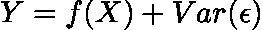
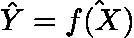
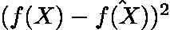
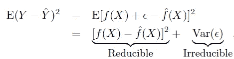

# 统计建模中的错误

> 原文：<https://towardsdatascience.com/errors-in-statistical-modeling-c22978a98269?source=collection_archive---------11----------------------->

## (或者为什么要让人类参与进来)

卢克·切瑟在 [Unsplash](https://unsplash.com?utm_source=medium&utm_medium=referral) 上的照片

统计模型的准确性不仅取决于模型中包含的信息，也取决于模型中遗漏的信息。在这篇文章中，我将讨论错误的两个主要概念:可约性和不可约性，以及为什么领域知识和主题专家是最大化模型准确性的关键。

假设您希望了解组织中影响销售的因素，以便更好地预测和(希望)控制未来几个季度的业绩。你从销售部门开始，询问表现最好的人对销售驱动因素的看法。

“销售是一项复杂的工作”，他们说。“一个季度的业绩有很多变动因素，每个季度都有变化。我无法告诉你影响销售的所有因素，但根据我的经验，广告是最重要的因素”。

这为您提供了一个系统建模的起点:

**销售额=广告预算+其他一切**

或者，

“其他一切”(或ϵ)是不可约误差，而 *f(X)* 是使用广告预算数据构建的统计模型。 ***您可以尽可能地细化模型，但这样做不会增加广告预算提供的信息之外的任何信息*。*因此，不可约误差可以被认为是提供了模型预测精度的上限*** 。

****

**其中 *Var* (ϵ)是随机误差项的方差。(假设: *f* (X)独立于ϵ，均值为零)**

**因此，你的首要任务是识别出所有对 *Y* 有较大影响的可测相关回归变量( *X_1，X_2，…，X_j* ，表示为 *X* )。在上面的案例中，这些可能包括按渠道细分的社交媒体广告预算:脸书、Instagram、Twitter、抖音等。以及电视和报纸等传统媒体广告。**

**下一个任务是找到 *f(X)* ，一个表示广告预算提供的关于销售的系统信息的函数。一般来说， *f* 是未知的，必须使用一些观测数据点来估计。比方说，我们对 *f(X)* 的最佳估计是 *f(X)^* ，这给出了 *Y^* (对 *Y* 的预测)，这样**

****

**因此，Y^作为 y 预测的准确性取决于两个量:**

1.  ****可减少的误差，**或者我们对 *f* 的估计与广告预算和销售之间的真实函数映射有多接近:**

****

**2.**不可约误差，**或先前确定的回归变量遗漏的信息。**

**想象一下，这个人忘记提到该组织在特定的播客或广播频道上做广告。或者他们提到了这一点，但也指出新闻部没有收集任何关于广播预算的数据。所有不能包含在 *X* 中的相关信息都收集在术语:***【var(ϵ】****下。***

**形式上，我们模型中的平均误差(或预期误差)可以写成:**

****

**统计学习导论:在 R 中的应用**

**其中 *E(Y- Y^)* 表示 *Y* 的预测值与实际值的平方差的平均值，即模型的平均预测误差。**

## **为什么把错误形式化为可约和不可约？**

**将误差项分解成可约项和不可约项可能会被认为是不必要的，并成为引入过于复杂的数学符号的借口。然而，以这种方式形式化我们的思维是有实际价值的。当与技术利益相关者交流时，强调模型的准确性有一个上限(不可减少的误差)是有帮助的。当任务是提高系统的预测准确性时，可以依靠这些词汇来澄清问题，并在使用更复杂的模型或收集更多数据之间做出决定。最重要的是，以这种方式组织我们的理解有助于发现以前被忽视的重要数据源。在上述场景中，这可能导致包括广播和播客广告预算或收集这种数据，如果还没有的话。**

**我喜欢这么想:
- **可约误差**是一个基于数据的函数与真函数之间的差距。这是统计技术展示其威力的舞台，让我们尽可能接近真实的关系。**

**- **不可约误差**是现实和我们对它的数学表述之间的差距。这种差距更难克服，因为即使您能够捕获系统的所有相关回归变量，也总是会有随机变化(也称为随机噪声)，这不会有助于您得出干净的模型。**

*****参考文献*** 1。*统计学习导论:在 R.* (2021)中的应用。纽约斯普林格出版社。‌**