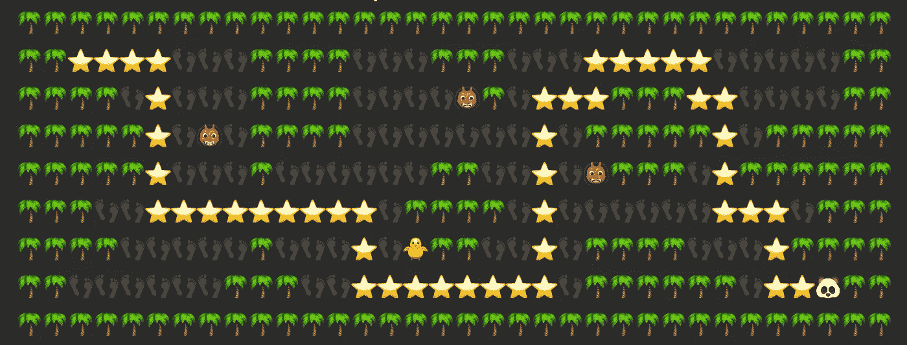
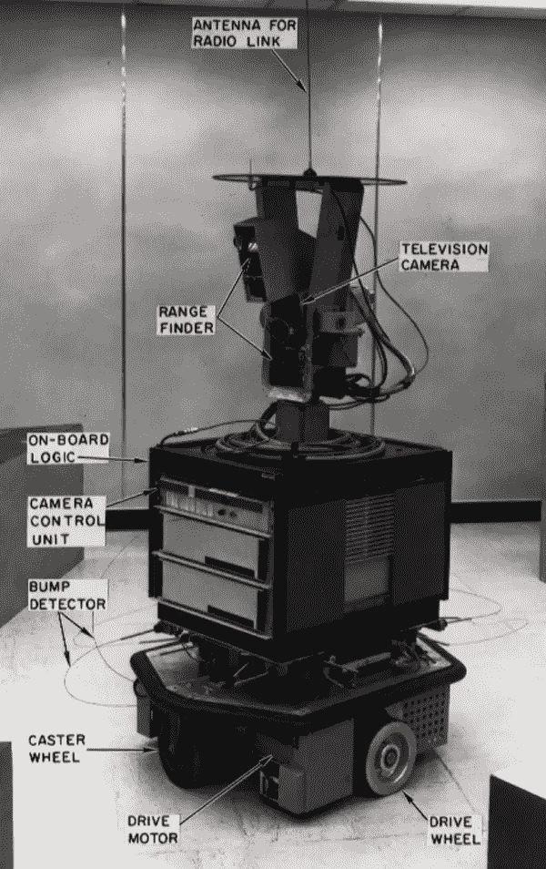
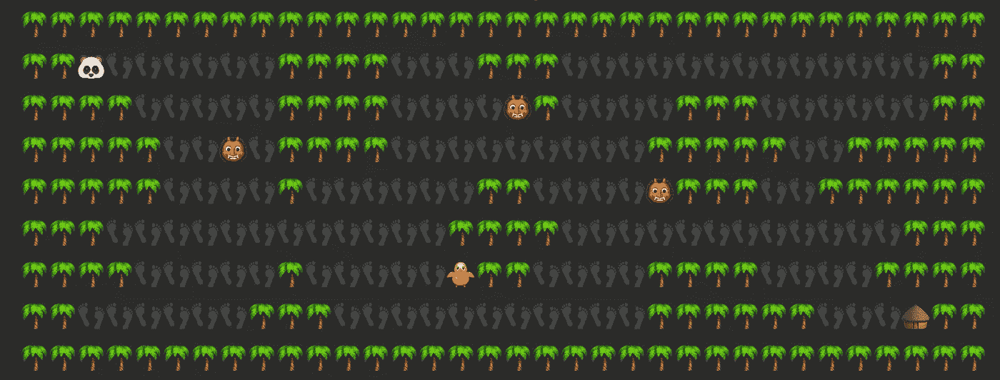
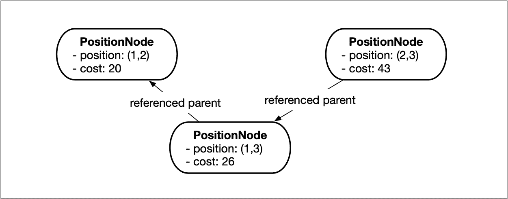
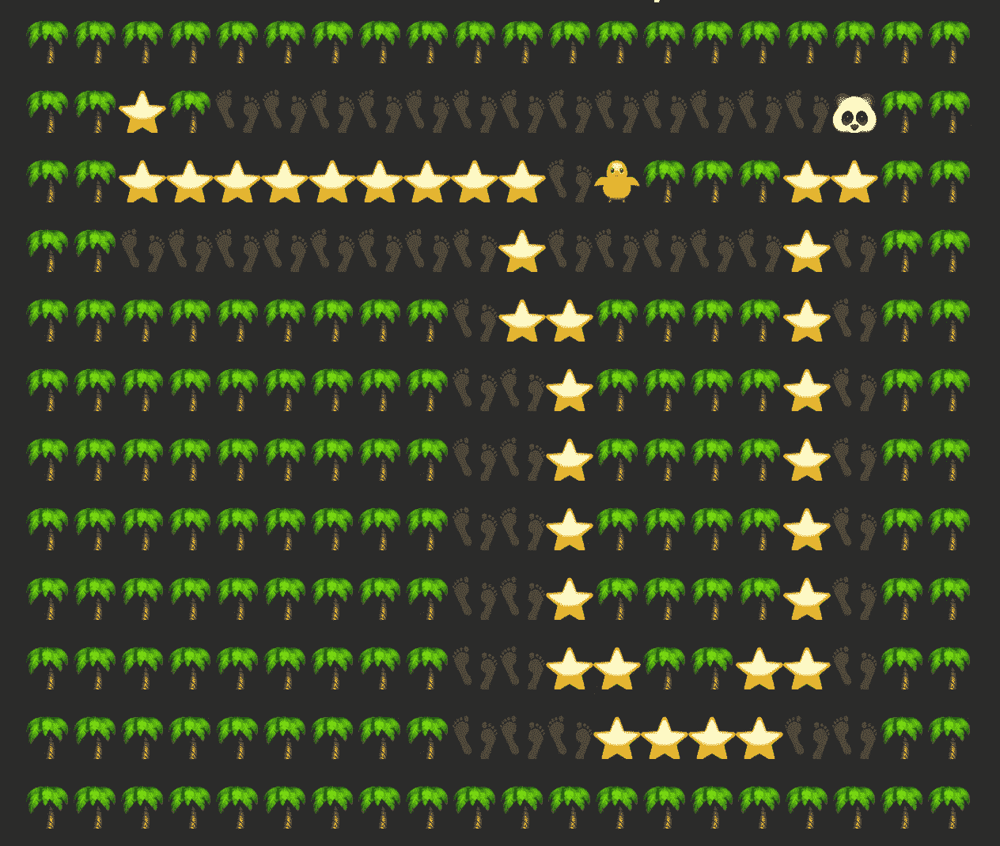
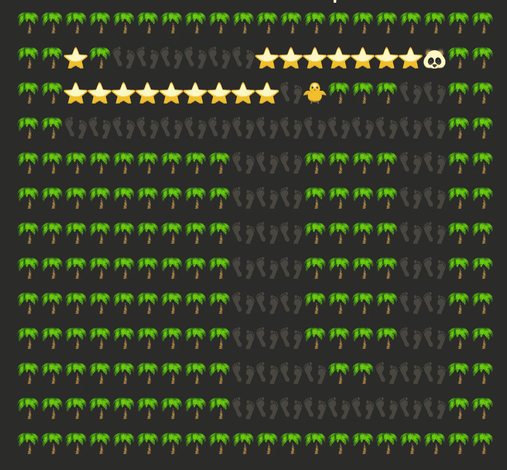

# 用 A*搜索算法逃离迷宫

> 原文：<https://towardsdatascience.com/escape-the-maze-with-a-search-algorithm-bb0f1cf876e0?source=collection_archive---------22----------------------->

## 如何逃脱一个致命的迷宫，并避免一个有用的算法危险的敌人

A* (A-Star)搜索算法是最常用的路径规划算法之一。它主要依靠蛮力和试探法来寻找两点之间成本最低的路线。今天我们将学习如何使用它来逃离一个致命的迷宫，同时避免一些潜伏的奸诈的敌人。



我们的英雄，温文尔雅的熊猫，选择了一条成本优化的路线到达了目的地

斯坦福大学的研究人员于 1968 年首次发布了 A*搜索算法，作为机器人[Shakey](https://en.wikipedia.org/wiki/Shakey_the_robot)项目的一部分。他们想要一种改进版本的 [Dijkstra](https://en.wikipedia.org/wiki/Dijkstra%27s_algorithm) 算法，该算法使用启发式函数来最小化移动成本，并为机器人规划一条路径，使其能够在建筑物的走廊和不同房间中自主导航。像某种古老的 Roomba 一样，它使用几个距离传感器和物理“保险杠”传感器来检测附近的障碍物，并建立一个本地导航地图。



摇动机器人。维基媒体基金会 CC BY-SA 3.0

与其他搜索或探路者算法相比， *A*搜索算法*的关键之一是使用一些启发式函数来确定或估计从起点到终点或目标的当前成本和未来成本。基于这种成本计算，算法将探索不同的路径，并选择最小化目标成本的路径。最基本的成本可以很容易地计算为到目标的距离。例如，离目标点最远的位置将比最近的位置更昂贵，然而不同的地形也将比其他位置更昂贵，例如铺设道路上的泥浆。我们还可以为地形中的高度或坡度创建一个成本函数。最后，有些障碍可能是无法逾越的，它们会影响最终的道路。

我们需要做的第一件事是建立和定义我们的世界地图，并定义一些规则，比如我们如何被允许四处移动，以及存在什么样的障碍。

我们将使用笛卡尔坐标的二维地图 ***x*** 和 ***y*** ，其中 ***x*** 是列， ***y*** 是行。在地图上的每个坐标上，都有一个位置或单元。这张地图也定义了一些我们如何移动每一步的限制。我们将定义一步向上、向下、向左或向右作为地图中可能的移动。一次一步，不要斜着走。

我们将有 4 种代表障碍的基本细胞类型，一种用于起点，另一种用于目标位置:

🌴**手掌**代表不可逾越的障碍，形成墙壁和地图边界
👣**脚印**只是空白
👹鬼兽是我们需要避开的死敌
🐥小鸡也是敌人，但没有我们稍后会发现的那么致命…
🐼**温文尔雅的熊猫**是我们的英雄，它也代表了地图中的起点
🛖 **但是**是我们从起点需要到达的目标或终点

有了前面的元素，我们可以构建相当复杂的地图，其中包含几个障碍和到达目标点的路线选项:



我们的初始地图上有障碍物，起点和终点位置。作者图片

为了构建一个地图，我只是使用一个纯文本文件作为解析的输入。我邀请你在 Github*中探索文章的 [***库，并创建和测试你的地图。你甚至可以制造新的障碍和敌人，或者定制他们的费用，我们稍后会看到。***](https://github.com/Veilkrand/a-star-search-maze)*

*下一步将使用启发式函数构建地图成本。在这种情况下，我选择预处理整个地图，并为地图中的每个位置创建一个成本地图。在另一种情况下，我们可能希望避免成本高昂的预处理，并在每次发现新头寸时按需处理试探法。如果地图内容未知，并且我们需要在浏览位置的同时发现和构建地图，这将非常有用。*

*为了计算每个位置的成本，我们只需要两个变量:位置的本地成本和到目标的距离成本。本地成本表示穿越该位置的难度，它可以模拟真实地形(如泥地和铺面路)的成本。在泥泞中行走更加困难，成本也更高，所以我们希望尽可能避免这种情况。*

*在我们的例子中，敌人增加了他们的位置和周围 8 个相邻位置的成本，所以我们想避免靠近敌人一个单元格的距离。怪物比小鸡的敌人花费更多，所以在这种情况下，我们将被迫决定是否靠近它们，选择走在小鸡旁边会花费更少，我们稍后会发现。按照这种成本结构，墙也有指定的成本。但是这个代价太高，无法承担，所以我们主要忽略它们，假设墙是不可逾越的障碍。这些是每单元/位置类型的成本:*

*🌴**城墙:** 1000
👣**空:** 0
👹**敌人:** 100(并且 100 为周围的 8 个细胞)
🐥**小敌人:** 50(周围 8 格也是 50)*

*我们成本计算的第二部分将与距离有关。总的来说，朝着目标前进比离开它的代价要小。因此，我们希望尽可能选择最短的路径来实现目标。*

*对于这种基于距离的成本，我们可以只使用每个位置到目标位置的*欧几里德距离*。二维空间中两点间的*欧氏距离*公式为 ***d = √((x1-x0) + (y1-y0))。*** 但是由于我们不能在地图上的点之间移动角度(我们使用的是没有对角线的 4 向移动)，距离成本函数可以简化为***d = ABS(x1–x0)+ABS(y1-y0)***在[出租车几何](https://en.wikipedia.org/wiki/Taxicab_geometry)中称为*曼哈顿距离*。*

*汇总成本、位置成本和距离成本，我们现在可以构建一个成本图:*

**

*使用距离和障碍成本的启发式函数生成成本地图。作者图片*

*在鲜红色，我们可以看到一些无法承受的成本超过 1000 的墙壁。然后是暗红色的 *oni* 怪物区域。小鸡成本区域用紫色表示。最后，带有到目标位置的距离成本的开放空间用更深的蓝色表示。
正如你所看到的，正确缩放这个成本图将是搜索算法找到从起点到目标点的最佳路线的关键。*

*现在已经准备好了初始地图和地图成本，我们可以开始执行 A*搜索算法。在 Github 的 [**文章库中，我使用了一个完整的 Python 实现，不仅用于算法本身，还用于可视化和解析输入映射和成本映射。但是我在这篇文章中的目标是探索一般意义上的实现，而不是特别关注任何语言。**](https://github.com/Veilkrand/a-star-search-maze)*

*我们将在 *A*搜索算法*实现中使用的第一个数据结构是一个简单的节点列表。该节点列表将代表一条通往目标位置的路径，我们将逐节点构建该路径，以便找到更好的方法来绕过障碍物，同时最大限度地降低路径的累积成本。*

*一个节点表示地图中具有累积成本的位置，并且它将引用所连接的父节点。从最后一个子节点到第一个父节点反向遍历节点将产生从起点到列表中最后一个节点的路由。*

```
*class PositionNode: def __init__(self, parent: "PositionNode", position: tuple):
        self.cost = 0
        self.parent: "PositionNode" = parent
        self.position: tuple = position

    def __eq__(self, other: "PositionNode"):
        return self.position == other.position*
```

*如您所见， *PositionNode* 类有 3 个属性:
***成本*** 与路线开始时的累计成本相关。
***position****为一个元组，或者以 x 和 y .
***parent****为参照的两个位置数组，指向的父节点对象是 *PositionNode* 类的另一个对象。在*父*中具有 *null* 或 *None* 值的对象将是路径中的根节点或起始位置。***

****

**在链接节点列表中引用父节点的节点表示通过具有累积成本的地图中的位置的路径。作者图片**

**接下来，我们将把两个节点对象列表(未连接)定义为对象数组:**

****nodes_to_visit[]** 这里，我们将添加从移动中新发现的节点/位置及其父节点和累计成本。这个未连接节点的列表实际上是节点的优先级队列，其中我们添加的第一个节点将是我们按照 FIFO 数据元素顺序弹出来处理的第一个节点。
**nodes_visited[]** 这里我们将把已经访问过的节点/位置从之前的列表中移走，不再需要检查。**

**在进入主循环之前，我们可以在 **nodes_to_visit** 列表中设置起始位置为第一个要访问的节点。**

**运行主搜索算法循环将如下所示:**

**1.检查列表中要访问的节点是否具有更低的开销。如果是，选择它作为当前节点。
2。将当前节点从*“要访问的节点”*列表移动到*“已访问的节点”*列表。
3。通过检查位置坐标来检查当前节点是否确实是目标位置。如果是这样，我们就完了！我们将返回应该是目标位置节点的最后一个链接节点。
4。从当前节点检查所有可能的移动并创建它们的节点，更新所有节点的当前成本
5。如果相同位置不在列表中或其累积成本低于相同位置的先前添加的节点，则仅将新节点添加到要访问的节点列表**中。注意这一点很重要，因为我们可能会不止一次地访问同一个位置，但作为不同路线的一部分，累积成本较低。****

**如果我们在主搜索循环中用完了要访问的节点，这意味着在地图中找不到路径，可能是因为从起始位置到目标位置是断开的，或者被一些不可逾越的障碍(如墙壁)阻挡。**

**成功到达目标点后，我们可以返回最后一个连接的节点，我们需要通过使用引用的父节点反向遍历节点，直到最后一个节点具有 ***null*** 或 ***None*** 父节点，来重建点的路径。颠倒这一系列的点将会给我们从开始到结束位置的正确顺序。**

****

**反转节点链表的位置后，解析带星号的路径**

**如果我们仔细研究选择的路径，我们会惊讶于实际优化的程度！开放空间的第一个优化是距离成本。该路径仅行走使到目标位置的距离更短的位置，同时避开昂贵的障碍物。**

**接下来，它试图优化(已经聚合了距离成本)怪物成本。它避免了第一个巨大的成本区域，甚至以采取一些额外的步骤为代价。第二场遭遇战更有趣，因为有两种方式:一种是短距离的，但有一个昂贵的怪物，另一种是长时间的，但有一个较小的敌人，费用较低(小鸡)。在这种情况下，绕道面对小鸡的成本比走捷径面对怪兽的成本要低。最后一场遭遇战也展示了这些基于成本的决策，有怪物时可以选择较短的路径，但要到达目标位置，最好选择没有怪物的较长路径。**

**现在让我们来探索这些基于成本的决策的局限性。在下一个迷宫中，所选择的路线也试图避开敌人，并选择一条明显更长的路径到达目标位置:**

****

**温文尔雅的熊猫绕了一大圈以避开小鸡。作者图片**

**然而，我们在同一个地图中稍微多绕了一圈(只增加了一行)。我们将到达一些成本断点，在这里绕道的成本比面对小鸡敌人和采取最短的路线更大:**

****

**温顺的熊猫面对他的第二大敌人，但提前回家了。作者图片**

**正如你所看到的，这种行为和决策过程完全取决于启发式函数的设计和对案例的缩放。该算法本身将访问所有邻近的允许位置，以计算出最低的路线。**

**您可以做一些改进和优化来调整 *A*搜索算法*的基本方法，以适应不同的情况。如果你想更深入地了解这个算法，我推荐你阅读 [Amit Patel 关于 *A** 的笔记](http://theory.stanford.edu/~amitp/GameProgramming/AStarComparison.html)、寻路、游戏几何等等。**

**我还强烈推荐您使用我们使用过的相同示例和地图解析器的完整 Python 实现以及整个 *A*搜索算法*来探索这篇[文章在 Github](https://github.com/Veilkrand/a-star-search-maze) 中的存储库，并尝试构建自己的地图和引入新的障碍。**

**有一个快乐的路径规划！**