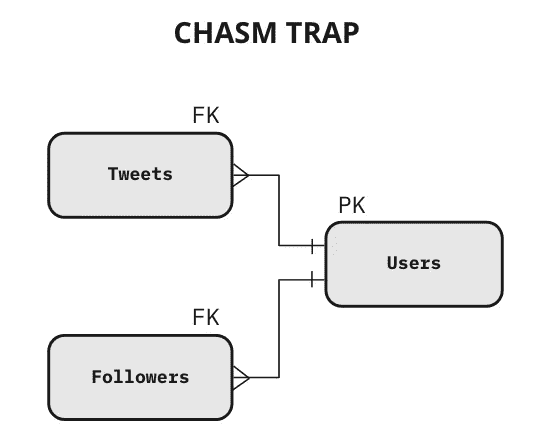
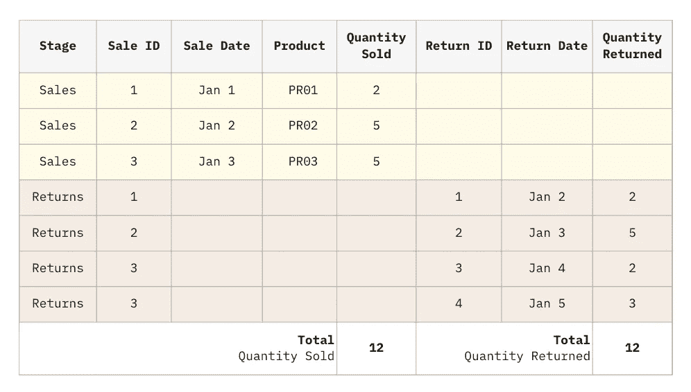

# 使用统一星型模式避开 SQL 陷阱

> 原文：<https://towardsdatascience.com/escaping-sql-traps-with-the-unified-star-schema-562c534b1a3e?source=collection_archive---------16----------------------->

## 现代分析

## 风扇陷阱和裂缝陷阱的优雅解决方案

如果您曾经使用过关系数据库，您可能会遇到某些表组合之间的`JOIN`产生不正确输出的情况。在某些情况下，我们可能会马上发现这些问题，但在其他时候，这些问题会被忽略，直到用户或客户通知我们不正确的结果。

这有很高的成本，因为对数据系统的信任很难赢得，也很容易失去。

当这样的事情发生时，我们通常会争先恐后地逐个解决问题，但是如果我们暂停一会儿，我们会发现这些问题实际上是由某些**模式**造成的。

导致这些自残的两种常见模式是**粉丝陷阱**和**鸿沟陷阱**。

在网上做了进一步的研究后，我注意到我几乎找不到关于这些模式的高质量信息。当你发现它被提到的时候，它经常被不一致的定义，不适当的限制，或者过于复杂。最重要的是，对于这些问题，我找不到一个不依赖于任何特定软件的优雅或通用的解决方案。

幸运的是，我最近看到了弗朗西斯科·普皮尼写的一本书，书名是[统一星形模式](https://amzn.to/3db9gyi) *。在那本书里，Francesco 清楚地指出了扇形陷阱和裂缝陷阱的根本原因，并提出了一种新的和创新的建模方法来解决这两个问题，以及许多其他挑战。

在 Francesco 的祝福下，我想利用这篇文章作为一个机会来阐述他书中的观点。统一星型模式有很多优点，我觉得 fan trap 和 chasm trap 是理解这种新模式优点的很好的切入点。

# 什么是粉丝陷阱？

在数据建模中，当一个表中的多行引用另一个包含度量的表中的单个键时，就会出现扇形陷阱，从而导致最终连接结果中的度量重复。

“度量”只是一个数字，例如销售额或库存数量，可以使用算术方法进行聚合。然而，并不是所有的数字都是衡量标准。例如，一年是一个数字，但不是一个度量，因为在我们的分析中，我们可能永远不会将两年相加或平均。

让我们以一次销售在一段时间内有多次退货为例。Returns 表保存 Sales 表的外键。


图一。风扇陷阱示例。#代表一个度量值。|作者图片

Returns 表可以有多个引用特定销售行的行，因此会复制销售度量，如*销售量*。注意，Returns 表也可以有度量，比如返回的*数量*，但是这并不是退货和销售之间存在粉丝陷阱的必要条件。但是，如果 Returns 表成为另一个具有类似多对一配置的表的目标，形成另一个 fan 陷阱，那么它就变得相关了。


图二。退货和销售表。销售表中的*销售量*度量是兴趣|作者图片的度量

忽略我们的客户似乎不喜欢我们的产品这一事实，我们可以看到已经购买了 12 件商品，退回了 12 件商品。

当我们连接这些表时会发生什么？


图三。联接这两个表会导致 Sales 表中的重复度量值。|作者图片

哎呀…销售表中的行被退货表中的行展开。不幸的是，即使是有经验的分析师通常也不会意识到这种情况的发生，并继续构建关于这种不良连接的报告。大多数工具也不会在发生风扇陷阱时发出警告。

因此，报告中总的*销售量*看起来是 17，而不是正确的值 12。请注意，基于*返回的数量*的报告将是正确的。这是因为返回的*数量*来自一个没有被任何其他表分解的表。

扇形陷阱问题并不仅限于表中存在的数据。即使对带有度量的目标记录的引用是隐式编码的，也会发生这种情况，这在 JSON 或 XML 文档等嵌套结构中很常见。考虑这个假设的电影 API 查询返回每部电影的标签的结果。

```
**Movie API Results**{
  "results": [
    {
      "Film": "F1",
      "Duration": 120,
      "Tags": ["Comedy", "Drama"]
    },
    {
      "Film": "F2",
      "Duration": 100,
      "Tags": ["Comedy", "Horror"]
    },
  ] 
}
```

使用 JSON 扁平化工具将这些数据导入数据库是相当常见的，可能发生的情况是持续时间度量被标签分解。


图 4。导致不正确测量的 JSON fan 陷阱示例:显示的总数是 440，而正确的总数是 220 |图片作者

# 什么是鸿沟陷阱？

当一个目标表(通过外键引用)被两个或更多的其他表分解时，就会出现鸿沟陷阱，产生类似笛卡儿积的效果。由于参与的表的数量是无限的，并且它们都互相爆炸，所以与扇形陷阱相比，鸿沟陷阱会产生更多不需要的副本。

例如，考虑以下表示 Twitter 的数据模型:



图五。裂缝陷阱的例子。|作者图片

这种数据模型在应用程序的数据库中肯定是正确的，因为应用程序通常一次处理单个操作。然而，在支持分析的数据库中(例如数据仓库)，这种结构存在很大的风险。SQL 开发人员可以安全地创建包含用户和 Tweets 的查询，以及包含用户和关注者的查询。但是如果查询同时涉及三个表，结果将会爆炸，并且每个度量(位于每个表中)也会爆炸，产生不正确的总计。

当 Users 表中的一行同时匹配 Tweets 表中的多行和 **Followers** 表中的多行时，就会出现问题。


图六。多条推文和多个关注者匹配一个用户|作者图片

让我们看看当我们`SELECT FROM`用户和`LEFT JOIN`推特和追随者时会发生什么。


图 7。由裂缝陷阱引起的爆炸。我们通过作者获得 11 行|图像

tweets 和 followers 表中匹配的每个用户都有一个笛卡尔乘积。不仅仅是用户行爆炸了。推文也是爆炸式的关注者，反之亦然。

你加入什么样的组织并不重要。如果用一个`INNER JOIN`代替一个`LEFT JOIN`，用户@qqq 和@www 会消失，但剩下的用户还是会有一个由鸿沟陷阱引起的笛卡尔爆炸。

爆炸只是与笛卡尔坐标相似。如果是完全的笛卡尔坐标(通过`CROSS JOIN`命令获得)，有 7 条 tweets 和 5 个追随者，我们将获得 35 行。相反，我们只获得 11 行，因为笛卡尔积只在“逐个用户”的基础上发生。

但是……这个数字 11 是从哪里来的呢？

很容易推导出一个公式，计算出您可以从鸿沟陷阱中获得的记录数。您甚至可以使用这个公式来自动检查自动化[数据质量](https://showmethedata.blog/how-to-measure-data-quality-13-metrics)管道中的裂缝陷阱。

下面，您将看到一个图表，它根据我们的示例说明了如何预先计算每个用户贡献的行数。这种计算可以在启动查询之前创建，它可以防止我们生成一个庞大的(并不真正有用的)结果表。


图 8。在我们的例子中，如何计算期望从裂缝陷阱中得到的行数

在 Twitter 示例中，如果每个表都有 **N** 行，那么结果表中行数的下限是 **N** ，上限是 **N** ，因为 Users 表是由 **2** 表定位的。一般来说，如果 Users 表被 k 个**表定位，并且它们都有 **N 个**行，那么结果表将以一个 **N^k** 行的上限结束。**

不难想象陷入鸿沟陷阱的代价。更糟糕的是，引用表本身可能成为其他陷阱的目标，由于嵌套效应，导致更大的爆炸。

图九。由嵌套裂缝陷阱引起的爆炸|来源: [giphy](https://giphy.com/gifs/parrot-G3Wfea8vbpQK4)

正如您所看到的，鸿沟陷阱爆炸了数据量，却没有提供额外的有用信息。这实际上会累积大量数据，导致存储冗余数据的高成本。

当表中包含度量时，情况会变得更糟。度量的重复不仅是一个系统挑战，也是一个非常严重的语义挑战，因为度量很难去重复。对于文本，您总是可以使用`COUNT DISTINCT`，但是对于度量，`SUM DISTINCT`的操作在语义上是无效的，因为它还会丢弃两个度量相同但语义独立的常见场景(例如，金额相同的不同发票)。

像 fan 陷阱一样，chasm 陷阱也扩展到了 JSON 这样的嵌套结构。

```
**Tweet API Results**{
   "results": [
     {
       "User ID": "@aaa",
       "Followers": [
         "@bbb",
         "@ccc"
       ],
       "Tweets": [
         {
           "Tweet ID": "T1",
           "Tweet": "Are autonomous cars data driven?"
         },
         {
           "Tweet ID": "T2",
           "Tweet": "forget data, guessing is the new oil."
         }
       ]
     },
     {
       "User ID": "@bbb",
       "Followers": [
         "@aaa",
         "@www"
       ],
       "Tweets": [
         {
           "Tweet ID": "T3",
           "Tweet": "I just ate an avocado"
         }
       ]
     },
     {
       "User ID": "@ccc",
       "Followers": [
         "@bbb"
       ],
       "Tweets": [
         {
           "Tweet ID": "T4",
           "Tweet": "sleep. eat. code."
         },
         {
           "Tweet ID": "T5",
           "Tweet": "Keep calm and code"
         }
       ]
     },
     {
       "User ID": "@qqq",
       "Tweets": [
         {
           "Tweet ID": "T6",
           "Tweet": "I tweet but I have no followers"
         },
         {
           "Tweet ID": "T7",
           "Tweet": "I am a lonely bird!"
         }
       ]
     },
     {
       "User ID": "@www",
       "Tweets": []
     }
   ]
 }
```

了解粉丝陷阱和鸿沟陷阱的定义是很重要的，因为它让你意识到这个问题。但是，下一步是什么？如何在这些麻烦的表格配置下回答我们的数据问题而不产生重复？

# 如何解决粉丝陷阱

您会很高兴地知道，许多(但不是全部)BI 工具，如 Tableau、Qlik 和 Power BI 为您解决了这个问题。您可以告诉 BI 工具两个表之间的关系**而不是预先创建连接。BI 工具将使用该信息及时创建适当的连接，并根据可视化应用上下文逻辑*。因为这两个表中的每一个都以原始粒度(没有重复)存在于内存中，所以 BI 工具能够计算并显示正确的总数。***

这个解决方案是理想的，但是它只适用于某些特定的软件。如果您想检查您的工具是否支持关系(有时也称为*关联*，您可以使用 fan trap 运行一个快速实验，看看输出是否正确。

为了更普遍地解决这个问题，我们需要深入兔子洞，彻底转变我们的视角。

扇形陷阱源于 SQL 连接的基本属性。无论你使用`INNER JOIN`、`LEFT JOIN, RIGHT JOIN`还是`FULL OUTER JOIN`，你总是会以重复结束。

有没有可能在不重复的情况下合并我们的表？是的，它是！不要一个`JOIN`，创造一个`UNION`！`UNION`从不重复。

通常不会想到`UNION`,因为来自不同表的信息最初不会在同一行上对齐。然而，每个现有的 BI 工具都创建了一个自动聚合，当在聚合可视化中显示时，数字将在同一行上对齐。



图 10。展示理想行为的假设表格|作者图片

总销售量现在是正确的。

这是我们如何组合数据来回答商业智能问题的一个根本性转变。我们不依赖于 **JOIN** 操作符，而是使用所有数据列的 **UNION** 。

# 统一星形模式

Francesco Puppini 是最早意识到使用这种方法的好处的人之一。在他的书 [The Unified Star Schema](https://amzn.to/3db9gyi) *中，他将这种模式扩展并形式化为一种针对自助式分析进行优化的新建模范式。

让我们看看如何使用统一星型模式(USS)方法构建正确版本的表。

USS 建议的一个立竿见影的效果是为键建立了一个标准的命名约定，这样每个表如何映射到其他表就变得很明显了。具有组合键的表被连接(或者散列)成一个键列。该键列以`_KEY_`为前缀。


图 11。将 USS 命名惯例应用于我们的原始表格|作者图片

请注意，带有`_KEY_`前缀的列是技术列，它们决不能包含在任何可视化中。如果最终用户需要可视化 id(`Sale ID`、`Return ID`和`Product`)，这些 id 可以保留其原始名称，并且`_KEY_`列将是相同的副本。这在数据存储中产生了一点冗余，但是它清楚地划分了技术列和业务列。

为了正确地构建表格，我们需要将这两个表格映射成所需的形状。这是通过**普皮尼桥完成的。**

Puppini 桥是一个表，它对数据模型中实体之间的每个现有关系进行编码。这是通过从所有源表中读取所有键并用一个`UNION`将它们合并来实现的。`Stage`列告诉我们为每一行提供数据的源表的名称。


图 12 是 Puppini 桥的基本结构，充当所有记录|作者图像的关系映射层

你可以把普皮尼桥想象成一个预先连接了所有记录的中央交换机。

这很有意义，因为我们通常知道这些实体应该如何连接…如果我们可以在关系中满足 90%的用例，那么让业务用户千辛万苦地阅读关于数据关系的手册是没有意义的。

过去曾尝试过预连接所有的表，比如 SAP Business Objects 的“Universe”。这个解决方案很棒，但是很快就发现不同的需求需要不同的世界，以稍微不同的方式组织表格。

使用统一的星型模式，最终用户总是使用 Puppini 桥开始查询，然后添加他们需要的任何表。他们不再需要知道如何连接表，因为这已经由桥处理了。不再期望它们创建表链，因为桥解析所有的表链。

根据 BI 工具的不同，表将通过关系(关联)或`LEFT JOIN`来连接。键列总是有相同的名称，允许大多数 BI 工具默认自动匹配它们。对于绝大多数业务需求，连接表的方式保持不变。

普皮尼桥越来越像我们的目标州了！不幸的是，这还没有解决我们的粉丝陷阱问题，因为如果我们将 Sales 表`LEFT JOIN`到桥中，我们实际上会意外地将 Sales measures 映射到 Returns 行。

为了达到我们想要的状态，我们需要在销售阶段将销售度量映射到适当的行。我们可以通过**将度量移到桥上来实现。**

请注意，这种方法仅适用于有被风扇陷阱爆炸风险的表格。在我们的示例中，只有销售表需要它。然而，这种方法也可以有选择地扩展到退货。

一般来说，如果所有的度量都被移到 Puppini 桥，那么这个表就会变成一个“超级事实表”。传统上是“单一事实”的 OLAP 立方体将无缝地支持“多事实”场景。Looker 将不再需要应用非常耗费资源的“扇出公式”。每一个 BI 工具，有了“超级事实表”，将能够超越自己的极限。

## 将度量移到桥上

在这种方法中，我们将所有有爆炸风险的表直接嵌入到 Puppini 桥中。


图 13。将有爆炸风险的措施移至普皮尼桥|图片由作者提供

请注意，退回的数量**不包括在普皮尼桥中，因为它没有爆炸的风险。该上下文可以通过 Returns 表的`LEFT JOIN`引入。**

使用这种方法，您可以根据销售的属性过滤退货，这是传统的 Kimball 建模所不能实现的操作。

# 如何解决鸿沟陷阱

有了建造普皮尼桥的所有基础工作，我们可以免费得到这座桥**！**

为什么？

统一星型模式从定义上来说是安全的，因为我们使用一个 **UNION** 操作来构建 Puppini 桥，它不会产生重复。


图 14。演示普皮尼桥如何通过小心放置钥匙来解除裂缝陷阱|图片由作者提供

Followers 和 Tweets 表在桥中不指向彼此，因此避免了鸿沟陷阱。

请注意，桥中还包含了 Users 阶段，即使 Users 表没有指向任何表:这将确保所有用户都会出现在桥中，即使他们没有追随者和 tweets。这被称为“完全外部连接效应”:尽管 BI 工具中的终端用户将创建一个`LEFT JOIN`，但结果看起来更像一个`FULL OUTER JOIN`。

# 结论

我希望你现在对扇形陷阱和裂缝陷阱如何在你的分析中引入不必要的重复有一个明确的理解。现在，您应该能够通过查看表的连接配置来快速识别它们。

如果没有我从阅读[统一星型模式](https://amzn.to/3db9gyi) *中获得的知识，这篇文章是不可能的，并且只是你将在书中找到的一小部分。如果你想更深入地研究这种方法，我强烈建议你买一本。

这本书非常容易理解，还解释了统一星型模式如何解决其他挑战，如循环、跨多个事实表的查询以及不一致的粒度。事实上，比尔·恩门(数据仓库之父)写了这本书的前几章，这应该扩大了这些想法的范围。

如果你对这些概念有任何疑问，请随时在 LinkedIn 上联系我。我将继续更详细地讨论这个主题，所以请务必订阅时事通讯，以便获得新文章的通知。

**这本书的链接是附属链接，这意味着你不需要支付任何费用，如果你点击并购买这本书，我会赚取佣金*

想进一步讨论这个吗？请在 Linkedin 上发表评论或[与我联系。](https://www.linkedin.com/in/balmasi/)

## 📕这篇文章最初发表在 [Show Me The Data](https://showmethedata.blog/sql-traps-unified-star-schema?utm_source=medium&utm_campaign=post&utm_content=sql-traps) 博客上，在那里我讨论了更多关于数据驱动业务的话题。