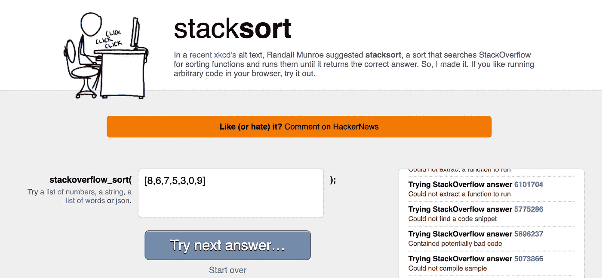

# 深奥的排序算法以及如何用 Python 实现它们

> 原文：<https://towardsdatascience.com/esoteric-sort-algorithms-and-how-to-implement-them-in-python-96c663fa6ae5?source=collection_archive---------16----------------------->

## 代码？

## 当快速排序太快时

卢卡斯·乔治·温迪特在 [Unsplash](https://unsplash.com?utm_source=medium&utm_medium=referral) 上的照片

W 当你听到排序算法的时候，你脑海中首先想到的是哪一个？快速排序？合并排序？冒泡排序？

回到大学，我的一位教授总是告诉全班同学，快速排序就像排序世界的苹果，因为他们非常擅长营销。通过将其命名为“quick”，人们将它们与最快的排序算法联系在一起，即使对于一般情况来说合并排序实际上更快。

撇开虚假广告不谈，我很肯定你听说过这些算法。让我们继续看最近的。

Python 使用的是 [*Timsort*](https://www.geeksforgeeks.org/timsort/) ，一种由归并排序和插入排序衍生而来的混合算法。Timsort 这个名字来自作者 Tim Peter，他在 2002 年为 Python 创建了这个名字。

对于特定的正数，我们有 [*基数排序*](https://www.geeksforgeeks.org/radix-sort/) *。*它是计数排序和黑魔法的组合，管理复杂度为 O(d*(n+b))，其中 d 是列表中的位数，n 是列表中的元素数，b 是使用的基数，通常为基数 10。

最近在 2020 年，一种叫做 [*四分类*](https://github.com/scandum/quadsort) 的新算法出现了。这是一个超优化合并排序的 1500 行实现，能够在多种情况下击败 Timsort。作者好心地为我们这些凡人提供了[可视化](https://github.com/scandum/quadsort#visualization)和[基准](https://github.com/scandum/quadsort#benchmark-quadsort-vs-stdstable_sort-vs-timsort)。

您可能认为我们将深入研究 Quadsort 的 1500 行代码，但是您错了。我们在这里看一看更有趣的排序算法。

> 深奥的ɛsəˈtɛrɪk 非常不寻常，只有少数人理解或喜欢，尤其是那些有专门知识的人

# 博戈索特

复杂度:O(n * n！)

经典的排序算法有许多别名，其中包括排列排序、愚蠢排序、慢速排序和猴子排序。

该算法的主要思想是随机打乱列表中的元素，直到它被排序。多亏了 Python 内置的`random`模块，我们只用几行代码就可以实现它。与实现快速排序或合并排序相比，这无疑要容易得多。

这意味着有 n 个！可能的组合，并且因为对于每一次迭代，我们将花费 O(n)时间来混洗列表，并且另外花费 O(n)时间来检查列表是否被排序，我们最终得到 O(n * n！)对于复杂性。

# Bogobogosort

复杂:O(我的天)

Bogosort 的高级变体。Bogobogosort 认为最初的 bogosort 算法效率太高，这就是为什么它引入了额外的步骤，使算法更加复杂。

Bogobogosort 将使用 bogosort 对列表中的前两个元素进行排序，并继续向上排序，直到所有元素都排序完毕。在每个 bogosort 之后，它将检查下一个元素是否已经处于正确的顺序。如果顺序不正确，我们将列表随机化，并再次返回到前两个元素。

要看原描述和详细分析，可以访问[这个页面](https://www.dangermouse.net/esoteric/bogobogosort.html)。

# 量子 Bogosort

复杂度:O(n)

也被称为*多元宇宙分类*，这是最终的博戈索特变异。不幸的是，我们找不到这种变化的 Python 代码，但这里有伪代码。([来源](http://wiki.c2.com/?QuantumBogoSort))

理论上，创造 n！宇宙分支的成本为 O(1)。O(n)复杂度来自于检查列表是否排序。我们假设破坏包含未排序列表的宇宙的成本也是 O(1)。

# 奇迹排序

复杂度:O(？？？)

请看下面 StackOverflow 答案启发的排序算法。直接忽略讨论的标题，不相关。

 [## 还有比 Bogosort(又名猴子排序)更糟糕的排序算法吗？

### 问关闭。这个问题需要更加专注。它目前不接受回答。想改善这一点…

stackoverflow.com](https://stackoverflow.com/a/6947808) 

> "最终，阿尔法粒子翻转内存芯片中的位应该会导致成功的排序."

我为奇迹等待时间实现了一个*补偿*机制，以增加在检查列表是否排序之间奇迹发生的机会。

使用上面的代码，我已经确认了这种排序算法确实有效。对于已经排序的列表，它在 O(n)时间内返回。尽管如此，我仍然在等待未排序列表的奇迹。

专业提示:实际上你可以用某种祈祷来代替`"Waiting for miracle..."`信息，称之为祈祷类。

# 斯大林式的

复杂度:O(n)

啊，一种运行在 O(n)中的高级排序算法，灵感来自非营利社交媒体乳齿象的这条“推特”。

 [## 马修·✅

### 我想出了一个单程 O(n)排序算法，我称之为斯大林排序。您向下迭代元素列表，检查是否…

乳齿象.社会](https://mastodon.social/@mathew/100958177234287431) 

> “……任何无序的元素都将被删除……”

该算法将遍历列表一次，并删除任何无序的元素—升序或降序。它将总是在 O(n)时间内产生一个排序列表，尽管可能会丢失一些元素。

谢天谢地，有一个 Stalin 排序的[变体，它实际上将所有项目都保留在列表中。这个想法是把不按顺序的元素推到列表的前面，然后重复这个步骤，直到列表被排序。不幸的是，它没有运行 O(n)时间，这意味着它比原来的斯大林排序差。](https://www.geeksforgeeks.org/add-elements-in-start-to-sort-the-array-variation-of-stalin-sort/)

# 灭霸排序

复杂度:O(n log n)

一个比较现代的排序算法，灵感来自漫威的灭霸哲学。我们实现了一个名为`snap()`的特殊函数来随机删除列表中的一半成员。

这个想法是检查列表是否排序。如果没有，我们将抓取列表，然后再次检查列表是否已经排序。重复此操作，直到列表真正排序完毕。

检查列表将花费 O(n)时间，由于`snap()`函数每次将元素减半，每次迭代将花费 O(log n)时间。考虑到这两点，该算法的复杂度为 O(n log n)。

灭霸排序的一种变体是真正的灭霸排序，在这种排序中，我们只进行一次`snap()`函数调用，而不检查列表是否已排序。该操作将元素数量减半，有助于将来的排序。

# 智能设计排序

复杂度:O(1)

[智能设计](http://wikipedia.org/wiki/Intelligent_design)是一种信仰，认为造物主通过设计创造了宇宙内部的某些事物或事件。

假设列表中的所有元素都是唯一的，那么有 n 个！可能的组合，其中 n 是列表中元素的数量。这意味着当前顺序只出现在 n 中的 1！案例。

智能设计排序认为，这种情况意味着造物主以这样一种方式排序列表，它超越了我们对升序和降序的理解。

智能设计的其他命名和哲学变化如下。

*   **禅宗排序**:当你意识到这个阵法，像所有的事物一样，是短暂的，它的顺序是无足轻重的，所以你就这样离开它，转而追求开悟。([来源](https://www.reddit.com/r/ProgrammerHumor/comments/9s9kgn/nononsense_sorting_algorithm/e8netnn?utm_source=share&utm_medium=web2x&context=3))
*   **Trump Sort** :数组总是排序的。任何不这么说的人都是假新闻。([来源](https://www.reddit.com/r/ProgrammerHumor/comments/9s9kgn/nononsense_sorting_algorithm/e8na95p?utm_source=share&utm_medium=web2x&context=3))

# 睡眠排序

复杂度:O(最大(输入)+ n)

另一个经典的臭名昭著的排序算法。主要思想是通过将值分配给睡眠定时器来对列表进行排序。当计时器结束时，它会将值添加到结果列表中。

较大的值将具有较长的睡眠计时器，因此它们将被添加到较小的值之后，从而产生一个按升序排序的列表。如果我们需要一个降序列表，我们可以使用`result[::-1]`简单地颠倒列表顺序

缺点是这只适用于数字列表。哦，如果你试图对非常大的数字进行排序，它也可以运行好几年。

# 堆栈排序

复杂度:O(取决于)

作者[https://gkoberger.github.io/stacksort/](https://gkoberger.github.io/stacksort/)截图

没有，这个没有代码，但是你可以访问[这个页面](https://gkoberger.github.io/stacksort/)自己试试。现在，你可能会认为这个算法以某种方式使用了一个堆栈来根据元素的名称对元素进行排序。这是不正确的。

名称中的 Stack 是 StackOverflow 的简称。是的，没错，堆栈排序会随机抓取带有`javascript`和`sort`标签的 StackOverflow 问题的顶部答案

如果你访问[堆栈排序页面](https://gkoberger.github.io/stacksort/)，它会尝试从 StackOverflow 答案中提取一个函数，编译它，然后尝试用那个函数对输入进行排序。最精彩的部分？你不需要编码，它会告诉你实际使用的是哪个答案。

复杂程度取决于你对爬虫的运气。我很幸运地使用[这个答案](https://stackoverflow.com/questions/3730510/javascript-sort-array-and-return-an-array-of-indices-that-indicates-the-positio#3730579)和[另一个答案](http://stackoverflow.com/questions/3579486/#3579651)成功排序，尽管后者返回的是字符串列表而不是整数列表。一些代码成功编译，但仍然无法排序。

*代码？是一系列与数据科学和编程相关的幽默。它们可能对你的日常工作没什么用，但它们可能会让你微笑。* [*定期更新*](https://chandraseta.medium.com/subscribe) *新故事和* [*成为中等会员*](https://chandraseta.medium.com/membership) *阅读无限故事。*

 [## 成为媒体成员—里奥纳尔迪·钱德拉塞塔

### 作为一个媒体会员，你的会员费的一部分会给你阅读的作家，你可以完全接触到每一个故事

chandraseta.medium.com](https://chandraseta.medium.com/membership)