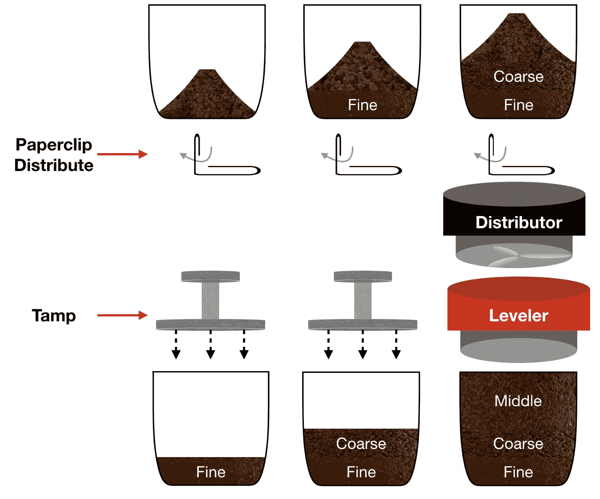
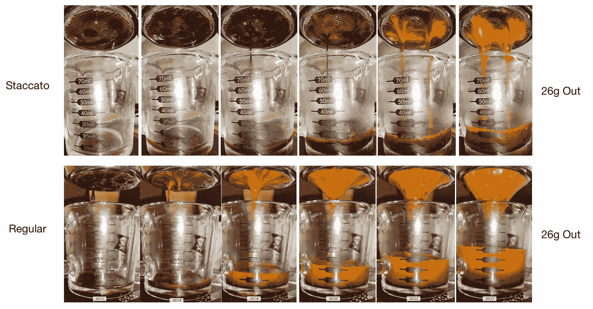
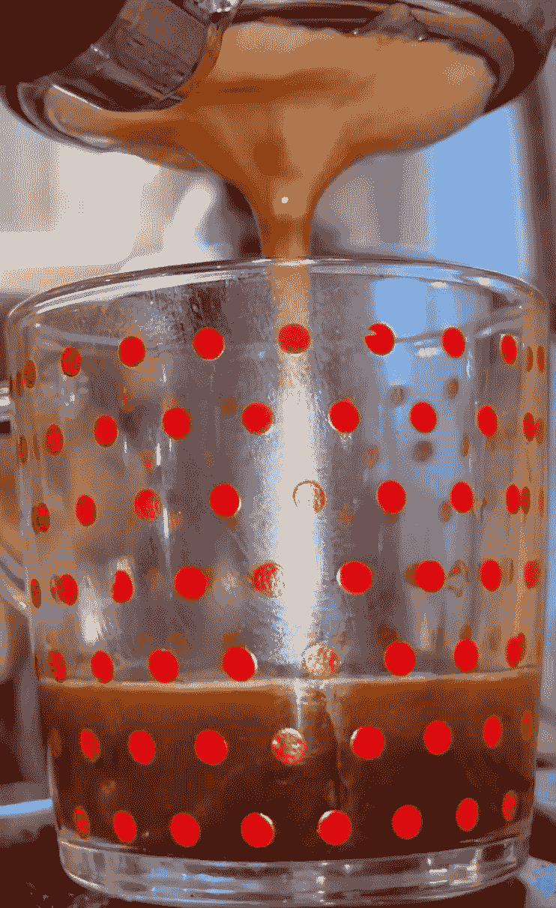
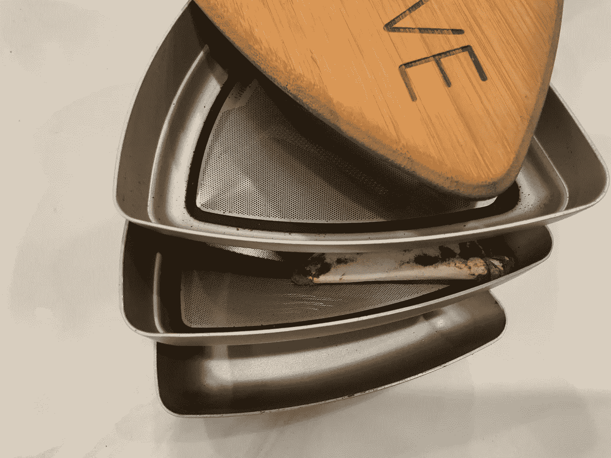
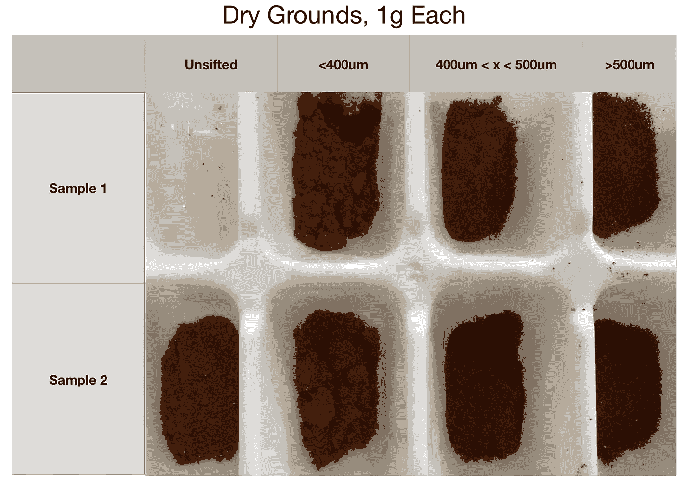
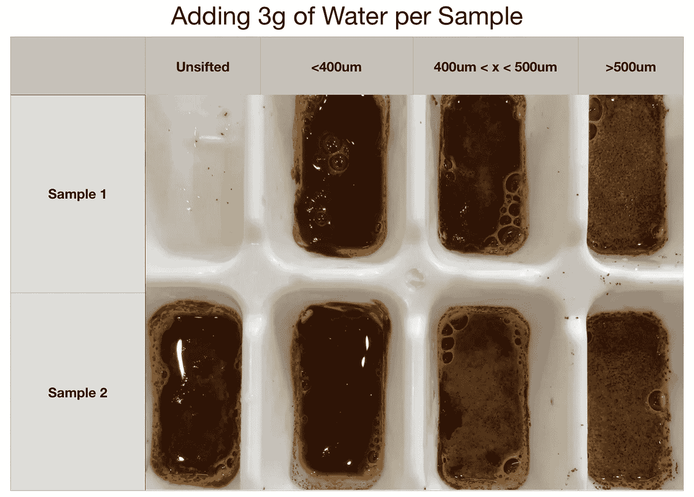
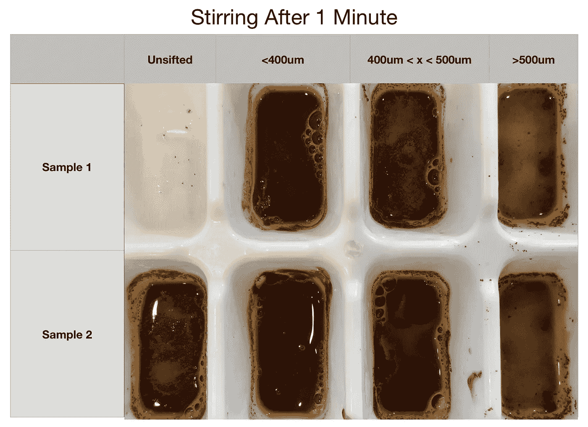
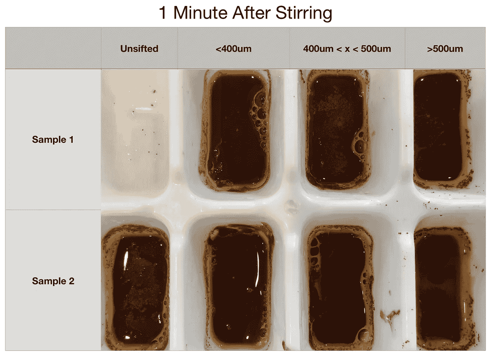

# 浓缩咖啡放屁:在断奏中检查气体

> 原文：<https://towardsdatascience.com/espresso-coffee-farts-examining-gases-in-staccato-a97d12fccf0f?source=collection_archive---------10----------------------->

## 咖啡数据科学

## 一个简短的实验来帮助理解筛选的好处

我最近在网上参加了一个讨论，讨论水需要多大的压力才能流过咖啡。然而，不是咖啡本身，而是咖啡中的可溶物和二氧化碳气体减缓了萃取。水流过废咖啡的速度非常快，所以只有这两个其他变量的工作减缓了水流。

让我们考虑断奏的镜头。在看过数百个断奏镜头和常规镜头的视频后，我注意到断奏镜头的开始比常规镜头暗得多。我开始好奇咖啡是如何根据颗粒大小研磨德加的，因为这可能有助于解释为什么断奏镜头与普通镜头的效果如此不同。

断续浓缩咖啡准备

我在实验中发现，较粗的咖啡含有更多的二氧化碳，我怀疑通过将它们与较细的颗粒分离开来，一杯断续的咖啡会流动得更好。

通常，前 10 克的断奏酒颜色很深，这是高萃取和低 CO2 的作用。毫不奇怪，随着更多的金发出现，颜色会发生变化，但也许条纹也是由二氧化碳释放造成的。

# 数据

我从一些视觉数据开始。我在这里用相似的输入和相同的输出比较两个镜头。然而，断奏镜头长时间保持较暗。在我的视频数据中，我经常看到这种模式。

所有图片由作者提供

我做了一个关于单位研磨尺寸的提取率的研究，我回头看了看这些数据，看看视频中杯子的颜色差异是否与二氧化碳的释放一致。这个数据的主要问题是，该镜头是 75%的用过的咖啡，25%的新咖啡，并且咖啡没有过筛。我查看了最精细的(在小生境 0 上设置 0)和最粗糙的(设置 20):

左:设置 0，右:设置 20

两种设置都没有很多泡沫，但设置 20 的颜色更浅，有一点二氧化碳气泡，提取量更少。然而，这两种影响是交织在一起的，很难分开。

# 实验设计

我想要不依赖于其他变量的更明确的数据。我想要一个更好的主意，多少二氧化碳气体保留由于研磨大小，所以我筛选。然而，我不想花一大笔钱买设备来测量二氧化碳的确切排放量。我尝试这个实验，看看我是否能得到一个定性的观点，即不同粒度的研磨物释放的 CO2 是如何不同的。

我用了 400 微米和 500 微米的筛子来筛才两天的烤肉。它应该有接近最大的碳酸化。我把豆子放在壁龛的第 9 个位置。<400um, between 400 and 500um, and >500 微米的分解率分别为 40%、30%和 30%。

然后，我将一些样品放入一个冰块托盘中，每份 1 克。

我用微波炉将水加热到 90 度左右，在拍摄视频时，我用一个天平向每个样品中加入 3 克水。

越粗的咖啡泡沫越多。它稳定下来了，所以我搅拌了一下，看看会发生什么。

<400um had almost no foam or bubbles indicating that it didn’t have any more CO2 to be released. That’s probably in part because the surface area to volume is much higher for smaller particles. It had a few larger bubbles from mixing but not from CO2 in the same way as the coarser grinds.

One minute after stirring, most of the bubbles went away.

There wasn’t much of a change for the <400um samples, but the other two had a cloud of foam disappear.

Originally, I wanted to buy more complex equipment to be able to quantify the amount of CO2 released during extraction by grind size. However, I settled on this experiment because it shows a hunch was correct.

The larger story of this study is that in a staccato shot, the fine layer (<400um) sits on the bottom. Since that layer doesn’t have much CO2 released, its flow is primarily restricted by solubles, and the flow increases as more is extracted. The fine layer has a [比其他两层的提取率](/espresso-extraction-by-layer-fc2780335aee)更高，CO2 可能会限制它们的提取，除非是更大的研磨粒度。

浓缩咖啡中的二氧化碳气泡没有得到很好的研究。我用一个[制作的透明移动滤镜](/experiments-with-a-transparent-portafilter-for-espresso-ad6b79fdd6b6)观察过这个问题，但这只是一个观察，与照片的其余部分没有太多联系。

这一概念提供了更多的证据，证明[断奏法在提取方面具有根本优势](/staccato-espresso-is-fundamentally-better-than-regular-espresso-e73e88337127)，因为它改变了较大颗粒的二氧化碳与咖啡球中较小颗粒的相互作用方式。

如果你愿意，可以在推特、 [YouTube](https://m.youtube.com/channel/UClgcmAtBMTmVVGANjtntXTw?source=post_page---------------------------) 和 [Instagram](https://www.instagram.com/espressofun/) 上关注我，我会在那里发布不同机器上的浓缩咖啡照片和浓缩咖啡相关的视频。你也可以在 [LinkedIn](https://www.linkedin.com/in/robert-mckeon-aloe-01581595?source=post_page---------------------------) 上找到我。也可以关注我在[中](https://towardsdatascience.com/@rmckeon/follow)和[订阅](https://rmckeon.medium.com/subscribe)。

# [我的进一步阅读](https://rmckeon.medium.com/story-collection-splash-page-e15025710347):

[我未来的书](https://www.kickstarter.com/projects/espressofun/engineering-better-espresso-data-driven-coffee)

[浓缩咖啡系列文章](https://rmckeon.medium.com/a-collection-of-espresso-articles-de8a3abf9917?postPublishedType=repub)

[工作和学校故事集](https://rmckeon.medium.com/a-collection-of-work-and-school-stories-6b7ca5a58318?source=your_stories_page-------------------------------------)

个人故事和关注点

[乐高故事启动页面](https://rmckeon.medium.com/lego-story-splash-page-b91ba4f56bc7?source=your_stories_page-------------------------------------)

[摄影飞溅页面](https://rmckeon.medium.com/photography-splash-page-fe93297abc06?source=your_stories_page-------------------------------------)

[使用图像处理测量咖啡研磨颗粒分布](https://link.medium.com/9Az9gAfWXdb)

[改进浓缩咖啡](https://rmckeon.medium.com/improving-espresso-splash-page-576c70e64d0d?source=your_stories_page-------------------------------------)

[断奏生活方式概述](https://rmckeon.medium.com/a-summary-of-the-staccato-lifestyle-dd1dc6d4b861?source=your_stories_page-------------------------------------)

[测量咖啡磨粒分布](https://rmckeon.medium.com/measuring-coffee-grind-distribution-d37a39ffc215?source=your_stories_page-------------------------------------)

[咖啡萃取](https://rmckeon.medium.com/coffee-extraction-splash-page-3e568df003ac?source=your_stories_page-------------------------------------)

[咖啡烘焙](https://rmckeon.medium.com/coffee-roasting-splash-page-780b0c3242ea?source=your_stories_page-------------------------------------)

[咖啡豆](https://rmckeon.medium.com/coffee-beans-splash-page-e52e1993274f?source=your_stories_page-------------------------------------)

[浓缩咖啡用纸质过滤器](https://rmckeon.medium.com/paper-filters-for-espresso-splash-page-f55fc553e98?source=your_stories_page-------------------------------------)

[浓缩咖啡篮及相关主题](https://rmckeon.medium.com/espresso-baskets-and-related-topics-splash-page-ff10f690a738?source=your_stories_page-------------------------------------)

[意式咖啡观点](https://rmckeon.medium.com/espresso-opinions-splash-page-5a89856d74da?source=your_stories_page-------------------------------------)

[透明 Portafilter 实验](https://rmckeon.medium.com/transparent-portafilter-experiments-splash-page-8fd3ae3a286d?source=your_stories_page-------------------------------------)

[杠杆机维护](https://rmckeon.medium.com/lever-machine-maintenance-splash-page-72c1e3102ff?source=your_stories_page-------------------------------------)

[咖啡评论和想法](https://rmckeon.medium.com/coffee-reviews-and-thoughts-splash-page-ca6840eb04f7?source=your_stories_page-------------------------------------)

[咖啡实验](https://rmckeon.medium.com/coffee-experiments-splash-page-671a77ba4d42?source=your_stories_page-------------------------------------)