# 浓缩咖啡流量:预浸泡

> 原文：<https://towardsdatascience.com/espresso-coffee-flow-pre-infusion-9e1c8c881881?source=collection_archive---------29----------------------->

## 咖啡数据科学

## 仔细观察预输注

当我第一次使用 Acaia Pyxis 时，我很好奇在预输注期间观察流量，并在输注期间平滑流量，以观察压力脉动。在收集了[一点点数据](/flow-analysis-over-multiple-espresso-shots-8e36b2b27069)后，我可以看到在长时间的预输注过程中，流量如何达到峰值并缓慢下降。在这篇文章中，我将回顾一些初始数据和长期指标，以帮助理解什么是好镜头的最佳预测。

总的来说，输液也出现了类似的情况，但那是由我操作控制杆的方式造成的。我用压力脉动我的镜头，我用视觉线索来帮助决定我应该多快或多慢地脉动。

让我们来看一个镜头，就提取的均匀性、最终提取率(EY)和味道而言，这是一个很好的镜头:

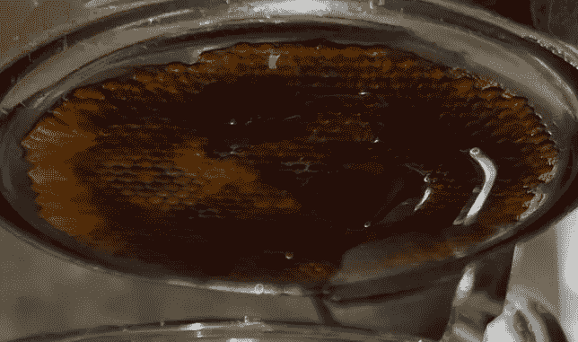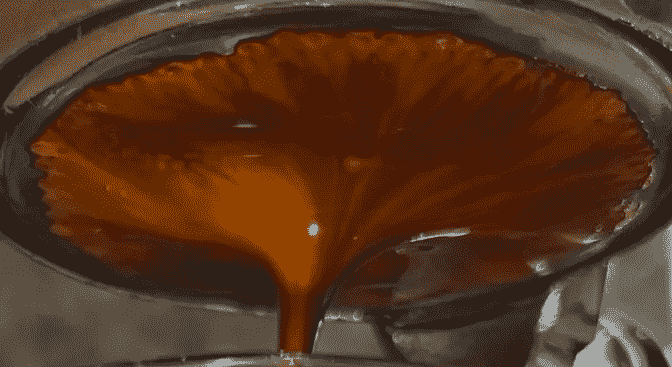

所有图片由作者提供

我们可以查看流量和平滑流量，其中流量在预输注和输注期间减少。这种减速并不是出现在所有的镜头中，但也许这是一个信号，表明这个镜头会拍得很好。

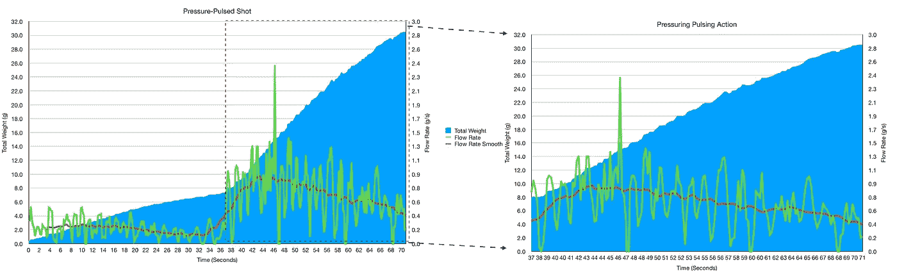

我们可以只关注预灌注(PI ),当液滴引起大量波纹时，最大包络和平均值正在下降。我为 TCF 和 T10 补充了一个说明:

1.  TCF:当过滤篮上的所有孔都有咖啡流出时，就该盖上过滤器了。
2.  T10:量杯中标示的达到 10ml 的时间。由于在量杯上使用视觉度量，这有更多的误差，但相对于 PI 来说，这是一个有趣的度量。

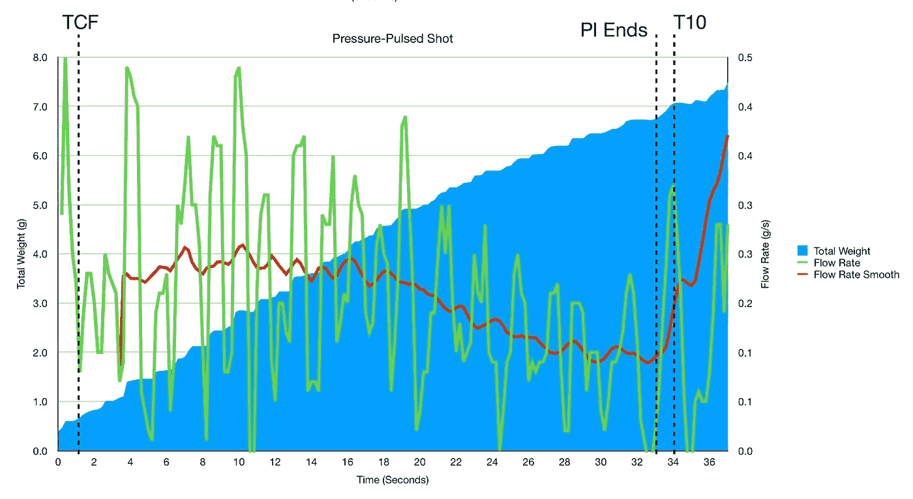

我们可以看一下另一个镜头，预输注和输注期间的流动要平坦得多。因此，这种趋势并不总是被观察到，也不知道它与性能相关。

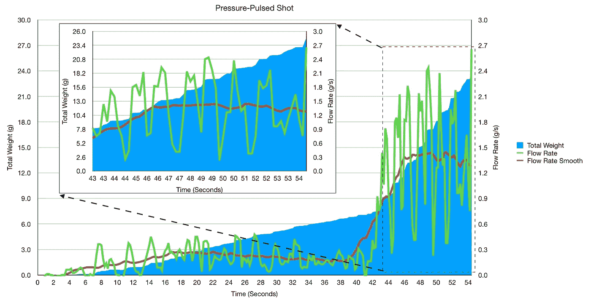

# 绩效指标

我使用两个指标来评估技术之间的差异:最终得分和咖啡萃取。然后，我使用相关性来了解这两个指标与其他变量的关联程度。

[**最终得分**](https://towardsdatascience.com/@rmckeon/coffee-data-sheet-d95fd241e7f6) 是记分卡 7 个指标(尖锐、浓郁、糖浆、甜味、酸味、苦味和回味)的平均值。当然，这些分数是主观的，但它们符合我的口味，帮助我提高了我的拍摄水平。分数有一些变化。我的目标是保持每个指标的一致性，但有时粒度很难确定。

**用折射仪测量总溶解固体量(TDS)，这个数字结合弹丸的输出重量和咖啡的输入重量用来确定提取到杯中的咖啡的百分比，称为**提取率(EY)** 。**

**相关性是衡量两个变量彼此相似程度的指标。高相关性并不意味着一个变量会引起另一个变量，而是当情况发生变化时，两个变量的涨跌幅度相同。我从一开始就假设一些分级变量会有很高的相关性，因为它们是从不同的时间点来看味道的。**

# **预输注的更多数据**

**这让我对预输注期间的流速对注射有何影响产生了兴趣。所以我看了一些关于心流的数据。我用这张图来说明我在哪里计算一些指标:**

**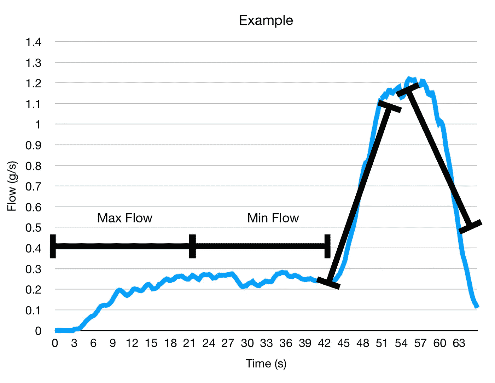**

**从最小流量和最大流量，我们可以了解流量如何达到峰值，然后变慢。所以我查看了最大流量时间和最小流量时间。达到最大流量的时间可能与圆盘变得完全饱和有关，而最小流量是圆盘在比注入期间更低的压力下如何以稳定状态流动。**

**我研究了这两个流动时间指标与 TCF 以及彼此之间的关系。数据似乎非常吻合。**

**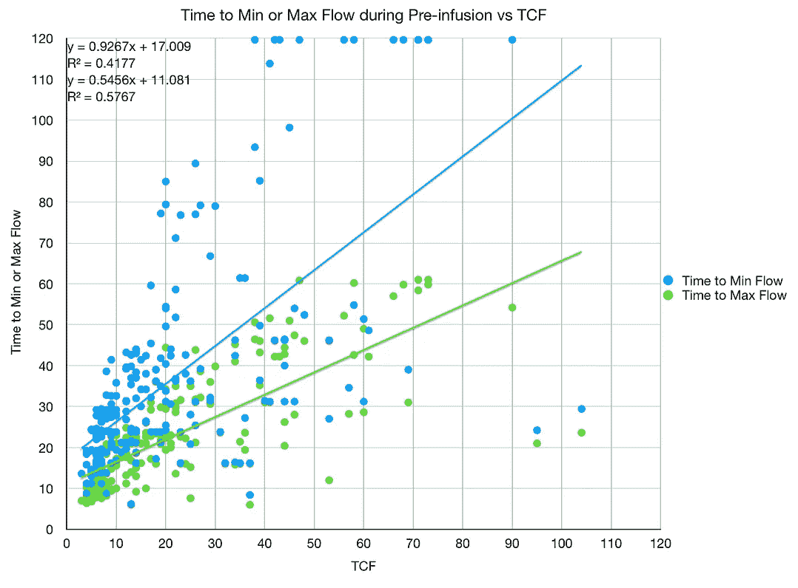****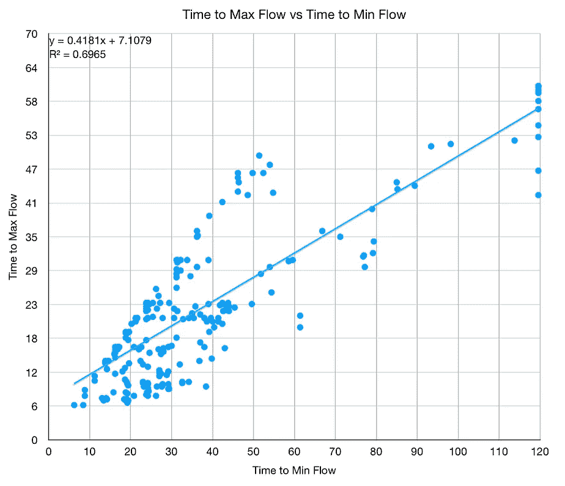**

**然后我从以前的实验中知道 EY 和最终分数的趋势与圆周率/TCF:**

**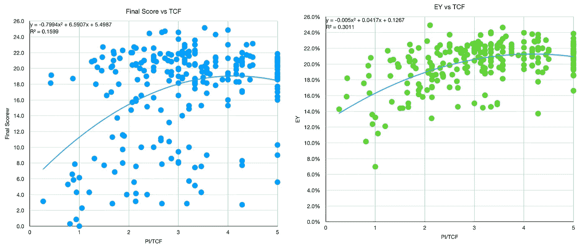**

**我还观察了 TCF、最小流量时间和最大流量时间之间的相关性。我特别感兴趣的是，在何时结束拍摄方面，最小或最大流量时间是否能比 TCF 更好地告诉我一些东西。**

**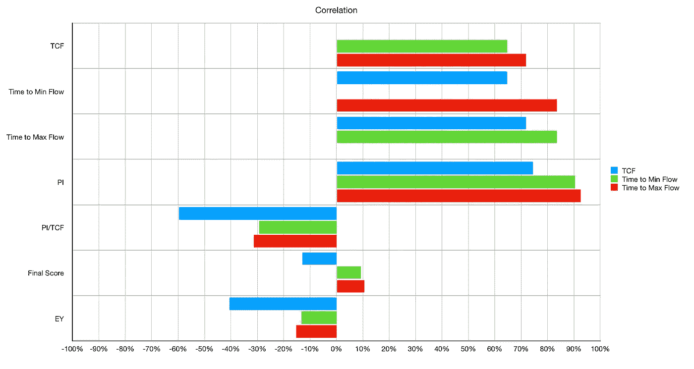**

**虽然它们与 TCF 和 PI 有很强的相关性，但在预测最终得分或 ey 的良好表现的指标方面，二者都不如 PI/TCF。**

**按镜头类型划分，TCF 仍是主要特征:**

**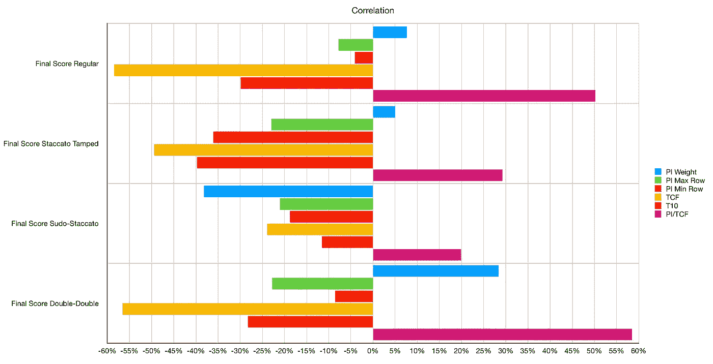**

**流程日志提供了一些关于拍摄进展的信息。我希望他们能更好地提示我在拍摄过程中使用它们作为衡量标准来做决定，但它似乎没有比 TCF 更有帮助。**

**我很好奇为什么预输注期间流速变慢。我想知道咖啡床是否压缩到流动受阻的地方。一些透明 portafilter 实验可能能够解释这一点，但在有更好的用于 58 毫米机器的透明 portafilter 之前，我不知道我能对这一特殊现象发现多少。**

**如果你愿意，可以在 Twitter 和 YouTube 上关注我，我会在那里发布不同机器上的浓缩咖啡视频和浓缩咖啡相关的东西。你也可以在 [LinkedIn](https://www.linkedin.com/in/robert-mckeon-aloe-01581595?source=post_page---------------------------) 上找到我。也可以关注我[中](https://towardsdatascience.com/@rmckeon/follow)和[订阅](https://rmckeon.medium.com/subscribe)。**

# **[我的进一步阅读](https://rmckeon.medium.com/story-collection-splash-page-e15025710347):**

**[浓缩咖啡系列文章](https://rmckeon.medium.com/a-collection-of-espresso-articles-de8a3abf9917?postPublishedType=repub)**

**[工作和学校故事集](https://rmckeon.medium.com/a-collection-of-work-and-school-stories-6b7ca5a58318?source=your_stories_page-------------------------------------)**

**[个人故事和关注点](https://rmckeon.medium.com/personal-stories-and-concerns-51bd8b3e63e6?source=your_stories_page-------------------------------------)**

**[乐高故事启动页面](https://rmckeon.medium.com/lego-story-splash-page-b91ba4f56bc7?source=your_stories_page-------------------------------------)**

**[摄影飞溅页](https://rmckeon.medium.com/photography-splash-page-fe93297abc06?source=your_stories_page-------------------------------------)**

**[使用图像处理测量咖啡研磨颗粒分布](https://link.medium.com/9Az9gAfWXdb)**

**[改善浓缩咖啡](https://rmckeon.medium.com/improving-espresso-splash-page-576c70e64d0d?source=your_stories_page-------------------------------------)**

**[断奏生活方式概述](https://rmckeon.medium.com/a-summary-of-the-staccato-lifestyle-dd1dc6d4b861?source=your_stories_page-------------------------------------)**

**[测量咖啡磨粒分布](https://rmckeon.medium.com/measuring-coffee-grind-distribution-d37a39ffc215?source=your_stories_page-------------------------------------)**

**[咖啡萃取](https://rmckeon.medium.com/coffee-extraction-splash-page-3e568df003ac?source=your_stories_page-------------------------------------)**

**[咖啡烘焙](https://rmckeon.medium.com/coffee-roasting-splash-page-780b0c3242ea?source=your_stories_page-------------------------------------)**

**[咖啡豆](https://rmckeon.medium.com/coffee-beans-splash-page-e52e1993274f?source=your_stories_page-------------------------------------)**

**[浓缩咖啡用纸质过滤器](https://rmckeon.medium.com/paper-filters-for-espresso-splash-page-f55fc553e98?source=your_stories_page-------------------------------------)**

**[浓缩咖啡篮及相关主题](https://rmckeon.medium.com/espresso-baskets-and-related-topics-splash-page-ff10f690a738?source=your_stories_page-------------------------------------)**

**[意式咖啡观点](https://rmckeon.medium.com/espresso-opinions-splash-page-5a89856d74da?source=your_stories_page-------------------------------------)**

**[透明 Portafilter 实验](https://rmckeon.medium.com/transparent-portafilter-experiments-splash-page-8fd3ae3a286d?source=your_stories_page-------------------------------------)**

**[杠杆机维护](https://rmckeon.medium.com/lever-machine-maintenance-splash-page-72c1e3102ff?source=your_stories_page-------------------------------------)**

**[咖啡评论和想法](https://rmckeon.medium.com/coffee-reviews-and-thoughts-splash-page-ca6840eb04f7?source=your_stories_page-------------------------------------)**

**[咖啡实验](https://rmckeon.medium.com/coffee-experiments-splash-page-671a77ba4d42?source=your_stories_page-------------------------------------)**