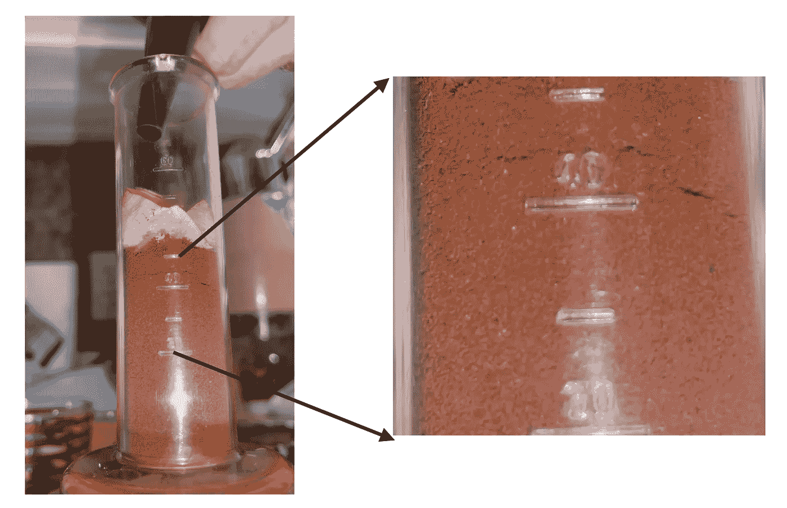

# 浓缩咖啡预湿，而不是预浸泡

> 原文：<https://towardsdatascience.com/espresso-pre-wetting-ecd9a895ed5f?source=collection_archive---------41----------------------->

## 咖啡数据科学

## 预输注透明过滤器试验的残留

我正在试验一种用于浓缩咖啡的透明移动式过滤器，我发表了一些试验结果。在与[乔纳森·加涅](https://coffeeadastra.com/)的交谈中，他想知道我是否能在毛细作用的基础上看到流量和时间之间的关系。所以我把我的图像处理技能应用到一个视频中，来帮助观察这种关系是否可见，并且它被观察到了！

> 预湿遵循毛细管作用的权利！

这一点很重要，因为有时我们会将预浸误认为是预湿，结果是托盘没有完全湿润，这可能会导致不好的浓缩咖啡。预浸真的是好咖啡的关键，所以我们应该每次都做好。

# 毛细作用

[一般理论](https://en.wikipedia.org/wiki/Capillary_action)(见标题“多孔介质中的液体传输”)是当液体被多孔材料吸收时，吸收率会随着时间的推移而降低。因此，液体渗透多孔材料的垂直距离与材料与液体接触时间的平方根成正比。

> 垂直距离=常数*sqrt(时间)

# 实验装置

我用了一个 make shift 透明 portafilter(又名 Kompresso)，我在里面放了一些咖啡。最初，我把热水倒进去了，我没有施加任何压力。顶部的纸过滤器减少了基于流量输入的通道，因此它就像一个淋浴帘。

所有图片由作者提供

我以 60 FPS 的速度捕捉了一个 4K 分辨率的视频。在处理视频的过程中，我专注于视频的一个区域。

然后我将每行的像素相加。我的目标是用最简单、最快的方法来计算平均咖啡线。我想如果有关系的话，我应该做些超级花哨的事情。然后我应用了一个简单的阈值。

从这里，我能够提取每帧的平均咖啡行值。我把它画在下面，然后我把它画在时间的平方根上。

当与时间的平方根比较时，存在非常强的相关性，这证实了水在预润湿期间通过圆盘的方式遵循毛细管作用预测。

一个理论是可测试的，我很喜欢看到这个关于毛细血管运动的理论解释为什么预湿不同于预灌注。这对于像 [Flair](https://www.flairespresso.com/) 或 [Kompresso](http://www.cafflano.com/product_kompresso.php?TM=2) 这样的机器来说是最重要的，在那里你可以倒水，你可以决定你是想做预湿还是 1 到 2 巴的预浸。

对于新的浓缩咖啡用户来说，这一点特别重要，有助于区分急需的预浸和可选的预湿。

如果你愿意，请在 [Twitter](https://mobile.twitter.com/espressofun?source=post_page---------------------------) 和 [YouTube](https://m.youtube.com/channel/UClgcmAtBMTmVVGANjtntXTw?source=post_page---------------------------) 上关注我，我会在那里发布不同机器上的浓缩咖啡照片和浓缩咖啡相关的视频。你也可以在 [LinkedIn](https://www.linkedin.com/in/robert-mckeon-aloe-01581595?source=post_page---------------------------) 上找到我。也可以在[中](https://towardsdatascience.com/@rmckeon/follow)关注我。

# [我的进一步阅读](https://rmckeon.medium.com/story-collection-splash-page-e15025710347):

[浓缩咖啡系列文章](https://rmckeon.medium.com/a-collection-of-espresso-articles-de8a3abf9917?postPublishedType=repub)

[工作和学校故事集](https://rmckeon.medium.com/a-collection-of-work-and-school-stories-6b7ca5a58318?source=your_stories_page-------------------------------------)

[个人故事和关注点](https://rmckeon.medium.com/personal-stories-and-concerns-51bd8b3e63e6?source=your_stories_page-------------------------------------)

[乐高故事首页](https://rmckeon.medium.com/lego-story-splash-page-b91ba4f56bc7?source=your_stories_page-------------------------------------)

[摄影启动页面](https://rmckeon.medium.com/photography-splash-page-fe93297abc06?source=your_stories_page-------------------------------------)

[一款价格实惠、简单透明的意式浓缩咖啡过滤器](https://medium.com/@rmckeon/a-cheap-transparent-portfilter-f60ee1824b52?source=your_stories_page-------------------------------------)

[浓缩咖啡过程中粉末不会迁移](/fines-dont-migrate-during-an-espresso-shot-1bb77e3252ca?source=your_stories_page-------------------------------------)

[浓缩咖啡捣固的收益递减](/the-diminishing-returns-of-tamping-for-espresso-cac289685059?source=your_stories_page-------------------------------------)

[浓缩咖啡可以涡轮增压吗？](/can-espresso-be-turbo-charged-2c5e619abdb8?source=your_stories_page-------------------------------------)

[浓缩咖啡浸泡测试](/espresso-soak-test-f73989d1faca?source=your_stories_page-------------------------------------)

【Kompresso 能得到 9 巴压力的浓缩咖啡吗？

[浓缩咖啡透明移动式过滤器实验](/experiments-with-a-transparent-portafilter-for-espresso-ad6b79fdd6b6?source=your_stories_page-------------------------------------)

[解构咖啡:分割烘焙、研磨和分层以获得更好的浓缩咖啡](/deconstructed-coffee-split-roasting-grinding-and-layering-for-better-espresso-fd408c1ac535)

[香辣浓缩咖啡:热磨，冷捣以获得更好的咖啡](/spicy-espresso-grind-hot-tamp-cold-36bb547211ef)

[断续浓缩咖啡:提升浓缩咖啡](https://link.medium.com/vmI2zVeQabb)

[断奏捣固:不用筛子改进浓缩咖啡](/staccato-tamping-improving-espresso-without-a-sifter-b22de5db28f6)

[压力脉动带来更好的浓缩咖啡](/pressure-pulsing-for-better-espresso-62f09362211d)

[咖啡数据表](https://towardsdatascience.com/@rmckeon/coffee-data-sheet-d95fd241e7f6)