# 浓缩咖啡圆盘分析

> 原文：<https://towardsdatascience.com/espresso-puck-analysis-9c35b102c4f8?source=collection_archive---------11----------------------->

## 咖啡数据科学

## 咖啡失效分析的可视化数据之旅

关于投篮后冰球分析或冰球学的有用性有一些争论。通常这需要看冰球的顶部，偶尔我会看到冰球底部的照片。通常，它们很难解码。

我注意到由于[断奏捣固](https://link.medium.com/FfQSXgCb3cb)和[纸过滤器](https://link.medium.com/BYukoXDb3cb)，我的镜头变得更加复杂，它们被用于更好的故障分析。我通常在照片的底部和中间使用纸质过滤器，如果有[残留的咖啡渍](https://link.medium.com/stXNMpIb3cb)，我可以更好地猜测通道是从哪里开始的。

咖啡上或所用的纸上的咖啡污渍或黑斑是相对于托盘中的其余咖啡的低流动性的指示。高流量区域或通道应该有较少的污点。

我们可以看一些例子，对我的数据集来说，非常引人注目的是，我有一个所有浓缩咖啡照片的视频。我希望通过这些例子，其他人能够更好地利用拍摄后的视觉线索来帮助理解问题所在。

> 你不能修正你观察不到的东西。

# 顶部过滤器的第一个例子

这一针在预输注期间开始得不太好。还有一大块地方没有咖啡流出来。通常，如果在预输注期间发生这种情况，我发现的唯一恢复的好方法是尝试低压下的[压力脉动](https://link.medium.com/Lh19VVjc3cb)。我定期使用压力脉冲，但通过使用较低的压力，有时你可以让流量返回。

在观察圆盘时，我使用了一个顶部滤镜，两个中间滤镜，没有底部滤镜。两个中间的过滤器使得没有咖啡渣的照片更清晰。

后来，我确定顶部过滤器增加了侧通道，因为它允许水比通常情况下更快地流向两侧。在查看过滤篮上的咖啡污渍时，一个大点没有太多的咖啡，如上图所示，当其余部分变成棕色时，咖啡颜色变深。

冰球的底部也有咖啡渍，在中间的过滤器中，很明显，在水流到冰球底部之前很久就发生了沟流。大月牙标志着流量不足。

# 单面拍摄

我们可以从另一个角度来看如何在冰球分析中看到这些影响。

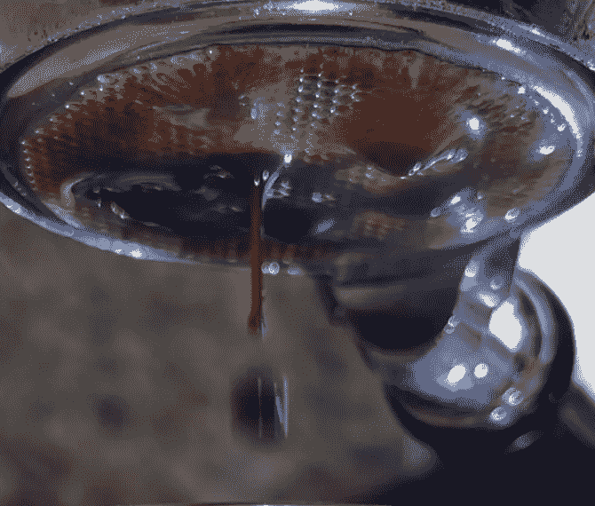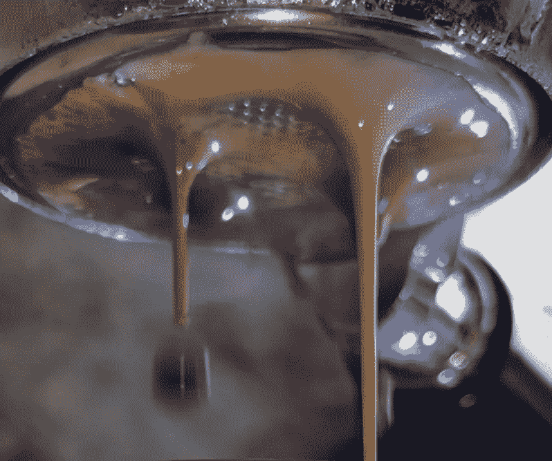

这张照片使用了一个顶部滤镜，两个中间滤镜，没有底部滤镜。中间的过滤器显示水流从两边和中间流下，停在一个甜甜圈里。中间看起来正常，因为[注射准备被设计为在中间](https://medium.com/swlh/simplifying-coffee-distribution-for-espresso-e58ac4351ba)具有较低的密度，以调整杠杆机器圆环问题。

两个滤纸中间的黑色圆圈是圆盘的两半，表明通道一直通向顶部。

这个分析让我更仔细地看了看移除顶部过滤器。当时，我试图看看顶部过滤器是否可以改善结果。

# 用顶部过滤器夯实

在这个例子中，我使用了一个更大的过滤器，并把过滤器压在上面。然而，一个大甜甜圈出现了。

夯实没有帮助。我以为水可能在过滤器上流动，但看起来淋浴屏幕的封条正好在纸的上面。所以水穿过纸流到边缘。

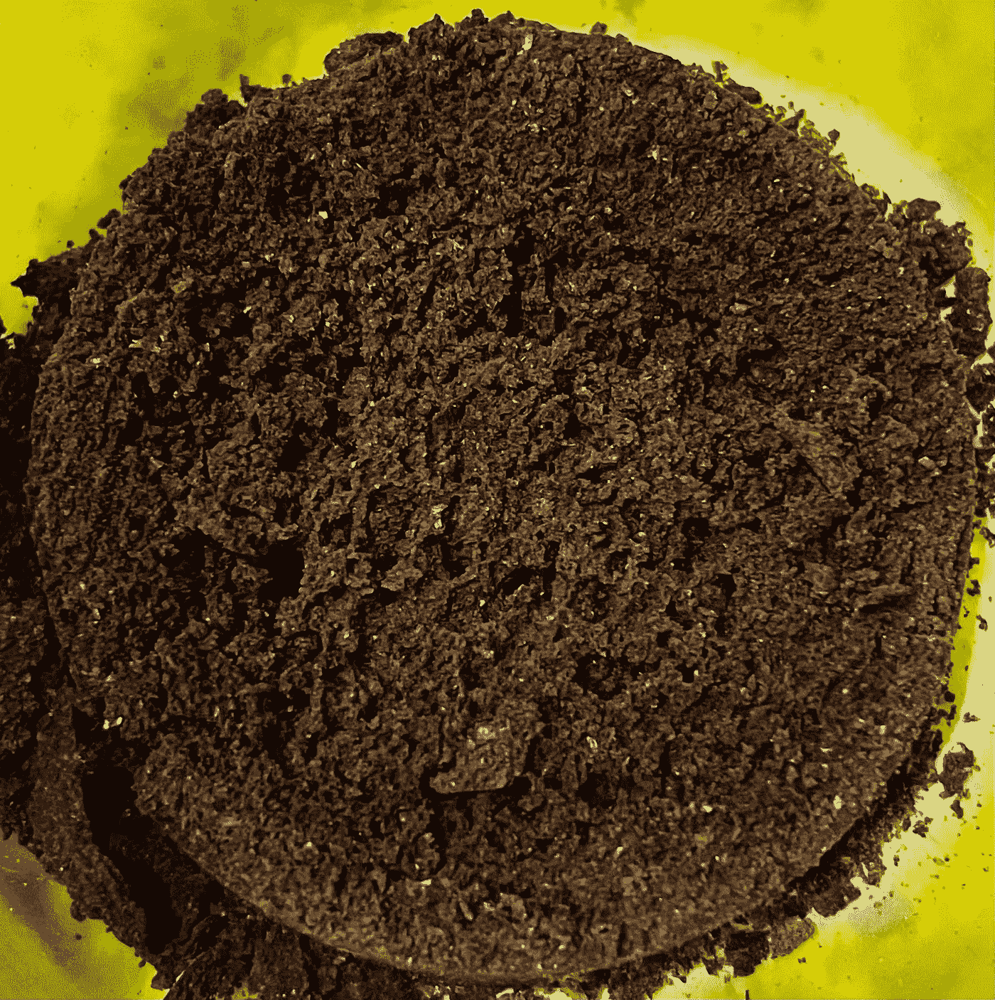

# 较小的顶部过滤器

为了测试这个想法，我把顶部的过滤器做得更小，这样它就不会一直到边缘。通灵没有那么糟糕，但是仍然有问题。

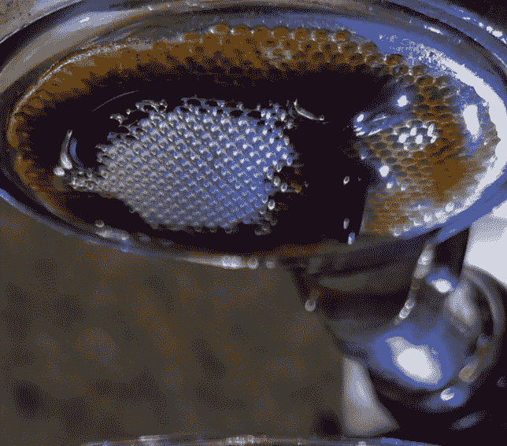

滤纸和圆盘上的颜色不是黑色的。甜甜圈效应并不完全是由顶部滤镜造成的，但这并没有帮助。

顶部有一个较小的纸质过滤器有助于侧面保持固化，这表明有一个完整的纸质过滤器会使侧面沟道效应变得更糟。这可能不是正常夯实镜头的情况，但对于断奏夯实，顶层有一个轻得多的夯实。

# 拆除顶部过滤器

对于这个镜头，顶部提取更均匀。这可以通过触摸圆盘并找到较硬的位置或较密集的位置来看到。

仍然有一个黑色的甜甜圈，但提取率更高，味道更好。

这个冰球的分布很奇怪。结果，一半的咖啡豆是错误的肯尼亚咖啡豆。我用两粒咖啡豆做典型的烘焙，我[将各层分开](/deconstructed-coffee-split-roasting-grinding-and-layering-for-better-espresso-fd408c1ac535)，我用肯亚豆做了两次烘焙。所以在这张照片中，肯尼亚咖啡豆比其他的要新鲜一周(一周而不是两周)。这导致了一些通灵问题。

# 缩小下半部分

我在底部减少到 7 克，在顶部减少到 11 克，这似乎使过滤器的提取更加均匀，但喷雾更多了。

# 在底部添加纸质过滤器

底部有纸过滤器，镜头提取时间长得多，但味道大大改善了提取。

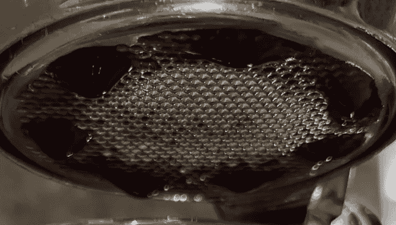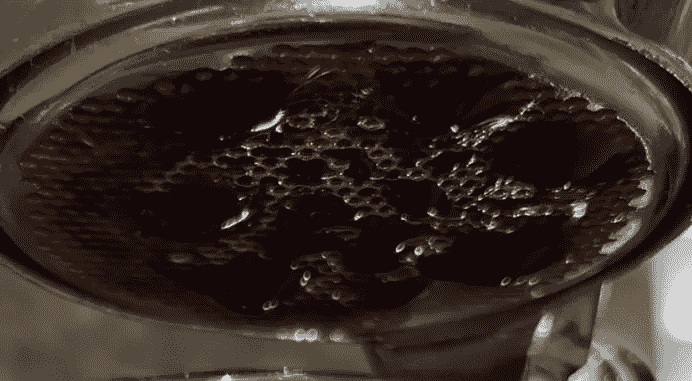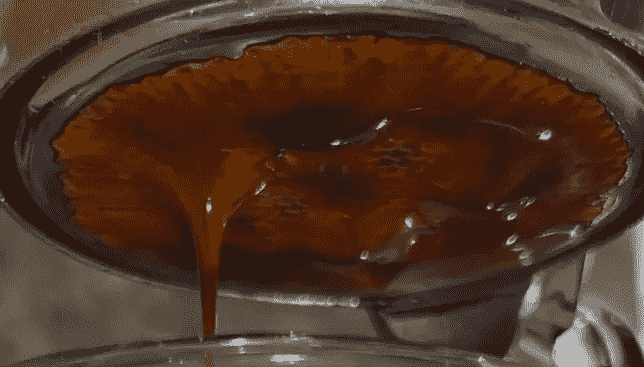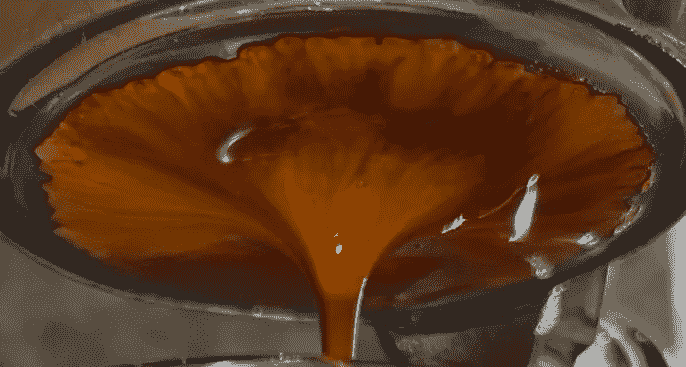

冰球分析显示更好的流动，但分析更难，因为冰球不容易出来。顶部没有大的标记，因为拍摄结束和大的沟道效应，这意味着顶部的沟道效应是由底部引起的

这个镜头的流程也很有趣。似乎流量随着预输注和输注的时间而减少。流量的大峰值是由于压力脉动，这就是为什么流量被平均用于分析。

# 重复使用的纸质过滤器

下一张照片在提取方面是相似的，但是现在，底部的纸质过滤器造成了一个反向的环形，因为水流通过中心非常集中。这是因为纸质过滤器只需用水清洗即可重复使用。

于是，我决定在镜头的下半部分做一个平坦分布，结果真的很可怕。

EY 接近 10%,正如你在杯子和过滤篮中看到的，大量未乳化的油被提取出来。击球后冰球很湿。篮子里到处都是油。太难看了。

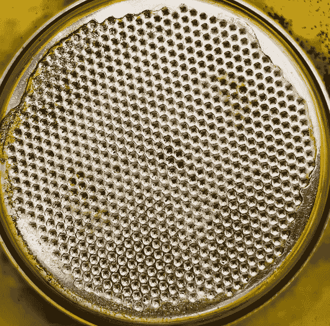

# 用力夯实

我回到了一个更密集的外环分布，并夯实底部一半稍微更难在 300 克，而不是 200 克。它回到了一个平均流量和 21% EY。

底部纸质过滤器的外侧仍然有一个有点暗的环，但我不确定这是通道还是液体在拍摄结束时沉淀的地方。镜头的上半部分均匀地分开，没有任何主要通道。

# 一个弱点

下一个镜头有 19%的 EY，这似乎很低。从底部看，边上有一些黑点，但在中间的过滤器上，外环没有那么暗。这意味着问题只是在下半部分。也许侧面密度不均匀。

在视频中发现了一个缓慢的斑点，它靠近底部过滤器上暗咖啡污渍的位置。

# 布料过滤器

我开始看布过滤器，我注意到中间的布过滤器引起了极快的流动。我被吹走了。

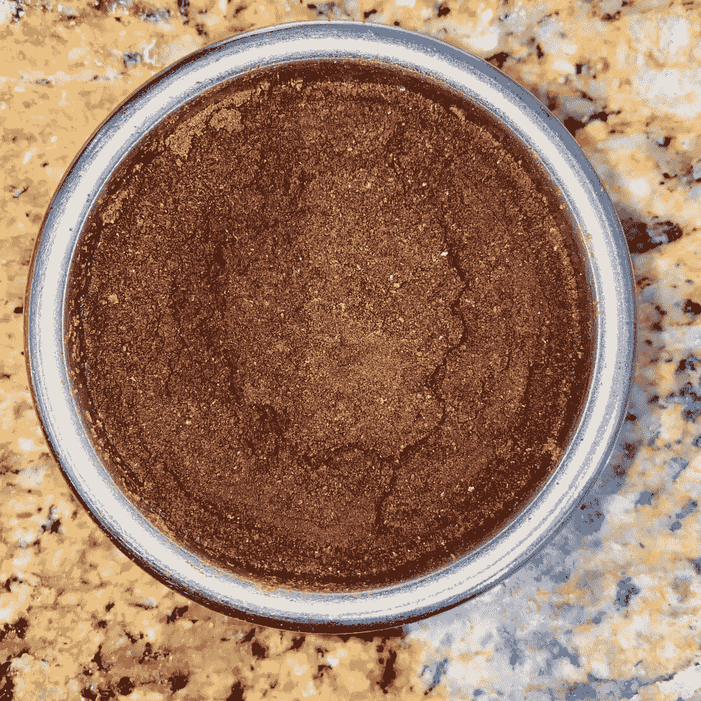

它们更干净，而且似乎比纸质过滤器更容易重复使用。纸质过滤器上的一个黑点可能是一些过滤孔，咖啡无法通过。

我在拍摄前/后的电子表格、拍摄期间的视频和拍摄后的冰球图像中收集了大量数据。他们很好地指导我如何制作更好的浓缩咖啡，因为我对浓缩咖啡的功能有了更深的理解。这就是为什么当人们在网上成群结队地询问如何修复他们的镜头时，我总是要求提供视频和图片。

> 数据越多越好。

我希望这给感兴趣的人一个起点，帮助他们学习如何提高他们的投篮。

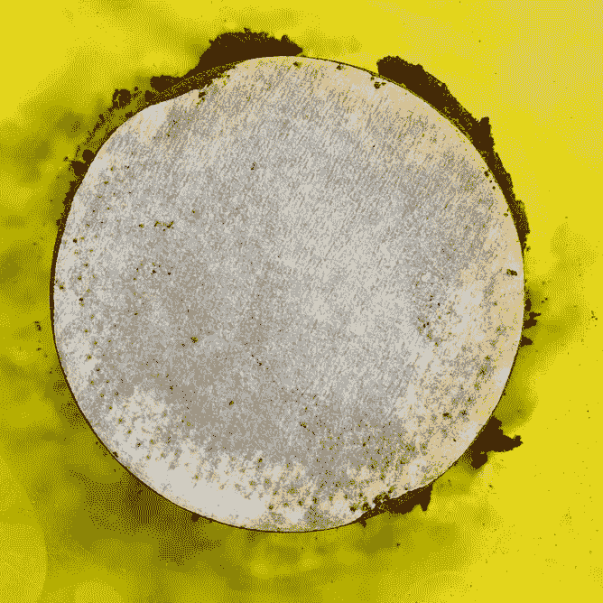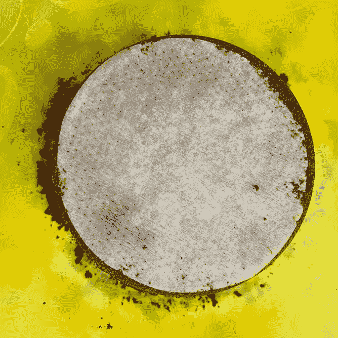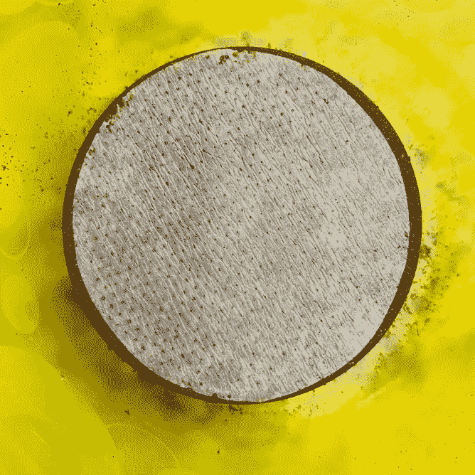

如果你愿意，可以在 Twitter 和 YouTube 上关注我，我会在那里发布不同机器上的浓缩咖啡视频和浓缩咖啡相关的东西。你也可以在 [LinkedIn](https://www.linkedin.com/in/robert-mckeon-aloe-01581595?source=post_page---------------------------) 上找到我。也可以关注我[中](https://towardsdatascience.com/@rmckeon/follow)。

# [我的进一步阅读](https://rmckeon.medium.com/story-collection-splash-page-e15025710347):

[浓缩咖啡系列文章](https://rmckeon.medium.com/a-collection-of-espresso-articles-de8a3abf9917?postPublishedType=repub)

[工作和学校故事集](https://rmckeon.medium.com/a-collection-of-work-and-school-stories-6b7ca5a58318?source=your_stories_page-------------------------------------)

[个人故事和关注点](https://rmckeon.medium.com/personal-stories-and-concerns-51bd8b3e63e6?source=your_stories_page-------------------------------------)

[乐高故事启动页面](https://rmckeon.medium.com/lego-story-splash-page-b91ba4f56bc7?source=your_stories_page-------------------------------------)

[摄影启动页面](https://rmckeon.medium.com/photography-splash-page-fe93297abc06?source=your_stories_page-------------------------------------)

[使用模式识别比较咖啡](/comparing-coffee-using-pattern-recognition-35b92cca4502)

[咖啡数据回顾:等级和口味](https://link.medium.com/1lDMQUH0Hbb)

[家庭烘焙咖啡的经济学](/the-economics-of-home-roasting-coffee-93003ea31ee8)

[咖啡豆脱气](/coffee-bean-degassing-d747c8a9d4c9)

[解构咖啡:分割烘焙、研磨、分层以获得更好的浓缩咖啡](/deconstructed-coffee-split-roasting-grinding-and-layering-for-better-espresso-fd408c1ac535)

[浓缩咖啡的预浸:更好的浓缩咖啡的视觉提示](/pre-infusion-for-espresso-visual-cues-for-better-espresso-c23b2542152e)

[咖啡的形状](/the-shape-of-coffee-fa87d3a67752)

[香辣浓缩咖啡:热磨，冷捣以获得更好的咖啡](/spicy-espresso-grind-hot-tamp-cold-36bb547211ef)

[断续浓缩咖啡:提升浓缩咖啡](https://link.medium.com/vmI2zVeQabb)

[用纸质过滤器改进浓缩咖啡](/the-impact-of-paper-filters-on-espresso-cfaf6e047456)

[浓缩咖啡中咖啡溶解度的初步研究](/coffee-solubility-in-espresso-an-initial-study-88f78a432e2c)

[断奏捣固:不用筛子改进浓缩咖啡](/staccato-tamping-improving-espresso-without-a-sifter-b22de5db28f6)

[更好的浓缩咖啡压力脉动](/pressure-pulsing-for-better-espresso-62f09362211d)

[咖啡数据表](https://towardsdatascience.com/@rmckeon/coffee-data-sheet-d95fd241e7f6)