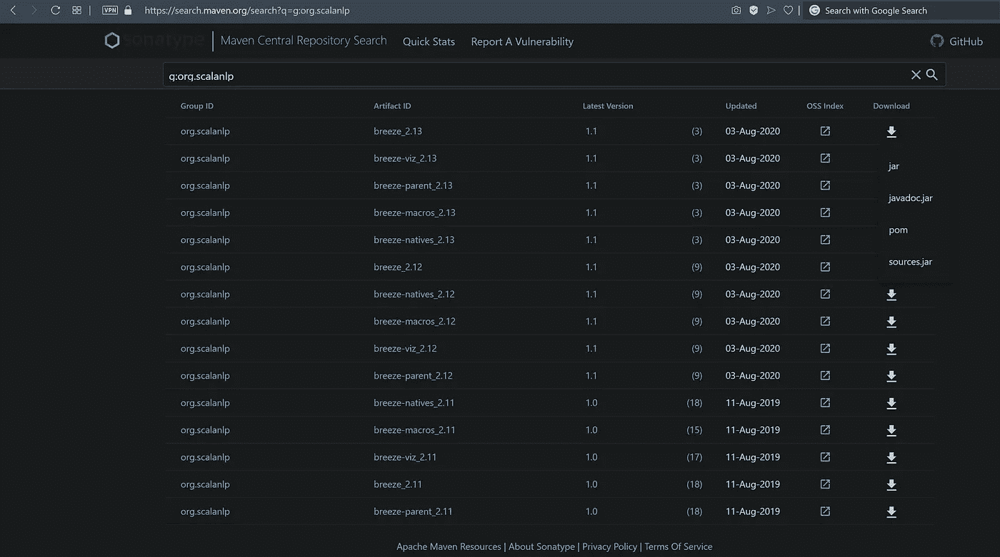
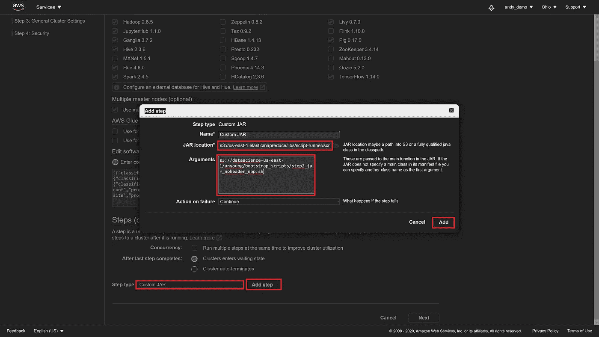

# 基本的大数据、数据科学家技能:如何为 AWS EMR 集群安装 jar

> 原文：<https://towardsdatascience.com/essential-big-data-data-scientist-skill-how-to-install-jars-for-an-aws-emr-cluster-5a9bdb7c3dab?source=collection_archive---------29----------------------->

## 基本数据科学技能

## *演示从哪里下载 jar 以及如何将它们安装在 AWS EMR 集群上，以便从 EMR 笔记本上访问*


[JESHOOTS.COM](https://unsplash.com/@jeshoots?utm_source=unsplash&utm_medium=referral&utm_content=creditCopyText)在 [Unsplash](https://unsplash.com/s/photos/frustrated-computer?utm_source=unsplash&utm_medium=referral&utm_content=creditCopyText) 上拍照

我还没有看到关于如何将 JAR 文件放到 EMR 集群的每个工作节点上的简单而全面的指南，然而这是一个非常重要的、普遍的需求。本文解决了这些需求。以下是我从个人奋斗和无数不同的谷歌结果、堆栈溢出帖子和官方 AWS 文档中总结的要点。

# 背景

GitHub 上托管的 Scala 库通常有安装指令，这些指令依赖于使用名为 Maven 的程序从源代码构建 JAR 文件。**但是作为一个数据科学家，我只想要 JAR 文件**。上述说明也缺乏关于如何在集群环境的数百个工作节点上安装这个 JAR 的实际指导。

有些文章有很棒的代码，但是依赖于您的集群/节点可以访问互联网——对于在多个防火墙后处理大量敏感数据的用户来说，这是不可思议的。例如，您可能会看到如下教程:

```
// download Vegas-viz library jars from the Maven repo
import $ivy.`org.vegas-viz::vegas:0.3.11`
```

有时，安全层会阻止从在线 Maven 存储库中导入托管 JAR 的互联网访问。因此，需要 JAR 文件本身，以便您可以将它加载到笔记本中。

本文将教您:1)从哪里下载官方 JAR 文件，2)如何创建一个 AWS EMR 集群，将 JAR 复制到集群的每个节点，这样您就可以运行以下代码行:

```
import vegas._
import h2o
etc.
```

# 第 1 部分:下载 jar

我不知道为什么**每一个** Scala GitHub repo 和数据科学工具都描述了如何从源代码构建一个 JAR，但是**没有一个**解释说你可以跳过这个多步骤的过程，直接从[https://search.maven.org/](https://search.maven.org/)下载一个 JAR。*如果你知道原因，请分享*。无论如何，请访问上面的网站，搜索您的软件包。首先，我找到了针对`breeze`的 GitHub repo，这是一个 Scala NLP 库，带有一个数据 viz 配套库:[https://github.com/scalanlp/breeze](https://github.com/scalanlp/breeze)。如果你只搜索“微风”，会出现太多的结果请改为搜索“scalanlp breeze”:



图片来源:作者

# 第 2 部分:安装 jar

创建 EMR 集群时，您希望选择`Custom Jar`然后选择`Add Step`以弹出一个对话窗口(以下截图供参考)。在这个新窗口中，相应地填写:

***姓名*:***

```
The name doesn’t matter. I just leave the default name since it isn’t referenced elsewhere/used again for our use case.
```

***罐子位置*:***

```
s3://us-east-1.elasticmapreduce/libs/script-runner/script-runner.jar
```

> 所有 AWS 用户都可以访问上面的 JAR，它用于运行 shell 脚本。

***论据:***

`s3://yourDirectory/yourShellScriptName.sh`

> 将 S3 目录用于 shell 脚本，命令复制您的 JAR 文件。下面的例子脚本进行截图。
> 
> **重要提示**:使用文本编辑器，如[记事本++](https://notepad-plus-plus.org/downloads/) 或记事本。AWS 技术支持和我发现，Sublime Text 默认使用一种字符编码，当集群试图运行 shell 命令时，这种编码会导致在该上下文中使用的`*.sh*`脚本生成`Step Failed`错误。即使手动指定 Sublime 文本使用 UTF-8 字符编码，相同的代码在 Sublime 文本生成的文件中也会失败，但在用 Notepad++创建的文件中可以工作。我们从来没有弄清楚为什么，坦率地说，我们更关心的是让一些工作。



我的 shell 脚本将(`cp` ) `jar` 文件复制到每个 AWS EMR 工作节点:

代码来源:作者。

在这一步之后，您将能够创建一个 EMR 笔记本，附加到您的 EMR 集群，并导入与这些 jar 相关联的库。如果您使用了我上面的脚本，您现在可以使用一个 **Python 3** 内核并运行:

```
import h2o
```

此外，您现在可以在一个 **Spark** 内核中运行以下代码:

```
import vegas._
```

恭喜你！现在，您可以使用那些更常用于在单节点环境中处理小数据的高级工具了！

# 关于作者

安德鲁·杨是 Neustar 的 R&D 数据科学家经理。例如，Neustar 是一家信息服务公司，从航空、银行、政府、营销、社交媒体和电信等领域的数百家公司获取结构化和非结构化的文本和图片数据。Neustar 将这些数据成分结合起来，然后向企业客户出售具有附加值的成品“菜肴”，用于咨询、网络安全、欺诈检测和营销等目的。在这种情况下，Young 先生是 R&D 一个小型数据科学团队的实践型首席架构师，负责构建、优化和维护一个为所有产品和服务提供信息的系统，该系统为 Neustar 带来了超过 10 亿美元的年收入。在 LinkedIn 上关注 Andrew，了解数据科学的最新趋势！

# 更多热门文章:

*   [隔离森林是目前最好的大数据异常检测算法](/isolation-forest-is-the-best-anomaly-detection-algorithm-for-big-data-right-now-e1a18ec0f94f)
*   [每个数据科学家都应该知道:偏差-方差权衡推广是错误的](/something-every-data-scientist-should-know-but-probably-doesnt-the-bias-variance-trade-off-25d97a17329d)

# 参考

[1]个人的血汗
[2] AWS 技术支持(特别感谢休斯顿的 Pranay S。我们一起学到了很多！)