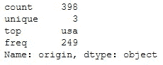

# 2021 年数据科学家必备的数据辩论技能

> 原文：<https://towardsdatascience.com/essential-data-wrangling-skills-for-data-scientists-in-2021-87a5cb698287?source=collection_archive---------38----------------------->

## 数据科学最基本的技能——与熊猫争论数据

## 使用 Pandas (Python)库处理数据的完整指南


照片由[福克斯](https://www.pexels.com/@fauxels?utm_content=attributionCopyText&utm_medium=referral&utm_source=pexels)从[派克斯](https://www.pexels.com/photo/photo-of-person-holding-mobile-phone-3183153/?utm_content=attributionCopyText&utm_medium=referral&utm_source=pexels)拍摄，经作者许可编辑

***熊猫*** 是数据科学工具包的核心组件之一。在过去的一年里，导入 Pandas 库已经成为我用 Python 开发的每个项目的首要步骤。加载和分析关系/标签数据从未如此简单。正如你可以从下面的图表中推断的那样，Pandas 只是下载量第二高的数据科学包，仅次于 NumPy。这是可以理解的，因为熊猫是建在 NumPy 上面的。


上个月的包下载数量。[来源](https://pypistats.org/)。

> 数据科学家花费 80%的时间准备和管理用于分析的数据。

在本文中，我将演示如何使用 Pandas 加载、探索和操作数据。请在 [Github](https://github.com/mwaskom/seaborn-data/blob/master/mpg.csv) 上找到用于演示的数据集。为了获得技能并理解您将要学习的概念，我强烈建议您并行尝试执行我们将在本文中讨论的命令。

我将详细说明大多数命令的功能，但是如果您想重温 Python 的基础知识，我建议您阅读下面的文章。

<https://link.medium.com/BhKOU360jcb>  

```
# installing pandas package
pip install pandas
# importing the pandas library
import pandas as pd
```

***什么是数据帧？***

> DataFrame 是主要的 Pandas 数据结构，用于以表格格式表示数据。

让我们 ***使用熊猫 ***read_csv()*** 函数将***mpg 数据加载到 DataFrame(DF)对象中。

```
import pandas as pd
# Loading the mpg data set from a local .csv file using Pandas
mpg_df = pd.read_csv('data/mpg_dataset.csv')
# Print first 5 rows of the data
mpg_df.head()
```


数据帧的前 5 行

有了索引和列标题，数据帧看起来很像 Excel 表格，不是吗？现在让我们从**到*探究*到**的数据。

## 探测

```
# Viewing the columns in the DataFrame
mpg_df.columns
```


mpg 数据集中的列

```
# dimensions of the DF
mpg_df.shape
>>> (398, 9)
#Summary of the DF 
mpg_df.info()
```


mpg_df 摘要

```
# Viewing the data type of each column in the DF
mpg_df.dtypes
```


每列的数据类型

pandas 中的 **describe** 函数可以让您快速汇总 DF 中每个字段的数据。这包括百分比、平均值、标准偏差等细节。默认情况下。描述对象类型字段时，将返回计数、唯一值数量、模式和频率等详细信息。

```
# Summary of all numeric fields in DF by default
mpg_df.describe()
```


mpg_df 摘要

```
# Accessing a column from the DataFrame
mpg_df.mpg
mpg_df['mpg']
```


数据集中的 mpg 列

我想你现在在想三件事。让我猜猜。

1.  为什么我们在同一个单元中执行两个命令？
2.  为什么结果不是表格的形式？
3.  如果我想要表格格式的选定列，我该怎么做？

各项问题的答案如下:

1.  我放在上面的单元格中用于访问列的两个命令都返回相同的结果
2.  结果不是以表格的形式，因为命令不是返回数据帧，而是返回 ***系列***
3.  从 DF 中访问列时使用双方括号，以获得 DF(表格格式)形式的结果


mpg 柱系列


作为 DF 的 mpg 列

如果这些不是你想问的问题，你可以随时留下评论，我会尽快回复你。

***什么是系列？***

> *系列*是能够保存任何类型数据的一维标签数组。它有一个与每个元素相关联的索引。本质上，系列只是表格中的一列。

现在我们已经了解了 Series，我们有各种专门的函数来了解特定列中的数据。让我们继续研究这些数据。

```
# Describe of origin field in mpg_df
mpg_df.origin.describe()
```



mpg_df 中“来源”字段的汇总

解释上面的摘要:
count -列中总共有 398 个值，unique - 3 个不同的值，
top - 'usa '是列的模式，freq - 249 是模式的频率

```
# Values present in the column & their occurence
mpg_df.origin.value_counts()
```


价值 _ 原产地计数

```
# check all the columns if there are any missing values mpg_df.isna().sum()
```


缺少值计数的列

```
# Assigning the df to another
cdf = mpg_df
cdf.head()
```

这里的“=”符号不会从 mpg_df 创建一个名为“cdf”的新 DF。这意味着，我对 mpg_df/cdf 所做的任何修改都会影响另一个，因为它们将共享相同的内存地址。

```
id(cdf)==id(mpg_df)
>>> True
```

所以如果你想创建一个 DF 的副本，使用 **copy()** 函数。

```
cdf = mpg_df.copy()
id(cdf)==id(mpg_df)
>>> False
```

## 操纵

到目前为止，我们已经讨论了这些部分- ***加载*** 和 ***探索*** 数据。我们现在将学习如何 ***操作*** 数据。

***切片&划片***

基本上，有 3 种分割 DF 的方法:

*   方括号-子集
*   基于位置标签的索引
*   iloc -位置索引

另一个选项 **ix** 就像是融合了 **loc** & **iloc** 。但是我们不会讨论这个，因为它已经过时了。

首先，让我们探索一下 ***方括号*** 的做法。

```
# Select the row where mpg value is minimum
cdf[cdf['mpg']==cdf['mpg'].min()] 
```


mpg 最小的行

如果您想将选定的列从其中删除，这又是一个带有列名的方括号。

```
cdf[['mpg','horsepower','origin']][cdf['mpg']==cdf['mpg'].min()]
```


从 mpg 最小的行中选择列

假设我们想基于这个条件设置一些值。我们可以这样做，但是记住这将抛出一个警告，并且不是推荐的方法。

```
cdf['mpg'][cdf['mpg']==cdf['mpg'].min()] = 9.001 
```


设置值时出现警告消息


使用[]将 mpg 最小值设置为 9.001

推荐的方法是使用 ***loc*** 属性。

```
# Setting mpg value based on condition using loc
cdf.loc[cdf['mpg']==cdf['mpg'].min(),'mpg'] = 9.005
```


使用 loc 的最小 mpg 值行集

```
# If you want to modify multiple values based on a condition
cdf.loc[cdf['mpg']==cdf['mpg'].min(),['mpg','weight','name']] = 9.005,4733,'fordtorino'
cdf.loc[cdf['mpg']==cdf['mpg'].min()]
```


基于 loc 条件的多个值集

是的，我甚至在第二个命令中使用了 loc 条件，同时访问具有最小“mpg”值的行。您可以使用方括号或 loc 来访问它。但是对于修改 DF 中的值，推荐的方法是使用 *loc* 。

还可以指定要从数据中提取的选定列和索引，如下所示:

```
# Select first 5 indexes from column mpg to displacement
cdf.loc[0:5,'mpg':'displacement']
```


将 0 到 5 列 mpg 索引到位移

```
# Select first 5 indexes from column mpg to displacement
cdf.loc[[1,3,5],['mpg','displacement']]
```


使用 loc 选择的索引和列

***iloc*** 可用于根据从 0 到(行数-1)分配给 DF 每行的虚拟索引位置提取行。

```
# Accessing row using index
cdf.iloc[[28]]
```


使用 iloc 的行索引 28

```
# Accessing the series based on index using iloc
cdf.iloc[28]
```


指数系列 28

```
# Accessing row,column based on index using iloc
cdf.iloc[28]['weight']
cdf.iloc[28,4]
>>> 4733
```

第一个命令显式地访问“weight ”,指定字段名，而第二个命令指向列索引 4 (weight)来获取值。

*由于将涉及多个 DF，请在以下部分中小心遵循 DF 名称。*

***设置指标***

***set_index()*** 函数帮助使用一个或多个现有列设置 DF 索引(行标签)。有一个参数'*代替'*,默认设置为 False。如果命令不应返回结果 DF，而是直接在调用 DF 中进行更改，则可以将其设置为 True。

```
abc_df = cdf.set_index("name")
abc_df.head()
```


使用名称作为索引从 cdf 创建 DF abc

***loc*** 在使用基于标签的索引访问行时起着重要的作用。

```
abc_df.loc['buick skylark 320']
```


使用 loc 的基于标签的选择

***复位索引***

我们有包含列名的 abc_df 作为索引。为了理解 reset_index 是如何工作的，我将把“cdf”中的行子集化到一个名为“rdf”的新 df 中。

```
rdf = cdf.loc[cdf['mpg']>17]
rdf.head()
```


mpg>17 的 rdf 子集 df

要删除索引并将 DF 索引重置回默认数字索引或将现有数字索引从 0 重置为(行数-1)，我们使用***reset _ index()***函数。

```
# inplace=True makes the changes directly in rdf
rdf.reset_index(inplace=True)
rdf.head()
```


rdf 索引重置

您可以在新列“index”中看到初始索引值。您可以通过将参数 ***drop*** 设置为 True 来删除它。例如，在当前将名称作为索引的 abc_df 中，让我们重置索引，将 drop 参数设置为 True。


以名称为索引的 abc_df

```
abc_df.reset_index(inplace=True,drop=True)
abc_df.head()
```


abc_df 索引重置-名称删除

***创建新列***

只有当值的长度与索引的长度匹配，或者在 DF 列中设置了单个值时，才能创建新列。

```
# Creating a column name set to 'xxx'
abc_df['name'] = 'xxx'# Creating a column based on existing columns
abc_df['calc'] = abc_df['cylinders']*abc_df['mpg']
abc_df.head()
```


添加了新列-名称，计算

***扔下一列***

可以使用 ***drop()*** 函数删除 DF 中的一列或多列。或者要删除单个列，您也可以使用 ***del()*** 函数。

```
# Drop a single column - index
del(rdf['index'])
# Drop multiple columns
rdf = rdf.drop(columns=['displacement','weight'])
rdf.head()
```


从 rdf 中删除的列

***重命名一列***

使用 ***rename()*** 函数重命名一个或多个 DF 列。

```
# Renaming the columns of DF
rdf = rdf.rename(columns={
    'acceleration':'acc',
    'model_year':'year'
})
rdf.head()
```


重命名的列

***按列排序***

使用***sort _ values()***函数对基于列的 DF 进行排序。默认情况下，升序参数为真。如果设置为 False，DF 将按降序排列。

```
weight_sorted_df = mpg_df.sort_values(by=['weight'],ascending=False)
weight_sorted_df.head()
```


DF 按 desc 顺序按重量排序

***执行字符串操作***

我发现非常有用且最常用的字符串操作:

*   strip()修剪空白
*   大写的 upper()
*   小写的 lower()
*   包含()来检查字符串是否存在

```
# String operations
# Trimming whitespaces and making origin capital
kdf = mpg_df.copy()
kdf['origin'] = kdf['origin'].str.strip()
kdf['origin'] = kdf['origin'].str.upper()
kdf.origin.unique()
```


字符串操作后的唯一值

```
# Rows where origin contains string 'eur' irrespective of the case
kdf[kdf['origin'].str.contains('eur',case=False)].head()
```


原产地为 str 'eur '

有关字符串操作技术的更多信息，请参考 [Geeksforgeeks](https://www.geeksforgeeks.org/string-manipulations-in-pandas-dataframe/) 。

***创建数据帧***

```
# Creating a DF using a dictionary with list of prices & country
price_dict = {'country': ['usa','japan','europe'],
              'price': [50000,85000,45000]}
price_df = pd.DataFrame(price_dict)
print(price_df)
```


创建的价格 DF

创建 DF 有许多方法。我只提到其中之一。要查看创建 DF 的所有不同方法，请参考 [Geeksforgeeks](https://www.geeksforgeeks.org/different-ways-to-create-pandas-dataframe/) 。

***追加到数据帧***

***【append()】***函数可用于将行追加到 DF 对象的末尾。参数‘ignore _ index’默认为 False，这意味着追加的 DF 的索引将保持在追加前的状态。

考虑一个名为“pk”的新 DF，如下所示，追加到 mpg_df 中


要追加的新 DF 'pk '

```
mpg_df.append(pk)
```


附加到 mpg_df 的新 DF

```
mpg_df.append(pk,ignore_index=True)
```


追加新 DF 时忽略索引

***串接数据帧***

使用 ***concat()*** 函数可以将行或列与现有的 DF 连接起来。“轴”参数决定要连接的轴。轴 0-索引(默认)，1 列。

```
# Concatenating the new DF pk and mpg_df
pd.concat([pk,mpg_df],ignore_index=True) # axis 0 by default
```


串联“主键”& mpg_df

类似地，使用 axis=1 进行连接将在现有 DF 的右侧创建新列。

***填充缺失 NA 值***

***fillna()*** 函数可用于填充 DF 中出现的所有 NaN 或 NULL(缺失)值。

```
# Filling the mpg_df missing country price values with 0
mpg_df['price'] = mpg_df['price'].fillna(0)# Or filling missing values in multiple numeric columns in DF
mpg_df[['price','horsepower']] = mpg_df[['price','horsepower']].fillna(0)# For filling entire DF missing values with 'Missing'
mpg_df = mpg_df.fillna('Missing')
```

***删除缺失值的行/列***

***【dropna()***函数可用于删除缺失值的行/列。

```
# Dropping rows with any missing values
tmp_df = mpg_df.dropna(axis=0,how=’any’,subset=None,inplace=False)'''Dropping columns inplace with all values missing. subset checks dropna only for the mentioned columns'''mpg_df.dropna(axis=1,how=’all’,subset = [’mpg’,’price’,’origin’],inplace=True)
```

## 解决问题的时间

假设我们必须根据每个原产地设置一个“价格”属性。有许多方法可以做到这一点，我将告诉你如何做。

1.  for 循环
2.  应用
3.  合并
4.  通信线路（LinesofCommunication）
5.  绘图

***为循环***

```
for i in cdf['origin']:
    if i == 'usa':
        cdf['price'] = 50000
    elif i == 'japan':
        cdf['price'] = 85000
    elif i == 'europe':
        cdf['price'] = 45000
```

***应用***

在 DF 上调用 *apply()* 上的函数将对所有行/列执行该计算。当涉及复杂操作时，被认为比循环更快。

```
# Function defined to calculate the price
def calc_price(df):
    if df['origin'] == 'usa':
        df['price'] = 50000
    elif df['origin'] == 'japan':
        df['price'] = 85000
    elif df['origin'] == 'europe':
        df['price'] = 45000
    return df
weight_sorted_df = weight_sorted_df.apply(calc_price,axis=1)
```

***合并***

合并 DFs 是处理数据时最重要的功能之一。Pandas 支持所有可以在基于列或索引的 DataFrame 对象之间执行的数据库连接操作。这就是一个 ***merge()*** 函数默认的样子。

```
pd.merge(left, right, how='inner', on=None, left_on=None, right_on=None)
```

*   “左”和“右”指的是测向对象
*   如果两个 DFs 有共同的列，则“on”指的是列列表
*   如果我们没有公共列，我们使用“left_on”和“right_on”来指定特定于 DF 对象的列名
*   “how”指的是连接操作-(左、右、内、外)


解释了合并方法。[来源](https://www.tutorialspoint.com/python_pandas/python_pandas_merging_joining.htm)。

现在让我们合并 rdf 和 price_df 数据帧对象。

```
rdf = pd.merge(
    rdf,
    price_df,
    left_on = 'origin',
    right_on = 'country',
    how = 'left'
)
rdf.head()
```


rdf & price_df 已合并

**loc**

创建新的列价格，并使用 loc 根据条件设置列值。这种方法肯定比循环或应用快。

```
abc_df.loc[abc_df['origin']=='usa','price'] = 50000
abc_df.loc[abc_df['origin']=='europe','price'] = 45000
abc_df.loc[abc_df['origin']=='japan','price'] = 85000
```

***映射***

使用 ***map()*** 函数根据字典的键映射值并分配相应的值。

```
p_dict = {'usa':50000,'europe':45000,'japan':85000}
mpg_df['price']=mpg_df['origin'].map(p_dict)
mpg_df.head()
```

在我们宣布我们已经掌握了 Pandas 中用于数据争论的所有基本功能之前。有一个重要的概念仍然悬而未决:

## **分组依据**

***groupby()*** 函数用于将数据分组。它有助于以一种易于解释和计算的方式聚合数据。

比方说，我想找出基于“原点”的所有值的平均值。

```
mpg_df.groupby('origin').mean()
```


按原点分组的所有值的平均值

```
'''Grouping based on multiple columns & calculate sum of cylinders used in each origin, will return a series'''mpg_df.groupby(['origin','price'])['cylinders'].sum()
```


按产地和价格分组的钢瓶总数

正如我们已经知道的，为了得到 DF 形式的结果而不是级数，我们使用了双方括号。

```
mpg_df.groupby(['origin','price'])[['cylinders']].sum()
```


分组依据 DF

```
mpg_df.groupby(['origin','name'])['name'].count()
```


按来源分组的名称

***Groupby*** 可以在不同的语境下有效使用，获得不同的结果。根据应用程序，可以结合使用不同的参数和函数。

Groupby 本身可以成为一篇文章的主题。因此，要想更详细地了解 groupby，你可以浏览以下我觉得有趣的媒体文章&涵盖了所有的基础:

*   [熊猫团比解说](/pandas-groupby-explained-453692519d0)和 [11 个团比的例子](/11-examples-to-master-pandas-groupby-function-86e0de574f38)由[Soner yld rum](https://medium.com/u/2cf6b549448?source=post_page-----87a5cb698287--------------------------------)
*   [高效数据汇总&分析](/efficient-data-summarizing-and-analysis-using-pandas-groupby-function-7b2cc9eff186)由[拉希达·纳斯林·萨克斯利](https://medium.com/u/8a36b941a136?source=post_page-----87a5cb698287--------------------------------)
*   [斯凯勒·戴尔](/ultimate-pandas-guide-mastering-the-groupby-104306251739)的的《掌握群体指南》

*是的！你现在已经学会了与熊猫争论数据的艺术。Pandas 中的大多数命令&功能都很简单并且容易实现，只要我们清楚我们想要用手头的数据实现什么。*

***总结***

我们在本文中涉及的概念:

*   ***将*** 数据加载到数据帧中
*   ***探索*** 数据
*   ***使用不同的方法操纵*** 数据

在几个数据集上练习和做一些 StackOverflow 搜索都是这个过程的一部分。

> 你挖得越深，发现的就越多

***包装完毕***

感谢到目前为止的所有人，我希望这篇文章对你有所帮助。请在评论中分享您的反馈/疑问。现在，是时候使用您的数据争论技能了。祝你好运！

*如果你觉得这篇文章很有趣，并且对数据科学/机器学习充满热情，点击* [*关注*](https://medium.com/@mahadeveaswar) *并随时在*[*LinkedIn*](https://www.linkedin.com/in/mahadev-easwar/)*上添加我。*

```
References:
1.[https://pypistats.org/](https://pypistats.org/)
2.[https://www.tutorialspoint.com/python_pandas/python_pandas_merging_joining.htm](https://www.tutorialspoint.com/python_pandas/python_pandas_merging_joining.htm)
3.[https://pandas.pydata.org/docs/reference/frame.html](https://pandas.pydata.org/docs/reference/frame.html)
```