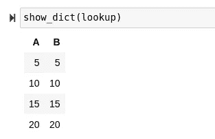

# Python 程序员必备的字典突变

> 原文：<https://towardsdatascience.com/essential-dictionary-mutation-for-python-programmers-d1a06efc5b?source=collection_archive---------15----------------------->

## 回顾 Python 中字典数据类型的一些最重要的特性。


(src =[https://pixabay.com/images/id-2771936/](https://pixabay.com/images/id-2771936/)

# 介绍

T 字典数据类型可以说是 Python 编程语言中最重要的数据结构。对于数据科学家来说更是如此，他们经常处理像字典一样工作的带标签的数据。在许多方面，数据框只是一个简单的表格视图，其功能与字典完全相同，并具有一些有助于数据处理的功能。

数据结构也是 JSON 的基础，JSON 是一种非常流行的数据格式，用于存储和通过请求传输。Python 有一个非常棒的字典数据结构的实现，数据结构有很多现成的功能。不用说，了解字典数据结构的来龙去脉将在数据科学工作中派上用场。有很多东西需要学习，但今天我想回顾一些我认为非常特别和有用的字典方法，尤其是对于数据科学。

> [笔记本](https://github.com/emmettgb/Emmetts-DS-NoteBooks/blob/master/Python3/Essential%20Dictionaries%20With%20Python.ipynb)

# 对词典进行分类

我们都听说过对熊猫系列和数据框进行排序，但是你知道你可以用字典做本质上相同的事情吗？我们既可以按字母排序，也可以按数值排序。这很方便，因为它允许我们同时对所有的键及其配对进行排序。这也可以用元组和其他数据类型来完成，但是现在我们将坚持使用字典。考虑下面的字典:

```
cities: dict = {
    "Detroit": 3619342323,
    "Las Vegas": 99870,
    "Las Angeles": 9525067,
    "Boulder": 17098246,
    "Atlanta": 2780400,
    "Paducah": 752612,
    "Tampa": 9596961,
}
```

我们可以使用 sorted()方法和 dict cast 对这个字典进行排序。对于键，我们将使用字典中的数值。为了对每个键都这样做，我们需要使用一个 lambda 表达式来计算每个值的键。如果你想了解更多关于 lambda 的知识和它的用途，我有一篇关于它的文章，我认为值得一读！你可以在这里找到这篇文章:

</scientific-python-with-lambda-b207b1ddfcd1>  

让我们继续整理字典:

```
citysorted = dict(sorted(cities.items(), key = lambda kv: kv[1], reverse=False))
```

现在我们的字典是这样的:

```
{'Las Vegas': 99870,
 'Paducah': 752612,
 'Atlanta': 2780400,
 'Las Angeles': 9525067,
 'Tampa': 9596961,
 'Boulder': 17098246,
 'Detroit': 3619342323}
```

为了证明我们也可以用字母特性做到这一点，我现在将按键的[0]位置对其进行排序:

```
{'Atlanta': 2780400,
 'Boulder': 17098246,
 'Detroit': 3619342323,
 'Las Angeles': 9525067,
 'Las Vegas': 99870,
 'Paducah': 752612,
 'Tampa': 9596961}
```

# 合并词典

合并是 Pandas 模块提供的工具之一，它不同于仅仅使用字典数据结构。为了将字典合并在一起，我们不一定需要编写函数，因为我们可以简单地使用包含在 dict 类中的 update 函数。然而，我喜欢编写一个函数来这样做，以便复制字典，而不是改变另一个，因为我在编程时经常专注于保留数据的形式。也就是说，这是一个相对简单的操作，主要涉及对字典类型中已经提供的函数的调用。为了编写这个合并函数，我们要做的第一件事是考虑我们的参数和输出，我们想要提供两个字典，并得到一个字典。让我们把它放到一个函数调用中:

```
def merge_dicts(one: dict, two: dict):
```

现在我们想要复制字典，这样我们就不会改变原始类型，因为如果我们在第一次尝试中意外地破坏了数据，那将是灾难性的——尤其是如果我们第一次尝试就搞砸了这个函数。因为我们不处理字典中包含的单个数据类型，所以没有必要进行深度复制，所以我们可以很容易地使用浅层复制。

```
temp: dict = one.copy()
newdict: dict = one.copy()
```

最后，我们将调用 update 函数并返回我们的新字典:

```
newdict.update(two)
 return(newdict)
```

最终结果如下所示:

```
def merge_dicts(one: dict, two: dict):
    newdict = one.copy()
    newdict.update(two)
    return(newdict)
```

现在我们将创建一个新的字典来调用它:

```
additional_cities: dict = {
    "Dover": 8323,
    "Colorado Springs": 4990,
    "Seattle": 95067,
}
```

现在让我们通过函数传递我们的两个字典！

```
allcities = merge_dicts(additional_cities, cities)
```

这就是结果:

```
{'Dover': 8323,
 'Colorado Springs': 4990,
 'Seattle': 95067,
 'Detroit': 3619342323,
 'Las Vegas': 99870,
 'Las Angeles': 9525067,
 'Boulder': 17098246,
 'Atlanta': 2780400,
 'Paducah': 752612,
 'Tampa': 9596961}
```

> 酷！

# 默认

Python 中经常使用字典来存储数据。随着时间的推移，这些数据会不断增加，有时可能会有丢失的值或键，如果我们没有适当的方法来处理它们，就会产生问题。对于这个问题，解决方案是使用 dictionary 类中包含的 setdefault()函数。在下面的例子中，我将这样做，并默认输入键没有被分配给我们的数据的平均值的对:

```
allcities.setdefault("Unknown", sum(allcities.values()) / len(allcities.values()))
```

这将把默认值追加到我们的字典中，同时也使传入的数据默认为这两个值。

# 将 CSV 读入字典

正如我之前提到的，JSON 数据格式在发送、接收甚至存储 web 开发和数据科学的数据时非常流行。然而，对于数据库之外的真实数据存储，最流行的格式之一可能是逗号分隔值或 CSV 文件。这些文件很棒，因为它们包含的语法字符比 JSON 之类的格式少得多。使用 CSV 模块，我们可以获得一个 CSV 阅读器，它会将我们的 CSV 文件转换为数据！让我们导入并试用它！：

```
import csv
```

现在我们可以通过调用 csv 来创建一个新的 reader 对象。用 open()方法调用 DictReader()类，以便将 CSV 文件转换成字符串:

```
reader = csv.DictReader(open("spreader.csv", "r"))
```

现在我们可以迭代该读取器类型，为我们提供键和相应的值:

```
for row in reader:
    print(row){'hello': 'how', 'medium': 'is'}
{'hello': 'everyone', 'medium': 'doing?'}
```

最后，我们可以使用之前使用的 update()函数将这些内容推入字典:

```
for row in reader:
    z[row["Code"]] = row
```

# 用标记可视化字典



(图片由作者提供)

大约一个月前，我写了一篇非常酷的文章，讲述了如何以表格的形式可视化字典，就像可视化数据框一样。因为这是一个很酷的技巧，我决定把它加在这个列表的末尾，这样字典征服者就可以找到更好的方法来查看他们的数据。如果你有兴趣阅读这篇文章，你可以在这里查看:

</automating-markup-with-python-and-html5-9054362e87ce>  

# 结论

字典数据结构对于软件工程工作几乎是必不可少的，对于数据科学工作更是至关重要。该数据结构使得一次处理多个对应的列表变得容易得多，并且在便利性和功能上是该语言打包的其他数据结构所无法比拟的。我认为，知道如何有效地使用字典可以让你与众不同，并对你的工作产生重大影响，使用其中的一些技巧肯定可以让字典的使用变得更容易一些。非常感谢你看我的文章！