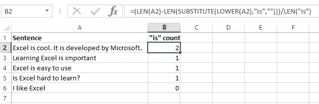
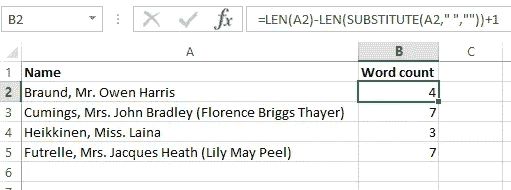
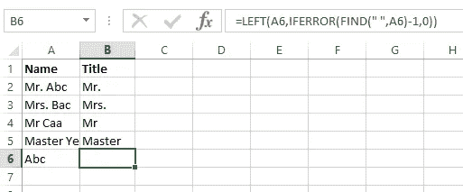
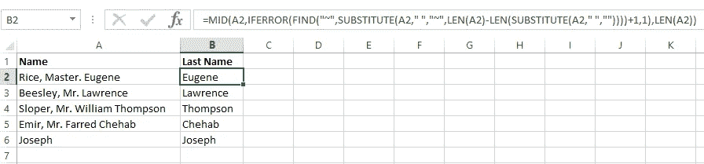
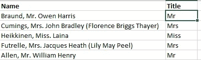
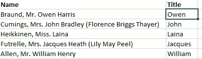
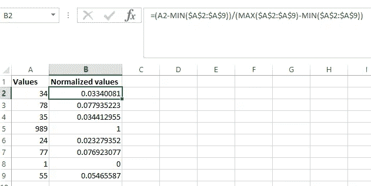
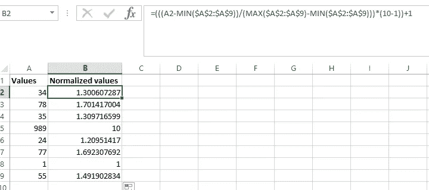
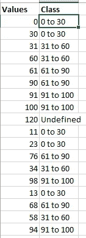

# Excel 中用于数据预处理的基本函数

> 原文：<https://towardsdatascience.com/essential-functions-in-excel-for-data-preprocessing-140f002f3ca?source=collection_archive---------12----------------------->

## 本文讨论了 Microsoft Excel 中用于数据预处理的几个基本函数以及几个示例。这些函数简化了数据预处理的过程。

*本文假设读者对 Excel 函数有基本的了解。*


照片由[米卡·鲍梅斯特](https://unsplash.com/@mbaumi?utm_source=unsplash&utm_medium=referral&utm_content=creditCopyText)在 [Unsplash](https://unsplash.com/s/photos/spreadsheet?utm_source=unsplash&utm_medium=referral&utm_content=creditCopyText) 上拍摄

对于非程序员来说，Microsoft Excel 是预处理和处理结构化数据的绝佳工具。Excel 有一些功能和技术可以使清理结构化数据变得更加容易。我们将讨论许多函数中的几个，并给出几个例子。在继续之前，我们将讨论几个基本函数，它们将是本文后面一个更大的公式的一部分。

# 基本功能

1.  **如果**

这个函数检查一个条件，并相应地返回一个指定的值。在下面的示例中，该函数检查条件“是 2 大于 3”。如果条件为真(事实并非如此),则函数返回“2 > 3 ”,否则返回“2 < 3”.

```
=IF(2>3,"2 > 3","2 < 3")
```

Since, 2 isn’t greater than 3, so the condition is FALSE and the value returned will be “2 < 3”.

2\. **IFERROR**

该函数有助于错误处理。在 Excel 中，最常见的错误是#N/A，#VALUE！，#DIV/0！，#REF！，#姓名？，#NUM！，不一而足。让我们来看一个错误处理的例子，我们试图用 1 除以 0。

```
=IFERROR(1/0,-1000)
```

在上面的例子中，我们将 1 除以 0。此计算返回一个错误(#DIV/0！).IFERROR 函数将计算/公式作为输入，如果计算结果不是错误，则返回计算结果。如果结果是错误的，则返回我们指定的值(在上例中为-1000)。

如果不处理，包含错误计算的公式也会返回错误。例如，如果我们添加 10 个数字(使用 SUM 函数),其中#DIV/0！是 10 个数字之一，那么 SUM 函数也将返回#DIV/0！。

3.**左**

这个函数返回字符串的前 n 个字符。我们来看一个例子，提取字符串“Excel”的前三个字符。该函数的输出将是“Exc”。

```
=LEFT("Excel",3)
```

**4。右侧**

这个函数返回字符串的最后 n 个字符。我们来看一个例子，提取字符串“Excel”的后三个字符。该函数的输出将是“cel”。

```
=RIGHT("Excel",3)
```

**5。中旬**

如果我们输入起始数和要返回的字符数，这个函数将返回一个字符串的子串。让我们看一个从字符串“Excel”中提取子字符串“xce”的例子。在本例中，起始数字是 2，要返回的字符数是 3。

```
=MID("Excel",2,3)
```

**6。找到**

此函数返回子字符串/字符在字符串中第一次出现的位置。我们来看一个例子，求子串“ce”在字符串“Excel”中的位置。该函数返回 3，因为它是第一个也是唯一一个“ce”出现的位置。

```
=FIND("ce","Excel")
```

查找功能还使用户能够控制搜索的起点。我们来看一个例子，找出“a”在“abca”中第二次出现的位置。我们将添加一个起点参数 2(因为我们想从搜索中排除第一个“a”)。该函数返回 4。

```
=FIND("a","abca",2)
```

FIND 中的搜索是区分大小写的，还有一个名为 search 的函数和 FIND 一样，但是它的搜索是不区分大小写的。查找和搜索函数返回#VALUE！如果在字符串中找不到指定的子字符串/字符，则出现错误。

**7。ISNUMBER**

如果给定的输入是一个数字，这个函数返回 TRUE，否则返回 FALSE。让我们看一个例子，在这个例子中，我们将“abc”和 123 输入到函数中。

```
=ISNUMBER("abc")
=ISNUMBER(123)
```

在上面的示例中，第一个公式返回 FALSE，因为“abc”不是数字。第二个公式返回 TRUE，因为 123 是一个数字。

**8。ISTEXT**

如果给定的输入是字符串/文本，该函数返回 TRUE，否则返回 FALSE。让我们看一个例子，在这个例子中，我们将“abc”和 123 输入到函数中。

```
=ISTEXT("abc")
=ISTEXT(123)
```

在上面的示例中，第一个公式返回 TRUE，因为“abc”是一个字符串/文本。第二个公式返回 FALSE，因为 123 是一个数字。

**9。替换**

此函数用替换字符串替换字符串中第 n 次出现的子字符串。此函数区分大小写，默认情况下“n”为 1。我们来看一个例子，将字符串“Excel 很酷”中的“Excel”替换为“MS Excel”。

```
=SUBSTITUTE("Excel is cool","Excel","MS Excel")
```

让我们看另一个例子，在字符串“Excel 很酷”中用“它”替换第二次出现的“Excel”。Excel 是微软开发的”。该公式返回“Excel 很酷。它是由微软开发的”。

```
=SUBSTITUTE("Excel is cool. Excel is developed by Microsoft","Excel","It",2)
```

**10。修剪**

这个函数从字符串中删除前导和尾随空格。

```
=TRIM(" a ") returns "a"
```

**11。计数**

该函数返回一组单元格中非空单元格的计数。

```
=COUNTA(A1:A10)
```

**12。COUNTBLANK**

该函数返回一组单元格中的空单元格数。此函数有助于查找列中缺失值的计数。

```
=COUNTBLANK(A1:A10)
```

**13。COUNTIF**

该函数返回一组单元格中指定值的计数。这对于查找被 999，-1000，-等值屏蔽的缺失值的计数很有用。等。让我们来看一个例子，计算一系列单元格中出现“-”的次数。我们还可以指定包含搜索条件的单元格地址，而不是“-”。

```
=COUNTIF(A1:A10,"-")
=COUNTIF(A1:A10,B1)
```

# 几个数据预处理示例

1.  **找出一个单词在一个字符串中出现的次数**

我们可能需要计算一个单词/字符在一个字符串中出现的次数。让我们看一个例子来计算单词“is”在字符串中出现的次数。



作者图片

```
=(LEN(A2)-LEN(SUBSTITUTE(LOWER(A2),"is","")))/LEN("is")
```

让我们将公式分解成几个部分，以便更好地理解它，并将其应用于上图的单元格 A2 中的名称。

*   LEN(A2)计算字符串的长度。这将返回 44。
*   LEN(SUBSTITUTE(LOWER(A2)，" is "，""))从字符串中删除单词" is "并计算其长度。这会返回 40。A2 中的字符串被转换为小写，以使替代函数不区分大小写。
*   我们从原始字符串的长度中减去不带“is”的字符串的长度。这给出了单词“is”在字符串中出现的次数(即 2)乘以单词“is”的长度(即 2)，因此，我们得到 2 * 2 = 4。因此，我们需要将结果除以搜索字符串的长度(即“is”的长度为 2)，最终得到 4 / 2 = 2。

**2。统计字符串中的单词数**

我们可能需要找出一个字符串中的单词数。让我们来看一个来自泰坦尼克号数据集的例子，来计算一个乘客名字中的单词数。



作者图片

```
=LEN(A2)-LEN(SUBSTITUTE(A2," ",""))+1
```

让我们将公式分解成几个部分，以便更好地理解它，并将其应用于上图的单元格 A2 中的名称。

*   LEN(A2)计算字符串的长度。这将返回 23。
*   LEN(SUBSTITUTE(A2，" "，""))从字符串中删除空格，并计算字符串的长度。这会返回 20。
*   我们从原始字符串的长度中减去不带空格的字符串的长度。这给了我们字符串中的空格数，即 3。将空格数加 1 得到单词数，即 4。

**3。提取字符串的第一个单词**

在某些情况下，我们可能需要从现有特征创建附加特征。让我们看一个从人名中提取人名的例子。我们假设一个名字的第一个单词就是标题。没有空格的名字被认为没有头衔。



作者图片

```
=LEFT(A6,IFERROR(FIND(" ",A6)-1,0))
```

让我们将公式分解成几个部分，以便更好地理解它，并将其应用于上图的单元格 A2 中的名称。

*   FIND 返回名称中第一个空格的位置，即 4。我们从位置中减去 1 来排除空间本身。现在变成了 3。
*   如果名称中没有空格，IFERROR 将处理 FIND 返回的错误。如果名称没有空格，IFERROR 返回 0。在这种情况下，名称中有一个空格。因此，FIND 不会返回任何错误。
*   LEFT 返回 FIND 返回的前 n 个字符，即前 3 个字符。如果名称中没有空格(如上图中的单元格 A6 ),则 IFERROR 返回 0，LEFT 返回前 0 个字符，即 nothing。

**4。提取一个字符串的最后一个单词**

让我们看一个从名字中提取姓氏的例子。我们假设一个名字的最后一个字是姓氏。当名称中没有空格时，名称将按原样返回。



作者图片

```
=MID(A2,IFERROR(FIND("~",SUBSTITUTE(A2," ","~",LEN(A2)-LEN(SUBSTITUTE(A2," ",""))))+1,1),LEN(A2))
```

把公式分解成几部分来解释可能会使事情变得复杂。所以，我们只讨论其中涉及的过程。

*   通过查找字符串中的空格数，可以找到空格最后出现的位置。
*   最后一个空格被替换为“~”(可以是不属于字符串的任何字符)。
*   我们找到了字符串中“~”的位置，这又是空格在字符串中最后一次出现的位置。加上 1 会使位置增加 1，因此不包括空格。
*   如果字符串中没有空格，IFERROR 返回原始字符串的长度。
*   MID 返回从最后一个空格开始直到字符串结束的子字符串。由于要提取的字符数量未知，我们可以给出最大可能数量，即原始字符串的长度。

**5。提取字符串的第 n 个单词**

让我们看一个例子，从 Titanic 数据集中的人名中提取人名。名字的第二个字是头衔。因为第二个单词是大多数名称中的标题，所以建议使用 Excel 的文本到列功能。然而，我们也将讨论公式。



作者图片

```
=SUBSTITUTE(LEFT(MID(A2,IFERROR(FIND("~",SUBSTITUTE(A2," ","~",1))+1,1),LEN(A2)),IFERROR(FIND(" ",MID(A2,IFERROR(FIND("~",SUBSTITUTE(A2," ","~",1))+1,1),LEN(A2)))-1,LEN(A2))),".","")
```

在 SUBSTITUTE(A2，" "，" ~ "，1)中用' n-1 '替换 1，提取字符串的' n '个单词。在上面的例子中，我们提取了字符串的第二个单词，所以它是 1。下面的公式提取字符串的第三个单词。

```
=SUBSTITUTE(LEFT(MID(A2,IFERROR(FIND("~",SUBSTITUTE(A2," ","~",2))+1,1),LEN(A2)),IFERROR(FIND(" ",MID(A2,IFERROR(FIND("~",SUBSTITUTE(A2," ","~",2))+1,1),LEN(A2)))-1,LEN(A2))),".","")
```



作者图片

把公式分解成几部分来解释可能会使事情变得复杂。所以，让我们只讨论提取第 n 个单词的过程。

*   最后出现的“n-1”个空格被替换为“~”(可以是不属于字符串的任何字符)。
*   我们找到了字符串中“~”的位置，这又是空格在字符串中最后一次出现的位置。加上 1 会使位置增加 1，因此不包括空格。
*   如果字符串中没有空格，IFERROR 返回原始字符串的长度。
*   MID 返回从最后一个空格开始直到字符串结束的子字符串。由于要提取的字符数量未知，我们可以给出最大可能数量，即原始字符串的长度。
*   提取结果字符串的第一个单词，如示例 3 所示。
*   替换句点(。)在标题的末尾加上一个空字符串(" ")。

**6。最小-最大标准化**

最小-最大归一化对数值特征进行归一化，使其保持在范围[0，1]内。



作者图片

```
=(A2-MIN($A$2:$A$9))/(MAX($A$2:$A$9)-MIN($A$2:$A$9))
```

我们可以使用下面的公式在范围[new_min，new_max]内对数据进行归一化。在下面的公式中，new_max = 10，new_min = 1。因此，数据将被归一化，以使它们保持在范围[1，10]内。

```
=(((A2-MIN($A$2:$A$9))/(MAX($A$2:$A$9)-MIN($A$2:$A$9)))*(10-1))+1
```



作者图片

7 .**。离散化**

离散化将数值特征转换为分类特征。它将数字特征转换成类区间，如 0–10、11–20 等。一旦确定了类间隔/箱，我们就可以使用 Excel 公式来离散化数据。在下面的例子中，我们将数值离散化为 4 个类区间，即“0 到 30”、“31 到 60”、“61 到 90”和“91 到 100”。任何大于 100 的值都被指定为“未定义”类。

```
=IF(AND(A2>90,A2<=100),"91 to 100",IF(A2<=30,"0 to 30",IF(AND(A2>=31,A2<=60),"31 to 60",IF(AND(A2>=61,A2<=90),"61 to 90","Undefined"))))
```



作者图片

这是一些使用 Excel 函数的数据预处理技术。还有其他预处理/清理技术可以在不使用函数的情况下在 Excel 中完成，这些技术不在本文中讨论。如果你有编程背景，建议使用 Python 或 r 等编程语言，对于非程序员来说，Excel 是处理结构化数据的最佳选择之一。