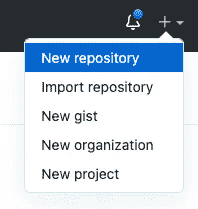
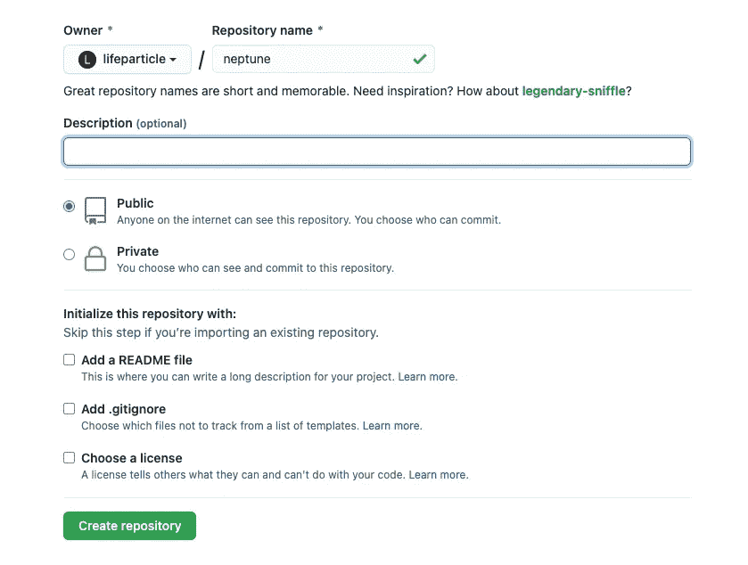

# 每个程序员都应该知道的基本 Git 命令

> 原文：<https://towardsdatascience.com/essential-git-commands-every-programmer-should-know-fe96feb570ce?source=collection_archive---------16----------------------->

## 学习 Git 的基础知识


照片由 [XPS](https://unsplash.com/@xps?utm_source=medium&utm_medium=referral) 在 [Unsplash](https://unsplash.com?utm_source=medium&utm_medium=referral) 上拍摄

在我们进入 Git 之前，让我们简单地讨论一下版本控制。版本控制或源代码控制系统赋予我们协作、管理和跟踪代码历史的能力。该系统将元数据存储在一个称为存储库的数据结构中，这允许我们使用像 **revert** 这样的特性来撤销代码。因此，它使软件开发更容易和更快。有两种类型的版本控制系统，集中式和分布式。所以，Git 是一个分布式版本控制系统。它是 Linus Torvalds 在 2005 年创建的最常用的源代码控制系统之一。通过这篇文章，您将了解一些常用的 Git 命令。

# 设置

对于这个设置，我将使用 [Git 命令行工具](https://git-scm.com/downloads)。此外，有多个 [Git GUI 客户端](https://git-scm.com/downloads/guis)可用于不同的操作系统。我将把 [GitHub](https://github.com/) 用于存储库托管服务，它带有大量很酷的[特性](https://github.com/features)。

# Git 仓库

有两种方法可以启动 Git 存储库，本地和远程。

## 本地知识库

我们可以使用 Git 命令`git init`将本地目录转换成 Git 存储库。本地 repo 的 Git 工作流将创建一个本地 repo，并最终将其推送到一个远程存储库，以便与其他人协作。

```
[start] the working directory  → git add → staging area → git commit →
local repository → git push → remote repository [end]
```

现在，我们可以使用 Git 命令`git pull`从远程 repo 中提取任何更改来更新我们的本地存储库。

```
[end] the working directory ← git pull ← remote repository [start]
```

## Git 命令

首先，让我们创建一个本地存储库。

```
cd Desktop
git init neptune
cd neptune
touch README.md
echo TODO > README.md
git add README.md
git commit -m "README"
git push
```

如果要将现有目录转换为本地存储库，请使用以下方法。

```
cd Desktop
cd neptune
git init
touch README.md
echo TODO > README.md
git add README.md
git commit -m "README"
git push
```

**git 初始化**

`git init`命令将创建一个`.git`目录，您可以使用下面的命令看到这个目录。它还将创建一个默认的或称为 master 的主分支。

```
ls -a
# .         ..        .git      README.md
```

Git 管理`.git`目录中的源代码控制。

**git 添加**

```
git add fileName
git add *
```

它会将一个或多个文件添加到临时区域。

**git 提交**

```
git commit -m "commit message"
```

它会将一个或多个文件提交到本地存储库。如果 Git 已经在跟踪您的文件，您可以使用一个命令添加和提交。所以它对修改过的文件有效，但对新文件无效。

```
echo 1\. TODO_1 >> README.md
git commit -am "add and commit"
```

**git 推送**

现在访问 [GitHub](https://github.com/) 来创建一个[远程存储库](https://github.com/lifeparticle/neptune)，这样我们就可以与其他人协作。



在 GitHub 上创建一个远程资源库

```
# add a remote repository
# where the origin is the remote location name
# one-time setup
git remote add origin git@github.com:lifeparticle/neptune.git

# rename the current branch into main, one-time setup
git branch -M main

# push all the local changes to the repository
# the -u parameter is needed only for the first push
git push -u origin main
```

## 远程存储库

我们可以使用 Git 命令`git clone`获得一个现有的 Git 存储库。远程 repo 的 Git 工作流是将一个远程 repo 从 GitHub 克隆到我们的本地机器上。

```
[end] the working directory ← git clone ← remote repository [start]
```

现在，我们可以像以前一样将本地更改推送到远程存储库。

```
[start] the working directory  → git add → staging area → git commit →
local repository → git push → remote repository [end]
```

## Git 命令

首先，让我们删除之前创建的本地存储库。从机器中移除文件夹时，请务必仔细检查。

```
sudo rm -r neptune
```

**git 克隆**

首先，从 GitHub 克隆远程存储库。

```
git clone git@github.com:lifeparticle/neptune.git
```

因为我们有一个链接到远程存储库的本地存储库，所以我们可以添加、提交并最终将我们的更改推送到远程存储库。此外，通过使用 Git 命令`git pull`，我们可以从远程 repo 中提取任何更改来更新我们的本地存储库。

# 其他重要的 Git 命令

下面是一些更常用的基本 Git 命令。

## 从远程存储库中获取所有最近的更改

我们可以使用`git pull`命令将任何更改合并到我们的本地存储库中。在我们推送之前，这一步是必要的，以避免任何推送拒绝，因为在我们上次推送之后，另一个合作者可能已经对远程存储库进行了更改。对于这个例子，我对 GitHub 的 README.md 进行了修改。

```
git pull
```

## 显示分支历史

我们可以使用`git log`来查看分支历史。在这里，我们正在查看主分支的历史。

```
git log main
```

## 显示存储库的当前状态

`git status`命令将显示我们当前在哪个分支上。如我们所见，我们在主干道上。此外，它还会显示与存储库相关的其他数据。

```
git status
# On branch main
# nothing to commit, working tree clean
```

## 创建新分支

我们可以使用`git branch`来创建一个新的分支。

```
git branch dev-007
```

## 切换到另一个分支

我们可以用`git checkout`切换到一个分支。

```
git checkout dev-007
```

## 删除分支

我们可以使用`git branch -d`删除一个分支。但首先，你需要切换到不同的分支。

```
git checkout main
git branch -d dev-007
```

## 显示文件之间的差异

我们可以使用`git diff`命令来比较文件之间的差异。

```
echo 4\. TODO_4 >> README.md
git diff
```

## 在存储库中移动文件

我们可以使用`git mv`命令在存储库中移动文件。

```
echo Hello world > index.html
git add .
git commit -m "index file"
mkdir web
git mv index.html web
git commit -m "move index file"
```

## 从存储库中删除文件

我们可以使用`git rm`命令从存储库中删除任何不必要的文件。

```
echo 1\. Make space robot > todo_today.txt
git add .
git commit -m "todo"
git rm todo_today.txt
git commit -m "remove todo file"
```

我希望看完这篇文章后，你已经对 Git 有了基本的了解。Git 是软件开发中必不可少的一部分，所以任何程序员都必须尽早了解和学习 Git 版本控制。只管做 Git！

# 相关职位

[](/17-terminal-commands-every-programmer-should-know-4fc4f4a5e20e) [## 每个程序员都应该知道的 17 个终端命令

towardsdatascience.com](/17-terminal-commands-every-programmer-should-know-4fc4f4a5e20e) [](/the-ultimate-markdown-cheat-sheet-3d3976b31a0) [## 终极降价备忘单

### 写一篇精彩的自述

towardsdatascience.com](/the-ultimate-markdown-cheat-sheet-3d3976b31a0)