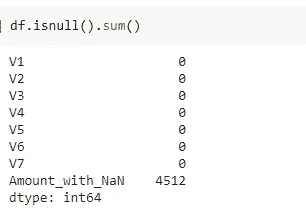
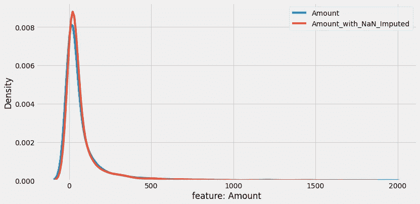
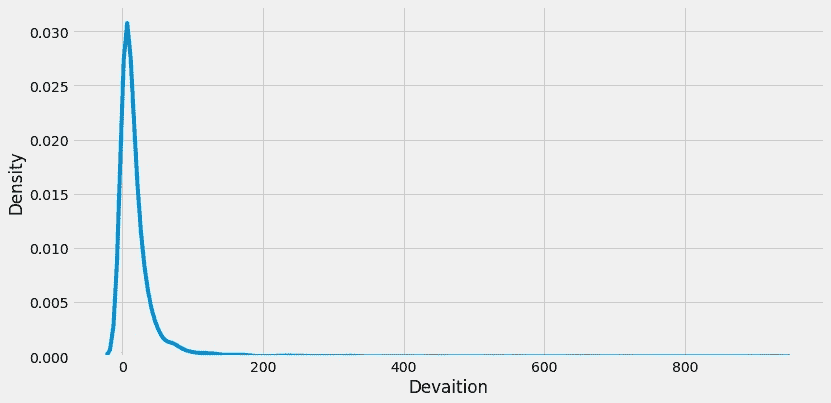
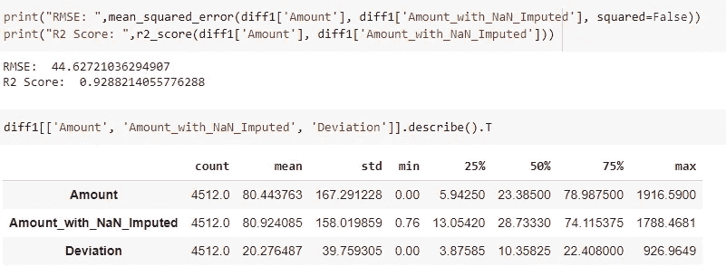
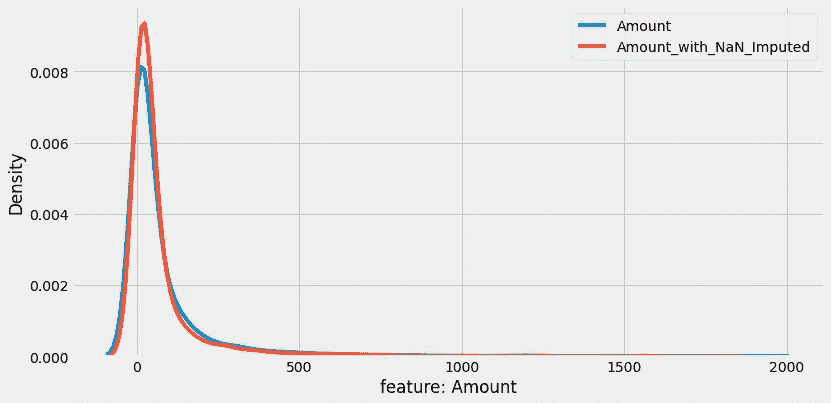
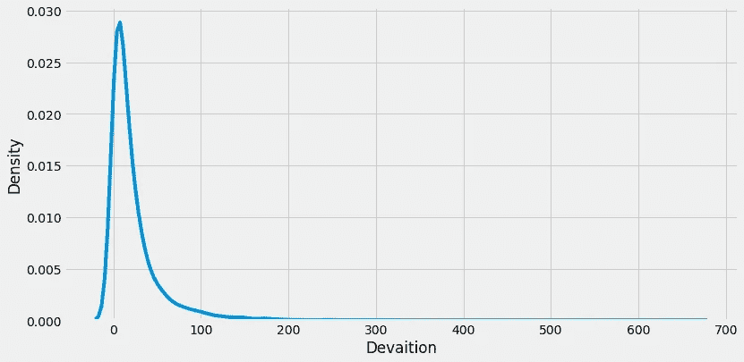
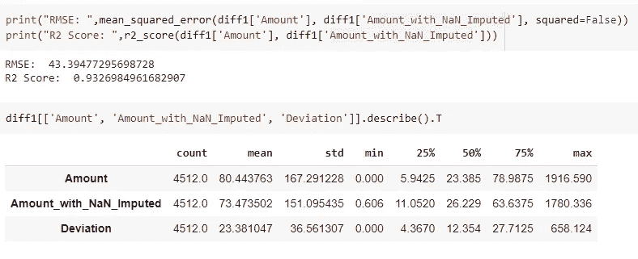

# 在一行 Python 代码中估算缺失值的基本指南

> 原文：<https://towardsdatascience.com/essential-guide-to-impute-missing-values-in-a-single-line-of-python-code-d495d40d0c84?source=collection_archive---------27----------------------->

## 使用随机森林和基于 k-NN 的插补预测缺失数据


图片来自[pix abay](https://pixabay.com/?utm_source=link-attribution&amp;utm_medium=referral&amp;utm_campaign=image&amp;utm_content=693870)Willi Heidelbach

现实世界中的数据集通常会有许多缺失记录，这可能是由于数据损坏或未能记录值而导致的。为了训练健壮的机器学习模型，在特征工程流水线期间，丢失值的处理是必不可少的。

有多种插补策略可用于对分类、数字或时间序列特征的缺失记录进行插补。你可以参考我以前的一篇文章，我已经讨论了处理数据集中缺失记录的 7 种策略或技术。

在本文中，我们将讨论一个开源 Python 库— ***missingpy*** 的实现，它使用基于随机森林和 k-NN 的模型来预测数字特征中的缺失值。

# 缺少副本:

missingpy 是一个开源 python 库，它使用基于预测的插补策略来插补缺失数据。它有一个类似于 scikit-learn 的 API，所以开发人员可以找到熟悉的界面。截至目前，missingpy 仅支持基于随机森林和 k-NN 的插补策略。

> 我们将使用 Kaggle 的[信用卡欺诈检测数据集中的一些特征来估算缺失的记录，并比较 missingpy 库的性能。](https://www.kaggle.com/mlg-ulb/creditcardfraud)

## 安装:

missingpy 可以从 PyPI 安装，使用:

```
**pip install missingpy**
```

`KNNImputer()`和`MissForest()`是 missingpy 包中的两个 API。

# 用法:

我们将仅使用信用卡检测数据集中的 8 个特征和 25，000 个实例进行进一步演示。由于数据集没有缺失记录，我们将创建一个`‘Amount’`要素的副本，并用 NaN 值替换实际值。

准备好数据后，`‘Amount’`特征`‘Amount_with_NaN’`的副本在总共 25000 条记录的样本数据中有 4512 条空记录。



(图片由作者提供)，缺少记录编号

## MissForest 基于森林的随机插补:

missingpy 附带了一个基于随机森林的插补模型，可以使用`**MissForest()**`函数在一行 Python 代码中实现。

```
**from missingpy import MissForest****imputer = MissForest()
df_new = imputer.fit_transform(df)**
```

实例化 MissForest 模型后，拟合具有缺失记录的数据集。该方法返回数据集和估算值。

现在，让我们将估算值与“金额”特征的真实值进行比较，并查看估算的偏差。



(图片由作者提供)，**左:**实际金额特征与估算值的 PDF 图，**右:**实际值与预测值偏差分布的 PDF；对于 MissForest 估算器

从上面的情节可以得出结论，

*   左图:我们可以观察到预测缺失数据和实际数量有相似的 PDF 图。
*   右图:实际值和预测缺失记录之间的偏差的 PDF 图是倾斜的，峰值为 0。我们有很长的尾巴，代表很少的预测偏离超过 100 个值。

现在，让我们来看一些统计数字，以观察缺失森林插补的表现。



(图片由作者提供)、实际数量的统计数字、使用 MissForest 预测的缺失数量及其偏差

## KNNImputer —基于 kNN 的插补:

KNNImputer 的实现与 MissForest 插补的实现相同。现在让我们直接跳到实现和生成 PDF 图。

```
**from missingpy import KNNImputer****imputer = KNNImputer()
df_new = imputer.fit_transform(df)**
```



(图片由作者提供)，**左:**实际金额特征与估算值的 PDF 图，**右:**实际值与预测值之间的偏差分布的 PDF；对于 KNNImputer



(图片由作者提供)、实际数量的统计数字、使用 KNNImputer 预测的缺失数量及其偏差

# 结论:

MissForest(基于随机森林的插补)和 KNNImputer(基于 k-NN 的插补)的表现几乎相似，给出了类似的插补值和实际值偏差的统计数字。就 RMSE 指标而言，KNNImputer 似乎表现得更好一些。

missingpy 库是一个非常方便的工具，可以在几行 Python 代码中预测丢失的数据。该包的 API 实现类似于 scikit-learn 的 API 实现，这使得开发人员熟悉该接口。

> 阅读我以前的文章，了解处理数据集中缺失值的 7 种技巧

</7-ways-to-handle-missing-values-in-machine-learning-1a6326adf79e>  

# 参考资料:

[1]缺少文件副本:[https://pypi.org/project/missingpy/](https://pypi.org/project/missingpy/)

> 感谢您的阅读