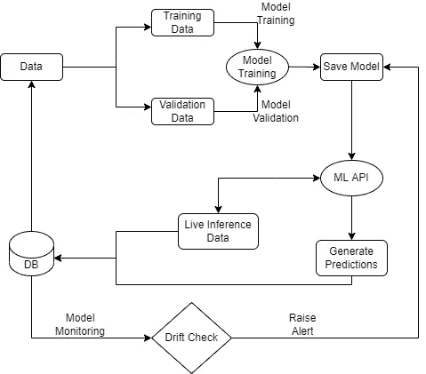

# 生产中机器学习模型监控的基本指南

> 原文：<https://towardsdatascience.com/essential-guide-to-machine-learning-model-monitoring-in-production-2fbb36985108?source=collection_archive---------20----------------------->

## 检测数据漂移的技术

图片由 [Mediamodifier](https://pixabay.com/users/mediamodifier-1567646/?utm_source=link-attribution&amp;utm_medium=referral&amp;utm_campaign=image&amp;utm_content=3078546) 来自 [Pixabay](https://pixabay.com/?utm_source=link-attribution&amp;utm_medium=referral&amp;utm_campaign=image&amp;utm_content=3078546)

模型监控是端到端数据科学模型开发管道的重要组成部分。该模型的稳健性不仅取决于特征工程数据的训练，还取决于该模型在部署后的监控程度。

通常，机器学习模型的性能会随着时间的推移而下降，因此检测模型性能下降的原因至关重要。其主要原因可能是独立或/和从属特征的漂移，这可能违反模型的假设和数据分布。

在本文中，我们将讨论各种技术，以检测数据漂移独立或独立的特征，在生产推断数据。

# 为什么需要模型监控？

(图片由作者提供)、模型训练、验证和监控工作流

模型的性能随着时间的推移而下降有多种原因:

*   推理模型性能
*   推断数据分布不同于基线数据分布
*   业务 KPI 的变化

上面提到的是模型性能随时间下降的主要原因。在部署之后，需要监控已部署的模型，以测量模型性能和数据分布。在确定了模型衰减的原因之后，用更新的数据集重新训练现有的模型。

# 如何进行模型监控？

推断数据的实际目标类标签通常不会在前面出现。因此，很难使用标准的评估指标(如精确度、召回率、准确度、日志损失等)来衡量模型的性能。

有时，直到实际的目标类标签可用需要时间。但是也可以通过观察数据分布来衡量模型的稳健性。有各种技术来测量独立和从属特征中的数据漂移。

# 测量独立特征的漂移:

有各种方面来监控独立特征的漂移。

## 1.监控每个特征的分布:

如果我们观察到推理数据的工程特征或原始特征的分布发生了变化，我们可以预期模型性能会下降。测量偏差的一些流行的统计技术有:

*   KL (Kullback Leibler)散度检验
*   科尔莫戈罗夫-斯米尔诺夫试验
*   卡方检验

## 2.监控统计特征:

我们需要监控推断和基线数据的统计特征，以观察数据集中的差异。一些统计特征是:

*   可能值的范围(分位数、平均值、最大值、最小值)
*   缺失值或空值的数量
*   数字特征的直方图分布
*   分类特征的不同值

## 3.监控多元特征的分布:

机器学习模型开发特征之间的一些交互来进行预测。如果特征之间的模式或分布发生变化，则可能导致模型性能下降。检测多元特征分布的技术是:

*   克拉默 Phi 试验

# 测量从属特征的漂移:

推理目标类的相关特征(目标标签)可能不会在生产中提前出现。一旦存在相关特征，就有各种技术来测量漂移，并得出模型性能是否恶化的结论。

## 1.目标类别的分布:

对于分类任务，目标类标签本质上是分类的。其思想是比较推理数据和基础数据之间目标类标签的分布。

对于回归任务，直方图或连续目标标签的统计特征可用于测量数据中的漂移。

## 2.监控推理模型性能:

一旦实际的目标类标签可用，那么可以通过评估和比较模型在标准度量上的性能来检测模型漂移。如果模型度量显示少于预期的数字，则需要重新训练模型。

# 结论:

在本文中，我们讨论了在产品中部署模型之后，检测推理数据集中的偏差的各种技术。随着时间的推移，模型漂移可能导致模型性能恶化。因此，在生产后监控模型的性能是很重要的。

# 参考资料:

[1] Vivek Kumar YouTube 播放列表:[https://www.youtube.com/playlist?list = PLM pree 1k byuk 348 hs 7w 2 ezuywtgcsn 54j](https://www.youtube.com/playlist?list=PLmpREe1kbYUk348hS7W2EzUyWtgCSN54J)

*喜欢这篇文章吗？成为* [*中等会员*](https://satyam-kumar.medium.com/membership) *继续无限制学习。如果你使用下面的链接，我会收到你的一小部分会员费，不需要你额外付费。*

 [## 加入我的推荐链接-萨蒂扬库马尔媒体

### 作为一个媒体会员，你的会员费的一部分会给你阅读的作家，你可以完全接触到每一个故事…

satyam-kumar.medium.com](https://satyam-kumar.medium.com/membership) 

> 感谢您的阅读