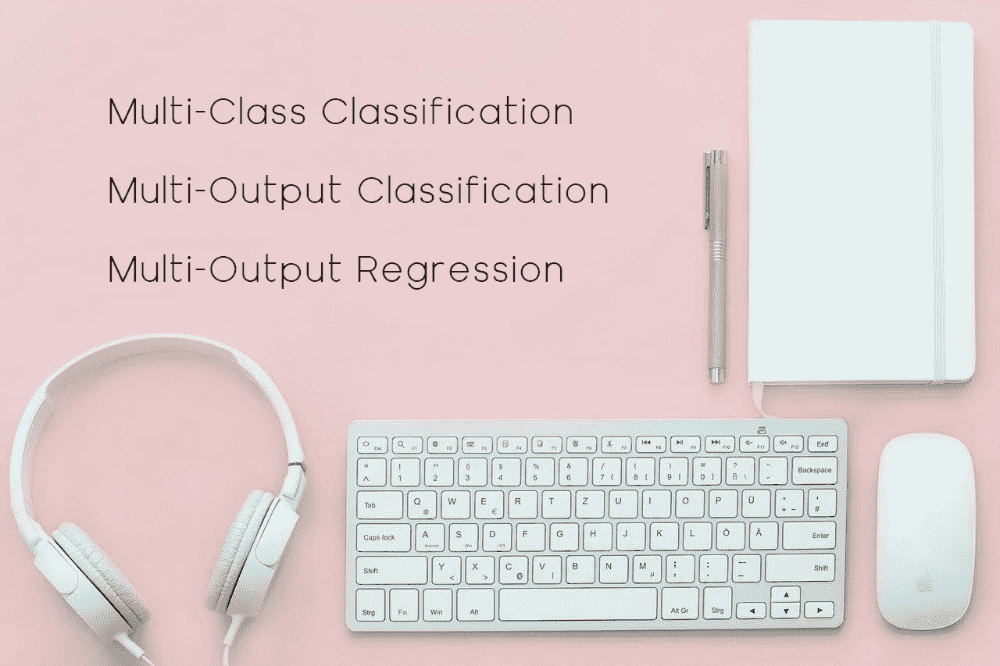
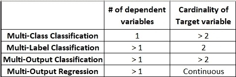
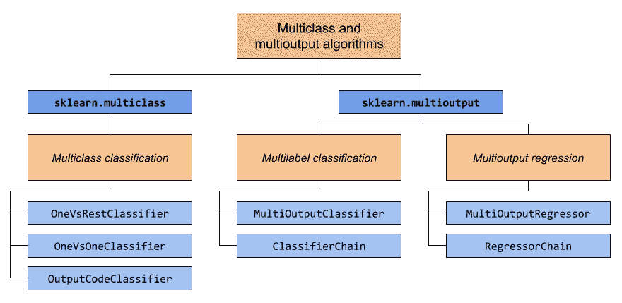

# Python 中多类和多输出算法的基本指南

> 原文：<https://towardsdatascience.com/essential-guide-to-multi-class-and-multi-output-algorithms-in-python-3041fea55214?source=collection_archive---------9----------------------->

## 如何训练多学习任务的 ML 模型

图片由 [LUM3N](https://pixabay.com/users/lum3n-1066559/?utm_source=link-attribution&amp;utm_medium=referral&amp;utm_campaign=image&amp;utm_content=2303851) 来自 [Pixaba](https://pixabay.com/?utm_source=link-attribution&amp;utm_medium=referral&amp;utm_campaign=image&amp;utm_content=2303851)

人们使用的大多数分类或回归涉及一个目标类别标签(因变量)和多个独立特征。一些机器学习分类或回归任务可能有两个或两个以上的因变量。标准的机器学习算法，如决策树、逻辑回归、SVM 等，并不是为预测多个输出而设计的。

在本文中，我们将讨论如何训练机器学习模型来预测分类和回归任务的多输出。在实现算法之前，让我们讨论一下什么是多类多输出算法。

# 多类多输出算法？

对于分类和回归任务，存在 1 个因变量或 1 个以上因变量的可能性。根据因变量的数量，我们可以定义多类和多输出算法:

(图片由作者提供)，基于目标类标签的问题陈述类型

Scikit-learn 包提供了各种函数来实现多类分类、多输出分类和多输出回归算法。

([来源](https://scikit-learn.org/stable/modules/multiclass.html))，sci kit-多类和多输出实现的学习函数

sklearn 包中的两个模块 multiclass 和 multioutput 涵盖了开发多学习任务模型的所有实现。上面提到的图表演示了可用于训练相应数据集的元分类器。

# 多类分类:

对于多类分类任务，数据有 1 个因变量，目标类有 2 个以上基数。[鸢尾物种数据集](https://www.kaggle.com/uciml/iris)是多类数据集的一个例子。大多数机器学习算法仅限于 2 类分类，无法处理多类数据集。scikit-learn 包中的多类模型实现了 3 个函数来训练这样的数据:

*   [One-vs-rest 分类器](https://scikit-learn.org/stable/modules/generated/sklearn.multiclass.OneVsRestClassifier.html#sklearn.multiclass.OneVsRestClassifier):这种策略适合每个类一个二元分类器。对于每个估计量，分类器与所有其他类别相匹配。
*   [一对一分类器](https://scikit-learn.org/stable/modules/generated/sklearn.multiclass.OneVsOneClassifier.html#sklearn.multiclass.OneVsOneClassifier):这种策略适合每对类一个二元分类器。在预测时，选择获得最多投票的一对类别。
*   [输出代码分类器](https://scikit-learn.org/stable/modules/generated/sklearn.multiclass.OutputCodeClassifier.html#sklearn.multiclass.OutputCodeClassifier):该策略将每个目标类转换成二进制代码。一个二进制分类器适用于二进制代码的每一位。使用这种策略，用户可以控制分类器的数量。

# 多标签分类:

对于多标签分类，数据有 1 个以上的独立变量(目标类)，每个类的基数应为 2(二进制)。 [Stackoverflow 标签预测数据集](https://www.kaggle.com/ajaysh/stackoverflow-tag-prediction/data)是多标签分类问题的一个例子。在这种类型的分类问题中，有不止一个输出预测。

大多数分类机器学习算法不能够处理多标签分类。需要使用机器学习算法的包装器来训练多标签分类数据。Scikit-learn 提出了两种包装器实现:

*   [MultiOutputClassifier](https://scikit-learn.org/stable/modules/generated/sklearn.multioutput.MultiOutputClassifier.html#sklearn.multioutput.MultiOutputClassifier) :该策略适合每个目标一个二元分类器。该包装器可用于不支持多目标分类的估计器，如[逻辑回归](https://scikit-learn.org/stable/modules/generated/sklearn.linear_model.LogisticRegression.html)。
*   [链式分类器](https://scikit-learn.org/stable/modules/generated/sklearn.multioutput.ClassifierChain.html#sklearn.multioutput.ClassifierChain):当分类目标相互依赖时，可以使用该策略。在这种策略中，二元估计器链是用独立特征以及最后一个估计器的预测来训练的。

# 多输出回归:

多输出回归类似于多标签分类，但这仅适用于回归任务。在这种条件问题语句中，数据有 1 个以上的连续目标标签。一些回归算法，如[线性回归](https://scikit-learn.org/stable/modules/generated/sklearn.linear_model.LinearRegression.html)和 [K-NN 回归器](https://scikit-learn.org/stable/modules/generated/sklearn.neighbors.KNeighborsRegressor.html)处理多输出回归，因为它们本质上实现了直接回归器。

对于不处理多输出回归的回归算法，scikit-learn 包提供了可用于此类任务的包装器:

*   [MultiOutputRegressor](https://scikit-learn.org/stable/modules/generated/sklearn.multioutput.MultiOutputRegressor.html#sklearn.multioutput.MultiOutputRegressor) :这个策略适合每个目标类的一个回归估计量。这种策略可用于不处理多输出回归的回归估计器，如 [LinearSVC](https://scikit-learn.org/stable/modules/generated/sklearn.svm.LinearSVC.html) 。
*   [RegressorChain](https://scikit-learn.org/stable/modules/generated/sklearn.multioutput.RegressorChain.html#sklearn.multioutput.RegressorChain) :当回归目标特性相互依赖时，可以使用该策略。在回归量的这个策略链中，估计量是用独立的连续特征以及最后一个估计量的预测来训练的。

# 结论:

在本文中，我们讨论了 scikit-learn 包提供的用于训练多学习任务模型的功能。它提供了可与分类和回归估计器一起使用的包装器，用于训练多类分类、多标签分类和多输出回归问题。

# 参考资料:

[1]sci kit-学习文档:[https://scikit-learn.org/stable/modules/multiclass.html](https://scikit-learn.org/stable/modules/multiclass.html)

*喜欢这篇文章吗？成为* [*中等会员*](https://satyam-kumar.medium.com/membership) *继续无限制学习。如果你使用下面的链接，我会收到你的一小部分会员费，不需要你额外付费。*

 [## 加入我的推荐链接-萨蒂扬库马尔媒体

### 作为一个媒体会员，你的会员费的一部分会给你阅读的作家，你可以完全接触到每一个故事…

satyam-kumar.medium.com](https://satyam-kumar.medium.com/membership) 

> 感谢您的阅读