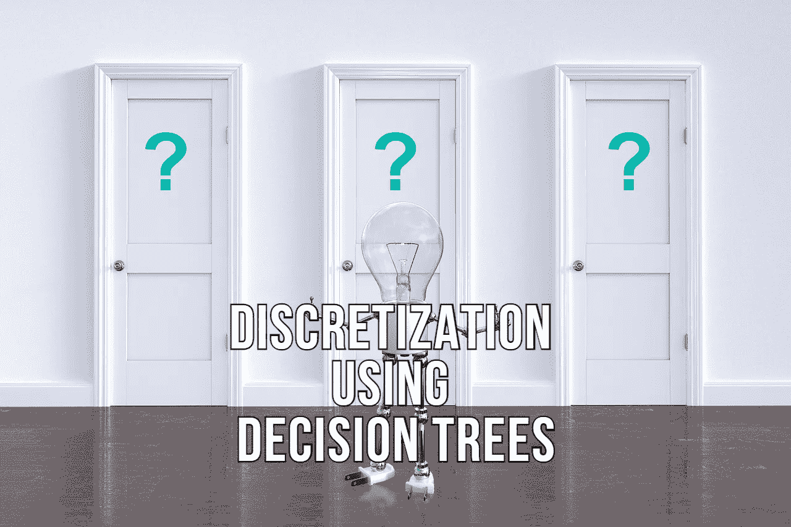
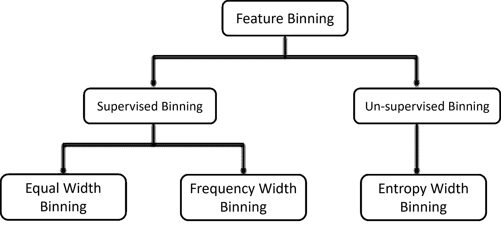
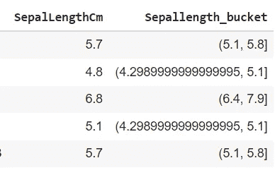
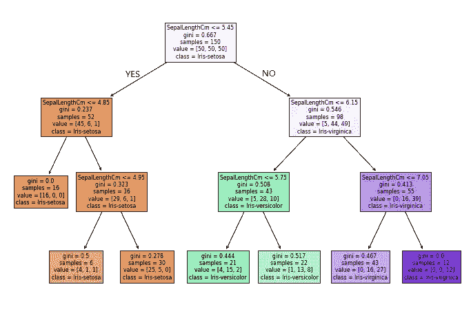
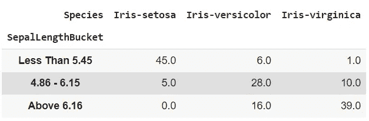

# 使用决策树模型执行功能宁滨的基本指南

> 原文：<https://towardsdatascience.com/essential-guide-to-perform-feature-binning-using-a-decision-tree-model-90bcc66d61f9?source=collection_archive---------9----------------------->

## 如何为数字特征宁滨找到最佳存储桶



图片来自 [Pixabay](https://pixabay.com/?utm_source=link-attribution&amp;utm_medium=referral&amp;utm_campaign=image&amp;utm_content=3839456) 的[皮特·林福思](https://pixabay.com/users/thedigitalartist-202249/?utm_source=link-attribution&amp;utm_medium=referral&amp;utm_campaign=image&amp;utm_content=3839456)

特征工程是机器学习模型开发管道的重要组成部分。机器学习模型只理解数字向量，因此数据科学家需要设计这些特征来训练一个健壮的机器学习模型。

宁滨或离散化用于将连续变量或数值变量编码成分类变量。有时，数字或连续特征不适用于非线性模型。因此，连续变量的宁滨会在数据中引入非线性，并有助于提高模型的性能。

有各种技术来执行特征宁滨，包括宁滨的**非监督和监督方法。**



(图片由作者提供)，宁滨表演技巧

阅读我以前的[文章](/feature-engineering-deep-dive-into-encoding-and-binning-techniques-5618d55a6b38)，深入了解特性编码策略

</feature-engineering-deep-dive-into-encoding-and-binning-techniques-5618d55a6b38>  

在本文中，我们将讨论使用决策树模型绑定数字特征的最佳策略之一。

# 宁滨的特色是什么？

特征宁滨指的是将数字或连续特征转换或存储为分类变量的技术。

Pandas 提出了一个`**pd.qcut(x, q)**` 函数，该函数将连续特征分成`**q**`个桶，具有相等的百分位数差异。

```
**df['Sepallength_quartle'] = pd.qcut(df['SepalLengthCm'], 4)**
```



(图片由作者提供)，分桶结果示例

或者也可以使用`**pd.cut(x, bins, labels)**` 函数，并传递自定义的箱柜和标签进行装箱。

在计算仓位时，这些类型的分桶策略不涉及目标变量。因此，箱夜与目标变量没有任何关联。特征宁滨的目的是在数据中引入非线性，这可以进一步改善模型的性能。

# 想法:

通过执行随机、计数或基于四分位数的存储桶，无法实现功能宁滨的主要目的。想法是使用决策树模型找到最佳的桶或箱集合，该模型将涉及与目标变量的相关性。

> 数据来源:我们将对从 [Kaggle](https://www.kaggle.com/uciml/iris) 下载的虹膜数据集中的“萼片长度”特征进行宁滨处理。

按照以下步骤确定最佳“萼片长度”箱:

*   用特征“萼片长度”作为训练数据，用“物种”作为目标变量，训练一个最适合的决策树模型。

```
**X = df[['SepalLengthCm']]
y = df['Species']****params = {'max_depth':[2,3,4], 'min_samples_split':[2,3,5,10]}
clf_dt = DecisionTreeClassifier()
clf = GridSearchCV(clf_dt, param_grid=params, scoring='accuracy')
clf.fit(X, y)****clf_dt = DecisionTreeClassifier(clf.best_params_)**
```

*   使用 Graphviz 绘制决策树。

```
**tree.plot_tree(clf_dt, filled=True, feature_names = list(X.columns), class_names=['Iris-setosa', 'Iris-versicolor', 'Iris-virginica'])
plt.show()**
```

*   通过观察图节点来决定特征桶。



(图片由作者提供)，使用 Graphviz 的决策树表示

从决策树模型的上述图形表示中，我们可以得出结论，鸢尾属的大多数点的萼片长度≤ 5.45，而鸢尾属的大多数数据点的萼片长度> 6.15。大多数鸢尾-杂色花数据点的萼片长度在 4.86-6.15 之间。

利用上述观察，我们可以准备桶来收集“萼片长度”连续特征。

```
bins = [0, 5.45, 6.15, 10]
labels = ['Less Than 5.45','4.86 - 6.15', 'Above 6.16']
df['SepalLengthBucket'] = pd.cut(df['SepalLengthCm'], bins=bins, labels=labels)
```



(图片由作者提供)，分桶连续特征(“SepalLengthBucket”)和目标变量(“物种”)之间的相关性

分桶萼片长度特征与目标变量有很好的相关性，并且将比随机、计数或基于四分位数的分桶策略更好地训练稳健得多的模型。

# 结论:

连续变量的宁滨会在数据中引入非线性，并有助于提高模型的性能。在执行要素宁滨时，基于决策树规则的分桶策略是决定要挑选的最佳要素分桶集的一种简便方法。

必须记住，不要训练深度较大的决策树模型，因为解释特征桶会变得很困难。

# 参考资料:

[1] Scikit-learn 文档:【https://scikit-learn.org/stable/modules/tree.html 

> 感谢您的阅读