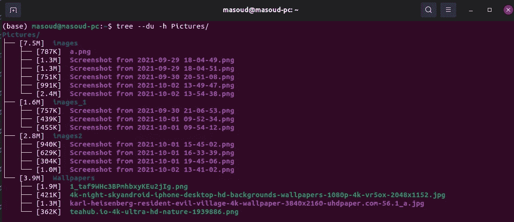
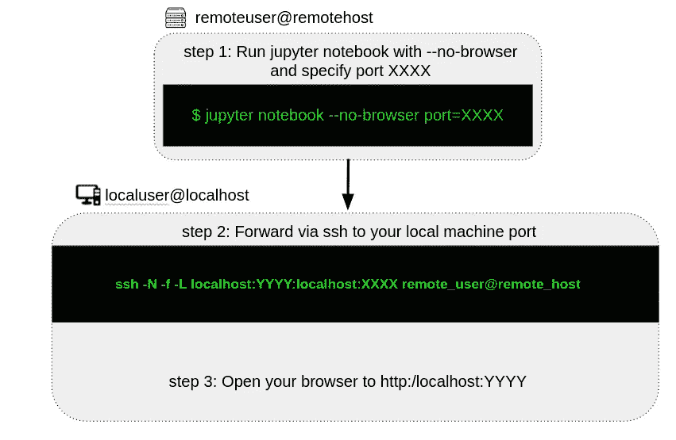
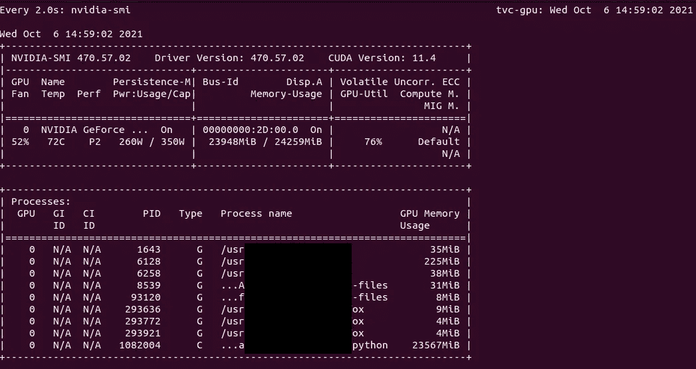
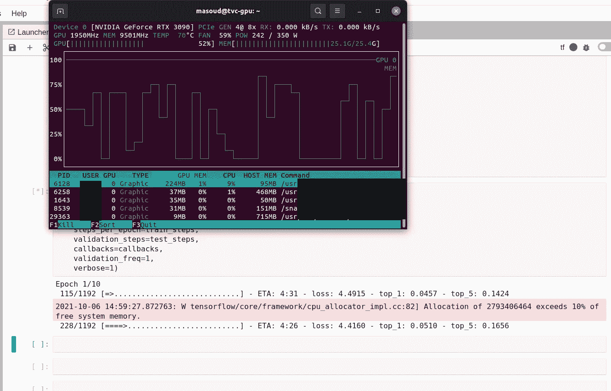
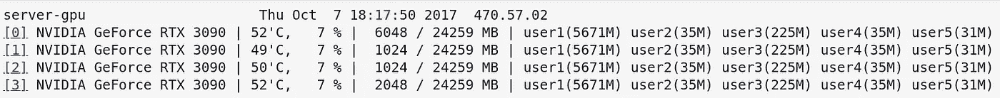
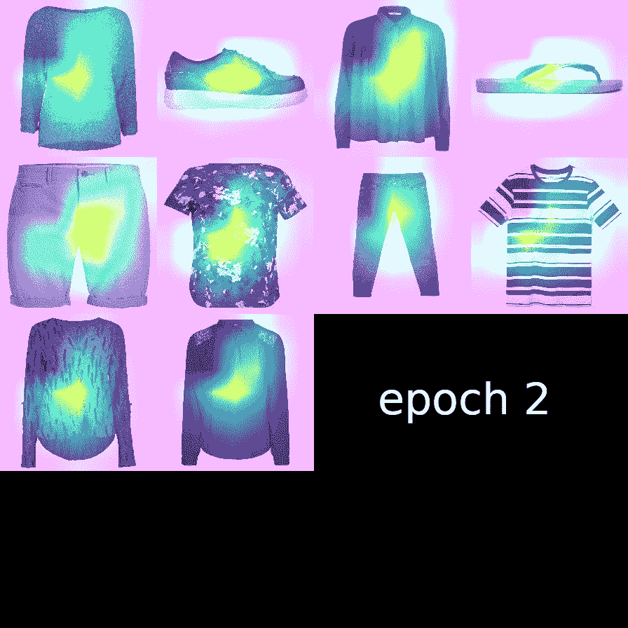

# 计算机视觉研究人员的基本 Linux 命令行技巧

> 原文：<https://towardsdatascience.com/essential-linux-command-line-tricks-for-computer-vision-researchers-27d4f013d9a?source=collection_archive---------33----------------------->

## 在本帖中，我们将介绍一些有用的命令行技巧，它们可以帮助计算机视觉工程师加快日常研发工作。


由 [ThisisEngineering RAEng](https://unsplash.com/@thisisengineering?utm_source=unsplash&utm_medium=referral&utm_content=creditCopyText) 在 [Unsplash](https://unsplash.com/?utm_source=unsplash&utm_medium=referral&utm_content=creditCopyText) 拍摄的照片

# 介绍

我永远不会忘记我第一天使用测试服务器的情景，我不小心在根目录上运行了`rm -r *`，搞砸了，让 DevOps 的人哑口无言！！


DevOps 的人想知道发生了什么？(gif 来自[Giphy.com](https://giphy.com/gifs/shocked-what-stunned-doJrCO8kCAgNy))

经过这次实验，我学到了两件重要的事情:

*   第一，打字的时候要抬头！
*   第二，我需要更好地使用命令行。

L inux 在数据科学社区，尤其是深度学习工程师中非常受欢迎。因为每当涉及到训练像 YOLO、RCNN 或 BERT 这样的深度学习模型时，他们都必须通过 MLOps 来确保安装的软件包与操作系统和硬件非常好地集成。但是在它所有的酷功能中，我认为它的命令行是另一回事。它的**简单性**、**工具多样性**、**易于与最先进的技术**、**、**和**敏捷的本质**使它在数据科学的研发方面非常独特。

**耶鲁安·扬森斯**在他的书《**数据** **命令行中的科学》中对命令行的优势进行了很好的分类:**

<https://www.datascienceatthecommandline.com/>  

> **命令行是敏捷的:**这个特性使它非常适合数据科学的探索性质。因为你想要及时的结果。
> 
> **命令行增加:**与其他技术很好地集成。(例如 Jupter Notebook、Colab 等)
> 
> **命令行是可扩展的:**因为您没有使用 GUI，而是实际键入命令，并且每个命令都有许多参数，所以它可以很容易地满足您的需要。
> 
> **命令行是可扩展的:**命令行本身是语言不可知的。所以你可以开发和扩展它的功能而不用担心语言。
> 
> **命令行无处不在:**任何类似 Unix 的操作系统都有命令行。大多数超级计算机、嵌入式系统、服务器、笔记本电脑、云基础设施都使用 Linux。

在这篇文章中，我想介绍一些我在项目中经常使用的 Linux 命令的技巧，主要是因为我发现必须为每个过程编写一个 python 脚本。我将命令分为两大类:

*   第一类包括**使用远程服务器和文件**时有用的命令
*   第二个包括帮助**图像/视频操作**的命令。

# 使用远程服务器和文件

## 1.检查图像的尺寸

有时在远程服务器上，您正在处理数据，并且没有任何 GUI 来查看图像尺寸。您可以使用以下命令检查图像尺寸:

`**linux@user-pc:~/some/path$ identify image_name.png
>>> image_name.png PNG 1920x1080 8bit sRGB 805918B 0.000u 0:00.000**`

如果你想把它用在一个目录中的几个图片上(也许你想把它们组合成一个剪辑，但是其中一些和其他的尺寸不一样！)，用`*.png`代替`image_name.png`

我曾经在 python 中使用过这个脚本:

## 2.清点目录上的图像

在某个目录下创建数据集后，我经常检查图像和标签的数量是否相等。(由于我使用 jupyter notebook，有时会有一个名为`.ipynotebook`的隐藏目录，当您使用`ls`命令时它不会出现，这在数据生成器开始从该目录获取数据时会产生问题)。

*   对所有图像进行计数:
    `**ls path/to/images | wc -l**`
*   仅检查`png`格式文件:
    `**find -name *.png -type | wc -l**`
*   查看目录的存储大小:
    `**du -lh --max-depth=1**`
*   您还可以使用`**tree -du -h Path/to/images**`来检查图像及其消耗的磁盘存储。

命令`**tree**`的输出更加直观，如下所示:



tree 命令的输出示例(图片由作者提供)

## 3.将文件从本地电脑复制到远程服务器或从远程服务器复制到本地电脑

我们经常需要将数据上传到远程服务器(或者从远程服务器下载数据)。为此，你应该这样使用`**scp**`命令:

*   首先我建议你用这个命令压缩文件夹:
    `**zip -r output.zip path/to/images path/to/labels**`
*   要下载，你应该在本地电脑上使用这个命令**:
    `**scp remote_user@remote_host:remote_path local_path**`
    例如:
    `**scp user_1@111.222.333.444:/home/user_1/path /home/local_user/path**`**
*   要上传，**切换来源和目的地**:
    

## 4.在远程服务器上运行 jupyter 笔记本

jupyter notebook 帮助研究人员编写脚本和可视化。
为了在本地 PC 上使用它，同时在远程主机上运行，我们在本地机器和远程主机上使用以下命令将 jupyter 笔记本端口转发到本地:

*   在远程服务器上运行 jupyter 笔记本:
    `**jupyter notebook --no-browser --port=XXXX**`
*   端口转发本地端口到远程端口:
    `**ssh -N -f -L localhost:YYYY:localhost:XXXX remote_user@remote_host**`



作者创造的形象

## 5.与 TMUX 一起进行 ML 模型培训/评估

我曾经在 ML 模型训练会议期间遭受了很多网络中断的痛苦，这有时使我回到起点，从头开始再次训练模型！因此，我发现`**tmux**`实用程序是一个非常吸引人的解决方案，当你想将进程从它们的控制终端上分离时，它允许远程会话保持活动而不被看到。

使用 tmux 真的很容易。

*   要启动 tmux 会话，只需键入`**tmux**`。
*   要重命名会话，请键入`**rename-session -t some_random_name**`(仅当您已激活会话时)。
*   然后，您可以运行您的流程，并通过按下`**CTRL+B**`和`**D**`将其分离。
*   要附加会话，您可以使用`**tmux attach -t some_random_name**`。
*   要终止会话，执行`**tmux kill-session -t yolo**`

你可以在这段精彩的 youtube 视频中了解更多细节:

[HackerSploit](https://www.youtube.com/channel/UC0ZTPkdxlAKf-V33tqXwi3Q) |完整 tmux 教程| 2020 年 4 月 9 日

## 6.观看您的培训课程和 GPU 资源

如果你在一个团队工作，你可能经历过与同事争夺 GPU 资源的竞争！！要了解 GPU 的使用情况(意识到它何时不被其他人使用)，请使用以下命令:
`**watch -n nvidia-smi**`



作者图片

`**nvtop**`(更好的可视化):



运行训练和 GPU 内存分配监控——图片由作者提供

`**gpustat**`(比较适合管理员同时看多个 GPU)



作者图片

有时，当您开始训练 ML 模型时，您会将结果记录在某个文本文件中。例如,`Detectron2`框架或 YOLOV5 日志度量(准确性、损失等)。)在一些 txt 文件上。
因此，如果我无法访问`tensorboard`，我将使用此命令检查最后 5 行的结果，这些结果将每 100 秒更新一次:

`**watch -n 100 tail -n 5**`

我根据损失和精度值保存检查点，并用相应的损失和精度命名权重。因此，我可以在命令行中对它们进行排序，并使用以下命令检查最后一个检查点的准确性:

`**ls checkpoints/* | sort | tail -n 1**`

## 6.创建 gif 图来显示时间序列图像

我使用 GradCam 算法，使用`tf-explain`模块在测试图像上可视化激活层特征提取热图。我经常从图中生成 gif，以了解训练过程如何影响模型的准确性。要将目录中的图像转换为绘图，可以使用此命令:

```
**convert -delay 10 -loop 0 *.png animation.gif**
```

并导致:



GradCam 输出的项目[图像颜色分类](https://www.kaggle.com/masouduut94/tensorflow-a-comprehensive-image-classification)。图片由作者提供。

Kaggle 上的完整项目:

<https://www.kaggle.com/masouduut94/tensorflow-a-comprehensive-image-classification>  

如果你想把视频转换成 gif，你可能会注意到输出的 gif 文件会变得非常大。所以减小 gif 文件大小的最好方法是从视频中取样。为此，使用采样 FPS 的`-r`:

`ffmpeg -i video.mp4 -r 10 output.gif`

# 视频/图像处理

是计算机视觉工程师的必备技能，因为她/他必须处理视频/图像数据。`**ffmpeg**`有很多窍门，我在这里只分享其中的几个。如果你想了解更多关于`ffmpeg`的信息，请看看这些书:

<https://www.amazon.com/FFmpeg-Basics-Multimedia-handling-encoder/dp/1479327832>  <https://ffmpegfromzerotohero.com/>  

## 1.检查视频持续时间

使用此命令:

`**ffmpeg -i file.mp4 2>&1 | grep “Duration”**`

输出将是这样的:

`*Duration: 00:05:03.05, start: 0.00000, bitrate:201 kb/s*`

## **2。转换视频格式:**

为此:

`**ffmpeg -i video.mp4 video.avi**`

如果您只需要视频中的音频:

`**ffmpeg -i input.mp4 -vn output.mp3**`

## 3.从视频生成数据集

有时，我们可能需要从视频中生成一个数据集，其中一些动作很少发生，如检测罕见的动作或罕见的对象，这可以称为“异常检测”。为此，我们需要浏览长达数小时的录像。我使用这个命令来剪切视频的某些部分:

`**ffmpeg -ss 00:10:00 -i input_video.mp4 -to 00:02:00 -c copy output.mp4**`

在该命令中:

*   `**-ss**`:开始时间
*   `**-i**`:输入视频
*   `**-to**`:时间间隔如 2 分钟。
*   `**-c**`:输出编解码器

如果您想要没有音频的视频:

`**ffmpeg -i input_video.mp4 -an -c:v copy output.mp4**`

*   `**-an**`用于无音频输出。

## 4.为 ConvLSTMs 或 3d CNNs 生成一系列帧

ConvLSTM 和 3d-CNN 网络设计用于提取视频序列的时空特征。所以为了和这些网络一起工作，我们必须为它们的输入张量产生一系列的框架。使用此命令从视频中生成 20 秒的图像:
`**ffmpeg -ss 00:32:15 -t 20 -i videos.ts ~/frames/frame%06d.png**`

您可以添加`**scale**`来重新调整图像尺寸。我主要是在`**1028x540**`得到视频，它的宽度必须减半。执行此操作的命令如下:

`**ffmpeg -ss 00:10:00 -t 20 -i video.ts -vf scale=iw/2:ih output_path/frame%06d.png**`

或者你可以简单地把维度:

`**ffmpeg -ss 00:10:00 -t 20 -i video.ts -vf scale=960x540 output_path/frame%06d.png**`

## 5.裁剪视频的边界框

这就是你如何简单地裁剪一盒视频剪辑:

`**ffmpeg -i input.mp4 -filter:v "crop=w:h:x:y" output.mp4**`

## 6.将视频相互堆叠在一起

在 [TVConal 初创公司](https://www.linkedin.com/company/tvconal/about/)，我从事体育分析项目，有时我们想要检查不同的视频馈送是否彼此同步。我刚刚发现这个惊人的 [StackOverflow 答案](https://stackoverflow.com/a/33764934/6118987)与这个问题如此相关，我在这里分享的是从提到的帖子中得到的见解。

由于我是排球的超级粉丝(我最喜欢的球员是二传手之王“赛义德·马鲁夫”)，我选择在排球的视频片段上测试命令。视频名称为`a.mp4` — `b.mp4` — `c.mp4` — `d.mp4`，荣誉归于 [Pexels](https://www.pexels.com/video/athletes-celebrating-6217063/?utm_content=attributionCopyText&utm_medium=referral&utm_source=pexels) 的 [Pavel Danilyuk](https://www.pexels.com/@pavel-danilyuk?utm_content=attributionCopyText&utm_medium=referral&utm_source=pexels) 。


a.mp4-b.mp4 视频剪辑(视频由[帕维尔·丹尼柳克](https://www.pexels.com/@pavel-danilyuk?utm_content=attributionCopyText&utm_medium=referral&utm_source=pexels)从[派克斯](https://www.pexels.com/video/athletes-celebrating-6217063/?utm_content=attributionCopyText&utm_medium=referral&utm_source=pexels)拍摄)


clips 和 clips 的视频剪辑(来自 [Pexels](https://www.pexels.com/video/athletes-celebrating-6217063/?utm_content=attributionCopyText&utm_medium=referral&utm_source=pexels) 的 [Pavel Danilyuk](https://www.pexels.com/@pavel-danilyuk?utm_content=attributionCopyText&utm_medium=referral&utm_source=pexels) 的视频)

## 6.1 —水平堆叠视频:

要沿水平轴堆叠提要，我们使用以下命令:

`**ffmpeg -i a.mp4 -i b.mp4 -filter_complex hstack output.mp4**`


FFmpeg 水平堆叠的输出结果视频

## 6.2 —垂直堆叠视频:

要沿垂直轴堆叠提要，我们使用以下命令:

`**ffmpeg -i a.mp4 -i b.mp4 -filter_complex vstack=inputs=2 end_vstack.mp4**`


FFmpeg 垂直堆叠的输出结果

# 6.3 —使用 xstack 的 2x2 网格堆叠

现在让我们试试更复杂的东西:

`**ffmpeg -i a.mp4 -i b.mp4 -i c.mp4 -i d.mp4 -filter_complex "[0:v][1:v][2:v][3:v]xstack=inputs=4:layout=0_0|w0_0|0_h0|w0_h0[v]" -map "[v]" 2x2.mp4**`


FFmpeg xstacking 的输出结果

# 结论

我相信命令行和 python 将为数据科学社区提供一套强大的工具。我们都知道，在 R&D 和快节奏的发展中，时间管理是非常关键的。所以使用如此强大的工具可以让我们在白天简单的任务上浪费更少的时间。我不否认还有很多更有用的命令行技巧我没有包括在本文中，比如在处理 DevOps 时很方便的`**Docker**`，但是我想在另一篇文章中写一下 **Docker** 。
我也感谢那些知道更多对计算机视觉社区有用的命令行并能与我分享的人。

# 我的在线个人资料:

*   [**我的 LinkedIn**](https://www.linkedin.com/in/masoud-masoumi-moghadam/)
*   [**我的 stack overflow**](https://stackoverflow.com/users/6118987/masoud-masoumi-moghadam)
*   [**我的 Github 资源库**](https://github.com/masouduut94)
*   [T5【我的卡格尔库】T6](https://www.kaggle.com/masouduut94)

# 参考

*   [https://ljvmiranda 921 . github . io/notebook/2018/01/31/running-a-jupyter-notebook/](https://ljvmiranda921.github.io/notebook/2018/01/31/running-a-jupyter-notebook/)
*   [https://en.wikipedia.org/wiki/Tmux](https://en.wikipedia.org/wiki/Tmux)
*   [https://ostechnix.com/20-ffmpeg-commands-beginners/](https://ostechnix.com/20-ffmpeg-commands-beginners/)
*   [https://UNIX . stack exchange . com/questions/233832/merge-two-video-clips-into-one-placing-them-next-to-other](https://unix.stackexchange.com/questions/233832/merge-two-video-clips-into-one-placing-them-next-to-each-other)
*   [https://askubuntu . com/questions/648603/how-to-create-a-animated-gif-from-MP4-video-via-command-line](https://askubuntu.com/questions/648603/how-to-create-an-animated-gif-from-mp4-video-via-command-line)
*   [https://stack overflow . com/questions/11552565/vertically-or-horizontal-stack-mosaic-some-videos-using-ffmpeg/33764934 # 33764934](https://stackoverflow.com/questions/11552565/vertically-or-horizontally-stack-mosaic-several-videos-using-ffmpeg/33764934#33764934)