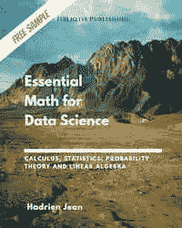

# 数据科学基础数学:基础和基础的变化

> 原文：<https://towardsdatascience.com/essential-math-for-data-science-basis-and-change-of-basis-f7af2348d463?source=collection_archive---------9----------------------->

## [数据科学的基本数学](https://towardsdatascience.com/tagged/essential-math)

## 理解对特征分解和奇异值分解有用的基的线性代数概念


(图片由作者提供)

在本文中，您将了解基的概念，这是理解矩阵分解方法(如特征分解或奇异值分解(SVD))的一种有趣方式。

# 定义

*基*是一个用来描述向量空间(向量组)的坐标系。它是一个参考，用于将数字与几何向量相关联。

作为基础，一组向量必须:

*   线性无关。
*   跨越空间。

空间中的每个向量都是基向量的唯一组合。空间的维数被定义为基集的大小。例如， *ℝ* 中有两个基矢(对应笛卡尔平面中的 *x* 和 *y 轴*)，或者 *ℝ* 中有三个基矢。

如[数据科学基础数学](https://bit.ly/3pC2JA1)第 7.4 节所示，如果一个集合中向量的个数大于空间的维数，它们就不可能线性无关。如果一个集合包含的向量少于维数，这些向量就不能跨越整个空间。

矢量可以表示为从原点到空间中一点的箭头。这个点的坐标可以存储在一个列表中。笛卡尔平面中矢量的几何表示意味着我们采用一个参考:由两个轴 *x* 和 *y* 给出的方向。

*基本矢量*是对应于该参考的矢量。在笛卡尔平面中，基向量是正交的单位向量(长度为 1)，一般表示为 ***i*** 和 ***j*** 。


*图 1:笛卡尔平面中的基本向量。(图片由作者提供)*

例如，在图 1 中，基矢 ***i*** 和 ***j*** 分别指向轴 *x* 和 *y* 的方向。这些向量给出了标准基础。如果你将这些基向量放入一个矩阵，你会得到以下单位矩阵(关于单位矩阵的更多细节，参见[数据科学基础数学](https://bit.ly/3pC2JA1)中的 6.4.3):


于是， ***的列我*** *₂* 跨度 *ℝ* 。同理，各列的 ***I*** *₃* 跨度 *ℝ* 等等。

**正交基**

基向量可以是正交的，因为正交向量是独立的。然而，反过来就不一定了:非正交向量可以是线性无关的，从而形成一个基(但不是标准基)。

你的向量空间的基非常重要，因为对应于向量的坐标值依赖于这个基。顺便说一下，你可以选择不同的基向量，比如图 2 中的那些。


图二。*二维空间中的另一个基础。(图片由作者提供)*

请记住，向量坐标取决于基本向量的隐式选择。

# 基本向量的线性组合

你可以把向量空间中的任何向量看作是基向量的线性组合。

例如，取下面的二维向量 ***v*** :


图 3。矢量𝒗.的分量(图片由作者提供)

矢量 ***v*** 的分量是在 *x* 轴和 *y* 轴上的投影( *v_x* 和 *v_y* ，如图 3 所示)。向量 ***v*** 对应其分量之和:***v****= v _ x+v _ y*，你可以通过缩放基向量得到这些分量:*v _ x = 2****I***和*v _ y =-0.5****j***。因此，图 3 所示的矢量 ***v*** 可以认为是两个基矢量 ***i*** 和 ***j*** 的线性组合:


# 其他基地

单位矩阵的列不是线性无关列向量的唯一情况。有可能在 *ℝⁿ* 中找到其他组 *n* 向量线性无关。

例如，让我们考虑一下 *ℝ* 中的以下向量:


和


*图 4:二维空间中的另一种基。(图片由作者提供)*

从上面的定义来看，向量 ***v*** 和 ***w*** 是一个基础，因为它们是线性独立的(你无法从另一个的组合中获得其中的一个)，并且它们跨越空间(所有的空间都可以从这些向量的线性组合中到达)。

重要的是要记住，当你使用向量的分量时(例如向量*的 *v_x* 和 *v_y* 、 *x* 和 *y* 分量)，这些值是相对于你选择的基的。如果使用另一种基础，这些值将会不同。*

*您将在[数据科学基础数学](https://bit.ly/3pC2JA1)的第 9 章和第 10 章中看到，改变基底的能力是线性代数的基础，也是理解特征分解或奇异值分解的关键。*

# *向量是相对于基来定义的*

*您已经看到，要将几何向量(空间中的箭头)与坐标向量(数字数组)相关联，您需要一个引用。这个参考是你的向量空间的基础。由于这个原因，向量应该总是相对于基来定义的。*

*让我们取下面的向量:*

**

**x* 和 *y* 分量的值分别为 2 和-0.5。未指定时，使用标准基准。*

*你可以写 ***Iv*** 来指定这些数字对应于相对于标准基的坐标。这种情况下， ***I*** 称为基矩阵的*变化*。*

**

*您可以使用不同于 ***I*** 的另一个矩阵来定义相对于另一个基的向量。*

# *基本向量的线性组合*

*向量空间(可能向量的集合)的特征是关于一个基。把一个几何向量表示成一组数字意味着你要选择一个基。用不同的基，同一个向量 ***v*** 关联不同的数。*

*你看到了基是一组跨越空间的线性独立的向量。更准确地说，如果空间中的每个向量都可以描述为基的分量的有限线性组合，并且向量集是线性独立的，那么向量集就是一个基。*

*考虑下面的二维向量:*

**

*在 *ℝ* 笛卡尔平面中，可以把 ***v*** 看作标准基向量 ***i*** 和 ***j*** 的线性组合，如图 5 所示。*

**

**图 5:向量* ***v*** *可以描述为基向量* ***i*** *和* ***j*** *的线性组合。(图片由作者提供)**

*但是如果使用另一个坐标系， ***v*** 则与新的数字相关联。图 6 显示了向量 ***v*** 在新坐标系下的表示( ***i*** *'* 和 ***j*** *'* )。*

**

**图 6:矢量* ***v*** *相对于新基准的坐标。(图片由作者提供)**

*在新的基础上， ***v*** 是一组新的数字:*

**

# *基矩阵的变化*

*您可以使用*基矩阵变化*从一个基转到另一个基。要找到新基向量对应的矩阵，可以将这些新基向量(***I****’*和***j****’*)表示为旧基( ***i*** 和 ***j*** )中的坐标。*

*让我们再看一下前面的例子。你有:*

**

*和*

**

*这如图 7 所示。*

**

**图 7:新基础向量相对于旧基础的坐标。(图片由作者提供)**

*由于是基向量， ***i*** *'* 、 *j* *'* 可以表示为 ***i*** 和 ***j*** 的线性组合。：*

**

*让我们将这些方程写成矩阵形式(关于方程组的矩阵形式的更多细节在[数据科学基础数学](https://bit.ly/3pC2JA1)的第 8 章中):*

**

*要使基本向量成为列，需要转置矩阵。您将获得:*

**

*这个矩阵叫做基变换矩阵。姑且称之为 ***C*** :*

**

*正如你所注意到的，基变换矩阵的每一列都是新基的一个基向量。接下来您将看到，您可以使用基变换矩阵 ***C*** 将向量从输出基转换为输入基。*

***基变换 vs 线性变换***

*基的变化和线性变换的区别是概念上的。有时，将矩阵的效果视为基的变化是有用的；有时，当你把它看作线性变换时，你会得到更多的见解。*

*要么移动向量，要么移动其参考。这就是为什么旋转坐标系与旋转矢量本身相比具有相反的效果。*

*对于特征分解和奇异值分解，这两种观点通常被放在一起，这在一开始可能会引起混淆。在本书的结尾，牢记这一区别将会很有用。*

*两者之间的主要技术差异是基的变化必须是可逆的，而线性变换不需要这一点。*

***求基矩阵的变化***

*基变换矩阵将输入基映射到输出基。让我们称输入基 ***B*** *₁* 用基向量 ***i*** 和 ***j*** ，输出基 *B* *₂* 用基向量**’*和***j*你有:******

**

*和*

**

*根据基变化的等式，你有:*

**

*如果你想求给定 ***B*** *₁* 和 ***B*** *₂* 的基矩阵的变化，你需要计算 ***B*** *₁* 的逆来分离 ***C*** :*

**

*换句话说，你可以通过将输入基矩阵的逆矩阵(***b****₁^{-1}*，包含输入基向量为列)乘以输出基矩阵(***b****，包含输出基向量为列)来计算基矩阵的变化。**

# **`Converting vectors from the output to the input basis`**

**注意，这个基矩阵的变化允许你将向量从 ***B*** *₂* 转换到 ***B*** *₁* 而不是相反。直觉上，这是因为移动对象与移动参考是相反的。由此可见，要从 ***B*** *₁* 到 *B* *₂* ，就必须使用基矩阵***c****^{-1}*的逆矩阵变化。**

**注意，如果输入基是标准基(***b****₁=****I***)，那么基的变化矩阵就是简单的输出基矩阵:**

****

# ****基矩阵的可逆变化****

**由于基向量是线性无关的， ***C*** 的列也是线性无关的，因此，如[数据科学基础数学](https://bit.ly/3pC2JA1)、 ***C*** 的 7.4 节所述，是可逆的。**

# **示例:更改向量的基**

**让我们改变矢量 ***v*** 的基础，再次使用图 6 所示的几何矢量。**

## **注释**

**您将把 ***v*** 的基础从标准基础更改为新基础。让我们把标准基记为 ***B*** *₁* ，新基记为 ***B*** *₂* 。记住，基是一个矩阵，包含列形式的基向量。你有:**

****

**和**

****

**我们把向量*相对于基 ***B*** *₁* 表示为[**v*****b****₁*:***

****

**目标是找到 ***v*** 相对于基 ***B*** *₂* 的坐标，记为[***v******b****₂*。**

****方括号符号****

**为了区分用来定义一个矢量的基，你可以把基名(像 ***B*** ₁)放在用方括号括起来的矢量名后面的下标中。然而，由于介质下标的限制，我们将在文本中写例如，[**v**]***b***₁来表示相对于基 ***B*** ₁.的矢量 ***v*** 相对于*₁.，也称为*的*表示*****

## **使用线性组合**

**让我们将向量 ***v*** 表示为输入和输出基向量的线性组合:**

****

**标量 *c₁* 和 *c₂* 对输入基向量的线性组合进行加权，标量 *d₁* 和 *d₂* 对输出基向量的线性组合进行加权。你可以合并这两个方程:**

****

**现在，让我们用矩阵形式写出这个方程:**

****

**包含标量 *c₁* 和 *c₂* 的向量对应于[***v******b****₁*包含标量 *d₁* 和 *d₂* 的向量对应于[***v******b****₂*你有:**

****

**很好，这是一个带有你要找的项的方程:[*v****b****₂*。你可以把每边乘以***b****₂^{-1}*来隔离它:**

****

**您还拥有:**

****

*****b****₂^{-1}****b****₁*是***b****₁^{-1}****b****₂*，这是基阵 ***C* 的变化这说明 **C** *^{-1}* 允许您将向量从输入基 ***B*** *₁* 转换为输出基 ***B*** *₂* 和 ***C*** 从 ***B*******

**在这个例子的上下文中，由于***b****₁*是标准基础，它简化为:**

****

**这意味着，应用矩阵***b****₂^{-1}*到***v******b****_ 1*可以让你将其基础改为***b****₂*。**

**让我们编码如下:**

```
**array([ 0.86757991, -1.00456621])**
```

**这些值是矢量 ***v*** 相对于基***b****₂*的坐标。这意味着如果你去*0.86757991****I****'—1.00456621****j****'*你就到达了标准基中的位置(2，1)，如图 6 所示。**

****结论****

**理解基的概念是接近矩阵分解的好方法，如特征分解或奇异值分解(SVD)。在这些方面，你可以认为矩阵分解是寻找一个基，其中与变换相关的矩阵具有特定的属性:因式分解是一个基矩阵的变化，新的变换矩阵，最后是基矩阵变化的逆，以返回到初始基(更多细节在[数据科学基础数学](https://bit.ly/3pC2JA1)的第 09 章和第 10 章)。**

****这篇文章是我的书*数据科学基础数学*的样本！****

****

**[在这里拿书:https://bit.ly/2WVf4CR!](https://bit.ly/3pC2JA1)**