# 数据科学基础数学:特征向量及其在 PCA 中的应用

> 原文：<https://towardsdatascience.com/essential-math-for-data-science-eigenvectors-and-application-to-pca-6f85d11ceb64?source=collection_archive---------9----------------------->

## [数据科学的基本数学](https://towardsdatascience.com/tagged/essential-math)

## 理解特征向量和特征值以及它们与主成分分析(PCA)的关系


(图片由作者提供)

*矩阵分解*，也叫*矩阵分解*是将一个矩阵拆分成多个块的过程。在数据科学的背景下，你可以使用它来选择数据的一部分，目的是在不丢失太多信息的情况下减少维度(例如在主成分分析中，你将在本文后面介绍)。一些运算在分解得到的矩阵上也更容易计算。

在本文中，您将学习矩阵的特征分解。理解它的一种方式是将其视为一种特殊的基础变化(关于基础变化的更多细节，请参见我的上一篇文章】)。您将首先学习特征向量和特征值，然后了解它们如何应用于主成分分析(PCA)。主要思想是将矩阵*的特征分解视为基的变化，其中新的基向量是特征向量。*

# *特征向量和特征值*

*正如您在[数据科学基础数学](https://bit.ly/3bj0Tyn)的第 7 章中所看到的，您可以将矩阵视为线性变换。这意味着，如果你取任意一个矢量*并将矩阵*应用于它，你就获得了一个变换后的矢量 ***v*** 。***

**以...为例:**

****

**和**

**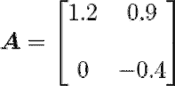**

**如果将 ***A*** 应用于矢量*(矩阵-矢量乘积)，就会得到一个新的矢量:***

***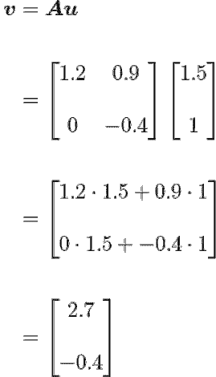***

***让我们画出初始向量和变换向量:***

***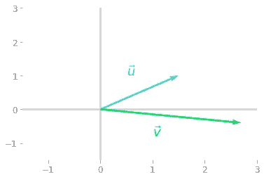***

****图 1:将矢量***由矩阵* ***A*** *转化为矢量* ***v*** *。*****

****请注意，正如您所料，变换后的矢量 ***v*** 与初始矢量*的运行方向不同。这种方向的改变表征了你可以通过*变换的大多数向量。******

****然而，以下面的向量为例:****

****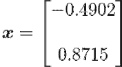********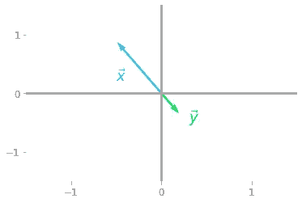****

*****图 2:矩阵***对特殊向量* ***x*** *的变换。******

****在图 2 中可以看到，向量 ***x*** 与矩阵 ***A*** 有着特殊的关系:它被重新缩放(带有负值)，但初始向量 ***x*** 和变换后的向量 ***y*** 都在同一条线上。****

***向量 ***x*** 是*的一个*特征向量*。只按一个值缩放，这个值叫做矩阵*的一个*特征值*。矩阵 ***A*** 的特征向量是由矩阵变换时收缩或伸长的向量。特征值是向量收缩或伸长的比例因子。*****

***数学上，向量 ***x*** 是 ***A*** 的一个特征向量，如果:***

***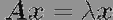***

***其中 *λ* (读作“λ”)是对应于特征向量 ***x*** 的特征值。***

*****特征向量*****

***矩阵的特征向量是非零向量，仅当矩阵应用于它们时才被重缩放。如果比例因子为正，则初始向量和变换向量的方向相同，如果为负，则它们的方向相反。***

*****特征向量的数量*****

***一个 *n* -by- *n* 矩阵最多有 *n* 个线性无关的特征向量。然而，每个特征向量乘以一个非零标量也是一个特征向量。如果您有:***

***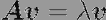***

***然后:***

***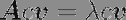***

***用 *c* 表示任何非零值。***

***这排除了零向量作为特征向量，因为你会有***

***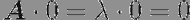***

***在这种情况下，每个标量都是一个特征值，因此是未定义的。***

# ***动手项目:主成分分析***

***主成分分析(PCA)是一种算法，可以用来降低数据集的维度。例如，减少计算时间、压缩数据或避免所谓的“维数灾难”是很有用的。它对于可视化也很有用:高维数据很难可视化，减少绘制数据的维数会很有用。***

***在这个动手项目中，您将使用在《数据科学的基本数学》一书中学到的各种概念来理解 PCA 是如何工作的，如基的变化(第 7.5 和 9.2 节，这里的一些示例)、特征分解(第 9 章)或协方差矩阵(第 2.1.3 节)。***

***在第一部分中，您将了解投影之间的关系，解释方差和误差最小化，首先是一些理论，然后通过对啤酒数据集(啤酒消费量作为温度的函数)进行 PCA 编码。在第二部分中，您将使用 Sklearn 对音频数据使用 PCA 来根据音频样本的类别可视化音频样本，然后压缩这些音频样本。***

# ***在后台***

## ***理论语境***

***PCA 的目标是将数据投影到低维空间，同时尽可能多地保留数据中包含的信息。这个问题可以看作是一个*垂直最小二乘*问题，也称为*正交回归*。***

***您将看到，当投影线对应于数据方差最大的方向时，正交投影的误差最小。***

## ***差异和预测***

***首先要理解的是，当数据集的要素并非完全不相关时，某些方向比其他方向具有更大的方差。***

***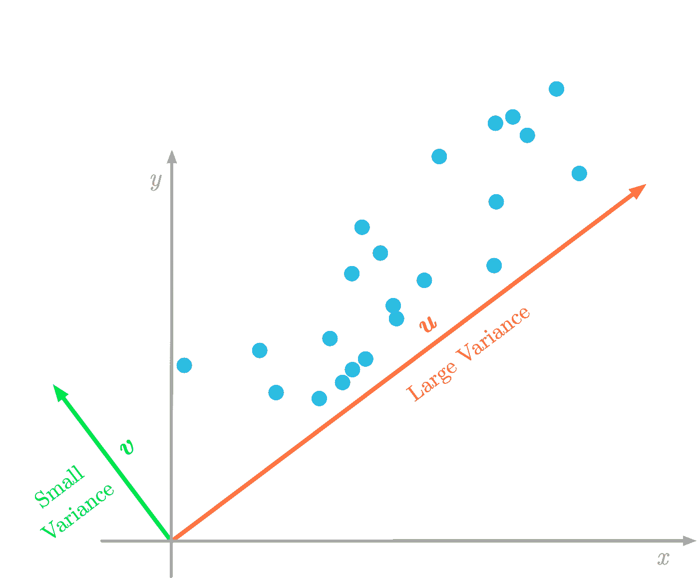***

****图 3:向量* ***u*** *方向的数据方差(红色)大于向量* **v** *方向的方差(绿色)。(图片由作者提供)****

***将数据投影到低维空间意味着您可能会丢失一些信息。在图 3 中，如果您将二维数据投影到一条线上，投影数据的方差会告诉您丢失了多少信息。例如，如果投影数据的方差接近零，这意味着数据点将被投影到非常接近的位置:您会丢失大量信息。***

***为此，PCA 的目标是改变数据矩阵的基，使得具有最大方差的方向(图 3 中的 ***u*** )成为第一个*主分量*。第二个分量是方差最大的方向，它与第一个分量正交，依此类推。***

***当你找到主成分分析的组成部分，你改变你的数据的基础，使组成部分是新的基础向量。此变换后的数据集具有新的要素，这些要素是初始要素的组成部分和线性组合。通过仅选择一些组件来减少维度。***

***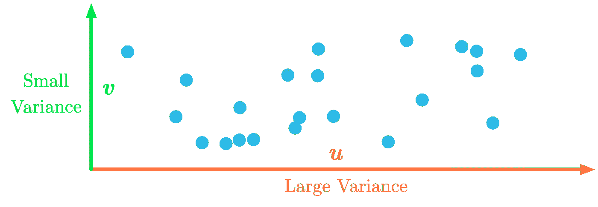***

****图 4:改变基底，使得最大方差在 x 轴上。(图片由作者提供)****

***作为一个例子，图 4 显示了改变基础后的数据:最大方差现在与 *x* 轴相关联。例如，您可以只保留第一维度。***

***换句话说，用基的变化来表示 PCA，它的目标是找到一个新的基(它是初始基的线性组合)，其中数据的方差沿着第一维被最大化。***

## ***最小化误差***

***寻找最大化方差的方向类似于最小化数据与其投影之间的误差。***

***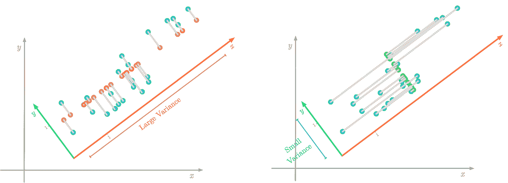***

****图 5:方差最大化的方向也是误差最小的方向(用灰色表示)。(图片由作者提供)****

***您可以在图 5 中看到，左图显示了较低的误差。由于投影是正交的，与投影线方向相关的方差不会影响误差。***

## ***寻找最佳方向***

***更改数据集的基础后，要素之间的协方差应该接近于零(如图 4 所示)。换句话说，您希望变换后的数据集具有对角协方差矩阵:每对主成分之间的协方差等于零。***

***你可以在[数据科学基础数学](https://bit.ly/3bj0Tyn)的第 9 章中看到，你可以使用特征分解来对角化矩阵(使矩阵对角化)。因此，您可以计算数据集协方差矩阵的特征向量。他们会给你新基的方向，其中协方差矩阵是对角的。***

***总之，主成分是作为数据集协方差矩阵的特征向量来计算的。此外，特征值给出了相应特征向量的解释方差。因此，通过根据特征值按降序对特征向量进行排序，您可以按重要性顺序对主成分进行排序，并最终删除与较小方差相关的成分。***

## ***计算 PCA***

*****数据集*****

***让我们来说明 PCA 是如何处理啤酒数据集的，该数据集显示了 2015 年巴西圣保罗的啤酒消费量和温度。***

***让我们加载数据，并将功耗绘制为温度的函数:***

***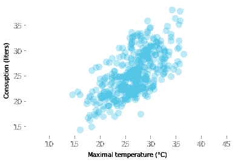***

****图 6:啤酒消费量与温度的关系。****

***现在，让我们用两个变量创建数据矩阵 ***X*** :温度和消耗。***

```
***(365, 2)***
```

***矩阵 ***X*** 有 365 行和两列(两个变量)。***

## ***协方差矩阵的特征分解***

***如您所见，第一步是计算数据集的协方差矩阵:***

```
***array([[18.63964745, 12.20609082], [12.20609082, 19.35245652]])***
```

***记住你可以这样理解:对角线上的值分别是第一个和第二个变量的方差。两个变量之间的协方差在 12.2 左右。***

***现在，您将计算这个协方差矩阵的特征向量和特征值:***

```
***(array([ 6.78475896, 31.20734501]), array([[-0.71735154, -0.69671139], [ 0.69671139, -0.71735154]]))***
```

***可以将特征向量存储为两个向量 ***u*** 和 ***v*** 。***

***让我们用数据绘制特征向量(注意，您应该使用居中的数据，因为它是用于计算协方差矩阵的数据)。***

***你可以通过特征向量对应的特征值来缩放特征向量，也就是解释的方差。出于可视化的目的，让我们使用三个标准差的向量长度(等于所解释方差的平方根的三倍):***

***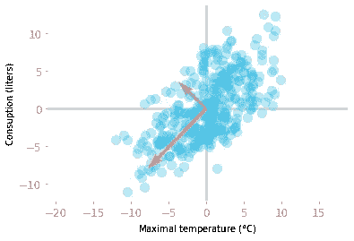***

****图 7:特征向量* ***u*** *(灰色)和* ***v*** *(红色)根据解释的方差缩放。****

***从图 7 中可以看出，协方差矩阵的特征向量给出了数据的重要方向。红色的向量 ***v*** 与最大特征值相关联，因此对应于最大方差的方向。灰色的向量*与 ***v*** 正交，是第二主成分。****

***然后，你只需要用特征向量作为新的基向量来改变数据的基。但是首先，你可以按照特征值降序排列特征向量:***

```
***array([[-0.69671139, -0.71735154], [-0.71735154, 0.69671139]])***
```

***现在，您的特征向量已经排序，让我们改变数据的基础:***

***您可以绘制变换后的数据，以检查主成分现在是否不相关:***

***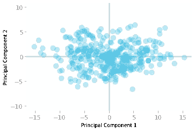***

****图 8:新基础中的数据集。****

***图 8 显示了新基础上的数据样本。您可以看到，第一个尺寸(*x*-轴)对应于方差最大的方向。***

***在这个新的基础上，您可以只保留数据的第一部分，而不会丢失太多信息。***

*****协方差矩阵还是奇异值分解？*****

***使用协方差矩阵计算 PCA 的一个注意事项是，当有许多特征时，可能很难计算(就像音频数据一样，就像本实践的第二部分)。为此，通常最好使用奇异值分解(SVD)来计算 PCA。***

*****这篇文章是我的书*数据科学基础数学*的样本！*****

******

***在这里获取书籍:【https://bit.ly/2WVf4CR! ***