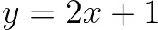

# 数据科学基础数学:线性方程组介绍

> 原文：<https://towardsdatascience.com/essential-math-for-data-science-introduction-to-systems-of-linear-equations-3f823fdd731e?source=collection_archive---------27----------------------->

## [数据科学的基本数学](https://towardsdatascience.com/tagged/essential-math)

## 理解和想象线性方程组的行列图

(图片由作者提供)

在这篇文章中，你将能够运用你所学的关于向量(见这里的)、矩阵(见这里的)和线性变换(这里的)的知识。这将允许你把数据转换成线性方程组。您还可以查看[数据科学基础数学](https://bit.ly/3nJsb5m)，了解如何使用方程组和线性代数来解决线性回归问题。

线性方程是变量之间关系的形式化。以两个变量 *x* 和 *y* 之间的线性关系为例，由以下等式定义:

您可以在笛卡尔平面中表示这种关系:

*图 1:方程 y=2x+1 的曲线图。*

记住直线上的每个点都对应这个方程的一个解:如果你用这个方程中直线上的一个点的坐标代替 *x* 和 *y* ，等式就满足了。这意味着有无限多的解(直线上的每一点)。

也可以考虑使用相同变量的多个线性方程:这是一个*方程组*。

# 线性方程组

方程组是描述变量之间关系的一组方程。例如，让我们考虑下面的例子:

你有两个线性方程，它们都描述了变量 *x* 和 *y* 之间的关系。这是一个有两个方程和两个变量的系统(在本文中也称为*未知数*)。

您可以将线性方程组(系统的每一行)视为多个方程，每个方程对应一条线。这叫*排图*。

您也可以将系统视为不同的列，对应于缩放变量的系数。这叫做*列图*。让我们来看看这两张图片的更多细节。

# 行图片

对于行图，系统的每一行对应一个方程。在前面的例子中，有两个方程描述了两个变量 *x* 和 *y* 之间的关系。

让我们用图形表示这两个方程:

*图 2:我们系统中两个方程的示意图。*

拥有一个以上的等式意味着 *x* 和 *y* 的值必须满足更多的等式。请记住，第一个等式中的 *x* 和 *y* 与第二个等式中的 *x* 和 *y* 相同。

蓝线上的所有点满足第一个方程，绿线上的所有点满足第二个方程。这意味着只有两条线上的点满足这两个方程。当 *x* 和 *y* 取直线交点坐标对应的值时，方程组求解。

在本例中，该点的 *x* 坐标为 0.8，而 *y* 坐标为 2.6。如果您在方程组中替换这些值，您将得到:

这是一种解方程组的几何方法。线性系统求解为 *x=0.8* 和 *y=2.6* 。

# 柱形图

将系统视为列被称为列图:你认为你的系统是缩放向量的未知值( *x* 和 *y* )。

为了更好地理解这一点，让我们重新排列方程，让变量在一边，常数在另一边。首先，您有:

第二点:

现在，您可以将系统写成:

您现在可以查看图 3，了解如何将这两个方程转换成一个单独的*向量方程*。

*图 3:将方程组视为由变量 x 和 y 缩放的列向量。(图片由作者提供)*

在图 3 的右边，你有矢量方程。左侧有两个列向量，右侧有一个列向量。正如您在[数据科学基础数学](https://bit.ly/3nJsb5m)中看到的，这对应于以下向量的线性组合:

和

使用柱形图，您可以用一个向量方程替换多个方程。在这个透视图中，您希望找到左侧向量的线性组合，从而得到右侧向量。

柱形图中的解决方法是一样的。行和列图片只是考虑方程组的两种不同方式:

它是有效的:如果你使用几何学上找到的解，你会得到右边的向量。

让我们把方程组看作向量的线性组合。让我们再看一次前面的例子:

图 4 显示了等式左侧的两个向量(图中蓝色和红色为您想要组合的向量)和右侧的向量(图中绿色为您想要从线性组合中获得的向量)的图形表示。

*图 4:由 x 和 y 缩放的向量的线性组合给出了右边的向量。(图片由作者提供)*

您可以在图 4 中看到，通过组合左侧向量，可以得到右侧向量。如果用值 2.6 和 0.8 缩放向量，线性组合会得到等式右侧的向量。

# 解决方案的数量

在一些线性系统中，没有唯一的解。实际上，线性方程组可以有:

*   无解。
*   一个解决方案。
*   无限多的解决方案。

让我们考虑这三种可能性(用行图和列图)来看看一个线性系统怎么可能有不止一个解和少于无穷多个解。

让我们采用下面的线性方程组，仍然有两个方程和两个变量:

我们将从表示这些方程开始:

*图 5:平行线。*

如图 5 所示，没有一个点同时位于蓝线和绿线上。这意味着这个方程组无解。

也可以通过柱形图图形化的理解为什么无解。让我们把方程组写成如下:

把它写成列向量的线性组合，你有:

*图 6:无解线性系统柱形图。(图片由作者提供)*

图 6 显示了系统的列向量。你可以看到，通过结合蓝色和红色向量，不可能到达绿色向量的端点。原因是这些向量是线性相关的(更多细节见[数据科学基础数学](https://bit.ly/3nJsb5m))。要到达的向量超出了组合向量的范围。

您可能会遇到另一种情况，即系统有无限多种解决方案。让我们考虑以下系统:

*图 7:方程线重叠。*

因为方程是相同的，无限多的点在两条线上，因此，这个线性方程组有无限多的解。这例如类似于单个方程和两个变量的情况。

从柱形图的角度来看，您有:

用向量符号表示:

*图 8:有无穷多个解的线性系统的柱形图。(图片由作者提供)*

图 8 显示了图形表示的相应向量。您可以看到，通过蓝色和红色向量的组合，有无数种方法可以到达绿色向量的端点。

因为两个向量的方向相同，所以有无限多的线性组合可以让你到达右边的向量。

# **总结**

总而言之，您可以有三种可能的情况，如图 9 中的两个方程和两个变量所示。

*图 9:总结了两个方程和两个变量的三种情况。(图片由作者提供)*

不可能有两条直线交叉不止一次而少于无限次。

这个原则适用于更多的维度。例如， *ℝ* 中的三个平面，至少两个可以平行(无解)，三个可以相交(一个解)，或者三个可以重叠(无限多个解)。

# 用矩阵表示线性方程

现在，您可以使用列图编写向量方程，您可以进一步使用矩阵来存储列向量。

让我们再来看看下面的线性系统:

你可以在[数据科学基础数学](https://bit.ly/3nJsb5m)中看到，你可以将线性组合写成矩阵向量乘积。该矩阵对应于从左侧连接的两个列向量:

并且向量对应于加权矩阵的列向量的系数(这里， *x* 和 *y* ):

你的线性系统变成下面的矩阵方程:

这导致了下面广泛用于编写线性系统的符号:

***Ax***=***b***

用 ***A*** 矩阵包含列向量、 ***x*** 系数向量和 ***b*** 结果向量，那我们就称之为*目标向量*。它允许你从单独考虑方程的微积分学到线性代数，线性系统的每一部分都用向量和矩阵表示。这种抽象是非常强大的，并带来了向量空间理论来解决线性方程组。

对于柱形图，您希望找到等式左侧的列向量的线性组合的系数。只有当目标向量在它们的跨度内时，解才存在。

**这篇文章是我的书*数据科学基础数学*的样本！**

在这里得到这本书:[https://www.essentialmathfordatascience.com/](https://bit.ly/3nJsb5m)