# 奇异值分解的可视化介绍

> 原文：<https://towardsdatascience.com/essential-math-for-data-science-visual-introduction-to-singular-value-decomposition-svd-ca549ab7eb9c?source=collection_archive---------18----------------------->

## [数据科学的基本数学](https://towardsdatascience.com/tagged/essential-math)

## 使用矩阵变换的可视化来了解 SVD

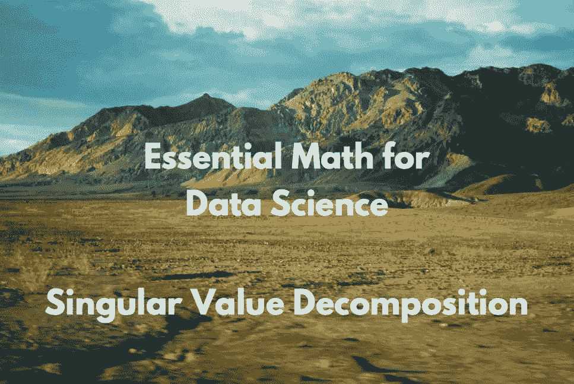

(图片由作者提供)

在本文中，您将了解奇异值分解(SVD)，这是线性代数、数据科学和机器学习的一个主要主题。例如，它用于计算主成分分析(PCA)。

你需要了解一些线性代数的基础知识(请随意查阅之前的文章和书[数据科学的基本数学](https://bit.ly/3spjZte))。

您只能对方阵应用特征分解，因为它使用基矩阵的单一变化，这意味着初始向量和变换向量相对于同一基。你用 ***Q*** 去另一个基做变换，你用***q****^*-1 回到初始基。

作为特征分解，奇异值分解(SVD)的目标是将矩阵分解成更简单的分量:正交矩阵和对角矩阵。

你也看到了，你可以把矩阵看作线性变换。矩阵的分解对应于将变换分解成多个子变换。在 SVD 的情况下，转换被转换成三个更简单的转换。

这里有三个例子:一个是二维的，一个是比较 SVD 和特征分解的变换，一个是三维的。

# 二维示例

您将看到使用定制函数`matrix_2d_effect()`的这些转换的动作(您可以在这里找到这个函数[)。该函数绘制单位圆(你可以在](https://gist.github.com/hadrienj/a70c476826cb9ea2489a773d6e84bc6c)[数据科学基础数学](https://bit.ly/3spjZte)的第 05 章中找到更多关于单位圆的细节)和矩阵变换的基本向量。

为了表示单位圆和变换前的基向量，让我们用单位矩阵来使用这个函数:

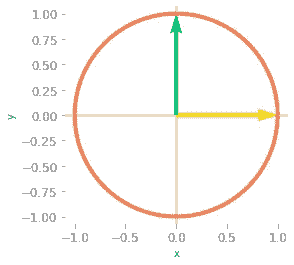

*图 1:单位圆和基本向量。*

现在让我们用函数来看看下面这个矩阵的效果*。*

*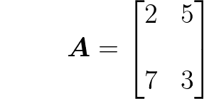*

*它将绘制单位圆和由矩阵变换的基向量:*

*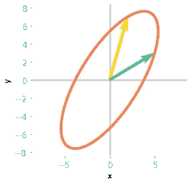*

**图 2:矩阵* ***A*** *对单位圆和基矢的影响。**

*图 2 展示了 *A* 在二维空间中的效果。让我们将其与 SVD 矩阵相关的子变换进行比较。*

*可以用 Numpy 计算出**T3A**的 SVD:*

*记住矩阵 ***U*** 、***σ、*** 和 ***V*** 分别包含左奇异向量、奇异值和右奇异向量。可以考虑将 ***V*** ^T 作为基矩阵的第一次变化，***σ***作为这个新基中的线性变换(这个变换应该是一个简单的缩放既然***σ***是对角的)，以及*基矩阵的另一次变化。您可以在[数据科学基础数学](https://bit.ly/3spjZte)的第 10 章中看到，SVD 约束基矩阵*和***v****^*t 的变化是正交的，这意味着变换将是简单的旋转。***

**综上所述，矩阵 ***A*** 对应的变换分解为一个旋转(或一个反射，或一个回折)，一个缩放，另一个旋转(或一个反射，或一个回折)。**

**让我们依次看看每个矩阵的效果:**

**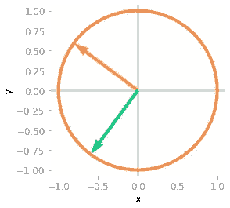**

***图 3:矩阵****v****^*t*对单位圆和基矢的影响。***

**在图 3 中可以看到，基向量已经被矩阵***v****^*t 旋转了**

**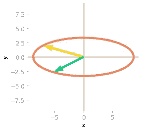**

***图 4:矩阵的作用****v****^*t*和****σ****。***

**然后，图 4 示出了***【σ】***的效果是单位圆和基向量的缩放。**

****

***图 5:矩阵****v****^*t*、****σ****和****u****的效果。***

**最后，由*进行第三次旋转。您可以在图 5 中看到，这个转换与矩阵 ***A*** 相关的转换是相同的。您已经将变换分解为一个旋转、一个缩放和一个旋转反射(查看基础向量:反射已经完成，因为黄色向量在绿色向量的左侧，最初并不是这样)。***

# **与特征分解的比较**

**由于矩阵 ***A*** 是正方形的，您可以将这种分解与特征分解进行比较，并使用相同类型的可视化。你会对这两种方法的区别有更多的了解。**

**请记住[数据科学基础数学](https://bit.ly/3spjZte)的第 09 章，矩阵 ***A*** 的特征分解由下式给出**

**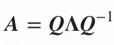**

**让我们用 Numpy 来计算矩阵 ***Q*** 和**λ**(读作“大写λ”):**

**注意，由于矩阵 ***A*** 不是对称的，所以特征向量不是正交的(它们的点积不等于零):**

```
**-0.16609095970747995**
```

**让我们看看***q****^*-1 对基矢和单位圆的影响:**

**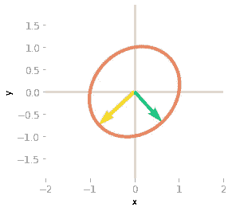**

***图 6:矩阵效果****q****^*-1*。***

**在图 6 中可以看到***q****^*-1 旋转并缩放单位圆和基矢。非正交矩阵的变换不是简单的旋转。**

**接下来就是应用***λ***。**

**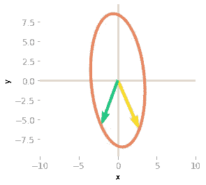**

***图 7:矩阵效果****q****^*-1****λ****。****

******λ***的效果，如图 7 所示，是通过 y 轴的拉伸和反射(黄色矢量现在在绿色矢量的右边)。***

***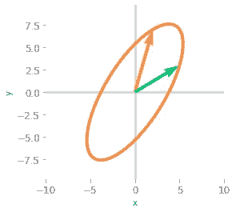***

****图 8:矩阵效果****q****^*-1*、* ***、*** *和* ***Q*** *。****

***图 8 所示的最后一个变换对应于将基变换回初始基。你可以看到它导致了与关联于*的变换相同的结果:两个矩阵 ***A*** 和***q*******λ*******q****^*-1 是相似的:它们对应于不同基中的相同变换。******

***它强调了特征分解和奇异值分解之间的区别。使用 SVD，有三种不同的变换，但其中两种只是旋转。使用特征分解，只有两个不同的矩阵，但是与 ***Q*** 相关的变换不一定是简单的旋转(只有当 ***A*** 对称时才是这种情况)。***

# ***三维示例***

***因为 SVD 可以用于非方阵，所以在这种情况下观察变换是如何分解的是很有趣的。***

***首先，非方阵映射两个具有不同维数的空间。请记住， *m* 乘 *n* 矩阵映射一个 *n* 维空间和一个 *m* 维空间。***

***让我们以一个 3 乘 2 的矩阵为例，将一个二维空间映射到一个三维空间。这意味着输入向量是二维的，输出向量是三维的。取矩阵 ***一个*** :***

***为了可视化*的效果，您仍将使用二维单位圆，并计算该圆上点的输出。每个点被认为是一个输入向量，你可以观察*对这些向量的影响。功能`matrix_3_by_2_effect()`可以在这里找到[。](https://www.essentialmathfordatascience.com/?utm_source=blog&utm_medium=medium&utm_campaign=medium_svd)*****

****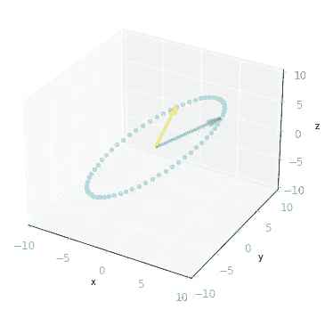****

*****图 9:矩阵 A 的作用:它把单位圆上的向量和基向量从二维空间变换到三维空间。*****

****正如所料，如图 9 所示，二维单位圆被转换成三维椭圆。请随意使用笔记本，以便能够移动情节，并对三维形状有更好的想法。****

****你可以注意到，输出向量都落在一个二维平面上。这是因为 ***A*** 的秩是 2(关于矩阵秩的更多细节在[数据科学基础数学](https://bit.ly/3spjZte)的第 7.6 节)。****

***现在，您已经知道了通过*进行变换的输出，让我们计算*的 SVD，并查看不同矩阵的效果，就像您对二维示例所做的那样。*****

****左奇异向量( ***U*** )的形状是 *m* 乘 *m* 而右奇异向量(***v****^*t)的形状是 *n* 乘 *n* 。矩阵中有两个奇异值***σ***。****

***与 ***A*** 相关联的变换被分解成在 *ℝⁿ* 中的第一旋转(与***v****^*t 相关联，在该示例中为 *ℝ* )，一个从 *ℝⁿ* 到 *ℝᵐ* 的缩放(在该示例中，从 *ℝ* 到 *ℝ* )***

***下面开始考察***v****^*t 对单位圆的作用。在这一步你停留在二维空间:***

***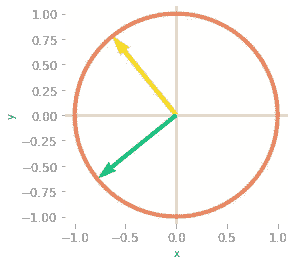***

****图 10:矩阵的效果****v****^*t*:到了这一步，你还是在二维空间。****

***您可以在图 10 中看到，基本向量已经旋转。***

***然后，需要对***【σ】***进行整形，因为函数`np.linalg.svd()`给出了包含奇异值的一维数组。你想要一个与*形状相同的矩阵:一个从 2D 到 3D 的 3 乘 2 矩阵。这个矩阵包含作为对角线的奇异值，其他值为零。****

****让我们创建这个矩阵:****

```
****array([[9.99274669, 0\. ], [0\. , 4.91375758], [0\. , 0\. ]])****
```

****您现在可以添加***【σ***的变换，在图 11 中以 3D 形式查看结果:****

***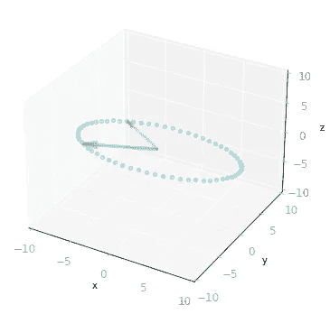***

****图 11:矩阵****v****^*t*和****σ****:由于****σ****是一个三乘二的矩阵，它将二维向量转化为三维向量。****

***最后，你需要操作基差的最后一个变化。你留在 3D 是因为矩阵*是一个 3 乘 3 的矩阵。****

********

*****图 12:三个矩阵****v****^**，****σ****和* ***U*** *的效果:变换是从三维空间到三维空间。*****

****您可以在图 12 中看到，结果与矩阵 ***A*** 相关的转换相同。****

# ***摘要***

******

***图 13:二维奇异值分解。(图片由作者提供)***

***图 13 总结了一个矩阵 ***一个*** 分解成三个矩阵。与*相关的变换由三个子变换完成。符号与图 13 中的相同，说明了 SVD 的几何透视图。****

****例如，奇异值分解可用于寻找近似矩阵的变换(参见[数据科学基础数学](https://bit.ly/3spjZte)第 10.4 节中的低秩矩阵近似)****

******这篇文章是我的书*数据科学基础数学*的样本！******

******

***在这里拿书:[https://www.essentialmathfordatascience.com/](https://www.essentialmathfordatascience.com/?utm_source=blog&utm_medium=medium&utm_campaign=medium_svd)！***