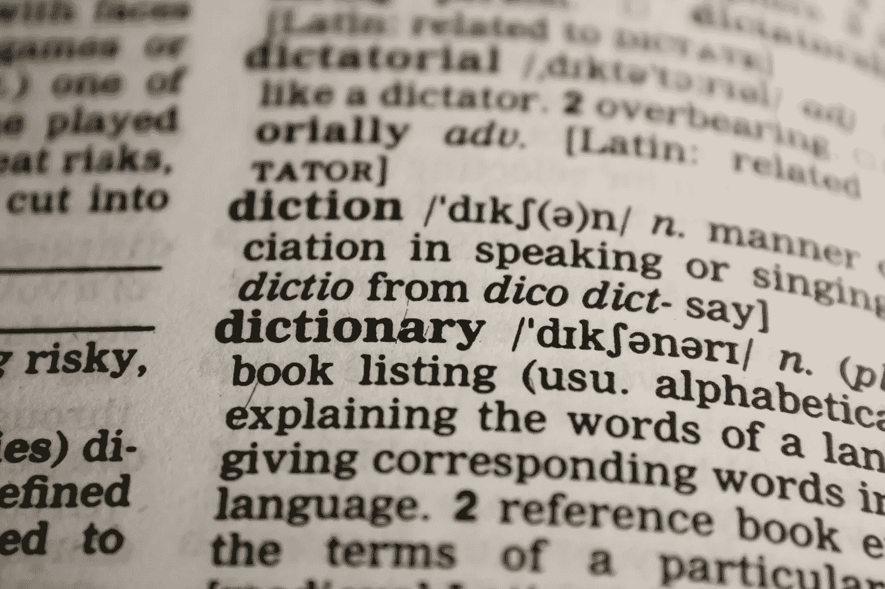

# 2021 年每个数据科学家都应该知道的基本 Python

> 原文：<https://towardsdatascience.com/essential-python-every-data-scientist-should-know-in-2021-65e571c20d19?source=collection_archive---------18----------------------->

## 将您的 Python 游戏提升 10 倍！


来自 [Pexels](https://www.pexels.com/photo/person-in-white-shirt-using-computer-4709289/?utm_content=attributionCopyText&utm_medium=referral&utm_source=pexels) 的 [cottonbro](https://www.pexels.com/@cottonbro?utm_content=attributionCopyText&utm_medium=referral&utm_source=pexels) 摄影

对于数据科学家来说，Python 就像空气一样重要。我们整天走路，聊天，思考 Python。但是，Python 是一个浩瀚的海洋，我们有时肯定会迷路。本文旨在成为一座灯塔，让您回忆起自己在 Python 海洋中的位置。这里是对所有数据科学家的 Python 复习。

# 目录


照片由[苏西·黑兹伍德](https://www.pexels.com/@suzyhazelwood?utm_content=attributionCopyText&utm_medium=referral&utm_source=pexels)从[派克斯](https://www.pexels.com/photo/notebook-1226398/?utm_content=attributionCopyText&utm_medium=referral&utm_source=pexels)拍摄

## 创造

```
l = [] # initialize a listl = [0] * n # initializes a list of 0s with n elements
```

## 分配

```
l[i] = val # assignment of ith valuel[i:j] = newlist # replace ith to jth-1 elements with all elements of newlist
```

## 检查东西

```
x in l # checks if x is in lx not in l # checks if x isn’t in l
```

## 发现事情

```
len(l) # returns length of listmin(l) # returns minimum element of listmax(l) # returns maximum element of listsum(l) # return sums of elements in listl.index(x) # returns index of first occurence of x in ll.index(x, s) # returns index of first occurence of x in l starting from sth positionl.index(x, s, e) # returns index of first occurence of x in l from sth to eth — 1 positionl.count(x) # returns number of total occurences of x in l
```

## 把东西拿出来

```
l[i] # return ith elementl[i:j] # returns ith to jth — 1 element l[i:j:k] # return list from ith to jth — 1 element with step kl[i:] # returns list after ith element l[:j] # returns list until jth — 1 elementl[-1] # returns last elementl[:-1] # returns all but the last element
```

## 扔东西

```
l.pop() # returns and removes last element from the listl.pop(i) # returns and removes i-th element from the listl.remove(i) # removes the first item from the list whose value is i
```

## 破坏东西

```
del l[i] # deletes ith elementdel l[i:j] # deletes ith to jth — 1 elementsdel l[i:j:k] # deletes ith to jth — 1 elements with step kdel l # deletes list ll.clear() # deletes all elements in l
```

## 放东西进去

```
l.append(item) # adds item to the last of list ll.insert(ind, item) # add item at index ind in list l l.extend(m) # add elements of m to the end of list l l += m # add elements of m to the end of list l
```

## 一些就地(没有额外的内存使用)的东西

```
l.reverse() # reverses the elements of the listl.sort() # sorts list l 
```

## 一些额外的技巧

```
list(set(l)) # returns list of unique elements in lzip(list1, list2) # returns list of tuples with n-th element of both list1 and list2sorted(l) # returns sorted copy of listsorted(l, key=lambda x: x[0]) # works on list of lists or list of tuples, returns copy of l sorted according to first element of each element list(reversed(l)) # returns reversed list l",".join(l) # returns a string with list elements seperated by commalist(enumerate(l)) # return a list of tuples (index, value at index)from collections import Counter; Counter(l) # return dictionary with counts of each unique elements in l
```

# 词典



照片由[像素](https://www.pexels.com/photo/black-and-white-book-business-close-up-267669/?utm_content=attributionCopyText&utm_medium=referral&utm_source=pexels)的 [Pixabay](https://www.pexels.com/@pixabay?utm_content=attributionCopyText&utm_medium=referral&utm_source=pexels) 拍摄

## 创造

```
d = {} # creates empty dictionaryd1 = {‘a’: 1, ‘b’: 2, ‘c’: 3} # just give keys and valuesd2 = dict(zip([‘a’, ‘b’, ‘c’], [1, 2, 3])) # give two list of equal length and zip them d3 = dict([(‘a’, 1), (‘b’, 2), (‘c’, 3)]) # give a list of pair tuples# d1, d2, d3 yield the same output
```

## 把东西拿出来

```
d[k] # returns value against key k in dd.get(k) # returns value aginst key k in dd.keys() # returns keys of dd.values() # return values in dd.items() # return tuples of key-value pairsiter(d) # returns an iterator over keys in dreversed(d) # returns a reversed iterator over keys in dlist(d) # returns list of keys in dlen(d) # return number of items in d
```

## 改变事物

```
d[k] = v # reassigns value of key k to vd.update(new) # updates d according to dictionary or list of pair tuples newd |= new # updates d according to dictionary or list of pair tuples new (in Python 3.9)
d | new # merges d and new, values in new take precedence (in Python 3.9)d.setdefault(k) # return value of key k if it exists, else adds key k to d with value Noned.setdefault(k, v) # return value of key k if it exists, else adds key k to d with value k
```

## 破坏东西

```
del d[k] # deletes key k from d d.pop(k) # return value against key k and remove key k from dd.popitem() # removes and returns a (key, value) pair from d (LIFO {Last In First Out} order)
```

## 检查东西

```
k in d # checks if key k is in dk not in d # checks if key k is not in d
```

## 额外奖励

```
d = {v: k for k, v in d.items()} # interchanges keys with values in dictionary
```

# 线


照片由[斯蒂夫·约翰森](https://www.pexels.com/@steve?utm_content=attributionCopyText&utm_medium=referral&utm_source=pexels)从[像素](https://www.pexels.com/photo/closed-up-image-of-gray-textile-985341/?utm_content=attributionCopyText&utm_medium=referral&utm_source=pexels)拍摄

## 创造

```
s = ''s = ""
```

## 把东西拿出来

```
l[i] # return ith elementl[i:j] # returns ith to jth — 1 element l[i:j:k] # return list from ith to jth — 1 element with step kl[i:] # returns string after ith element l[:j] # returns string until jth — 1 elementl[-1] # returns string elementl[:-1] # returns all but the last element
```

## 你需要的常量

```
import string # mandatory for everything in this sectionstring.ascii_letters # 'abcdefghijklmnopqrstuvwxyzABCDEFGHIJKLMNOPQRSTUVWXYZ'string.ascii_lowercase # 'abcdefghijklmnopqrstuvwxyz'string.ascii_uppercase # 'ABCDEFGHIJKLMNOPQRSTUVWXYZ'string.digits # '0123456789'string.punctuation # '!”#$%&\’()*+,-./:;<=>?@[\\]^_`{|}~'string.whitespace # ' \t\n\r\x0b\x0c'; \x0b is \v (vertical tab), \x0c is \f (form feed)string.printable # = digits + ascii_letters + punctuation + whitespace
```

## 美化你的琴弦

```
s.capitalize() # captilizes (first character becomes uppercase) the strings.lower() # all characters become lowercases.casefold() # more rigorous lowercase (languages other than English are covered)s.upper() # all characters become uppercase
```

## 寻找东西

```
s.count(sub) # count occurences of substring sub in ss.count(sub, start) # count occurences of substring sub starting from start position in string ss.count(sub, start, end) # count occurences of substring sub from start to end — 1 position in string ss.find(sub) # returns index of first occurence of substring sub in s, return -1 if not founds.find(sub, start) # returns index of first occurence of substring sub starting from start position in string s, returns -1 if not founds.find(sub, start, end) # returns index of first occurence of substring sub from start to end — 1 position in string s, return -1 if not founds.index(sub) # returns index of first occurence of substring sub in s, raises error if not founds.index(sub, start) # returns index of first occurence of substring sub starting from start position in string s, raises error if not founds.index(sub, start, end) # returns index of first occurence of substring sub from start to end — 1 position in string s, raises error if not foundlen(str) # returns length of string
```

## 检查东西

```
s.startswith(prefix) # checks if s starts with prefixs.startswith(prefix, start) # checks if s starts with prefix starting from start positions.startswith(prefix, start, end) # checks if s starts with prefix starting from start position until end — 1 positions.endswith(suffix) # checks if s ends with suffixs.endswith(suffix, start) # checks if s ends with suffix starting from start positions.endswith(suffix, start, end) # checks if s ends with suffix starting from start position until end — 1 positions.isalnum() # checks if string is alphanumerics.isalpha() # checks if string contains only alphabetss.isnumeric() # checks if string contains only numberss.islower() # checks if all alphabets in string s are lowercases.isupper() # checks if all alphabets in string s are uppercases.isspace() # checks if s is a space character
```

## 改变事物

```
s.replace(old, new) # replaces substring old with substring news.replace(old, new, count) # replace substring old with substring new for count number of times starting from left side of string ss.ljust(width) # puts width — len(s) spaces on the right side of string ss.ljust(width, fillchar=c) # puts character c width — len(s) times on the right side of string s s.rjust(width) # puts width — len(s) spaces on the left side of string ss.rjust(width, fillchar=c) # puts character c width — len(s) times on the left side of string ss.strip() # all spaces gone left and right both sides of string ss.lstrip() # all spaces gone on left side of string s s.rstrip() # all spaces gone on right side of string ss.strip(k) # all substrings k gone left and right both sides of string ss.lstrip(k) # all substrings k gone on left side of string ss.rstrip(k) # all substrings k gone on right side of string ss.split(‘,’) # splits the string by ‘,’; returns a lists.split(‘::’) # splits the string by ‘::’; returns a list s.split(‘ ‘) # splits the string by ‘ ‘; returns a lists.zfill(width) # adds width — len(s) zeros on the left side; if a +/- sign is there then zeros are added after it
```

## 奖励诡计

```
s.join(l) # joins a list or string l with substring s
```

# 结论

Python 是 Google 和 Guido von Rossum 送给我们的健康礼物。还有很多东西有待探索。本文提供了一些现成的复习资料和技巧，帮助您进一步加深对 Python 的了解。

# 阿布舍克·维尔马

*   *如果你喜欢这个，* [*在 Medium 上关注我*](https://medium.com/@deeptechtalker) *获取更多*
*   *我们来连线上* [*LinkedIn*](https://www.linkedin.com/in/abhishek-verma-3b63479a/)