# Python 中的主标注处理

> 原文：<https://towardsdatascience.com/essential-python-string-processing-techniques-aa5be43a4f1f?source=collection_archive---------13----------------------->

## 关于在 Python 中处理字符串类型数据的完整教程。


[图像来源](https://pixabay.com/images/id-173588/)

# 介绍

在数据科学和计算机编程的广阔世界中，有许多不同的数据类型都需要以某种方式来处理。在计算中，我们非常习惯于频繁地与数字和数学打交道来完成目标。然而，虽然计算机可能会用数字说话，但人类不会，包含字符的数据在计算机编程中被称为字符串数据类型。

字符串数据类型可用于表示任何类型的值。这可以是整个段落，例如元代码，或者甚至只是一个单词或字符。也就是说，string 数据类型对于促进这类数据是完全必要的，这类数据是数据生态系统的重要组成部分。通常，在处理数据时，我们需要大规模地操纵数据，以便实际使用数据，这一点在字符串的例子中最为明显。

幸运的是，Pythonic 的 str 类实际上非常容易使用，甚至可以使最复杂的操作看起来简单！在编程中，字符串和其他数据类型的一个很大区别是，计算机本身并不真正理解字符串。计算机在数字中工作，所有的字符串都是在没有这些数字的高层次上呈现的，但在幕后，我们可以使用很多技术来转换这些字符串，使其更容易被计算机解释。

> [笔记本](https://github.com/emmettgb/Emmetts-DS-NoteBooks/blob/master/Python3/mastering%20string%20manipulation.ipynb)

# str 类

str 类是 Python 命名字符串的奇怪方式，它提供了一些很好的功能来简化字符串操作。重要的是要记住，Python 语言的一大优势是其数据和脚本的高级接口，这一点从第一天起就备受推崇。当然，为了打开文件、编写文本和处理数据，数据类型必须便于适当地处理字符串和 IO。因此，str 类实际上非常善于管理其中的字符数据。然而，为了正确理解 str 类，对它进行一点解构可能是个好主意。

## 创建字符串

每当我们在数据上使用断言操作符时，Python 都会检查它的基本数据类型，以便为所提供的数据找到准确的匹配。这当然是 true 或 string，可以这样构造:

```
string = "Hello, my name is Emmett :)"
```

现在让我们来看看这个新字符串的类型:

```
type(string)
```

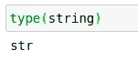

(图片由作者提供)

## 循环

首先，需要注意的是，这种类型实际上是可迭代的。一个字符串只是一个按顺序显示的字符列表，和列表一样，我们可以称之为字符串的索引。这也意味着我们可以使用将 iterable 作为 str 对象的参数的方法，例如 len():

```
string[1]
string[0]
len(string)
```

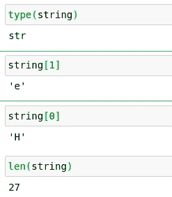

(图片由作者提供)

这也意味着我们可以在常规的 for 循环中使用这个对象。

```
for char in string:
    print(char)
```

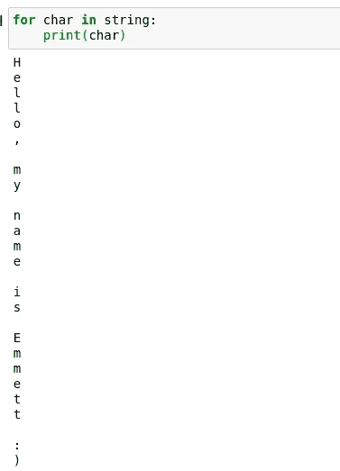

(图片由作者提供)

## 功能

如您所料，str 类还包含许多函数，可以非常有效地用来操作字符串中包含的字符。当然，可能要花很长时间才能真正看完它们，但我会展示我发现最有用的几个！列表中第一个是 strip()函数。这个函数用于从字符串中删除前后的空格。考虑以下字符串:

```
h = "    This string starts and ends with spaaaace               "
```

这个字符串本身前后都有很多空格，如果我们试图使用这个字符串来处理一个模型，这可能会很成问题！通过使用 strip()函数删除所有多余的空白，我们可以非常简单快速地解决这个问题。

```
print(h.strip())
```

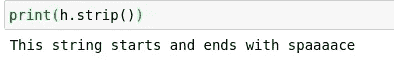

(图片由作者提供)

这个类中另一个很酷的函数是 replace()函数。这用于将某些字符组合替换为其他字符组合。看看这个:

```
ex = "I love Data Science"
ex.replace("Data", "Biological")
```

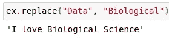

(图片由作者提供)

isalnum()和 isalpha()分别是一组方便的方法，可以用来探索字符串类型的数据。这两个函数可用于返回一个布尔值，该值将区分字符串是否包含数字。还有一些类似的方法可以用来判断一个字符串实际上是浮点数还是整数，但是现在，让我们来看看这两种方法的用法:

```
numbers = “2”
nonumbs = “two”
print(numbers.isalpha())
print(nonumbs.isalpha())
print(numbers.isalnum())
print(nonumbs.isalnum())
```

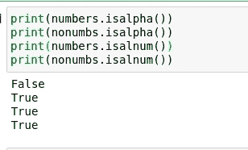

(图片由作者提供)

我发现自己经常使用的另一个很酷的功能是 rfind()。这个函数返回一个字符串的索引，在这个字符串中找到一组给定的字符。考虑下面的例子，它详细描述了我如何假设我可能会喜欢一种我从未尝试过的食物:

```
txt = "I like fish. I like tacos. So I like fish tacos!"x = txt.rfind("fish")
z = txt.rfind("like")
print(x, z)
```

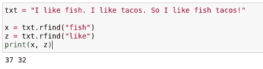

(图片由作者提供)

Python 类中另一个很棒的字符串函数的例子是 partition()方法。这个函数可以用来根据一个逻辑中心将一个字符串分成三个独立的部分。在我们的鱼玉米卷的例子中，我把这个应用到中间的句子，我喜欢玉米卷，让我们看看产生了什么结果:

```
fish1, fish2, fish3 = txt.partition("I like tacos.")
print(fish1)
print(fish2)
print(fish3)
```

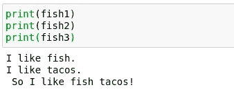

(图片由作者提供)

使用 index()函数，我们还可以获得任何给定字符集的索引。在本例中，我使用它分别打印出 fish 的字符，方法是在基于这两个值对字符串进行索引之前获取索引和长度，以便只接收我们最初索引的字符串:

```
searchingfor = "fish"
print(txt.index("fish"))
start = txt.index("fish")
sl = len(searchingfor)
for i in range(start, start + sl):
    print(txt[i])
```

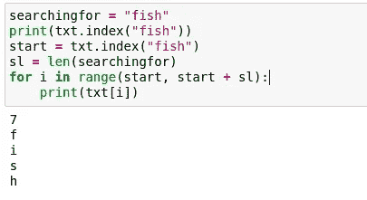

(图片由作者提供)

## 一张便条

我们刚刚看到的所有这些函数都很棒，但是在数据科学中，我们实际上使用单个大字符串的频率有多高呢？正确的答案是根本不经常，所以知道如何将这些技术应用于整个字符串列表而不仅仅是单个字符串是很重要的。为此，我们通常使用 Pandas apply()函数，该函数将获取一个 lambda 表达式，并将其应用于整个系列或数据帧类型。

```
import pandas as pd
listofstr = ["Hello", "Hi", "Hello", "Hi"]
nums = [5, 10, 15, 20]
df = pd.DataFrame({"A" : listofstr, "B" : nums})
df["A"] = df["A"].apply(lambda x: x.replace("H", "W"))
df.head(5)
```

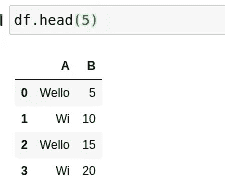

(图片由作者提供)

## 正则表达式

关于 str 类和字符串，我想谈的另一件事是正则表达式的概念。正则表达式是编译器的上下文调用，允许程序员扩展字符串的功能。也就是说，它们在某种程度上对于用字符串编程的坚实基础是必不可少的，但只是作为一个例子，我将演示\n，\n 是一个用于创建新行的正则表达式。有很多正则表达式可以放在字符串中来改变它们的行为方式，当然这只是处理字符串的冰山一角。

```
poem = """I tried a career called data science,\n Then befriended a colony of ants\n
The ants ate my sugar,\n
so i took my cooler,\n
and flooded, so harshly, their pants"""
print(poem)
```

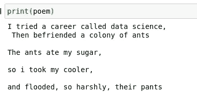

(图片由作者提供)

# 编码

字符串是一种很好的数据形式，但是就计算机语言而言，它们对计算机来说毫无意义。计算机将字符和文本解释为用 Unicode 或 ANSI 表示的任意浮点数。由于这些字符对计算机来说是完全任意的，对我们来说是主观的，为了实际使用这些数据进行机器学习，甚至统计，我们需要对其进行编码。编码是将任意字符转换成没有任何意义的真实数据的好方法。有许多类型的编码器，但主要使用的三种是标签编码器，普通编码器和一个酒店编码器。

Onehotencoding 通过将每个单独的类别作为布尔型特征来扩展字符串的维度。这可能是积极的，也可能是消极的，取决于应用程序，因为有时这种更高的维度会导致一些严重的问题，但有时它会非常有帮助。如果您的要素是一个很小的类子集，那么这一点尤其正确，在这种情况下，维度的权衡将不会像仅使用少量维度那样明显。我们可以使用 Sklearn 附带的 Onehotencoder 来实现这一目标:

```
from sklearn.preprocessing import OneHotEncoder
```

现在让我们用一些基于类的字符串制作一个数据框架:

```
df = pd.DataFrame({"Danger_Level": ["A", "A", "C", "D", "C", "A", "B"],
                   "Layer_Count": [5, 6, 12, 19, 13, 6, 9]})
```

现在，我们将通过调用不带参数的构造函数来初始化编码器:

```
encoder = OneHotEncoder()
```

接下来，我们需要让我们的单个特征改变它的形状。这是因为 SkLearn 更喜欢我们处理矩阵，而不是数据帧中的一维数组。通常，在矩阵中，特征是通过垂直方向的观察而不是水平方向的观察列出的。因此，我们的特性看起来像是一堆不同的特性，每个特性只有一个样本——但事实并非如此。为了解决这个问题，我们需要将它转换成一个 NumPy 数组，然后对它进行整形:

```
import numpy as np
dl = np.array(df["Danger_Level"]).reshape(-1, 1)
```

现在，我们可以在编码器中调用 fit_transform()方法，以便对新的 dl NumPy 数组进行编码:

```
output = encoder.fit_transform(dl)
```

普通编码器也可以这样做。OrdinalEncoder 不同于 OneHot 编码器，它保留了我们的特征的维度。编码器只是将类映射到整数值，然后在匹配时替换数据中的这些值:

```
from sklearn.preprocessing import OrdinalEncoder
encoder = OrdinalEncoder()
encoder.fit_transform(dl)
```

我们要看的最后一种编码器是浮点或标签编码器。这种编码器通常用于矢量化和自然语言处理，但当应用于分类问题时，本质上与顺序编码器一样，只是使用字符中的浮点组合作为映射数。

```
from sklearn.preprocessing import LabelEncoder
encoder = LabelEncoder()
encoder.fit_transform(dl)
```

# 结论

字符串可能是一种有趣的数据类型，因为它们对人类来说是主观经验，而对计算机来说是不存在的，但尽管如此，它们对数据科学家经常处理的许多数据来说肯定非常重要。幸运的是，Python 拥有处理这些数据类型的非常坚实的基础，了解这方面的正确方法可以节省大量时间！非常感谢你的阅读，祝你好运！