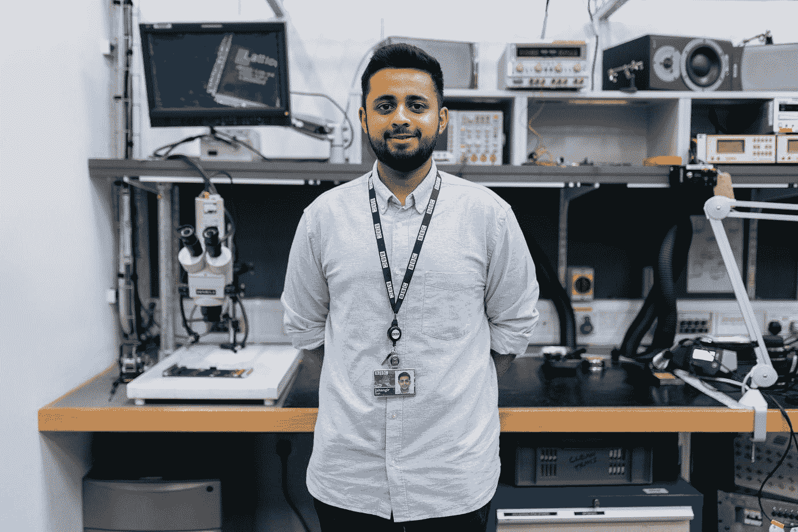

# 机器学习工程师的基本技能

> 原文：<https://towardsdatascience.com/essential-skills-for-machine-learning-engineers-720938c6e12b?source=collection_archive---------7----------------------->

## 打造机器学习工程师

在 [Unsplash](https://unsplash.com?utm_source=medium&utm_medium=referral) 上拍摄的 [ThisisEngineering RAEng](https://unsplash.com/@thisisengineering?utm_source=medium&utm_medium=referral)

你喜欢开发软件，但是对数据科学非常感兴趣吗？如果是这样，你可能要考虑机器学习工程师的角色。机器学习工程师位于软件工程和数据科学的交汇点——这意味着如果你真的想出类拔萃，你需要这两种技能。

数据科学家的重点是将分散的数据转化为可操作的见解。另一方面，机器学习工程师专注于开发利用数据的工作软件以及自动化预测模型。

</overview-of-data-related-roles-70ca48f8deed> [## 数据相关角色概述

### 不同视角的数据](/overview-of-data-related-roles-70ca48f8deed) 

以下是所需技能的总结:

## 软件工程

计算机科学基础对机器学习工程师至关重要；很好地掌握数据结构和算法，如多维数组、数组、堆栈、队列、树等。ML 工程师还应该能够编写能够搜索、排序和优化代码的算法。进一步补充，对可计算性、复杂性和计算机架构的理解都是必要的。

由于机器学习工程师的最终输出通常是可交付的软件，ML 工程师必须很好地了解软件的各个不同部分如何工作和通信，以便为您的组件构建合适的接口。

## 数据科学

数据科学家通常非常依赖编程语言，如 Python、R、SQL、Java 等。他们在概率和统计方面也有坚实的基础——主题包括:

*   假设检验
*   可能性
*   [贝叶斯法则](/algorithms-from-scratch-naive-bayes-classifier-8006cc691493)
*   结石
*   [条件概率](/marginal-joint-and-conditional-probabilities-explained-by-data-scientist-4225b28907a4)
*   [隐马尔可夫模型](/part-of-speech-tagging-for-beginners-3a0754b2ebba)
*   分布

> **注**:这绝不是一份详尽的清单。更多阅读我的文章，[2021 年学习数据科学的课程](https://medium.com/analytics-vidhya/courses-to-learn-data-science-in-2021-a52e64344e5c)

此外，ML 工程师应该有娴熟的数据建模和评估技能。数据建模是训练学习算法以预测给定一组特征的标签的过程。

建模的目标是识别有用的模式，这些模式最好地允许模型推广到新的看不见的实例——这就是评估发挥作用的地方。在机器学习项目的开始，将使用任务的最合适的评估度量来确定算法执行得有多好。

## 机器学习

许多广泛使用的机器学习算法可以通过第三方库实现，如 Scikit-Learn、Keras、TensorFlow、PyTorch、MLlib 等。然而，有效地应用这些算法包括选择适合手头问题的模型、优化方法以及了解超参数对学习的影响。

此外，ML 工程师应该擅长超参数调整。超参数是用于控制学习过程的参数值，因此超参数调整可以描述为为学习算法选择一组最佳超参数的问题。

ML 工程师可能需要了解的一些其他工具(取决于他们工作的公司)包括:

*   Spark 和 Hadoop
*   阿帕奇卡夫卡
*   谷歌云 ML 引擎
*   亚马逊机器学习
*   Azure 机器学习
*   IBM 沃森

## 机器学习工程师自学路径

和数据科学一样，成为一名机器学习工程师需要学习的东西也很多。假设我们已经学习了基础数学要求，下面我会留下一些好的资源来帮助你练习 ML 工程师技能集的各个部分:

**软件工程&编程**

<https://leetcode.com/problemset/all/>  <https://www.hackerrank.com/dashboard>  

**数据科学&机器学习**

<https://www.kaggle.com/>  <https://datahack.analyticsvidhya.com/?utm_source=main-logo>  

**课程**

*   [斯坦福的机器学习](https://www.coursera.org/learn/machine-learning)
*   [通过深度学习实现深度学习专业化。艾](https://www.coursera.org/specializations/deep-learning)
*   [成为机器学习工程师纳米学位](https://www.udacity.com/course/machine-learning-engineer-nanodegree--nd009t)
*   [生产中的机器学习简介](https://www.coursera.org/learn/introduction-to-machine-learning-in-production)
*   [汗学院计算机科学原理](https://www.khanacademy.org/computing/ap-computer-science-principles)
*   [可汗学院的算法](https://www.khanacademy.org/computing/computer-science/algorithms)

## 包裹

随着数据科学继续从研究转向生产，对 ML 工程师的需求一直在快速增长。如果你有构建优秀软件的诀窍，但仍然热爱数据科学，ML 工程师之路可能是适合你的。

感谢您的阅读！

如果你喜欢这篇文章，请通过订阅我的**免费** [每周简讯](https://mailchi.mp/ef1f7700a873/sign-up)与我联系。不要错过我写的关于人工智能、数据科学和自由职业的帖子。

</my-biggest-challenges-being-a-self-taught-data-scientist-e389f365f70c>  </5-laws-for-self-taught-data-professionals-4bf351ac5c24> [## 自学成才的数据专业人员的 5 条法则

towardsdatascience.com](/5-laws-for-self-taught-data-professionals-4bf351ac5c24) </data-scientist-should-know-software-engineering-best-practices-f964ec44cada> 