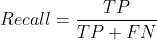
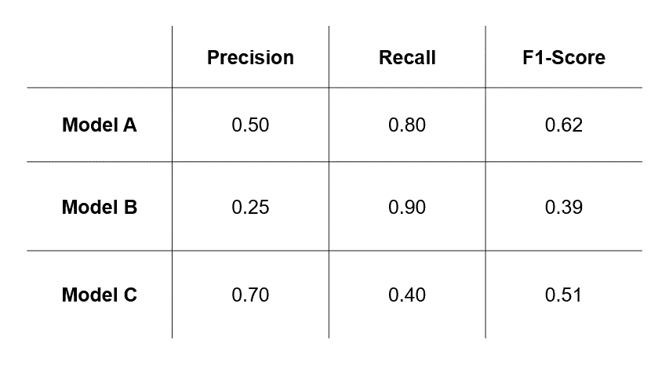

# 关于 F1-Score 你需要知道的重要事情

> 原文：<https://towardsdatascience.com/essential-things-you-need-to-know-about-f1-score-dbd973bf1a3?source=collection_archive---------3----------------------->

## 了解 F1 分数的关键基础知识，F1 分数是机器学习中最重要的评估指标之一。

一级方程式赛车(照片由[斯潘塞·戴维斯](https://unsplash.com/@spencerdavis?utm_source=medium&utm_medium=referral)在 [Unsplash](https://unsplash.com?utm_source=medium&utm_medium=referral) 上拍摄)

# 目录

1.  [简介](#782b)
2.  [精确和召回:一个回顾](#9ffb)
3.  假阳性和假阴性哪个更糟糕？
4.  [F1 得分背后的动机](#d3cf)
5.  [什么是 F1-Score？](#4c6c)
6.  [精准、召回还是 F1 评分？](#07a9)
7.  [为什么谐音是指？](#90cb)
8.  [结论](#90cb)

# 1.介绍

F1 值是机器学习中最重要的评价指标之一。它通过结合两个相互竞争的指标——精确度和召回率，很好地总结了模型的预测性能。这篇文章是我前两篇关于准确度、精确度和召回的文章的延伸，我鼓励你去看看！

<https://medium.com/mlearning-ai/evaluating-classification-models-why-accuracy-is-not-enough-abf3d9c93a69>  </precision-and-recall-made-simple-afb5e098970f>  

在这篇文章中，我将涵盖所有你需要知道的关于 F1 分数的重要事情。我将通过解释何时使用 precision 或 recall 来设置上下文。接下来，我将定义 F1-score，并解释何时应该使用它。最后，我将比较两个数字平均的不同类型——包括调和平均数、几何平均数和算术平均数——并讨论为什么 F1 得分基于调和平均数。

# 2.精确度和召回率:回顾

如果不首先设定精确和回忆的上下文，就不可能讨论 F1 分数。简言之，精确度和召回率是帮助我们评估分类模型对特定**兴趣**类别(也称为**正面类别**)的预测性能的指标。

*   精度:在所有积极的预测中，有多少是真正积极的？
*   **回忆**:在所有真实阳性病例中，有多少是预测阳性？

形式上，精确度和召回率被定义为:

# 3.假阳性和假阴性哪个更糟糕？

那么，什么时候应该使用精确，什么时候应该使用回忆呢？仔细想想，精确度和召回率都衡量模型的预测性能，但方式不同。精确度测量由假阳性(FPs)引起的错误的程度，而召回测量由假阴性(FNs)引起的错误的程度。因此，为了决定使用哪个度量，我们应该**评估这两种类型的错误对我们用例**的相对影响。因此，我们应该问的关键问题是:

> "对于我们的用例，哪种类型的错误——FPs 或 FNs——更不受欢迎？"

让我们通过回顾我们的癌症预测例子来理解这一点。图 1 显示了总结假设预测结果的混淆矩阵。在这四种情况中，情况#2 和#3 是不可取的。

图 1:癌症预测的混淆矩阵(图片由作者提供)

*   场景#2 代表 **FPs** 。在 900 名真正没有患癌症的病人中，模型显示其中 80 人患了癌症。这 80 名患者可能会接受昂贵和不必要的治疗，以牺牲他们的健康为代价。
*   场景#3 代表 **FNs** 。100 个真正患有癌症的病人中，模型显示其中 20 个没有。这 20 名患者将无法确诊，也无法接受适当的治疗。

在这两种情况之间，哪个更不可取？我们可以说这是第三种情况。不接受任何可能危及生命的治疗可能比接受不必要的治疗更糟糕。由于 FNs 造成的误差影响被评估为更为显著，因此选择具有尽可能少 FNs 的模型是有意义的。换句话说，我们应该用回忆代替精确。

那么，什么时候应该使用精度呢？许多真实世界的数据集通常没有标记，即我们不知道每个观测值属于哪个类。电子邮件是垃圾邮件还是火腿？一篇文章到底是不是假新闻？客户会流失吗？在这种用例中使用机器学习进行分类的一个关键好处是减少所需的人力。因此，对于模型**预测为正**的所有观察值，我们希望它们中有尽可能多的**真的为正**。换句话说，我们希望我们的模型尽可能精确。在这种情况下，精度应该比召回更重要。

# 4.F1 分数背后的动机

对于您的用例，您也有可能认为 FPs 和 FNs 引起的误差(几乎)同样不可取。因此，您可能希望模型的**帧数和帧数尽可能少**。换句话说，你可能希望**最大化精确度和召回率**。在实践中，由于精确度和召回率之间的权衡，不可能同时最大化精确度和召回率。

> 提高精度会降低召回率，反之亦然。

因此，给定不同模型的精度和召回值对，您将如何比较并决定哪一个是最好的？答案是——你猜对了——F1——分数。

# 5.F1-Score 是什么？

根据定义，F1 分数是精确度和召回率的调和平均值。它使用以下公式将精度和召回率合并为一个数字:

这个公式也可以等价地写成:

请注意，F1-score 同时考虑了精确度和召回率，这也意味着它同时考虑了 FPs 和 FNs。精确度和召回率越高，F1 分数越高。f1-分数范围在 0 到 1 之间。越接近 1，模型越好。

# 6.精确度、召回率还是 F1 分数？

既然我们已经讨论了基础知识，让我们来看看在精确度、召回率和 F1 分数之间进行选择的思考过程。假设我们训练了三个不同的癌症预测模型，每个模型都有不同的精度和召回值。

图 2:使用精确度、召回率或 F1 分数的模型选择(作者的动画 GIF)

*   如果我们评估 FPs 引起的**误差**(图 1 中的场景# 2)**更不可取**，那么我们将**基于精度**选择模型，并选择模型 c
*   如果我们评估 FNs (图 1 中的场景# 3)**导致的**错误更不可取**，那么我们将**基于召回**选择一个模型，并选择模型 b。**
*   然而，如果我们评估**两种类型的错误都是不期望的**，那么我们将**基于 F1 分数选择一个模型**并选择模型 a。

因此，这里的要点是**您选择的模型在很大程度上取决于您选择的评估指标**，而评估指标**又取决于您的用例中 FPs 和 FNs** 误差的相对影响。

# 7.为什么调和平均？

我简单提到过 F1 分数是“精确度和召回率的调和平均值”。**谐音表示**是什么意思？当然，还有其他方法可以将两个数字合并成一个数字……例如**算术平均值**或**几何平均值**(它们的数学公式见图 3)。

图 3:两个数的调和、算术和几何平均值(图片由作者提供)

关于调和、算术和几何平均的更多详细信息，我推荐下面这个由[丹尼尔·麦克尼克](https://medium.com/u/2d441c4de574?source=post_page-----dbd973bf1a3--------------------------------)写的帖子。

</on-average-youre-using-the-wrong-average-geometric-harmonic-means-in-data-analysis-2a703e21ea0>  

如果你在谷歌上搜索 F1-score 为什么要用调和平均值，你会找到类似“调和平均值更多地惩罚不相等的值”和“调和平均值惩罚极值”这样的答案。一开始我很难理解他们。因为我喜欢简化概念，所以我在图 4 中创建了一个交互式 3D 散点图来帮助我更好地理解。实际上，这个 3D 散点图比较了**谐波、算术和几何平均值如何随着不同组的精度和召回值**而变化。请随意使用它！

图 4: 3D 互动图表，说明调和、算术和几何平均的各自行为(图片由作者提供)

*另外，我不会仔细检查用于生成图 4 的代码，因为那超出了本文的范围，但是可以在我的*[*GitHub repo*](https://github.com/zeyalt/My-Articles/blob/master/Machine%20Learning/Essential%20Things%20You%20Need%20to%20Know%20About%20F1-Score/visualise_means_3d.py)*查看。*

从图 4 中我们可以得出一些有趣的观察结果:

1.  **当且仅当精度和召回率相等时，三种类型的方法是相同的**。请注意红色散点如何仅沿精度-召回轴的对角线与蓝色和绿色散点相交(即当精度=召回时)。
2.  **当精度和召回率不相等时，调和平均值和几何平均值开始远离算术平均值**。红色散射点形成平面，而蓝色和绿色散射点形成曲面。
3.  **精度和召回值越不相等，调和平均值越低，超过几何和算术平均值**。调和平均值的蓝色散点图所代表的平面比几何和算术平均值的平面更“弯曲”。

照片由[阿莱西奥·索格蒂](https://unsplash.com/@asoggetti?utm_source=medium&utm_medium=referral)在 [Unsplash](https://unsplash.com?utm_source=medium&utm_medium=referral) 上拍摄

我们如何以直观的方式理解这些观察结果？让我们想象自己站在图 4 的最高点，这里精度和召回率都等于 1，三类均值都是 1。现在，假设我们沿着精度轴“走”平面的斜率，即我们将 recall 固定为 1，同时将精度从 1 降低到 0.95、0.90、0.85 等等，直到达到 0.05。当我们行走时，精确度降低，所有三种类型的平均值也降低。

然而，对于调和平均值，它下降得最厉害，因为它的平面是最“弯曲”的。在精度为 0.05 的点上，如果我们在代表调和平均值的平面上，我们会发现自己处于最低点。这里算术平均值是 0.525，几何平均值是 0.224，但是调和平均值只有 0.095！现在，对我(希望对你也是)来说，调和平均值“更多地惩罚不平等值”或“惩罚极端值”的事实的真正含义更有意义。

那么，F1-score 为什么是基于调和平均值的呢？很明显，**调和平均值不鼓励极大的不平等值和极低的值**。我们希望 F1 分数**在精确度或召回率较低**时*给出合理的*低分，并且只有调和平均值才能做到这一点。例如，当 recall 为 1 而 precision 为 0.05 时，算术平均值为 0.525 或几何平均值为 0.224 可能不足以传达精度非常低的事实，而调和平均值为 0.095 则足以传达这一事实。此外，如果精度或召回率为 0，使用调和平均值意味着 F1 得分将为 0。

# 8.结论

恭喜你！您已经了解到，选择精度、召回率还是 F1 分数来评估模型取决于 FPs 和 FNs 在您的使用案例中的相对影响。特别是，如果两种类型的错误都是不可取的，F1-score 会更合适。此外，你对 F1 分数基于调和平均值的原因有了更好的直觉。当然，机器学习中还有其他评估指标，但我特意将这篇文章主要集中在 F1 分数上。那好吧..请继续关注我的下一篇文章！

你好！我是泽雅。我喜欢将数据科学的概念分解成简单的小块，并给出清晰直观的解释。毕竟，这是我发现自己最有效的学习方式。通过分享我如何简化概念，我希望帮助人们降低学习数据科学的门槛。如果你觉得这篇文章有用，请在评论中告诉我。我也欢迎讨论、问题和建设性的反馈。请随时通过[媒体](https://zeyalt.medium.com/)关注我，或者通过 [LinkedIn](https://www.linkedin.com/in/zeyalt/) 或 [Twitter](https://twitter.com/zeyalt_) 联系我。祝您愉快！

# 参考

1.  比尔·威尔逊(2021 年 11 月 18 日)。理解调和平均数。[http://groups.di.unipi.it/~bozzo/The%20Harmonic%20Mean.htm](http://groups.di.unipi.it/~bozzo/The%20Harmonic%20Mean.htm)