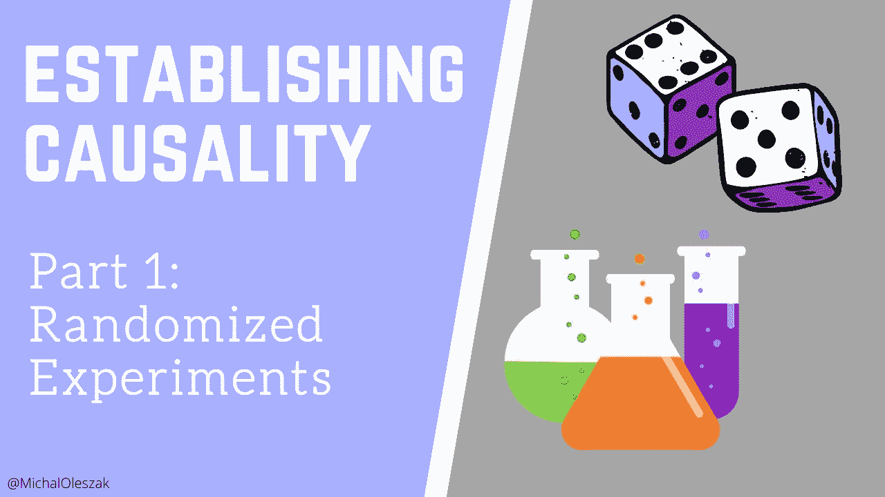
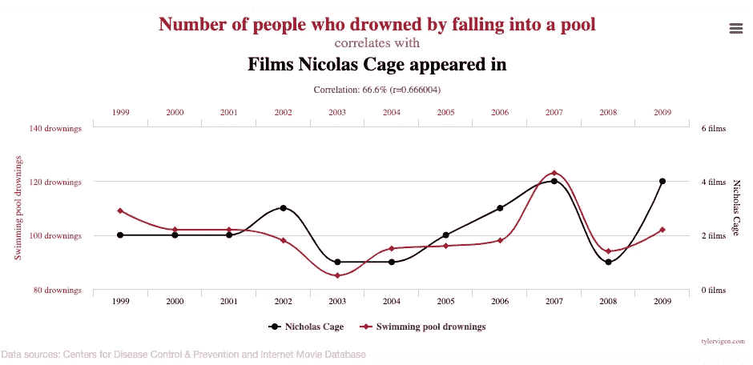
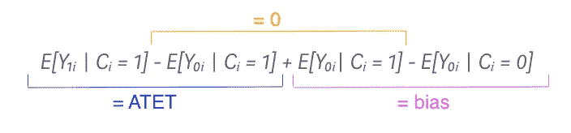

# 建立因果关系:第 1 部分

> 原文：<https://towardsdatascience.com/establishing-causality-part-1-49cb9230884c?source=collection_archive---------16----------------------->

## 随机实验的黄金标准

图片由作者提供。

能够建立因果关系是强大的。它赋予你在对话中使用“因为”这个词的权利。我们的销售额增加了，因为我们改变了网站布局。犯罪率下降了，因为新的预防政策已经出台了。准确定位因果关系对于数据驱动的决策至关重要，无论是在企业中优化公司运营，还是在政府中确保我们的税收以最有效的方式支出，政策有效运作。在这一系列文章中，我讨论了四种统计工具，它们为说“因为”提供了科学依据。

> 只有以严格的方式建立因果关系，你才有权利使用“因为”这个词。

我们要研究的四种因果关系估计方法是:

*   *随机实验*。
*   [*工具变量*](/establishing-causality-part-2-45ab696d2246)
*   [*回归不连续*](https://michaloleszak.medium.com/establishing-causality-part-3-3e8f8c546f9a)
*   [*差异中的差异*](https://michaloleszak.medium.com/establishing-causality-part-4-5d3b5e917790)

这个系列的第一部分集中在科学的黄金标准:随机实验。

## 相关性并不意味着因果关系

你可能以前听过这个。两件事同时发生的事实并不意味着其中一件是导致另一件的*。*看看这个臭名昭著的，在泳池中溺死的人数和尼古拉斯·凯奇电影上映数量之间近乎完美的相关性。

资料来源:[https://www.tylervigen.com/spurious-correlations](https://www.tylervigen.com/spurious-correlations)(抄送 4.0)

我们觉得这是一种虚假的关联。这两个变量之间的任何因果关系似乎都是荒谬的。但是撇开这个考虑，你怎么说是什么导致了什么呢？尼古拉斯·凯奇的电影很糟糕吗，人们看完之后会淹死自己吗？《溺水者》是否能以某种方式让凯奇发行更多电影？或者可能存在一个导致这两者的外部因素:糟糕的经济可能会使一些人陷入绝望，迫使凯奇出演更多的电影来增加他的收入。

资料来源:xkcd([https://xkcd.com/552/](https://xkcd.com/552))

为了回答因果关系相关的问题，我们需要严格的统计工具。最简单也是最理想的方法是随机实验。

## 潜在结果模型

在跳到随机实验之前，让我先介绍一下用于分析因果关系的框架，称为*潜在结果模型*。它的大部分词汇来自医学研究。实际上，因果关系估计也被称为*治疗评估。*这是因为该框架的早期应用侧重于评估为患者提供一些治疗*是否会导致*他们的健康状况改善。

让我们从一些符号开始。潜在结果模型中有两个感兴趣的变量:

*   *Cᵢ = {0，1}，*表示人 *i* 是否暴露于治疗，
*   Y *ᵢ，*人的结局*我的*。

治疗 *C = 1* 字面意思是用某种药物治疗病人，在这种情况下 *Y* 可以表示病人体内病毒的数量。但是 *C = 1* 也可以意味着向用户显示新的网站布局，而不是旧的布局( *C = 0)，*和 *Y* 可以测量用户在网站上花费的时间。无论我们想确定药物是否会改善健康，或者网站布局的改变是否会增加粘性，同样的框架也适用。

现在，单个患者 Y *ᵢ* 的结果可以取两个可能值中的一个，称为潜在结果:

*   Y₁ *ᵢ* 表示人 *i* 被治疗的结果(当 *Cᵢ = 1* )，
*   Y₀ *ᵢ* 表示如果人 *i* 没有被治疗的结果(当 *Cᵢ = 0* )。

自然，一个人不可能既被治疗又不被治疗，这就是为什么我们只观察两个价值中的一个。另一种被称为*反事实。*想象用户 *i* 被展示了新的网站布局，他们在网站上花了 50 秒，所以 Y₁ *ᵢ =* 50。我们不知道反事实的 Y₀ *ᵢ* 测量这个用户会在网站上花多长时间，如果他们看到旧的布局。

但是想象一下，我们可以在不同的现实之间移动，可以观察同一个人在两种情况下的结果:当他们接受治疗时和不接受治疗时。然后，我们可以简单地将这两个结果相减，得到人 *i* 的治疗效果:

> TEᵢ = Y₁ *ᵢ -* Y₀ *ᵢ*

如果我们的网站用户在旧布局下只花了 Y₀ *ᵢ =* 30 秒，那么对于这个特定用户来说，切换到新布局的治疗(或因果)效果将达到 50 - 30 = 20 秒。

如果我们有许多人的数据，我们可以将他们平均计算出*平均处理效果(ATE)* 来估计网站布局变化的平均影响 *:*

> E[Y₁ᵢ - Y₀ᵢ]

然而，在大多数情况下，我们对 ATE 并不真正感兴趣。通常，研究的目标是在证明有效的情况下，将治疗推广到更大的人群。例如，如果我们发现药物能使病人康复，我们会把它分发给每个人。如果新的网站布局能让用户更长时间地使用它，我们会向所有用户推广。因此，我们实际上感兴趣的量是对被治疗者的平均治疗效果的*，或 *ATET* 。这只是治疗对接受治疗的个体的平均影响:*

> E[Y₁ᵢ - Y₀ᵢ | Cᵢ = 1]

如果我们能够计算出 ATET，我们就能平均得出治疗的因果影响。但我们不是，因为我们无法知道公式中存在的反事实。我们能做些什么呢？

## 幼稚的比较？

如果我们只看治疗组和未治疗组之间平均结果的差异呢？

> 天真的比较= E[Y₁ᵢ | Cᵢ = 1] - E[Y₀ᵢ | Cᵢ = 0]

平均而言，服用药物的患者每 1cm 组织中有 90 个病毒细胞，而没有服用药物的患者有 140 个。这是否证明了药物对病毒的因果影响？可惜没有。看看为什么让我们增加和减少接受治疗的患者的反事实 Y₀ᵢ。通过加减相同的东西，我们不会打破等式，现在等式是:

添加这两个相互抵消的项(用橙色标记)让我们注意到，这样一个天真的比较实际上是 ATET 加上其他一些项。另一个术语被称为*选择偏差*。如果选择偏差为零，那么这样一个简单的比较将会产生治疗的因果效应。

> 因果效应估计完全是为了摆脱选择偏差。

然而，通常它不是零。选择偏倚与个体选择治疗的原因有关，消除它是建立因果关系的主要挑战。幸运的是，有一个银弹。

## 进入随机实验

银弹被称为随机实验，非常简单。你所需要做的就是将这些人随机分成两组:治疗组，他们将接受治疗，而对照组，则不会。

这背后的想法是，如果样本足够大，并且分割是真正随机的，那么所有其他与治疗无关但可能影响结果的特征，将在两组中分散开来。两组都将包含高个子和矮个子、聪明的和愚蠢的、年轻的和年老的、有抵抗力的和易受影响的人，比例相似。治疗组和对照组之间的唯一区别在于治疗。

另一种说法是，在没有治疗的情况下，两组是相同的。从统计学上来说:

> E[Y₀ᵢ | Cᵢ = 0] = E[Y₀ᵢ | Cᵢ = 1]，

或者:如果没有进行治疗，治疗组的平均结果将与对照组相同。你可能已经注意到，这两项，现在假设是相等的，是在前面的公式中形成选择偏差的(用粉色标记)。因为它们相等，所以相减后就抵消了。因此，在一项随机实验中，治疗组和未治疗组之间平均结果的简单差异就是 ATET 或治疗对治疗组的因果影响！

> 在一项随机实验中，治疗和未治疗之间的平均结果差异产生了因果效应！

## 美中不足

随机实验很酷。他们只需要正确的实验设计，足够大的样本，真实可信的随机化，瞧，我们得到了因果效应。我们可以说“因为”。我们有。在医学研究中，药物正在随机实验中进行测试，这使得它们能够获得必要的批准。随机实验设计确保患者因服药而恢复*。在市场营销和网络广告中，A/B 测试是一个标准。它们也是随机实验。一个随机的用户样本暴露于一些 UX 的变化，这些变化后来可以说是*导致*用户在网站上花更多的时间或者点击更多的广告。*

然而，美中不足的是。随机实验并不总是可行或合乎道德的，尤其是在经济学和其他社会科学领域。税收改革会降低失业率吗？人们不可能真的对随机抽样的公民征收新税。是不是小时候被欺负过的人成年后就因为这个不太成功？我们不应该指派孩子被欺负，等他们长大了再看会发生什么。在这种情况下，为了估计因果影响，我们需要求助于随机实验以外的其他方法。

接下来，[我们来看看工具变量法](/establishing-causality-part-2-45ab696d2246)。

感谢阅读！

如果你喜欢这篇文章，为什么不订阅电子邮件更新我的新文章呢？并且通过 [**成为媒介会员**](https://michaloleszak.medium.com/membership) ，可以支持我的写作，获得其他作者和我自己的所有故事的无限访问权限。

需要咨询？你可以问我任何事情，也可以在这里 为我预约 1:1 [**。**](http://hiretheauthor.com/michal)

你也可以试试我的其他文章。不能选择？从这些中选择一个:

 [## 6 有用的概率分布及其在数据科学问题中的应用

### 带有示例和 Python 代码的实用概述。

towardsdatascience.com](/6-useful-probability-distributions-with-applications-to-data-science-problems-2c0bee7cef28)  [## 贝叶斯数据分析最温和的介绍

towardsdatascience.com](/the-gentlest-of-introductions-to-bayesian-data-analysis-74df448da25)  [## Python 中面向对象编程的 8 个技巧

### 按照以下步骤让您的 Python 类防弹

towardsdatascience.com](/8-tips-for-object-oriented-programming-in-python-3e98b767ae79)