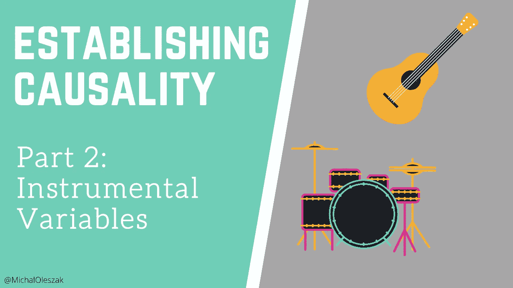
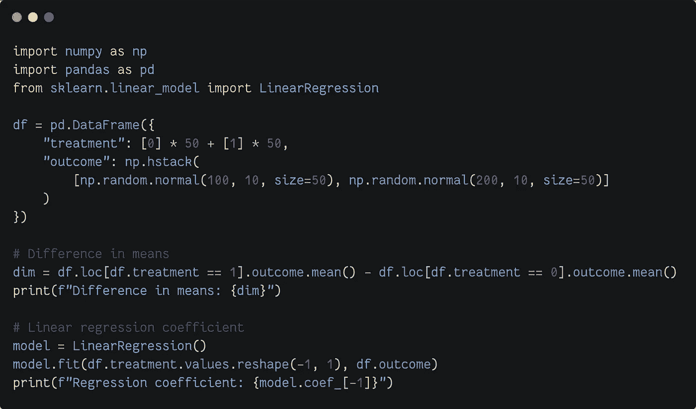

# 建立因果关系:第 2 部分

> 原文：<https://towardsdatascience.com/establishing-causality-part-2-45ab696d2246?source=collection_archive---------18----------------------->

## 通过工具变量加强随机性



图片由作者提供。

每当有人说“因为”这个词时，他们都暗示着一种因果影响。某件事导致另一件事发生。否则就不会发生了。这样的“因为”陈述相当大胆，因为需要一些统计技巧来正确地建立因果关系。在这一系列文章中，我讨论了四种统计工具，它们为说“因为”提供了科学依据。

我们要研究的四种因果关系估计方法是:

*   [*随机实验*](/establishing-causality-part-1-49cb9230884c)
*   *仪器变量*
*   [*回归不连续*](https://michaloleszak.medium.com/establishing-causality-part-3-3e8f8c546f9a)
*   [*差异中的差异*](https://michaloleszak.medium.com/establishing-causality-part-4-5d3b5e917790)

如果您还没有阅读关于随机实验的第 1 部分，请考虑绕道而行。它介绍了我们正在使用的行话，将使我们更容易理解我们从这里开始。

[](/establishing-causality-part-1-49cb9230884c) [## 建立因果关系:第 1 部分

### 随机实验的黄金标准

towardsdatascience.com](/establishing-causality-part-1-49cb9230884c) 

这个系列的第二部分集中在随机实验不可行的情况下，人们不得不求助于另一种技术:*工具变量*。


## 随机实验与观察研究

在本系列的[第 1 部分](/establishing-causality-part-1-49cb9230884c)中，我们已经看到了随机分配到治疗组或对照组是如何消除选择偏差的，这使我们能够比较治疗组和未治疗组的平均结果，以获得治疗的因果影响。例如，这在在线营销和广告中运行良好，人们可以将成千上万的用户无缝地分成实验组。然而，在其他领域，进行随机实验会带来一系列问题:

*   它们很贵。在医学研究中，药物对健康的因果影响必须在允许进入市场之前得到证明，制药公司别无选择，只能在随机试验上多花一些钱。在其他领域，资金可能不足。
*   如果要进行一些实验，让某些人而不是所有人受益，那么这种治疗可能会被认为是不道德的(想想把普遍基本收入作为一种治疗发放给随机选择的个人，看看它是否会影响失业水平)。
*   未接受治疗的个体倾向于寻求替代治疗。在医学实验中，被分配到对照组的病人可能非常渴望康复，以至于他们会服用其他药物，从而掩盖了所检查药物的因果效应。
*   约翰·亨利效应:当人们知道自己是实验的一部分时，他们的行为会有所不同。

在这种情况下，当不可能进行随机实验时，人们必须依靠所谓的观察研究。在这些研究中，我们观察治疗的效果，而不选择谁接触或不接触它。

> 在观察性研究中，我们不控制谁暴露于治疗，我们只是观察结果。

考虑两个例子，我们将在后面提到:

1.  加州当局担心来自贫困家庭的学生的学习成绩，尤其是那些家里没有电脑的学生。他们提出了一项政策计划，给这些家庭提供电脑。为了验证这是否是一个好主意，他们需要知道计算机是否会*导致*孩子们在学校的表现提高。作为实验的一部分，向大量随机抽样的家庭提供电脑会过于昂贵，而且可能会被公众认为不公平。
2.  学历对工资的因果关系是什么？经济学家用来解决这个问题的一个典型框架，被称为明瑟方程，是回答以下问题:一个人平均多受一年教育能多挣多少钱？没有人能真正强迫学校内外的人进行随机试验。

为了估计这些场景中的因果关系，我们需要借助一个聪明的技巧。但是在我们开始之前，我们首先需要再看一看随机试验。


## 回归和因果关系

在本系列的前一篇文章中，我们已经看到，给定治疗组和对照组的真正随机分配，我们可以简单地计算两组的平均结果，减去这两个数字，瞧，我们有因果关系。

理解这与拟合这个简单的线性回归模型完全相同是至关重要的:

> y = α₀ + α₁ x

其中 *y* 是结果 *x* 是处理*。*一旦我们估计了模型的参数，我们会发现α₁等于治疗组和未治疗组的平均结果之差。所以，α₁是 x 对 y 的因果影响

> 在随机试验中，使用虚拟治疗指标的线性回归估计其对结果的因果影响。

你可能想知道为什么。为什么简单的线性模型会产生因果影响？在不深究公式和数学的情况下，让我试着给你一些基本的直觉。

我相信有三种不同的方式来理解和解释线性回归。

*   如果你来自计算机科学或机器学习，你可能会将其视为一个简单的监督预测模型，其参数通过梯度下降进行优化，由于其简单性，可能会对数据进行欠拟合。
*   如果你是一名统计学家，你可能会将回归视为一种描述性模型，旨在解释数据中的关系，在大量假设下，通过普通最小二乘法估计参数。
*   最后，从计量经济学家的角度来看，回归是一把刀，沿着预测变量将数据切成碎片，并计算每个碎片的平均 *y* 值。 *x* 处的系数是 *x.* 的每个值的平均值 *y* 之间的差值

> 回归是一把将数据分割成小块并计算每一块的平均值的刀。

最后一种说法可以用数学方法证明，但是，让我给你看一个 Python 模拟。让我们创建一个有 100 个观察值的想象数据集，其中 50 个观察值将以 100 左右的随机结果进行处理，另外 50 个观察值将以 200 左右的随机结果进行处理。然后，我们来比较一下均值计算和回归系数的区别。



```
Difference in means: 100.12765658545278
Regression coefficient: 100.12765658545275
```

要点:我们可以使用线性回归来估计随机实验中的因果影响。但是观察研究呢？


## 观察研究中的回归

在观察性研究中，除了影响结果的治疗外，个体之间可能存在差异。例如，回想一下估算教育对工资影响的尝试。还有许多其他因素影响着工资，比如居住地、职业、年龄等等。假设我们将它们列出来，并用控制变量进行回归拟合:

> y = α₀ + α₁ x + β₁ c₁ + … + βₙ cₙ

其中 *y* 为工资， *x* 为受教育年限，*C*s 为刚才讨论的控制变量。这行得通吗？可惜没有。主要是因为我们不能控制一切。有一些影响工资的变量我们没有数据，不知道它们有多重要，或者根本无法衡量(想想“技能”)。这种现象被称为*省略变量偏差*。忽略重要的变量会使模型将它们的影响归因于被包含的变量，从而使对治疗的因果影响的估计产生偏差。

> 省略变量偏差使得回归系数在预测因子的因果影响方面不可信。

那么，如何解决观察性研究呢？如果随机化是不可能的，我们需要…无论如何都要实施它！算是吧。


## 工具变量

我们需要找一个*仪器*！工具是与感兴趣的因果变量相关但与结果的任何其他决定因素不相关的一些变量。

如果我们找到这样一个工具变量 *z* ，我们可以运行一对回归，这一过程被称为两阶段最小二乘法(2SLS)。在第一阶段，我们用工具解释感兴趣的因果变量。在第二阶段，我们使用第一阶段模型的预测来解释结果:

> 第一阶段:x = α₀ + α₁ z
> 
> 第二阶段:y = β₀ + β₁ x̂

实际上，没有必要拟合两个模型，因为感兴趣的结果可以使用封闭形式的公式来计算。我们可以计算治疗 *x* 对结果 *y* 的因果影响

> β₁=(e[y | z = 1]—e[y | z = 0]/(e[x | z = 1]—e[x | z = 0])。

工具变量(IV)方法实际上随机创建了组，其中工具的每个值代表一个组。然后，它简单地比较组均值( *Z=0* vs *Z=1* )。

> 工具变量法随机创建组，其中工具的每个值代表一个组，这使得它几乎与随机实验一样好。

注意，因果变量 *X* 和仪器 *Z* 都用于估算。如果仪器满足某些条件，这就相当于随机分配！我们说的是什么条件？有四个。

1.  *独立。*该工具应该像彩票一样，这样它创建的群体在潜在治疗和结果方面是相似的。
2.  *排除。*仪器只能对治疗状态产生影响，并且只能通过这种影响来影响结果。
3.  *第一阶段。*仪器必须与治疗状态相关联。
4.  *单调性。*改变个人的仪器值将导致其治疗状态的相应改变。

如果这四个成立，IV 可以估计因果影响。这听起来可能很抽象，让我们看一些例子。


## 寻找仪器

寻找好的仪器既是科学也是艺术。之前提到的两项研究(计算机对学校表现的影响和教育对工资的影响)是展示在哪里寻找它们的有趣例子。

在他们最初的关于计算机和学校表现的研究中，fair lie Robinson 实际上进行了一项大型且昂贵的随机实验，但是假设这是不可行的。假设某个慈善组织已经随机向一小部分家庭分发了电脑。我们有工具指标:该家庭是否从该组织收到了计算机。它与感兴趣的因果变量(拥有一台计算机)相关，与学校表现的任何其他决定因素无关(因为它是随机的)。结论:可以在小范围内模拟随机分配，并使用 IV 来估计因果影响。顺便说一句，作者发现使用电脑根本不能转化为更好的学校表现！

工资和教育的例子更加有趣。在[的论文](https://www.jstor.org/stable/2937954)中，安格里斯特和克鲁格提出了一个聪明的工具。他们注意到，美国大多数州要求学生在年满六岁的那一年入学。一年中晚出生的相对年级来说年龄小，早出生的相对年龄大。与此同时，义务教育法通常要求学生在 16 岁生日之前留在学校。这样一来，1 月份出生的学生将与 12 月份出生的学生处于不同的年级，而 12 月份出生的学生在法律上是允许退学的。这创造了一个自然的实验，在这个实验中，年轻人根据他们的出生季节被迫上学不同的时间。因此，作者使用出生的四分之一作为教育的工具。结论:有时法律提供了研究人员可以利用的自然实验。

然而，有时找到一个好的乐器是困难的，甚至是不可能的。幸运的是，在有利的情况下，我们也许可以使用剩下的两种方法之一来建立因果关系:回归不连续性或差异中的差异。

接下来，[让我们看看回归不连续设计](https://michaloleszak.medium.com/establishing-causality-part-3-3e8f8c546f9a)。


感谢阅读！

如果你喜欢这篇文章，为什么不订阅电子邮件更新我的新文章呢？并且通过 [**成为媒介会员**](https://michaloleszak.medium.com/membership) ，可以支持我的写作，获得其他作者和我自己的所有故事的无限访问权限。

需要咨询？你可以问我任何事情，也可以在这里 为我预定 1:1 [**。**](http://hiretheauthor.com/michal)

你也可以试试[我的另一篇文章](https://michaloleszak.github.io/blog/)。不能选择？从这些中选择一个:

[](/6-useful-probability-distributions-with-applications-to-data-science-problems-2c0bee7cef28) [## 6 有用的概率分布及其在数据科学问题中的应用

### 带有示例和 Python 代码的实用概述。

towardsdatascience.com](/6-useful-probability-distributions-with-applications-to-data-science-problems-2c0bee7cef28) [](/the-gentlest-of-introductions-to-bayesian-data-analysis-74df448da25) [## 贝叶斯数据分析最温和的介绍

towardsdatascience.com](/the-gentlest-of-introductions-to-bayesian-data-analysis-74df448da25) [](/8-tips-for-object-oriented-programming-in-python-3e98b767ae79) [## Python 中面向对象编程的 8 个技巧

### 按照以下步骤让您的 Python 类防弹

towardsdatascience.com](/8-tips-for-object-oriented-programming-in-python-3e98b767ae79)