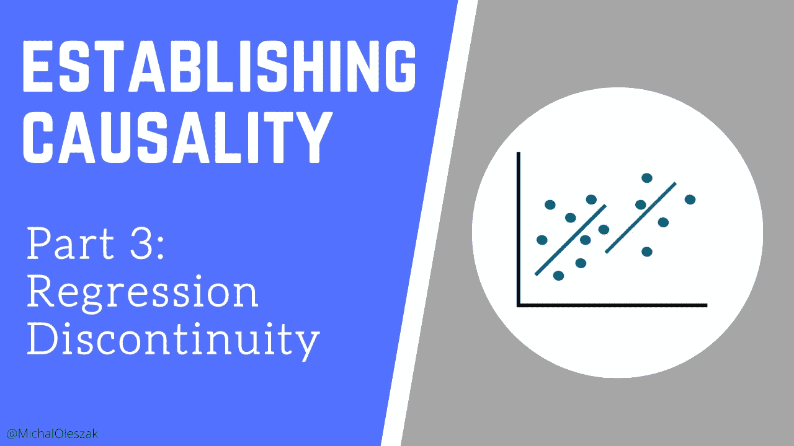
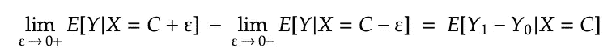
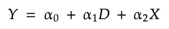
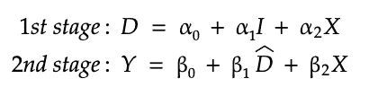

# 建立因果关系:第 3 部分

> 原文：<https://towardsdatascience.com/establishing-causality-part-3-3e8f8c546f9a?source=collection_archive---------9----------------------->

## 回归不连续设计

图片由作者提供。

“因为”这个词很容易被过度使用。我们常常意识不到它的意义的力量。“因为”意味着因果关系——原因和结果之间的关系，这需要一些统计技巧来建立。

这是我讨论四种统计工具的系列文章中的第三篇，这四种统计工具为说“因为”提供了科学依据。我们正在研究的四种因果关系估计方法是:

*   [*随机实验*](/establishing-causality-part-1-49cb9230884c)
*   [*工具变量*](/establishing-causality-part-2-45ab696d2246)
*   *回归不连续*
*   [*差异中的差异*](https://michaloleszak.medium.com/establishing-causality-part-4-5d3b5e917790)

如果你还没有看完前两部分，请考虑绕道。他们引入了术语，这将使我们更容易理解我们从这里开始。

在这个系列的第三部分，我们将着眼于不连续性，或截断点，人们可以利用它来估计因果关系。

## 介绍

在本系列的第 1 部分中，我们已经看到了随机实验如何让我们通过简单地比较治疗组和对照组之间的平均结果来计算治疗的因果影响。这是可能的，这要归功于随机化的魔力:如果分配到两个组确实是随机的，那么每个组中的个体仅在他们是否暴露于治疗中有所不同，因为所有其他的差异都被平均掉了。

在第 2 部分的[中，我们已经看到，在随机实验中比较这些平均结果与运行线性回归解释治疗指标的结果是一样的。我们还看到，在观察性(相对于随机)研究中，选择偏差使得这种基本回归毫无用处。如果可以找到一个工具的治疗指标，那么工具变量回归是必由之路。](/establishing-causality-part-2-45ab696d2246)

在这两种情况下，我们实际上是在比较那些仅在治疗状态上有所不同的群体。有时，这种组作为阈值的结果出现。

## 中断

在某些情况下，治疗是由一些观察到的变量是否超过一个已知的分界点决定的。想想给最好的学生现金奖励。他们会让你以后有更好的学习成绩吗？如果奖金颁发给所有 GPA 高于某个阈值的学生 *C，*我们应该能够使用回归不连续技术来回答这个问题。

我们不能简单地比较获奖学生和未获奖学生的学业表现，因为这两组学生在奖项之外的更多方面存在差异，比如知识和学习意愿。

然而，想想那些刚刚低于阈值 *C、*的和那些刚刚高于阈值的。这两个群体应该非常相似，由(坏)运气决定他们 GPA 的最后一个小数点，从而决定他们是否通过了门槛并获得了奖励。

## 回归不连续性

回归不连续性(RD)背后的思想是估计接近临界值两边的个体结果的差异。

> 回归不连续性比较了刚高于和刚低于决定治疗状态的阈值的个体。

设 *Y* 为结果，例如学习成绩，*X*GPA，C 为治疗分界点，高于该分界点则给予奖励。我们希望计算那些 GPA 刚刚超过 *C、*的学生和那些 GPA 刚刚低于它的学生之间的平均结果差异*、*，其中ε表示实际 GPA 和阈值之间的差异，我们希望阈值无限小，即收敛到零。

这种差异被称为截止时的*平均治疗效果(ATE)。*通过运行回归可以很容易地对其进行估计，在回归中，我们用虚拟治疗指标(是否获奖，姑且称之为 *D* )和建立阈值的变量(在本例中为 GPA)来解释结果:

这里的 *α1* 是想要的待遇效果，也就是奖金对以后学习成绩的影响。

> 包括治疗指标和设定临界值的变量允许我们估计治疗对结果的因果影响。

## 假设和有效性

和往常一样，还是有一些问题。首先，RD 假设 *X* 是 *D.* 在我们这里的例子中，应该是这样的:GPA 是奖金是否授予的唯一决定因素。然而，在其他情况下，情况不一定如此。这一假设至关重要，因为它确保了 *D* 与回归误差项不相关，否则将导致[内生性问题](https://en.wikipedia.org/wiki/Endogeneity_(econometrics))。

> 确保治疗仅由是否超过临界值决定，并且个人无法控制治疗状态。

第二，如果个人能够控制治疗**【D】*状态，并且从治疗中获得预期收益，那么临界值两边的群体可能是不同的。为了验证这是否是一个问题，看一下 *X* 的密度是有用的:在 *C* 的跳跃暗示着一个问题。*

**

## *清晰模糊的设计*

*到目前为止所讨论的方法被称为 Sharp RD 设计，在该设计中，治疗状态正好在临界值处改变。另一种可能性是模糊 RD，其中治疗的概率在截止点发生变化。*

> *在急变研发中，治疗状态在临界值处发生变化。在模糊 RD 中，治疗的概率在截止点发生变化。*

*作为一个具体的例子，考虑英国司法部的这项研究，旨在评估提前释放囚犯对累犯的影响。只有刑期超过三个月的罪犯才有资格提前释放，而且只有其中一些人获得了提前释放。因此，超过三个月监禁的门槛增加了获得提前释放的可能性，但并不能保证这一点。*

> *在模糊研发中，需要工具变量回归来估计治疗对结果的因果影响。*

*在这种情况下，普通的回归是不够的。我们将需要求助于[工具变量回归](/establishing-causality-part-2-45ab696d2246)，其中我们将使用通过阈值的指标 *I、*作为处理的工具:*

**

*接下来，我们再来看[差异中的差异法。](https://michaloleszak.medium.com/establishing-causality-part-4-5d3b5e917790)*

**

*感谢阅读！*

*如果你喜欢这篇文章，为什么不订阅电子邮件更新我的新文章呢？通过 [**成为媒介会员**](https://michaloleszak.medium.com/membership) ，你可以支持我的写作，并可以无限制地访问其他作者和我自己的所有故事。*

*需要咨询？你可以问我任何事情，也可以在这里 为我预约 1:1 [**。**](http://hiretheauthor.com/michal)*

*你也可以试试我的其他文章。不能选择？从这些中选择一个:*

* [## 建立因果关系:第 1 部分

### 随机实验的黄金标准

towardsdatascience.com](/establishing-causality-part-1-49cb9230884c)  [## 建立因果关系:第 2 部分

### 通过工具变量加强随机性

towardsdatascience.com](/establishing-causality-part-2-45ab696d2246)  [## 6 有用的概率分布及其在数据科学问题中的应用

### 带有示例和 Python 代码的实用概述。

towardsdatascience.com](/6-useful-probability-distributions-with-applications-to-data-science-problems-2c0bee7cef28)*