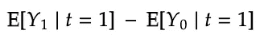
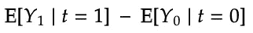
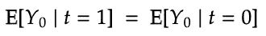
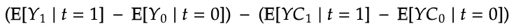
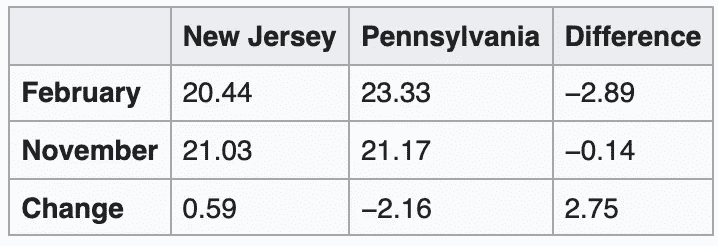
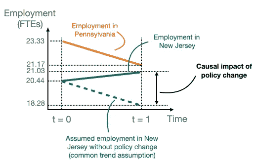
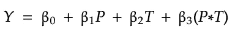

# 建立因果关系:第 4 部分

> 原文：<https://towardsdatascience.com/establishing-causality-part-4-5d3b5e917790?source=collection_archive---------21----------------------->

## [提示和技巧](https://towardsdatascience.com/tagged/tips-and-tricks)

## 利用差异中的差异的政策转变

图片由作者提供。

人们倾向于以因果的方式思考。每当我们观察到一个结果，我们的大脑会立即提示最可能的原因。很自然，感觉很轻松。然而，用统计学上合理的方法来量化原因对结果的影响要困难得多。在某种程度上，我们可以有把握地说，某件事的发生*是因为某个其他事件的* 。

这是我讨论四种统计工具的系列文章中的第四篇也是最后一篇，这四种统计工具为说“因为”提供了科学依据。我们正在研究的四种因果关系估计方法是:

*   [*随机实验*](/establishing-causality-part-1-49cb9230884c)
*   [*工具变量*](/establishing-causality-part-2-45ab696d2246)
*   [*回归不连续*](/establishing-causality-part-3-3e8f8c546f9a)
*   *差异中的差异*

如果你还没有看完前两部分，请考虑绕道。他们引入了术语，这将使我们更容易理解我们从这里开始。第 3 部分不是阅读本文的必要部分，但尽管如此，我还是鼓励您去看看——它描述了一种简单而又强大的因果关系估计方法。

在这个系列的最后一部分，我们将研究一些外部政策变化创造准实验环境的情况。在这些情况下，我们可以使用差异中的差异方法来利用这种准实验。

## 介绍

在本系列的第一部分中，我们已经看到了确定因果影响的最佳方式是进行一个**随机实验**。只是将人们随机分成两组，其中只有一组接受治疗，并比较他们之间的平均结果。这种方法的成功要归功于随机分组的魔力，它平均掉了两组之间除治疗以外的所有差异。然而，有时随机实验成本太高，不道德，或者我们不得不使用观察性研究的数据(在这些研究中，我们观察治疗的效果，而不选择谁接触或不接触它)。

在[第 2 部分](/establishing-causality-part-2-45ab696d2246)中，我们已经看到，比较随机实验的平均结果与运行线性回归解释治疗指标的结果是一样的。我们还看到，在观察性(相对于随机)研究中，选择偏差阻止了这种基本回归产生正确的因果关系估计。绕过它的一个方法是找到一个工具变量，一个随机但与治疗相关的变量，然后运行**工具变量回归** (IV)。

在[第三部分](/establishing-causality-part-3-3e8f8c546f9a)中，我们看到了通过一些观察变量是否超过一个已知的分界点来决定治疗的情况。在这样的场景中，**回归不连续** (RD) 方法就派上了用场。他们基本上是比较接近分界点两边的个体在结果上的差异，假设他们的确切分数，以及他们所处的分界点的一边，受到随机性的影响。

随机实验是金标准。在静脉注射和研发中，我们实际上是在试图创造一个尽可能接近随机实验的环境，这样我们就可以比较那些只有治疗状态不同的组。有时，这种团体的出现是政策变化的结果。

## 政策转变

在某些情况下，治疗是由政策或经济环境的一些外部变化决定的。一个著名的例子是卡和克鲁格对最低工资和失业的研究。根据一些经济理论，最低工资的提高应该会导致失业激增，因为无法承受更高雇佣成本的雇主被迫解雇最廉价的员工。但是我们如何用一种统计上严格的方法来估计这种因果关系呢？

美国新泽西州于 1992 年 4 月通过了一项法案，将最低工资从 4.25 美元提高到 5.05 美元。卡德和克鲁格利用了这一政策变化。他们测量了该州同年 2 月和 11 月的就业水平，即该法律生效前后的就业水平。他们用全时当量(fte)表示就业情况，发现 2 月份为 20.44，11 月份为 21.03。这产生了 0.59 的正差值，表明最低工资提高后就业实际上略有增加。

然而，这种天真的比较不会产生有效的因果关系估计，因为除了最低工资增长之外，可能还有许多因素影响就业激增。例子有经济状况、天气或简单的季节性——就业根据几个月的季节性模式而变化。

## 差异中的差异

理想情况下，我们希望将最低工资上调后新泽西州的就业情况与最低工资没有上调时该州的就业情况进行比较。在数学符号中，这种预期的因果关系是:

其中 *t* 表示时间步长(0 表示政策变化前，1 表示政策变化后)，Y₀是没有政策变化时的就业，Y₁是有政策变化时的就业。显然，我们不能观察第二个术语，因为它是一个反事实:没有政策变化的就业，在变化之后。

我们唯一能观察到的是变化前后就业的简单差异:

但是，正如我们已经提到的，由于遗漏变量的偏差，这不是一个有效的因果关系估计。只有当我们假设，它才等于我们之前定义的真正因果效应

这意味着在没有政策变化的情况下，随着时间的推移，结果不会有什么不同。在大多数情况下，这很难保持。

这就是差异中的差异(DiD)方法发挥作用的地方。它通过将受变化影响的一组(治疗组)在变化前后的结果与未受影响的一组(对照组)的相应差异进行比较，放松了这种不可信的假设:

这里，*表示对照组的结果。正如你所看到的，我们计算了两个随时间变化的差值:一个是经过治疗的，另一个是未经治疗的。让我们通过回到卡片和克鲁格的研究来更具体的说明一下。*

> *差异中的差异将治疗前后的结果与未治疗的相应差异进行比较。*

*对他们来说，新泽西州 0.59 的就业变化是接受治疗者的超时差异。但是他们需要控制组:与新泽西公民相似的人，但是不受新政策的影响。他们选择了邻近的宾夕法尼亚州，在大多数经济指标和天气方面与新泽西州相似。通常，这两个州的就业水平遵循相似的模式。他们测量了宾夕法尼亚州相应月份的就业差异，为-2.16，这意味着那里的就业水平显著下降。这是他们的对照组超时差异。*

**

*卡德和克鲁格的 FTE 测量。来源:[https://en . Wikipedia . org/wiki/Difference _ in _ differences # Card _ and _ Krueger _(1994)_ 示例](https://en.wikipedia.org/wiki/Difference_in_differences#Card_and_Krueger_(1994)_example)*

*最后，他们计算了差异中的差异:0.59–2.16 = 2.75。这使他们得出结论，新泽西最低工资 0.80 美元的增长导致了 FTE 2.75 美元的就业增长，这与一些经济理论相反。*

**

## *假设*

*通常情况下，统计方法会附带一些假设，DiD 也不例外。*

*核心 DiD 假设是**共同(或平行)趋势假设。**它指出，在没有政策变化的情况下，对照组和治疗组的平均结果变化是相同的。这可以用图表清楚地描述出来:*

**

*差异中的差异方法依赖于共同趋势假设。图片由作者提供。*

*我们假设，如果没有进行治疗，治疗组和对照组会显示出相同的趋势。自从宾夕法尼亚州的就业人数减少了 2.16。我们假设，如果没有政策变化，新泽西州的死亡率也将下降相同的幅度，从 2.44 降至 18.28。这一假设值与观察到的就业率之间的差异(21.03–18.28 = 2.75)归因于治疗，即政策变化。*

> *平行趋势假设:在没有政策改变的情况下，随着时间的推移，对照组和治疗组的结果变化是相同的。*

*共同趋势假设可能看起来相当严格，但如果对照组确实与治疗组相似，就像这两个相邻的州一样，在实践中就不应该违反。然而，在选择对照组时，这一点需要记住。*

**

## *作为线性回归的差异中的差异*

*就像我们在本系列中讨论的所有其他因果关系估计方法一样，DiD 可以被视为一个回归模型。该模型应该用三个预测因子来解释结果:*

*   *虚拟时间步长指示器 *T，**
*   *虚拟治疗指示器 *P* ，*
*   *上述两者的乘积，即在政策改变后(当 *T* =1 时)，仅用于治疗个体的观察值为 1 的虚拟值。*

**

*在这样的模型中，β₃系数是治疗对结果影响的估计值。*

*让我们在模拟研究中看看这是不是真的。首先，我对一个有 200，000 个观察值的数据集进行采样，其中 50，000 个观察值在时间 T=0 时被处理，另外 50，000 个观察值在时间 T=1 时被处理，类似的还有未处理的观察值。对于每条记录，我模拟了一个接近 Card 和 Krueger 的就业人数的随机值。*

*让我们通过手动计算差异来计算 DiD 估计值。*

*`2.751098003538063`*

*现在，让我们试试回归法。*

*`[-2.16443239 -2.88931896 2.751098]`*

*模型系数中的第三项是上述模型方程中的β₃系数，您可以验证它与手动计算差异时的系数相同。*

**

*感谢阅读！*

*如果你喜欢这篇文章，为什么不在我的新文章上 [**订阅电子邮件更新**](https://michaloleszak.medium.com/subscribe) ？而通过 [**成为媒介会员**](https://michaloleszak.medium.com/membership) ，可以支持我的写作，可以无限制的获取其他作者和我自己的所有故事。*

*需要咨询？你可以问我任何事情，也可以在这里 为我预约 1:1 [**。**](http://hiretheauthor.com/michal)*

*你也可以试试我的其他文章。不能选择？从这些中选择一个:*

*</establishing-causality-part-1-49cb9230884c>  </establishing-causality-part-2-45ab696d2246>  </establishing-causality-part-3-3e8f8c546f9a> *