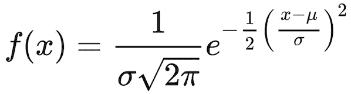
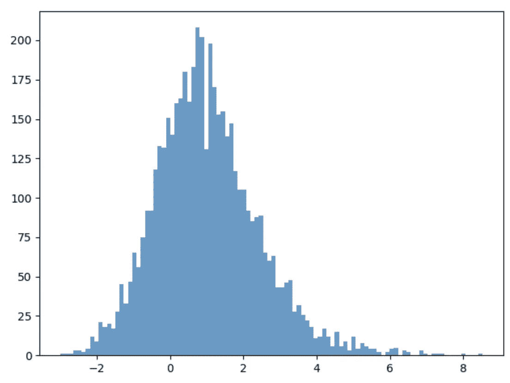
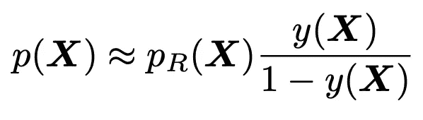
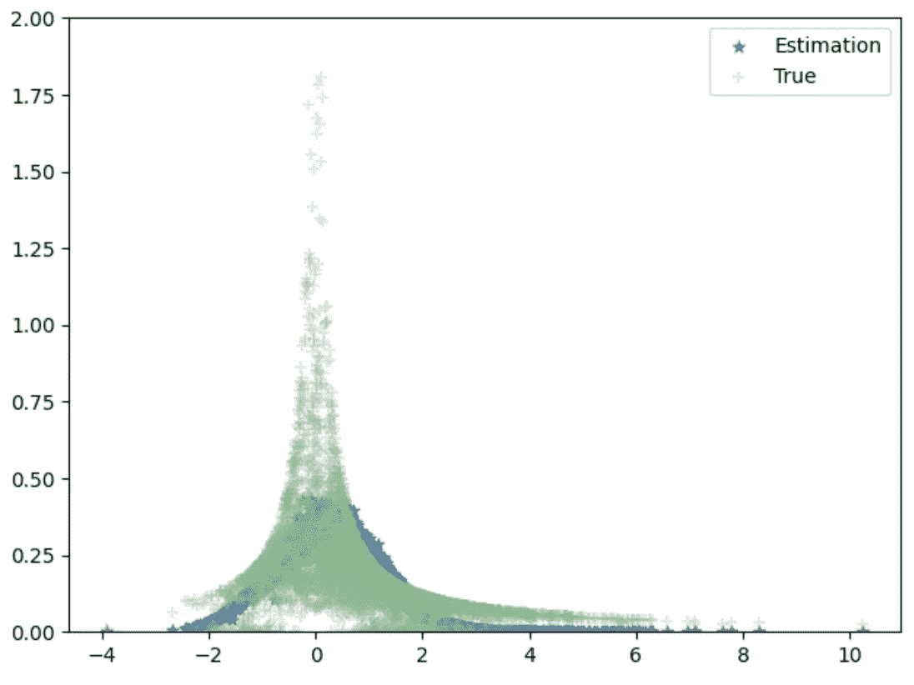
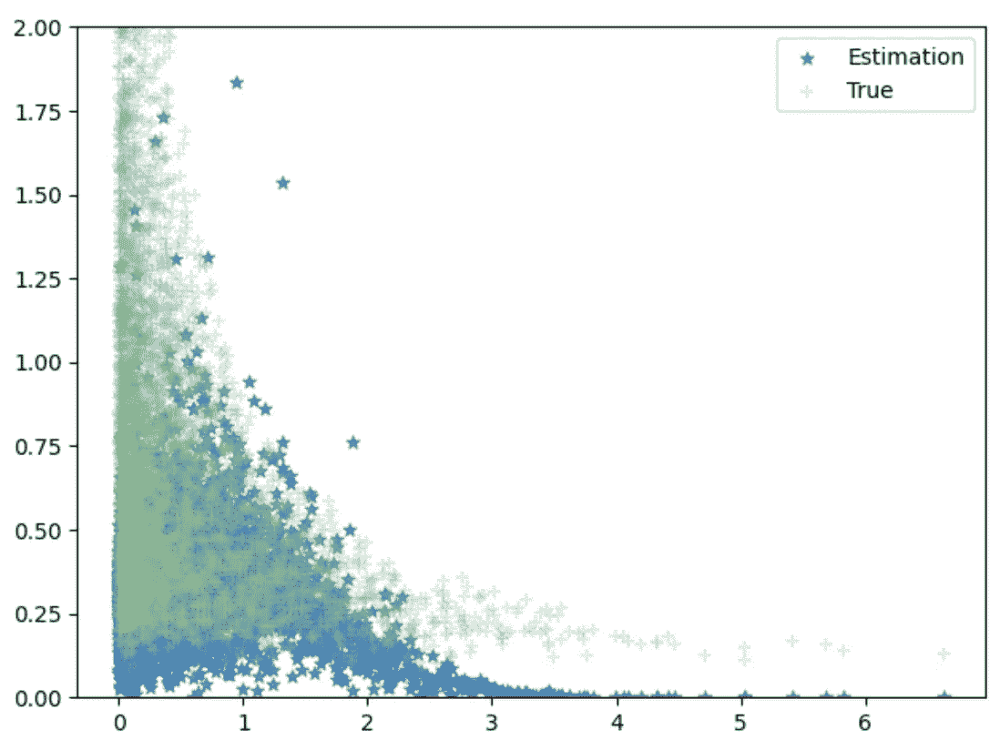
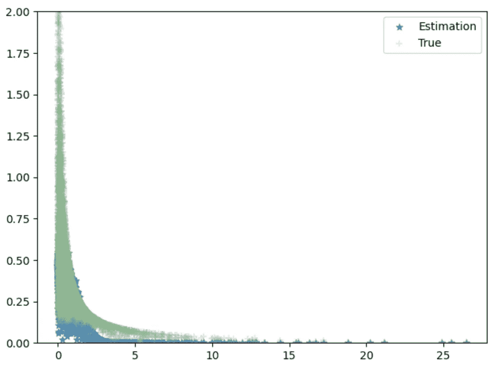
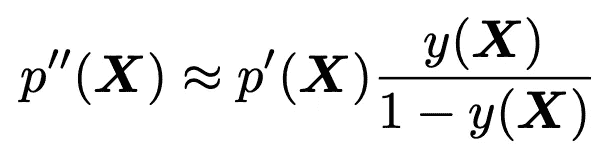

# 使用神经网络超越单点估计

> 原文：<https://towardsdatascience.com/estimate-of-a-probability-density-function-through-neural-networks-f0de20b49de5?source=collection_archive---------12----------------------->

## 用 Python 估算未知数据生成过程的观测数据的 PDF。

机器学习算法通常估计未知数据生成过程的第一矩(即均值)。然而，超越分布拟合一阶矩的应用可以在各种不同的领域找到，如经济[2]，工程[3]和自然科学[4]。例如，观察金融市场并试图指导投资者的神经网络可以计算股票市场运动的概率以及运动的方向。为此，可以使用概率密度函数来计算连续随机变量范围出现的总概率。

用于密度估计的传统方法(例如这里的[和](https://medium.com/hal24k-techblog/a-guide-to-generating-probability-distributions-with-neural-networks-ffc4efacd6a4))是基于函数的统计模型的初步选择和随后对其参数的拟合。例如，神经网络输出的均值(μ)和标准差(σ)参数足以描述正态分布的密度函数:



然而，什么 id。没有关于数据生成过程的先验知识？Aristidis Likas [1]在早期工作中首次提出了一种基于贝叶斯统计的替代方法。这种简单但有效的方法不需要对可用数据进行任何假设，而是从神经网络的输出中提取概率密度函数，该神经网络用合适的数据库进行训练，该数据库包括原始数据和一些具有已知分布的特别创建的数据。不幸的是，最初的实现并不适合现代计算环境，因此，在本文中，我将演示如何在 Python 和 TensorFlow 的上下文中使用该方法。

## 设计数据生成流程

为了便于说明，我们可以创建一些简单的数据生成过程，如下图所示，其中使用单位指数 Xs 的条件正态分布生成结果。因此，每个个体都将具有以 x 为条件的唯一概率密度函数(PDF)。

```
def hi_sample(N):
    fx = lambda x: np.random.normal(loc = np.mean(x[:,0:-1],1), size=N)
    X1 = np.random.exponential(1, size=N)
    X2 = np.random.exponential(1, size=N)
    Y =  fx(np.array([X1,X2]).T)
    hi_data = [X1, X2, Y]
    return np.array(hi_data).T

train_array = hi_sample(5000)
```

生成的 Y 将具有以下分布:



作者图片

## **概率密度估计的基本方法**

在这里，我们不讨论原著中的所有数学术语，而是强调用 python 实现所需的基本步骤:

1.  用已知的数据生成过程(创建先验分布)扩充原始数据集，该过程来自参考 PDF: **P(ref)** 。这里，我们假设扩充数据集中所有个体的结果将从标准正态分布中生成:

```
train_array_0 = train_array.copy()
train_array_0[:,-1] = metropolis_hastings_normal(train_array_0[:,-1]) #regenerate the outcome f(x) using metropolis_hastings simulators with a standard normal distribution. 
train_data = [train_array,train_array_0]
```

2.用二进制判别神经网络拟合扩充的数据集，该网络估计从 **pr(X)** 或从目标 PDF: **p(X)** 生成观察对 **X:=(x，f(x))** 的概率**y(X)**。它可以是这样一个简单的网络:

```
def simple_nn(dim_x):
    input_x = tfkl.Input(shape=(dim_x+1))
    combined_layer = tfkl.Dense(dim_x)(input_x)
    for i in range(5):
        combined_layer = tfkl.Dense(dim_x)(combined_layer)
        combined_layer = tfkl.Dropout(0.1)(combined_layer)
    out = tfkl.Dense(1, activation='sigmoid')(combined_layer)
    model = tf.keras.Model(inputs = input_x, outputs=out)
    model.compile(loss = 'binary_crossentropy',
                  optimizer=tf.keras.optimizers.RMSprop(lr=0.001))
    return model
```

3.使用贝叶斯理论计算目标概率密度函数:



因此，用特意扩充的数据集训练 NN 产生了神经函数 **y(X)** ，通过使用中间的任意 PDF **pr(X)** ，可以从该神经函数中推断出未知的 PDF **p(X)** :

```
conditional_y = pdf_function_i(x).numpy()
reference_dense =  norm.pdf(x[:,-1]).reshape(-1, 1) #norm(loc = np.sum(x[:,0:-1],1)).pdf(x[:,-1]).reshape(-1, 1)
conditional_dense = (conditional_y / np.clip(1 - conditional_y, a_min=1e-3, a_max=1.0))  * reference_dense
```

现在让我们用真实的 PDF 来绘制估计的 PDF (conditional_dense ):



条件正态分布的估计。作者图片

注意这里每个单独的点都有一个以给定的 x 为条件的正态分布。

让我们看看从标准密度函数导出的其他几个条件分布的估计:



条件均匀分布的估计。作者图片



条件指数分布的估计。作者图片

使用相同的标准正态先验，我们能够从不同的原始数据生成过程中获得相当准确的单个 pdf 的估计。我们能进一步提高估计值吗？是的。在 Leonardo Reyneri 等人[5]的另一项工作中，作者建议使用初始估计的估计 PDF**p’(X)**作为调整估计的先验。也就是说，我们重复第 1 步到第 2 步，用**p’(X)，**代替标准的正态先验，在第三步中，我们估计以下量:



因此，我们可以得到 PDF 的原始估计的一步调整。这背后的直觉类似于自动编码器，其中如果神经网络不能区分估计的 PDF 和先前的 PDF，则估计的 PDF 将是最佳的。

## 参考

[1] Likas，A. (2001 年)。用人工神经网络估计概率密度。*计算机物理通信*， *135* (2)，167–175。

[2] Combes，c .，Dussauchoy，a .:用于拟合股票交易中开盘/收盘资产价格和收益的广义极值分布。施普林格运营研究 6(1)，3–26(2006)

[3] Zaharim，a .，Razali，A.M .，Abidin，R.Z .，Sopian，k .:马来西亚风速数据的统计分布拟合。欧洲科学研究杂志 26(1)，6–12(2009)

[4] Wendell Cropper Jr .，p .，Anderson，P.J .:热带棕榈的种群动态:使用遗传算法进行逆参数估计。生态模型 177，119–127(2004)

[5]雷诺里、科拉和范努齐(2011 年 6 月)。通过神经网络估计概率密度函数。在*人工神经网络国际工作会议上*(第 57-64 页)。斯普林格，柏林，海德堡。