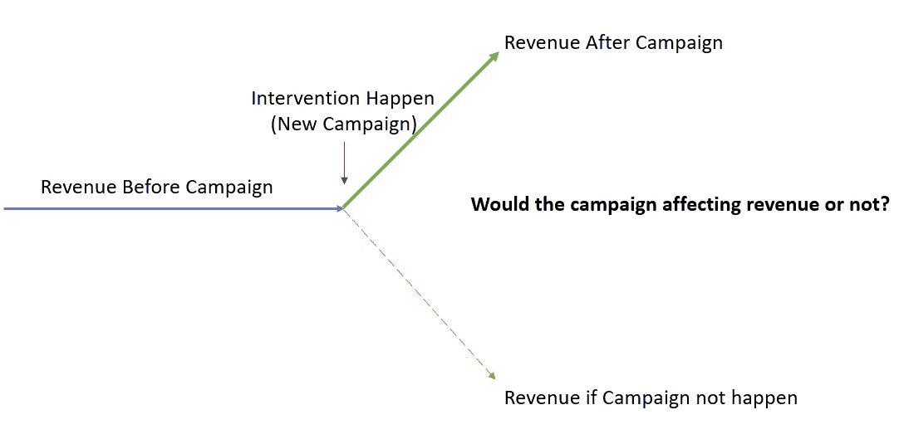
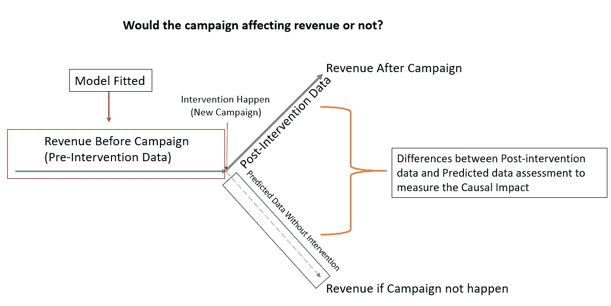
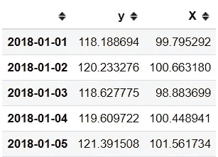
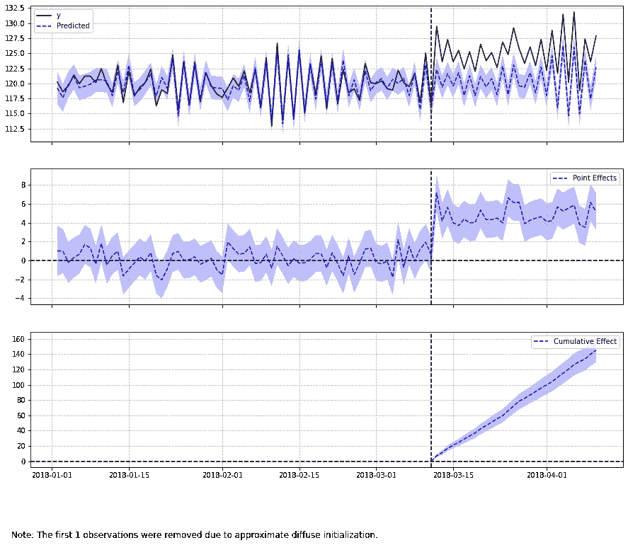
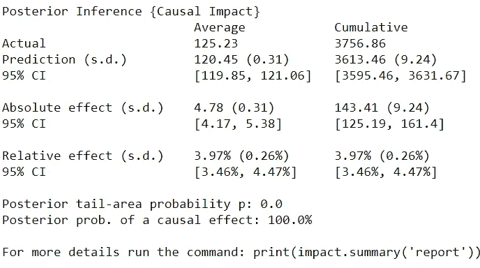
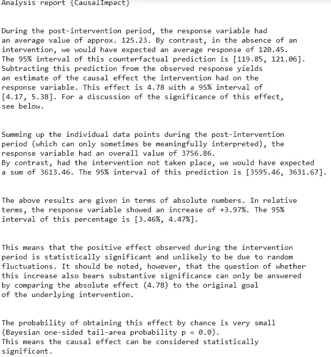
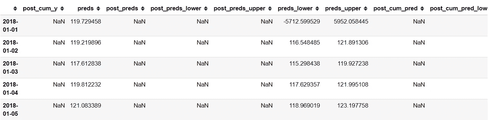
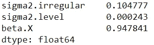

# 用因果影响估计时间序列的因果效应干预

> 原文：<https://towardsdatascience.com/estimate-the-causal-effect-intervention-on-time-series-with-causalimpact-e949c5cd4147?source=collection_archive---------20----------------------->

## 推断对时间序列数据的因果干预效应


在 [Unsplash](https://unsplash.com?utm_source=medium&utm_medium=referral) 上由 [Fabrizio Verrecchia](https://unsplash.com/@fabrizioverrecchia?utm_source=medium&utm_medium=referral) 拍摄的照片

想象一下，作为一名数据科学家，在一家销售糖果的公司工作，公司的销售部门就他们最新的活动请求帮助。销售部门想知道他们的新活动从长远来看是否有助于提高公司收入，但由于活动的成本很高，他们无法进行任何 A/B 测试；这意味着你只有当前的实验数据来验证现实世界的影响。我们应该采取什么方法？

解决这个问题的替代方法很少，例如，活动前后的描述性收入比较或实验性假设检验。这些方法都是可行的，但无法衡量实际的影响，因为许多特征会影响结果。

为了解决这个问题，谷歌的团队使用贝叶斯结构时间序列开发了一个开源包，对 R 的[因果影响](https://google.github.io/CausalImpact/CausalImpact.html)。Python 中也有[因果影响包](https://github.com/dafiti/causalimpact)，我们稍后会用到。

在这篇文章中，我想概述因果影响是如何工作的，以及这个包如何帮助我们一个数据科学家。

让我们开始吧。

# 因果影响

## 概念

因果影响概念是为了解决干预或行动对时间序列数据产生影响的问题。在现实世界中，有很多情况下，我们拥有的唯一数据是我们的实验结果，而不是我们没有做任何实验或干预的数据。

让我用下面的例子来说明我在上面的文章中的意思。



作者创造的形象

回到我们以前的想象，当我们有一个新的活动来增加公司收入时，我们唯一的数据将是活动后的收入，而不是活动没有发生时的收入。

活动结束后，收入可能会有变化，但我们能确定这是因为活动而不是其他原因吗？毕竟，如果这场运动没有发生，我们就没有数据。

这就是因果影响可以帮助我们评估我们的假设。因果影响处理问题的方式是通过使用[**贝叶斯结构时间序列**](https://en.wikipedia.org/wiki/Bayesian_structural_time_series) 来拟合最佳解释**【预干预】**数据(在我们的示例中是活动发生之前的数据)的模型。最佳模型用于**“后干预”**(活动后)数据，以预测如果干预从未发生会发生什么。

因果影响提到，模型将假设**响应变量(预期目标，如收入)可以通过线性回归与不受时间干预**影响的其他变量(“协变量”或 X)一起建模。例如，在我们的例子中，我们想评估一个活动对收入的影响，那么它的每日访问量不能作为协变量，因为访问量可能会受到活动的影响。

然后，评估因果影响的推断将基于观察到的响应与预测的响应之间的差异，这将产生干预对数据造成的绝对和相对预期影响。

如果我在一个图像中总结因果影响过程，它将如下图所示。



作者图片

## 编码示例

我们可以用数据集例子来尝试因果影响分析。我们用下面的代码试试吧。

```
import numpy as np
import pandas as pd
from statsmodels.tsa.arima_process import ArmaProcess
from causalimpact import CausalImpact#Creating Random Generated time data
np.random.seed(12345)
ar = np.r_[1, 0.9]
ma = np.array([1])
arma_process = ArmaProcess(ar, ma)
X = 100 + arma_process.generate_sample(nsample=100)
y = 1.2 * X + np.random.normal(size=100)
y[70:] += 5#Data Frame with time index
data = pd.DataFrame({'y': y, 'X': X}, columns=['y', 'X'])
dated_data = data.set_index(pd.date_range(start='20180101', periods=len(data)))#Time period for pre-intervention and post-intervention
pre_period = ['20180101', '20180311']
post_period = ['20180312', '20180410']dated_data.head()
```



作者创建的图像

现在，我们有一个包含两列的数据帧， **y** 和 **X** 。使用因果影响，要评估的预期目标应该重命名为 y，其他列将被视为协变特征。

要将时间分为干预前数据和干预后数据，您应该使用 DateTime 对象设置数据的索引，并创建两个包含时间范围的列表(干预前和干预后)。

让我们尝试使用所有这些信息进行因果影响分析。

```
#Using Causal Impact analysis, the three parameter you should fill (data, pre-intervention time, post-intervention time)
ci = CausalImpact(dated_data, pre_period, post_period)
ci.plot()
```



作者创建的图像

当我们绘制结果时，有三个图作为默认输出:

1.  上面部分是**原**系列对其**预测的一个**

2.中间部分，也就是**点特效**剧情；原始序列和预测序列之间的差异

3.底部是**累积**效果图。这是随着时间累积的点效应的**总和**。

如果你不确定这个情节在告诉我们什么，我们可以通过观察累积效应，看到一个因为时间干预事件而增加的效应。

出于考虑，因果影响建议我们将先验参数设置为`None`，就像下面的代码一样，让模型进行所有的优化。

```
#Add prior_level parameter
ci = CausalImpact(dated_data, pre_period, post_period, prior_level_sd=None)
ci.plot()
```

如果您想查看所有**因果影响的统计结果**，您可以运行下面的代码。

```
print(ci.summary())
```



作者创建的图像

对于上面的例子，我们可以看到绝对效应是 4.78，其中预测可以在 95%置信区间内从 4.17 变化到 5.38。这意味着干预发生时增加了 4.78 个单位。虽然，在做任何结论之前，不要忘记检查 p 值。

如果您需要**更详细的结果**，您可以运行报告摘要代码。

```
print(ci.summary(output='report'))
```



作者创建的图像

在这种情况下，您将获得关于时间干预效果的所有信息。

如果您需要**更深入的分析**，您可以运行这段代码来获取每个时间点的预测信息。

```
ci.inferences.head()
```



作者创建的图像

这里，所有预测信息都汇总到一个数据框对象中。如果您想摆弄这些数据，您可以创建自己的可视化。

另外，如果您想要**分析模型**，您可以运行这段代码。

```
ci.trained_model.params
```



作者创建的图像

如果您觉得模型参数无法帮助模型预测响应变量，您可能需要评估该参数。

# 结论

作为数据科学家，我们可能需要评估事件对时间序列数据的影响。虽然可以使用简单的统计数据来评估，但具有挑战性的部分是确认事件是否实际影响了结果。

在这种情况下，我们可以使用称为因果影响的分析来解决影响问题。这个软件包易于使用，如果干预影响了响应变量，它会产生所有的结果来支持你的假设。

# 如果您喜欢我的内容，并希望获得更多关于数据或数据科学家日常生活的深入知识，请考虑在此订阅我的[简讯。](https://cornellius.substack.com/welcome)

> 如果您没有订阅为中等会员，请考虑通过[我的推荐](https://cornelliusyudhawijaya.medium.com/membership)订阅。