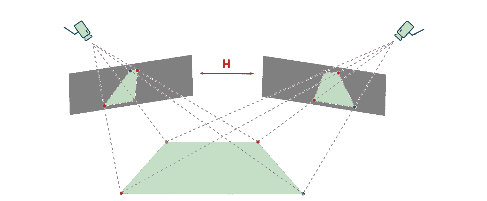
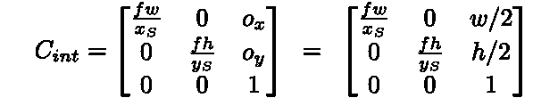
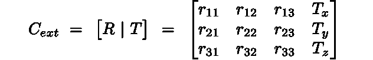
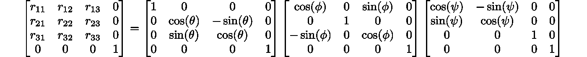
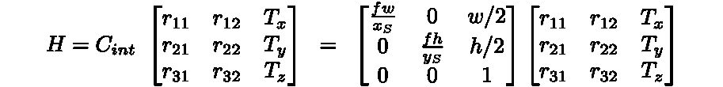
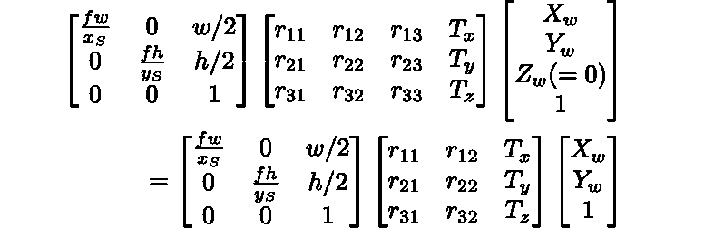
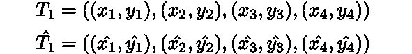
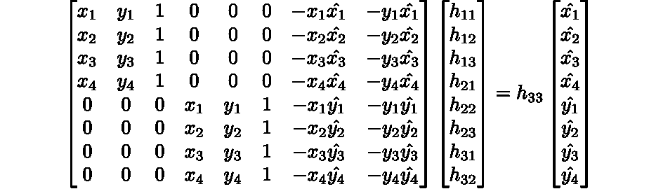

# 单应估计

> 原文：<https://towardsdatascience.com/estimating-a-homography-matrix-522c70ec4b2c?source=collection_archive---------2----------------------->



*单应概念可视化【作者图片】*

## [让我们知道系列] — #1

> **这篇短文描述了估计一个 3 × 3 单应矩阵的方程。我们首先讨论从内部和外部摄像机参数的计算；必要时，将公式与现实世界的相机规格联系起来。接下来，我们提出使用对应点的*二元组的计算方法，这些点在它们各自的平面中是共面的，并且避免了共线退化。***

## **1** ⌉ **来自摄像机参数的单应**

## **a .基本设置**

让我们把 3D 世界视图空间中的一个点看作一个三元组


3D 世界视图通过放置在世界视图坐标中的照相机被捕获到 2D 图像上。

然后，我们可以将这个 *3D* 点映射到任意空间*中的一个点，如下所示:*


**情商。(1)**

其中***C****_ int*分别是*内在*和***C****_ ext*是*外在*相机矩阵。任意空间中的点**(****_ a***，*y****_ a***，*z****_ a***)**，可以通过涉及如下比例因子映射到*图像空间:**

****

****情商。(2)****

**因此，一旦我们在任意空间中有了一个点，我们可以简单地缩放它的坐标，以获得(捕获的)图像空间中的 *2D* 坐标。**

## ****b .内禀矩阵****

**现在让我们看看***C****_ int*的形式。假设一台相机，其焦距为 ***f*** (单位为 mm)，实际传感器尺寸为(***x****_ S*，***y****_ S*)(单位为 mm)，捕获图像的宽度和高度(有效传感器尺寸)为( ***w，h* )
相机的*光学中心*(***o***_*x*，***o***_*y*)然后是(***w****/*2**，h 【T 我们现在的状态指定***C****_ int*如下:******

****

****情商。(3)****

**由此可以观察到， ***C*** *_int* 中的所有条目都是以像素*为单位的。*以下可视为分别在 *x* 和 *y* 方向上的有效焦距，单位为像素**

****

**实际上，它们是相同的，因为当从相机规格计算时，它们有非常微小的差异(≈ 0.2 到 0.5 %)**

## ****c .非本征矩阵****

****C** *_ext* 由旋转矩阵 ***R*** 和平移矩阵 ***T*** 组成，如下:**

****

****情商。(4)****

**元组(***T****_ x*，****T****_ y*，****T****_ z*)表示摄像机在世界空间坐标中的平移。通常情况下，我们可以认为摄像机没有 *x* 和 *y* 平移(**T***_ x*=***T****_ y*= 0)，摄像机位置离地面的高度(单位为 mm)等于 ***T*******

**如果 ***θ*** ， ***φ*** ， ***ψ*** 分别是相机相对于 *x* ， *y* 和 *z* 轴的方位(以弧度为单位的角度)，我们可以得到 **r** _ *ij *i* ， *j* ∈ {1，2，3}如下:***

**

***情商。(5)***

## ***d .单应***

*要估计的单应矩阵 ***H*** 是一个 3 × 3 的矩阵，并且包含如下的*内在*和*外在*摄像机矩阵的部分:*

**

***情商。(6)***

*以上可以直接成立的事实是，当我们在 world-view 中寻找一个平面来计算单应性时，***Z****_ w*= 0，因此，*

**

***情商。(7)***

*因此，单应性***H*** 将在任意空间中映射一个世界观点。如果我们只需要计算任意两点之间的距离，这个空间就足够了。然而，实际上，像素空间中的坐标将通过考虑等式 1 中指定的比例因子来计算。(2).*

## *共面点的 2⌉单应*

## *a.基本设置*

*单应性让我们将两个观看同一平面的相机联系起来；相机和它们观察(生成图像)的表面都位于世界视图坐标中。换句话说，两个 *2D* 图像通过一个*单应* ***H*** 相关，如果两者从不同的角度观察同一平面*。单应关系不依赖于正在观看的场景。**

*考虑两幅这样的图像在世界视图中观看同一平面。
设(***x****_*1，***y****_*1)为第一幅图像中的一点，(***x***ˇ_ 1，***y***ˇ_ 1)为第二幅图像中的对应点。然后，这些点通过*估计的*单应 ***H*** 相关联，如下:*

**

***情商。(8)***

**

***情商。(9)***

*因此，第一图像中的任何点都可以通过单应映射到第二图像中的对应点，并且该操作可以被视为图像扭曲的操作。*

## ***b .单应性***

*让我们将 3 × 3 单应矩阵 ***H*** 参数化如下:*

**

***情商。(10)***

*因此， ***H*** 的估计需要估计 9 个参数。换句话说， ***H*** 有 9 个自由度。如果我们选择两个元组的对应点，**【☟】****【共面】**在它们各自的平面上，如下:*

**

***情商。(11)***

```
*[**co-planar**] The homography relation is provable only under the co-planarity of the points, since everywhere, we are assuming that the *z*-coordinate of any point in any image is 1\. In practice, for instance, one may thus choose four points on a floor, or a road, which indicate a *nearly* planar surface in the scene.*
```

*然后，从 Eq。(8，9，10)，我们可以解出下面的估算值*:**

****

****情商。(12)****

**其中(***x****ˇ*_*I*，***y****ˇ*_*I*)∈***T****ˇ*_ 1 和(***x****_ I*， **【T29)然后，这将转化为要求解的以下方程组:****

****

****情商。(13)****

**我们现在有 8 个方程，可以用来估算*(除了***H****_*33)的 8 个自由度。为此，我们要求上面的 8 × 8 矩阵具有满秩(没有冗余信息)，也就是说，没有一行是线性相关的。这暗示着*在 ***T*** _1 或者***T****ˇ*_ 1 中没有三个点*应该是共线的。***

*我们接下来需要解决的是 ***h*** _33。请注意，在等式中。(13)如果 ***h*** _33 被预先等同于 1，我们将简单地把整个一组***h****_ ij*超平面移动到另一个参考系，但是它们的方向不会改变。实际上，我们将因此简单地看到不同的***z****_ a*值，同时根据 Eq 映射一个*2D* 图像坐标。(8)，它随后会在等式中被分开。(9).于是，我们在*中保持 ***h*** _33 = 1，而 Eq。然后可以使用最小二乘估计来求解(13)。**

**在 *OpenCV* 中，可以使用函数***find homo graphy***，它的功能与上面描述的完全相同。它接受四个对应点的二元组，用*_ 33 计算单应性 ***H*** 始终且严格为 1。任何一个 *2D* 图像点都会被映射到一个***z****_ a**放大版的另一个平面上的对应点上。****

## ****c .假设摄像机的单应性****

**在各种应用中，例如虚拟广告、用于智能城市规划的绝对距离测量，需要假设存在假设的摄像机***【C】***，并计算单应矩阵，该单应矩阵可以将观察到的场景中的任意点投影到由 ***C*** 捕获的图像的平面上。**

**想象鸟瞰图(俯视图)中的 ***C*** 是一个**☟****热门选择**在这种情况下，可以选择在被观察场景中具有四个共面点的*_ 1，而对应的元组***t****ˇ*_ 1 可以简单地具有四个点作为假想矩形的角场景中的任何一点都可以映射到它的鸟瞰图上，也就是说，从上面看它会是什么样子。***

```
**[**popular choice**] There has been a recent surge of research papers, which exploit the bird's eye view (BEV) for behavioural prediction and planning in autonmous driving.**
```

**请注意，基于单应性的映射只是观察到的图像的扭曲版本，并且场景中没有新的信息被合成。例如，如果我们只观察了场景中一个人的正面视图，它的鸟瞰视图，不会真正开始告诉我们这个人的头发是如何从顶部开始的；但这只会扭曲他头部的正面可视部分，使其看起来像俯视图。**

## ****d .单应投影中的负值****

**注意，在求解 ***H*** 时，没有约束任意空间中的投影点必须为正，即***x***_*a*、***y***_*a*和***z*【T47 _*a*可能为负。一旦被***z***_*a*缩小，这将意味着一个映射点(***x****ˇ_ I*、***y****ˇ_ I*)可能是负数。****

**这从直觉上看可能是不期望的，因为图像坐标通常被认为是正的。然而，这可以被看作仅仅是参考轴偏移，并且在映射整个图像之后，可以适当地决定偏移量。**

```
****💡 Remark** - The treatment presented here, *may not be* akin to *3D* reconstruction procedures, which may involve estimation of multiple-view homographies', sometimes via a hypothesized view projection. Multi-view homographies, have been shown to possess specific algebraic structures, but *3D* reconstruction from *2D* scenes largely remains an unsolved problem.**
```