# 根据纽约市自行车份额数据估计自行车的可用性

> 原文：<https://towardsdatascience.com/estimating-bike-availability-from-nyc-bike-share-data-7cfc4655d5f6?source=collection_archive---------27----------------------->

## 使用熊猫来重组花旗自行车的行程记录，以估计一个车站全天可用的自行车数量

自行车共享系统要想取得成功，会员必须随时随地都可以使用自行车。对于像纽约市的 Citi Bike 这样使用带码头的固定站点的系统，在骑行结束时必须有空码头，以便会员可以归还自行车并上路。

自行车和空码头的可用性是任何自行车共享系统的有用指标。虽然 Citi Bike 没有提供这方面的信息，但可以根据现有的出行数据进行估算。在本文中，我将展示如何做到这一点。


宾州车站附近的自行车站——图片由作者提供

如何确定自行车(和码头)的可用性？Citi Bike 以网络服务的形式提供了一个关于站点状态的*实时*反馈，包括可用自行车和停靠站的数量。在[花旗自行车系统数据](https://www.citibikenyc.com/system-data)页面上可以找到描述和 URL 的链接。

获得*历史*数据更成问题。使用电台状态信息需要编写一个程序，定期查询节目源并保存信息。这在过去已经完成并可用，例如在[theopenbus.com](http://theopenbus.com)，但自 2019 年 4 月以来一直没有更新。

然而，Citi Bike 每月提供 tripdata 文件，记录每次行程，包括起止时间和站点。使用这些数据来估计自行车的可用性是可能的。

本文是探索花旗自行车提供的自行车份额数据系列的一部分。其他文章包括:

[探索纽约市自行车共享数据](/exploring-bike-share-data-3e3b2f28760c) —介绍使用 Jupyter、Python、Pandas 和 Seaborn 进行数据准备和分析。

[内插纽约自行车共享数据以发现再平衡运动](/interpolating-nyc-bike-share-data-to-discover-rebalancing-movements-6cf8a80eb902)-解释如何使用花旗自行车为每次骑行提供的数据来发现自行车何时在骑行之间移动以进行再平衡。

# 估计自行车和码头的可用性

在每次旅行中，一辆自行车在一个车站上车，在另一个车站下车。当一辆自行车被取走时，起点站就少了一辆*自行车；当它被放下时，在终点站还有一辆*自行车。**

为了表示这个活动，我首先阅读一个月的 tripdata 文件。我把它分成两个数据帧:一个用于接送，一个用于接送。然后，我将两个数据帧连接起来，并按照旅程开始的时间进行排序。这提供了每个站点的所有活动，因此我可以看到自行车数量如何波动。

然而，这种方法有两个问题:

*   月初车站里自行车的数量还不知道。
*   它没有考虑到重新平衡、因维修而移除的自行车或添加到系统中的自行车。

但这些都不是不可克服的问题。

## 下载数据和导入库

从下载并解压一个月的数据开始。Tripdata 文件可以从上面链接的数据页面下载，该页面还包括可用列的描述。在这篇文章中，我使用了 2020 年 9 月的数据。

在 Linux 命令提示符下输入以下命令:

```
mkdir bikeshare && cd bikeshare
wget [https://s3.amazonaws.com/tripdata/202009-citibike-tripdata.csv.zip](https://s3.amazonaws.com/tripdata/202009-citibike-tripdata.csv.zip) 
unzip 202009-citibike-tripdata.zip
rm -f 202009-citibike-tripdata.zip
```

在您的`bikeshare`目录中创建一个 Jupyter 笔记本。这里用到的所有代码都可以在 GitHub 上找到，名为[avail ability . ipynb](https://github.com/ckran/bikeshare/blob/main/availability.ipynb)。

导入所需的库:

```
import pandas as pd
import seaborn as sns
import matplotlib.pyplot as plt
from matplotlib.dates import DateFormatter
```

将 tripdata 加载到数据帧中。九月对花旗自行车来说是一个繁忙的月份，实际上是迄今为止最繁忙的月份，有近 200 万次骑行，所以为了减少数据帧的大小，我只阅读我需要用`usecols`的列。我希望开始和结束时间值被读取为`datetime`值，所以对它们使用`parse_date`。

```
df = pd.read_csv('~/bikeshare/202009-citibike-tripdata.csv',\
        usecols=['starttime','start station id',\
                 'stoptime','end station id'],\
        parse_dates=['starttime','stoptime'])
df.info()
```

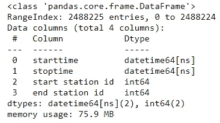

## 调整资金组合

为了确保在需要时有自行车和码头可用，Citi Bike 通过将自行车从有剩余的车站转移到需要的地方来“重新平衡”自行车。虽然这些运动中的大部分不会出现在 tripdata 文件中，但是可以通过在系统中骑自行车来推断它们。当一辆自行车似乎从一个站点移动到另一个站点而没有骑手时，我认为这是一次重新平衡(或维护)的移动。

参见我的文章[内插纽约市自行车共享数据以发现再平衡运动](/interpolating-nyc-bike-share-data-to-discover-rebalancing-movements-6cf8a80eb902)，了解确定这些运动发生的时间和地点的方法。我创建了一个拼花文件，其中记录了每次移动，格式与实际乘坐相同。

> 要从 Python 中读取一个 Parquet 文件，请安装 pyarrow 库:
> `*conda install -c conda-forge pyarrow*`

您可以按照那篇文章中的描述创建文件，并在本地读取它，或者从我的 Github 存储库中读取一个保存的副本:

```
dfrebal = pd.read_parquet \ ('[https://github.com/ckran/bikeshare/blob/main/202009-citibike-reblance.parquet](https://github.com/ckran/bikeshare/blob/main/202009-citibike-reblance.parquet)')
```

该文件具有与 tripdata 文件相同的列和 39，560 个条目，这表示找到的重新平衡移动的数量。

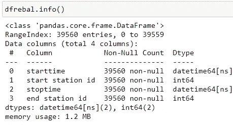

将 tripdata 文件中的游乐设备与再平衡运动连接起来，使它们都在一个数据帧中。

```
df = pd.concat([df,dfrebal])
df.reset_index(drop=True, inplace=True)
df
```

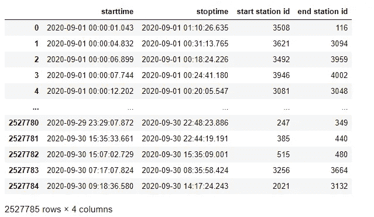

## 从旅行到行动的重组

通过创建两个数据帧，将一行中的每个行程(包括开始和结束时间及站点)拆分为两行，并增加一列`act`来指示发生的动作:

*   `dfs`(拾音器)`starttime`、`start station id`和`act`设置为-1
*   `dfe`(下降)`stoptime`、`end station id`和`act`设置为+1

```
dfs=df[['starttime','start station id']].assign(act=-1)
dfe=df[['stoptime','end station id']].assign(act=1)
```

重命名中的列，使它们匹配并将两个数据框架连接成一个新的数据框架。

```
dfs.columns=['docktime','stationid','act']
dfe.columns=['docktime','stationid','act']
dfse=pd.concat([dfs,dfe])
```

## 按时间排序

最后，按`docktime`对数据帧进行排序；删除并重新创建索引。

```
dfse.sort_values(by=['docktime'], inplace=True) 
dfse.reset_index(drop=True, inplace=True) 
dfse.head(100)
```

现在，所有的接送都按照发生的顺序进行:

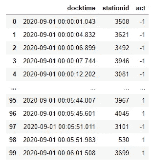

车站开始和停止

# 可视化车站流量

使用花旗自行车时，唯一真正重要的自行车(或码头)可用性是你所站的车站。这种分析对单个站最有用。

以前，我在一家软件公司工作，办公室就在宾夕法尼亚车站的正上方。我最熟悉的花旗自行车站在第七大道对面，名为 **W 31 St & 7 Ave.** 在早高峰期间，它基本上是空的，因为通勤者会在佩恩站从他们的火车上下来，拿起自行车，很快清空了所有的码头。白天，骑手们来来往往，但通常只有几辆自行车。在下午高峰期间，花旗自行车站会挤满人，因为通勤者会在进入火车站之前归还他们的自行车。事实上，当我下班后去那里取自行车时，总有人在等着码头开放。我想看看那个车站的用法图是否能反映我的经历。

## 获取电台名称

虽然 tripdata 文件包含每次旅行的车站名称，但我没有将它们包含在 dataframe 中，因为这样做会使 data frame 非常大，因为几乎有 200 万行，但现在我需要它们。

要在我的图表中包含站点名称，请创建一个数据框架作为查找表，每个站点占一行(大约只有一千个站点)。

```
dfstations = \
  pd.read_csv('~/bikeshare/202009-citibike-tripdata.csv',\
  usecols=['start station id','start station name']).\
  drop_duplicates()                
dfstations.columns=['stationid','station name']
dfstations.set_index('stationid',drop=True, inplace=True)
```

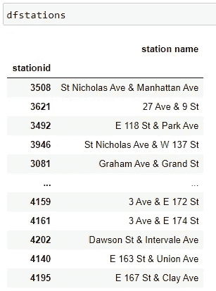

电台 ID 和名称查找表

## 为一个站创建一个数据帧

首先从`dfstations`数据帧中获取感兴趣站点的站点 ID。然后创建一个新的数据帧，只包含该站的行。

```
sid = dfstations.loc[dfstations['station name']\
     =='W 31 St & 7 Ave'].index[0]dfstation = dfse.loc[(dfse.stationid==sid) ]
dfstation.reset_index(drop=True, inplace=True)
```

## 计算一个站点的自行车数量

通过计算`act`列的累计和，我可以看到车站自行车数量的增加和减少:

```
dfstation = dfstation.assign(cnt = dfstat.act.cumsum())
dfstation.head(10)
```

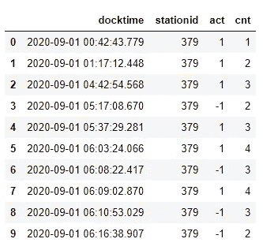

运行总和的车站活动

从 9 月 1 日午夜开始，它显示自行车的数量随着骑车人放下自行车而增加，随着他们捡起自行车而减少。问题是`cnt`从*零*辆自行车开始，这是不准确的。随着越来越多的自行车被捡起来，数量将下降到零以下，这当然是不可能的。

我可以通过计算曾经达到的最小数字并将其添加到第一个单元格来避免这种情况。这个数字是猜测，但总比没有强。然后重新计算。

```
dfstation.at[0, 'act'] =+ abs(dfstation.act.cumsum().min())dfstation = dfstation.assign(cnt = dfstat.act.cumsum())
dfstation.head(10)
```

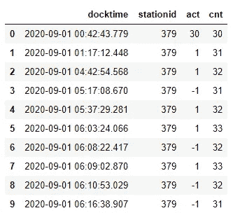

## 该月的绘图可用性

现在，我可以创建一个图表，显示这个站点九月份的可用自行车数量。每当地块触底时，车站是空的，当它触顶时，车站是满的。

```
sns.set(font_scale = 1)
plt.figure(figsize=(20,5))
ax=sns.lineplot(data=dfstation , x='docktime', y='cnt' ) 
ax.set_xlabel('Day')
ax.set_ylabel('Available Bikes') ;
```

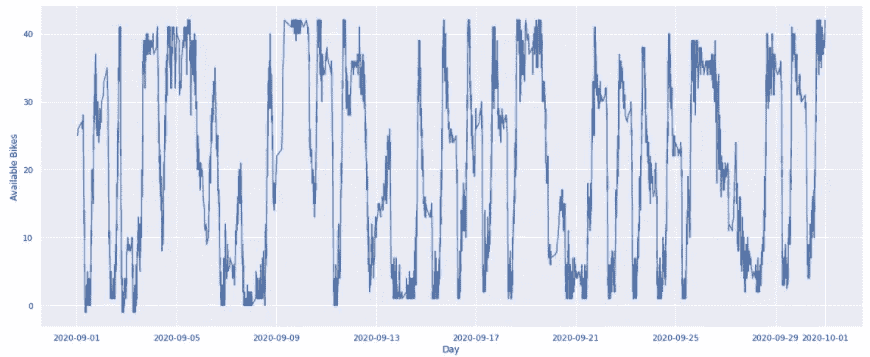

**W 31 St&7 Ave**2020 年 9 月使用——图片由作者提供

月图显示了可用性的变化，但它太压缩了，我看不出这是否是我所期望的。一天一天地看可能更好。

## 绘制一天的可用性

我选择了 9 月 8 日，那天是劳动节的第二天。我使用`DateFormatter`将日期值格式化为一天中的小时。

```
sns.set(font_scale = 1)
plt.figure(figsize=(20,8))
ax=sns.lineplot(data=dfstation.loc[dfstation.docktime.dt.day == 8],\
    x='docktime', y='cnt'  ) 
ax.set_ylabel('Available Bikes')
ax.set_xlabel('Hour of Day') 
ax.set_title('Citi Bike station - '+station+' - September 8, 2020')
ax.xaxis.set_major_formatter(DateFormatter("%H")) ;
```

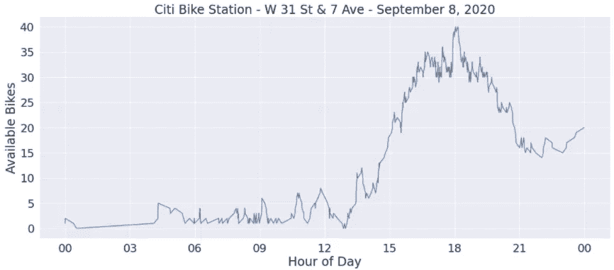

一个站点一天的站点使用量

这显示了车站在一天中的大部分时间都是空的或接近空的，直到下午它经常是满的。这是我所期望的。

然而，这个车站靠近一个交通枢纽。位于商业区或居民区的车站呢？

## 其他站点的可用性

要查看其他站，请将代码放入函数中:

```
def availabilty (station,day):
    # inputs: station name, day 
    # requires: dfstations, dfse 
    sid = dfstations.loc[dfstations['station name']==station]\
        .index[0] # lookup station id 
    dfstation = dfse.loc[(dfse.stationid==sid) ] 
    dfstation.reset_index(drop=True, inplace=True)
    dfstation = dfstation.assign(cnt = dfstation.act.cumsum()) 
    dfstation.at[0, 'act'] =+ abs(dfstation.act.cumsum().min())
    dfstation = dfstation.assign(cnt = dfstation.act.cumsum()) 

    # Create chart 
    sns.set(font_scale = 2)
    plt.figure(figsize=(20,8))
    ax=sns.lineplot(data=dfstation.\
     loc[dfstation.docktime.dt.day == day],x='docktime',y='cnt' ) 
    ax.set_ylabel('Available Bikes')
    ax.set_xlabel('Hour of Day') 
    ax.set_title\
     ('Citi Bike Station - ' + station +' - September ' + str(day))
    ax.xaxis.set_major_formatter(DateFormatter("%H")) ;
```

首先，我将在洛克菲勒中心的一个电视台播放，这是一个大型会议酒店附近的大型办公楼群。加油站在早上六点到九点之间加满油，一天的大部分时间都是满的，下午五点后很快就空了，一天的其余时间几乎都是空的。

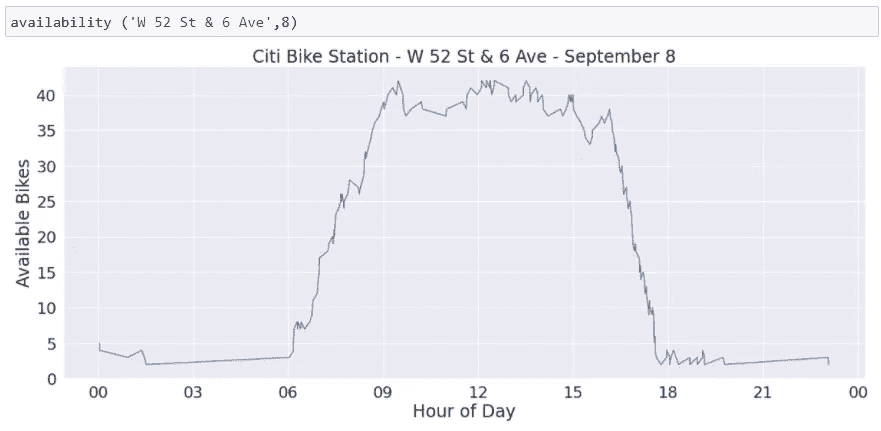

洛克菲勒中心的花旗自行车——作者图片

接下来，我将查看一个大型公寓楼附近的一个车站的主要居民区。那个车站一夜爆满，在早高峰和全天都是空的，然后在晚高峰又被填满。

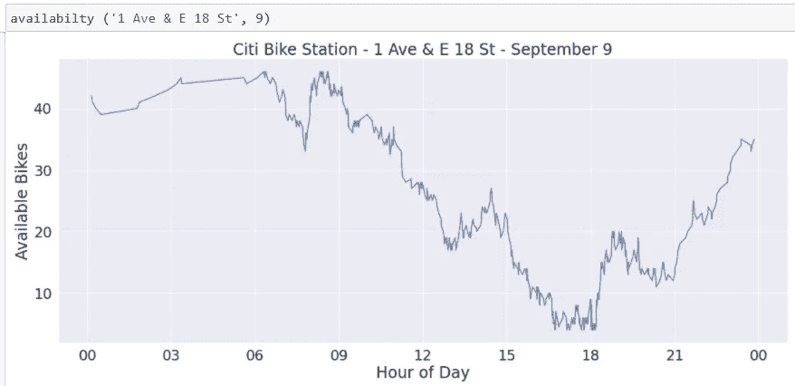

施托伊弗桑特镇附近的花旗自行车——图片由作者提供

# 结论

尽管 Citi Bike 不提供有关自行车和码头可用性的历史数据，但可以从反映实际站点使用情况的 tripdata 文件中得出估计值。