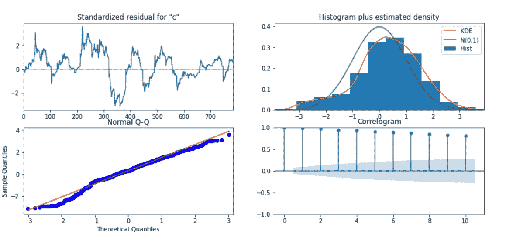

# 用因果影响 BSTS 估计金融时间序列的因果影响

> 原文：<https://towardsdatascience.com/estimating-causal-effects-on-financial-time-series-with-causal-impact-bsts-85d3c403f4a0?source=collection_archive---------5----------------------->

## 简要介绍 Google 的 Python 因果影响库及其在估计金融时间序列因果影响中的效用。


作者图片

***注来自《走向数据科学》的编辑:*** *虽然我们允许独立作者根据我们的* [*规则和指导方针*](/questions-96667b06af5) *发表文章，但我们不认可每个作者的贡献。你不应该在没有寻求专业建议的情况下依赖一个作者的作品。详见我们的* [*读者术语*](/readers-terms-b5d780a700a4) *。*

# 介绍

量化和解释已知事件对因变量的影响的能力是一种数据科学技能，其效用适用于无数学科。然而，这种分析的影响及其影响商业决策的能力(尽管分析本身是真实的！)的能力与数据科学家/分析师/定量分析师合理选择模型及其决策的能力，以及必要的领域专业知识和对因变量的理解一样好。

谷歌的[因果影响库](https://medium.com/r?url=https%3A%2F%2Fgithub.com%2Fgoogle%2FCausalImpact)(用 R 和 Python 实现)可以帮助我们在很短的时间内完成这样的任务，同时提供方法让用户能够充分解释底层建模过程和模型的决定。

在本文中，我们将简要探讨如何实施因果影响模型来估计[淡水河谷大坝坍塌](https://en.wikipedia.org/wiki/Brumadinho_dam_disaster)对铁矿石现货价格的影响。你可以在这里找到本文中的所有代码。

## 什么是因果影响？

Google 的因果影响库提供了一个非常简单的结构化时间序列模型的实现，该模型可以估计“设计”干预对目标时间序列的影响。通过分析*预期*和*观察到的*行为之间的差异来衡量这种影响——具体而言，该模型生成一个**预测反事实**，即***预期*观察值，说明如果事件*未发生，因变量*可能会如何在事件*之后演变。*****

## **它是如何工作的？**

**最初是作为 R 包开发的，因果影响通过将贝叶斯结构时间序列(BSTS)模型拟合到一组目标和控制时间序列观察值来工作，并随后对反事实进行后验推断。**

**作为参考，结构化时间序列模型是时间序列数据的状态空间模型，可以根据以下一对等式来定义:**

****

**结构时间序列模型定义。作者图片**

**在上面的表达式中:**

*   **Eq 1。就是观测方程。这将观测数据 y_t 与一个潜在的 d 维状态向量α_t 联系起来。**
*   **等式 2。是状态方程；它决定了状态向量αt 随时间的演化。换句话说，阿尔法变量指的是时间序列的“状态”, y_t 是状态的线性组合，加上一些解释协变量 x 的线性回归，加上一些噪声的ε，ϵ，正态分布在平均值 0 附近。**
*   ***ε_ t*和*η_ t*独立于所有其他未知量。**

**在这个阶段，值得注意的是 BSTS 模型和传统统计/深度学习变体之间的一个关键差异:**

**传统的时间序列预测架构，如线性回归模型，通过最大似然估计来估计其系数，或者，在更强大的一端，LSTM 学习一个函数，该函数将一系列过去的观察值作为输入映射到输出观察值。另一方面，BSTS 模型采用概率方法来模拟时间序列问题，即，它们返回一个后验预测分布，我们可以对其进行采样，不仅提供预测**，还提供一种量化模型不确定性的方法。****

## **这为什么有用？**

**贝叶斯结构时间序列模型是特别强大的模型，因为它们可以推广到一个非常大的时间序列模型类，如 ARIMA，萨里马克斯，霍尔特温特斯等。在上述表达式中，您可以观察到我们如何通过改变矩阵 X、Z、T、G 和 R 来实现这一点，以便在观察到的时间序列中模拟不同的行为和结构，以及添加线性协变量βX，这也可能是因变量的预测。**

****示例——二阶自回归过程:****

**考虑一个例子，我们想要对一个时间序列的时间结构(自相关)进行建模。我们可以将时间序列建模为二阶自回归过程 AR(2)，通过调整上面的表达式！：**

****AR(2)过程的定义:****

****

**二阶自回归过程定义。作者图片**

****状态空间形式:****

****

**状态空间形式的 AR(2)过程。作者图片**

**鉴于这种选择任何时间序列模型来拟合数据的灵活性，人们可以很快看到这些模型有多么强大。**

**但是这听起来工作量很大？**

**嗯，是的，但是**不要害怕。**关于因果影响的奇妙之处在于，如果你需要一个权宜的初步分析，你**不必**明确定义*模型的任何*结构组件。**

**如果确实是这种情况，并且您没有在输入中指定模型，则默认情况下会构建一个本地级别的模型，该模型会为您估计时间序列的主要结构组件。对于局部水平模型，目标时间序列 y 被定义为:**

****

**本地级模型。作者图片**

**这里，给定时间点被建模为随机游走分量 mu_t(也称为局部水平分量)。**趋势和季节性成分**、gamma_t 被建模为未观察到的成分。趋势被建模为固定截距和季节分量，使用具有固定周期和谐波的三角函数。关于更详细的数学解释，可以参考因果影响文档 [**此处**](http://google.github.io/CausalImpact/CausalImpact.html) ，以及 **S** [**tatsmodels 状态空间季节性文档**](https://www.statsmodels.org/devel/examples/notebooks/generated/statespace_seasonal.html) ，其逻辑遵循因果影响的 Python 变体的逻辑。**

**总之，我们的实现(在 Python 中)因此被简化为一行表达式！：**

```
ci_model = CausalImpact(target, pre_period, post_period)
```

**对于那些对如何使用 TensorFlow 详细构建贝叶斯结构时间序列感兴趣的人，你可以在本文中看到**如何:****

**[**https://towards data science . com/structural-time-series-forecasting-with-tensor flow-probability-iron-ore-mine-production-897d 2334 c 72 b**](/structural-time-series-forecasting-with-tensorflow-probability-iron-ore-mine-production-897d2334c72b)**

**否则，我们来看看行动中的因果影响。**

# **问题是**

**我们将探讨如何在估算淡水河谷大坝坍塌对铁矿石现货价格的影响时实施因果影响。虽然这一事件并不构成“设计好的”干预，但在金融界，在提供对未来类似性质事件的价格变动的估计方面，效用仍然存在。此外，这是为了展示谷歌的因果影响包在估计一个事件对反应时间序列的影响的效用。提醒一下，Python colab 笔记本的链接可以在这里 找到 [**。**](https://github.com/cmp1/bsts-causal_impact/blob/main/Spot_IO_Causal_Impact_Vale_Dam_Accident_20210104.ipynb)**

****淡水河谷大坝事件****

**在这种情况下，我们正在估算 2019 年 1 月 25 日发生在淡水河谷(全球最大的铁矿石生产商)córrego do feijo 矿的淡水河谷大坝事件对铁矿石现货价格的影响。**

****警告:**虽然对任何金融时间序列的结果进行建模通常是一个高度复杂的非线性问题，需要比我们正在演示的更多的考虑和技术应用，但本演示的目的是说明 CI 可以执行这种分析的效用和便利性，及其可解释性——这是任何商业环境中的先决条件。**

## **铁矿石现货价格数据**

**我们首先获取铁矿石现货价格数据，然后绘制铁矿石现货时间序列的收盘价。我们还创建了 21 天和 252 天的滚动平均值，为我们提供当前价格变动的方向指引:**

```
import matplotlib.pyplot as plt
import numpy as np
import pandas as pdfrom causalimpact import CausalImpact
from statsmodels.tsa.seasonal import seasonal_decompose# Get spot prices
df = pd.read_excel(
    '/Users/CMP/OneDrive/PriceCurves/IO_Spot_2015010120200501.xlsx',
    index_col='date'
)
# Plot close price, 21d and 252 roll avg.
df['close'].plot(lw=2., figsize=(14,6), label='Close Price',c='royalblue')
df['close'].rolling(21).mean().plot(lw=1.5, label='Roll_21d',c='orange')
df['close'].rolling(252).mean().plot(lw=1.5, label='Roll_252d', c='salmon')
plt.title('Spot Iron Ore Historical ($/MT), 2015-2020')
plt.ylabel('Close Price, $/MT')
plt.grid(); plt.legend()
```

****

**铁矿石现货价格和 2015-2020 年 21d/252d 滚动平均价格。作者图片**

## ****淡水河谷大坝事件****

**到目前为止一切顺利。在定义事件前和事件后的时间段之前，我们可以通过标记事件日期并绘制图表来更好地了解事件本身的规模:**

****

**铁矿石现货收盘价注释。作者图片**

**在上图中，您可以观察到两个事件:**

1.  ****第一个**数据点表示 Vale dam 崩溃的日期。**
2.  **第**个**数据点/事件是淡水河谷对其一座尾矿坝稳定性的警告。**

## ****开始之前—模型假设:****

**与所有预测问题一样，在将任何模型应用于我们的问题之前，我们必须充分考虑它所做的假设。**

1.  ****控制集合**:在有因果影响的情况下，模型假设存在一个集合控制时间序列，它是受事件*影响的 ***而不是*** 本身。在我们问题的背景下，这个假设并不严格相关。***
2.  ****外部协变量:**另外一个假设是**与**相关，然而，该模型假设外部协变量和目标时间序列之间的关系，如前期所建立的，在后期保持稳定。在我们的问题背景下，很有可能的是，可以预测铁矿石价格的特性**也很可能受到该事件的影响。****
3.  ****模型先验:**未观测状态的先验分布会有所不同，这取决于您是否选择在 R 或 Python 中实现因果影响。因果影响的 R 变量基于目标系列的第一次观察和数据集的方差来设置未观察状态的先验。另一方面，Statsmodels 使用漫射(均匀)先验。这不应该导致两者之间的任何重大差异，但是值得记住(参见观察、批评&对 R 和 Python 包之间的关键差异的进一步分析)。**

# **默认模型**

**有了上面的基本信息，让我们将基本模型拟合到我们的现货价格数据，并检查输出。实施简单明了:**

```
# Define training data - period prior to the event
pre_period = ['2016-01-04', '2019-01-24'] # Define post-event period - i.e. time AFTER the event occurred.
post_period = ['2019-01-25', '2019-08-01'] # Instantiate CI model.
ci = CausalImpact(df['close'], pre_period, post_period)
```

***注意:在指定事件前和事件后期间的界限时，因果影响可以(方便地)接受日期字符串。***

**将因果影响模型拟合到我们的数据会返回一个对象，调用该对象的方法时，我们可以检查模型结果、拟合的参数等。现在，我们将绘制结果:**

****

**因果影响结果，包括预测的反事实、逐点和累积影响。图片作者。**

**正如您在上面的图表中所看到的，通过调用 CI 对象上的`.plot()`方法，我们可以访问拟合过程的结果。默认情况下，plot 方法呈现三个独立的图表:**

1.  ****观察到**“事后”时间序列，并拟合模型的预测反事实**
2.  *****逐点*** 因果效应，由模型估计。这是观察结果和预测结果之间的差异。**
3.  ****累积**效应。**

**此外，通过调用 CI 对象的`.summary()`方法，我们可以生成一个方便的摘要报告:**

```
print(ci.summary())
```

****

**因果影响模型:总结报告。图片作者。**

## **结果评估**

**对上述输出的检查揭示了拟合模型的结果:**

*   ****平均**栏是指干预后期间的平均价格(在一段时间内)。**
*   ****累积**列是个人每日观察的总和——在我们的例子中不是很有用，但是如果因变量是一个度量标准，其累积总和是您实验的一部分，则非常有用；额外的销售、点击等。**

**粗略地看一下预测的反事实和逐点效应表明，这种规模的事件对现货价格产生了重大影响。事实上，该模型自信地断言，淡水河谷大坝事件的绝对因果效应为 21 美元，从 18.04 美元到 23.98 美元不等。注意这里的 p 值也很重要(< .05) to understand whether the observed behaviour is statistically significant or simply occurred by chance.**

## ****拟合模型诊断****

**然而，显而易见的是，我们的默认模型的预测反事实看起来不太令人信服。在很大程度上，它看起来是方向准确的，但是，它显然没有捕捉到显著的价格变动，并且预测似乎落后于观察到的现货价格。**

**我们可以检查拟合模型的参数和诊断，以评估模型是否符合其基本的统计假设:**

```
ci.trained_model.summary()
```

****

**图 1:拟合的模型结果和参数。图片作者。**

```
# Plot residuals diagnostics 
_ = ci.trained_model.plot_diagnostics(figsize=(14,6))
```

****

**图 2:拟合模型的残差。图片作者。**

**对上面图 1 的检查显示了拟合模型的参数。对单个结果的完整解释超出了本文的范围，但是突出的要点，即模型组件；sigma2 .不规则和 sigma2 .水平以及它们的系数表明，它们对我们的目标铁矿石现货价格的预测是多么微弱。**

**事实上，如果我们考虑图 2 和残差图，我们可以检查模型误差的大小，“c 的标准化残差”。我们还可以观察到误差遵循明显的非正态分布，并表现出很强的自相关性。然而，我们已经有效地建立了一个**基线模型**来估计事件对我们目标变量的影响。**

# **定制模型**

**我们刚刚实施了第一个因果影响模型，并估算了淡水河谷大坝事件对我们的铁矿石现货数据的因果影响。到目前为止，我们已经让软件包决定如何为我们的现货价格数据构建一个时间序列模型，并且发现，作为拟合模型的诊断结果，我们不能确信推断的效果。**

**如上所述，结构性时间序列模型的一个有用的特性是它们的模块化，为我们提供了建模时间序列的个体行为动态的灵活性，例如季节性。因果影响模块提供了几个选项，使我们能够实现这一点，我们将利用这些选项来改善我们推断的反事实。**

## **季节性模型&具有外生特征(协变量)的模型**

**为了改进我们的模型和预测反事实，我们将利用我们的专业知识并调整我们的模型，以包括一个经常出现在现货铁矿石价格行为中的已知季节性因素，并纳入两个与铁矿石现货价格呈现已知线性相关性的特征:现货废钢和中国国产钢筋(螺纹钢):**

****

**铁矿石现货价格曲线增加了两个新特征(协变量)；螺纹钢和废钢。图片作者。**

## ****添加季节性成分****

**我们将开始尝试在我们的模型中添加一个**已知的**季节性组件。对于许多大宗商品来说， [**价格往往会在中国的夏季和冬季**](https://www.businessinsider.com.au/iron-ore-price-seasonality-2018-1)**赶在春季和秋季建设高峰期之前上涨。在铁矿石中通常可以观察到同样的行为。作为参考，季节分量可以描述为周期性重复的模式，即信号是周期性的。****

****通过将我们的时间序列分解成它的组成结构部分，我们观察了上述季节性对现货价格的影响程度:****

```
**s_dc = seasonal_decompose(df['close'], model='additive', period=252).plot()**
```

********

****分解的现货铁矿石时间序列。图片作者。****

*****注意:Statsmodels seasonal_decompose 对我们的时间序列进行了简单的分解——更复杂的方法应该使用，特别是当我们的时间序列是金融时间序列时。然而，对于本文的目的以及演示如何将它们作为组件添加到我们的模型中，这就足够了。*****

****隔离几个例子证实了我们先前的信念/领域专业知识；我们可以看到季节分量的频率和幅度与中国的夏季和冬季相对应；****

********

****2015 年和 2016 年孤立的季节性成分观测。图片作者。****

****看起来这个信号大概有 146 天的周期，谐波为 1，尽管这些都是粗略的解释。我们可以观察到，在两个例子中，冬季峰值的幅度小于夏季峰值的幅度，因此信号本身不是严格对称的。现在，出于演示的目的，我们将继续我们的假设。****

****将季节性因素纳入因果影响非常简单:因果影响类接受一个字典列表，其中包含每个季节性信号的周期性，以及已知的[谐波](https://en.wikipedia.org/wiki/Harmonic):****

```
**# Example - Adding seasonal components to a CI modelci = CausalImpact(
    df['close'], 
    pre_period, 
    post_period,
    nseasons=[{'period': 146, 'harmonics': 1}]
)**
```

## ****添加外源协变量****

****我们现在可以将外部协变量添加到我们的模型中，即现货废钢价格和中国国内钢筋。****

****同样，将外部协变量添加到我们的因果影响模型很简单。这些可以作为 Pandas 数据帧与我们的目标变量一起传递。根据[源代码](https://github.com/dafiti/causalimpact/blob/master/causalimpact/main.py)，因果影响期望目标/标签列在第一个索引(0)中。所有后续列都注册为外部协变量:****

```
**df_1 = pd.concat([df, steel_scrap_df, rebar_df], join='inner', axis=1)**
```

********

****我们的价格曲线数据框。图片作者。****

****然后，我们将这个数据框架传递给我们的因果影响模型，以及相同的前期和后期事件定义和我们的季节性组件。请注意，我们不会指定季节分量的谐波*:****

```
**# Fit new seasonal + beta coef variant
ci_1 = CausalImpact(df_1, pre_period, post_period, nseasons=[{'period': 146}])# Plot result
ci_1.plot(figsize=(12, 6))**
```

******模型默认将此计算为 math.floor(periodicity / 2))*****

********

****预测反事实:季节性+外部协变量 CI 模型变量。图片作者。****

****在检查我们新模型的反事实时，我们可以观察到一个更可信的结果。看起来似乎我们仍然需要考虑时间序列中的时间(自相关)结构，并且可以将其包括在随后的模型中，但是结果对于第一遍来说似乎是可信的。在检查拟合模型的参数时，我们可以看到我们的季节成分及其定义需要重新评估，而我们的外部协变量解释了我们的响应变量中观察到的许多情况:****

********

****季节性+外部协变量模型—拟合参数。图片作者。****

****最后，我们可以让我们的模型使用有用的方法`.summary('report')`来估计 Vale dam 事件对我们目标的影响，该方法返回了对观察到的影响的详细解释:****

********

****季节性+外部协变量模型-报告。作者图片****

****在这里，我们可以看到，该模型得出的重要结论是，该事件导致铁矿石现货价格上涨+33%，因此，从逻辑上讲，如果该事件没有发生，那么现货价格在此期间将下跌 33%。****

# ****结论****

****在这篇文章中，我们已经了解了如何使用 Google 的因果影响包来估计干预对观察到的时间序列的因果影响。具体来说，我们实施了一个 CI 模型来估计淡水河谷大坝事件对铁矿石现货价格的影响。****

****此外，我们了解到:****

*   ****什么是贝叶斯结构时间序列模型，它们的能力，以及在某种程度上，它们的局限性(见下文)。****
*   ****谷歌的因果影响库是什么，它做什么。****
*   ****如何实现基本/默认因果影响模型。****
*   ****如何实现一个更复杂的变量，通过定义和添加已知的季节性因素和线性相关的外生变量作为线性协变量。****
*   ****如何评价我们拟合模型的结果？****

# ****观察、批评和进一步分析****

*   ******参数估计:**根据您是在 R 还是 Python 中实现因果影响，您可能会发现您的模型返回完全不同的结果。这是各个库采用不同估计方法的结果:Python 变体采用 Statsmodels 不可观测组件实现来对目标时间序列建模，并且使用最大似然估计其参数。R 变体使用 BSTS 库，其参数用贝叶斯 MCMC 估计。****
*   ******季节性:**参见上述“添加季节性成分”下的限制****
*   ******对架构能力**建模:在干预*之前，通过在**人为干预**上运行`CausalImpact()`来检查目标变量能够被预测到多好是一个好主意。这是对模型捕捉假想干预后数据中相关结构的能力的健全性检查。从逻辑上讲，我们希望**而不是**发现显著影响，即反事实估计值和实际数据应该相当接近。*****
*   ******模型假设:**参见上面的“模型假设”。进一步注意，我们没有为几乎所有金融时间序列固有的自相关建模。****
*   ******定制模型:**请注意，在本文中没有介绍如何定义定制模型，这将是冗长的，超出了范围。然而，因果影响类的一个参数`model`使我们能够将任何 [Statsmodels 状态空间模型](https://www.statsmodels.org/stable/generated/statsmodels.tsa.statespace.structural.UnobservedComponents.html#r0058a7c6fc36-1)作为参数传递，这展示了 CI 库的强大和灵活性。****

****非常感谢您花时间阅读这篇文章，一如既往，我欢迎所有建设性的批评和意见。****

# ****参考****

1.  ****因果影响 1.2.1，布罗德森等人，《应用统计学年鉴》(2015)，[http://google.github.io/CausalImpact/](http://google.github.io/CausalImpact/)****

****[2。https://www . ft . com/content/8452 e078-7880-11e 9-bbad-7c 18 c 0 ea 0201](https://www.ft.com/content/8452e078-7880-11e9-bbad-7c18c0ea0201)****

****3.[https://www . business insider . com . au/铁矿石-价格-季节性-2018-1](https://www.businessinsider.com.au/iron-ore-price-seasonality-2018-1)****