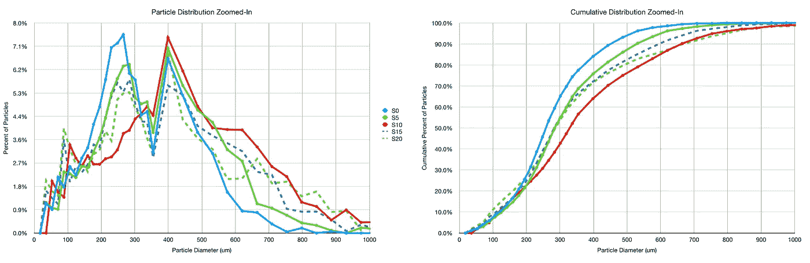
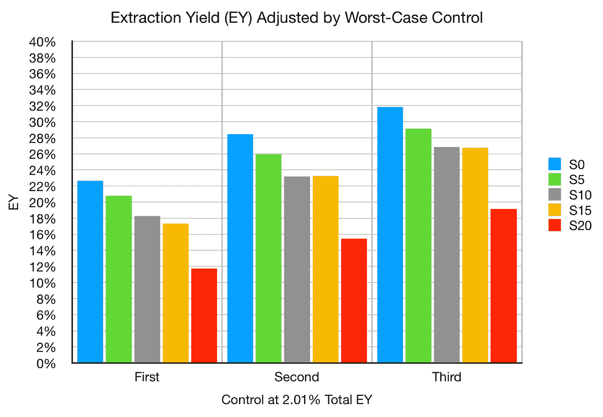
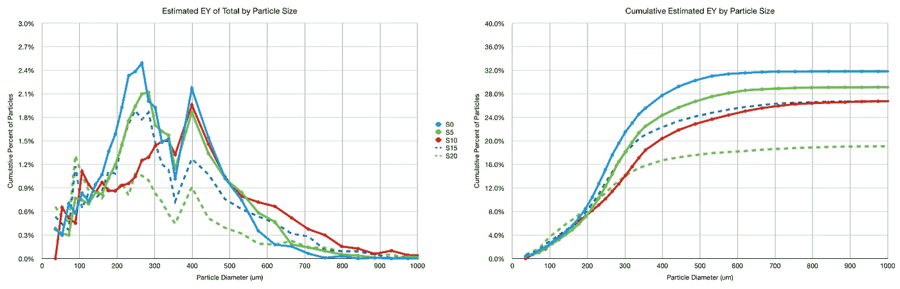

# 估计咖啡萃取物的粒度

> 原文：<https://towardsdatascience.com/estimating-coffee-extraction-across-particle-size-353d858a96ae?source=collection_archive---------34----------------------->

## 咖啡数据科学

## 咖啡数据之路的更多探索

最近，我用用过的咖啡渣做了一个实验，以更精确地测量不同研磨设置的提取潜力。我还试图通过使用表面积体积比来估计提取潜力，知道[颗粒尺寸分布](/modeling-coffee-gringers-afb7c4949d6b)。现在，我想我可以把这两条信息结合起来，看看我们能从不同粒度提取中了解到什么。

# 原始数据

首先，我在一个利基零研磨机上有 5 个设置，我使用一种[成像技术](https://medium.com/nerd-for-tech/measuring-coffee-grind-distribution-d37a39ffc215)测量它们的粒子分布。有一个设置似乎有点偏离或者容易出错，那就是设置 10。我对此没有很好的解释，但我们可以承认这种差异是一个警告。在数据收集期间，我必须回忆分布情况，因为照明问题可能是导致问题的原因。

在我的实验中，我确定了随着时间的推移，分成大致相等的 3 杯的弹丸的提取率(EY)。然后，我通过了解废磨粒控制样品的 EY 来修正测量值。我鼓励任何有问题的人首先阅读这篇文章。

# 将提取率应用于颗粒分布

之前，我研究过使用表面积与体积(S/V)的比率作为粒子提取速度的指标。无论粒子形状如何(球形、方形等)，S/V 都是半径的一个因子。我还可以假设最大提取水平是 32%,因为这是我从设置 0 获得的最大提取。

然后，我用最大可能提取量计算了分布中每个箱的提取量。从那里，我得到了每个颗粒尺寸箱对最终提取的贡献(如下)。不足为奇的是，大部分估计的提取量来自较小的粒子。

我注意到一些有趣的模式，所以我用最大提取量来归一化累积估计提取曲线。由此看来，似乎区分提取的仅仅是颗粒大小。

然后，我查看了每个颗粒尺寸箱的估计 EY，并用粗线绘制了过度提取和提取不足的估计值。

需要对颗粒大小有更好的了解。用筛分过的颗粒尺寸代替研磨设置再做一次实验不会有什么坏处，这样可以增加另一个级别的控制，而且我认为这将有助于告知基于研磨机或研磨分布与其他圆盘准备或机器参数相比可以在哪里进行改进。

如果你愿意，可以在 Twitter 和 YouTube 上关注我，我会在那里发布不同机器上的浓缩咖啡视频和浓缩咖啡相关的东西。你也可以在 [LinkedIn](https://www.linkedin.com/in/robert-mckeon-aloe-01581595?source=post_page---------------------------) 上找到我。也可以关注我[中](https://towardsdatascience.com/@rmckeon/follow)。

# [我的进一步阅读](https://rmckeon.medium.com/story-collection-splash-page-e15025710347):

[浓缩咖啡系列文章](https://rmckeon.medium.com/a-collection-of-espresso-articles-de8a3abf9917?postPublishedType=repub)

[工作和学校故事集](https://rmckeon.medium.com/a-collection-of-work-and-school-stories-6b7ca5a58318?source=your_stories_page-------------------------------------)

[个人故事和关注点](https://rmckeon.medium.com/personal-stories-and-concerns-51bd8b3e63e6?source=your_stories_page-------------------------------------)

[乐高故事启动页面](https://rmckeon.medium.com/lego-story-splash-page-b91ba4f56bc7?source=your_stories_page-------------------------------------)

[摄影启动页面](https://rmckeon.medium.com/photography-splash-page-fe93297abc06?source=your_stories_page-------------------------------------)

[使用图像处理测量咖啡研磨颗粒分布](https://link.medium.com/9Az9gAfWXdb)

[改善浓缩咖啡](https://rmckeon.medium.com/improving-espresso-splash-page-576c70e64d0d?source=your_stories_page-------------------------------------)

[断奏生活方式概述](https://rmckeon.medium.com/a-summary-of-the-staccato-lifestyle-dd1dc6d4b861?source=your_stories_page-------------------------------------)

[测量咖啡磨粒分布](https://rmckeon.medium.com/measuring-coffee-grind-distribution-d37a39ffc215?source=your_stories_page-------------------------------------)

[咖啡萃取](https://rmckeon.medium.com/coffee-extraction-splash-page-3e568df003ac?source=your_stories_page-------------------------------------)

[咖啡烘焙](https://rmckeon.medium.com/coffee-roasting-splash-page-780b0c3242ea?source=your_stories_page-------------------------------------)

[咖啡豆](https://rmckeon.medium.com/coffee-beans-splash-page-e52e1993274f?source=your_stories_page-------------------------------------)

[浓缩咖啡用纸质过滤器](https://rmckeon.medium.com/paper-filters-for-espresso-splash-page-f55fc553e98?source=your_stories_page-------------------------------------)

[浓缩咖啡篮及相关主题](https://rmckeon.medium.com/espresso-baskets-and-related-topics-splash-page-ff10f690a738?source=your_stories_page-------------------------------------)

[意式咖啡观点](https://rmckeon.medium.com/espresso-opinions-splash-page-5a89856d74da?source=your_stories_page-------------------------------------)

[透明 Portafilter 实验](https://rmckeon.medium.com/transparent-portafilter-experiments-splash-page-8fd3ae3a286d?source=your_stories_page-------------------------------------)

[杠杆机维护](https://rmckeon.medium.com/lever-machine-maintenance-splash-page-72c1e3102ff?source=your_stories_page-------------------------------------)

[咖啡评论和想法](https://rmckeon.medium.com/coffee-reviews-and-thoughts-splash-page-ca6840eb04f7?source=your_stories_page-------------------------------------)

[咖啡实验](https://rmckeon.medium.com/coffee-experiments-splash-page-671a77ba4d42?source=your_stories_page-------------------------------------)